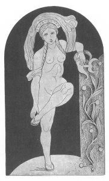

[Intangible Textual Heritage](../../index)  [Neo-Paganism](../index.md) 
[Index](index)  [Next](err01.md) 

------------------------------------------------------------------------

# Etruscan Roman Remains in Popular Tradition

## by Charles Godfrey Leland

#### New York, C. Scribner's sons, and London, T. F. Unwin

#### \[1892\]

###### scanned at Intangible Textual Heritage, July 2002. J.B. Hare, redactor.

Frontispiece: TURAN, OR VENUS

(From Gerhard, who gives it as one of the Dämonen der Aphrodite,
Probably an error--Charles G. Leland)

------------------------------------------------------------------------

[Next: Contents](err01.md)
