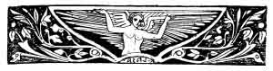
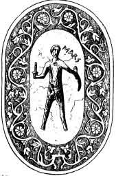
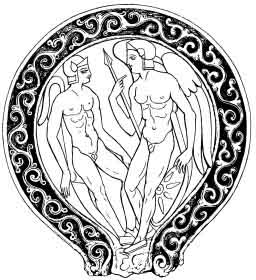
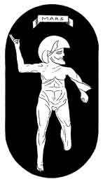
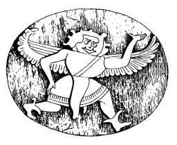

[Intangible Textual Heritage](../../index)  [Neo-Paganism](../index.md) 
[Index](index)  [Previous](err04)  [Next](err06.md) 

------------------------------------------------------------------------

p. 49

# CHAPTER II

### MASO

Omnia transformat sese in miracula rerum."--VIRGIL, Georg,. 1. 4.

As to what became of the old god of war Mars since the victory of the
Christians I can tell you but little. I am inclined to believe that
during the Middle Ages he exercised the law of the strong hand. The
nephew of the executioner of Münster once met him in Bologna."--HEINE,

Die Götter in Exil

OF Maso I could learn nothing more, save that he was a
very great *folletto*, or spirit, who protects or presides over the
crops, and is a special patron of girls or "women who make love," by
which, I suspect, those are meant who make it rather freely than
otherwise.

"The old root of Mars," remarks PRELLER, "seems to be *Mar* or *Mas*,
and indicates, the virile strength of a generating and inspiring deity,
who was originally a god of *nature*, but whom later ages reduced to
simply a god of war. From *mar* came by reduplication *Marmar* and
*Marmer*, by which name he is invoked in the song of the Arval Brothers,
to protect and bless the fields. In old times he was honoured as a
protecting deity of marriage and of married life. Here Martea is allied
to Mars as the goddess of love and of desire."

p. 50

If Maso be Mars, it is probable that we have him here known only by his
first name and earliest attributes. My informant positively denied that
Maso was in this case only the diminutive of Tommaso, or Thomas--as was
(of course)

 

WINGED MARS

Maso.

After Gerhard and Gori

 

promptly suggested by one of the learned. And I am inclined to believe
the former, because there is no apparent reason whatever, beyond mere
resemblance of name, why a spirit of nature should be called Thomas
after a saint, while that

p. 51

between the modern Maso and the ancient Mas is very great. A single
coincidence, be it of name or attribute, or incident, gives basis for
nothing more than an hypothesis, or supposition; two, as of name and
attribute, entitles us to form a theory; three, as when both are borne
out by established tradition and testimony, constitute authentic
history. In this case the latter is wanting, but great allowance must be
made for the fact that Maso appears in company with a number of others
of whose authenticity there can be little doubt.

It is to be particularly observed that in the prayer to Mars given by
Cato (*de re rustica, cap*: 141), which is of very great antiquity, this
deity is, as Panzer (*Bayerische Sagen*, p. 525) observes, invoked
solely as a god of crops, "*ist ganz als Ärntegott dargestellt*," and
that all the offerings brought to him indicate that he was a god of
harvests. This view of Mars, according to Panzer, is confirmed by
passages in the Eugubœan tablets, so far as they have been deciphered.

Elias Schedius (*De Dis Germanis*) has gathered together much learning
to prove that *Mars autem nullus alius nisi Sol* ("Mars is none other
than the Sun"), that is to say, the fructifying and vivifying principle
of nature. And it is as such that he appears in old Etruscan mythology.

#### MANIA DELLA NOTTE

"The real god of the world below among the Tuscans, or Tusker," writes
OTTFRIED MÜLLER, "was called Mantus, who was therefore compared with
Dis-pater. In Etruscan histories the name of Mantua was derived from
him. With him was worshipped a goddess of the lower realms--the *Mania*.
. . . This was a truly Etruscan divinity . . . . . To the strange and
terrible gods to whom the Tuscan *libri fatales* give human sacrifices .
. . belong Mantus and Mania. Terrible to the old Italians seemed Mania .
. . who is inseparable from the Tuscan faith of the Lares, being allied
to the Manes. She was an awful divinity to whom, under TARQUINIUS
SUPERBUS, boys were offered. Her fearful image--afterwards a child's
toy--was in early times hung on doors to avert contamination. This
*Mania* was the mother or grandmother of the Manes, also the mother of
the Lares." MÜLLER indulges in much speculation as to this chthonic
goddess, or deity of darkness.

And she still lives in Tuscany, and is called *Mania della Notte* (Mania
of the Night), but regarded simply as the Nightmare, and Succuba, and as
a mysterious nocturnal spirit inspiring wanton dreams.

It has been suggested to me that "the Greek word *mania*, meaning
insanity or madness, has nothing to do with the Latin *mania*," which to
a degree weakens

p. 52

 

MARS

 

p. 53

the connection between the nightmare and the spirit of the night. This I
leave to others to discuss; it is enough for me to have shown that there
was an Etruscan Mania of the Night of old, and that the nightmare is
called by the same name now, in La Romagna Toscana.

It may be observed that both Mania of the Night and Martha of the Day,
or her prototype Mater Matuta, were said to be the mothers of the Lares.
This indicates the existence of a primal goddess of both night and day.
"Mania," writes Mrs. Hamilton Gray (Hist. of Etruria), "was a most
fearful spirit to the old Italians. Her frightful image used to be hung
over the doors, like a scarecrow, to frighten away evil." This is quite
identical with the old Assyrian observance recorded by Lenormant of
placing the images of evil or dreaded deities in places to scare away
the demons themselves.

I have mentioned in the Preface that Enrico Rossi testified of Mania
della Notte that she was "remembered once by many, but it is now a long
time since any one at Galeata has spoken of her." From which it may be
inferred that the name is passing away rapidly, and but for my inquiries
would soon have been among those

"Of the gods who had their turn,  
And whose fires no longer burn."

 

------------------------------------------------------------------------

[Next: Part One: Chapter III--FERONIA](err06.md)
