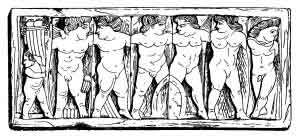
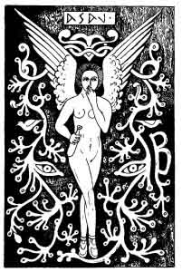
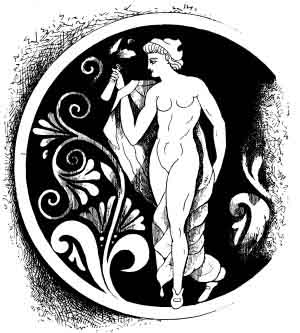
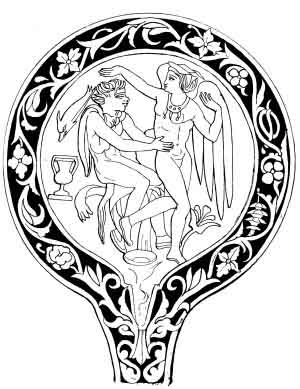
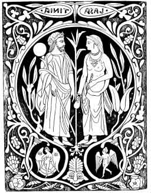
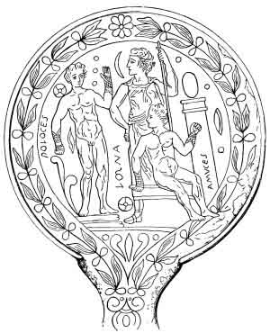
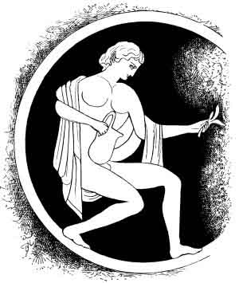
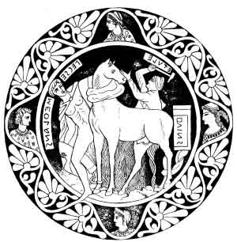
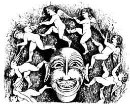

[Intangible Textual Heritage](../../index)  [Neo-Paganism](../index.md) 
[Index](index)  [Previous](err07)  [Next](err09.md) 

------------------------------------------------------------------------

p. 80

# CHAPTER V

### LARES, LASA, AND LASSI

"E nos Lases iuvate,  
Neve luerve Marmar sins incurrere in pleoris.  
Satur furere Mars limen sali, sta berber.  
Semunis alternei advocavit conctos  
E nos Marmo iuvato.  
Triumpe. Triumpe."  
           

Song of the Arval Brothers

BY the Latin words *Lar* and *Lares* we generally
understand domestic family spirits, on which subject MÜLLER (*die
Etrusker*) gives much information and conjecture. He writes: "That the
Lares belong to the Tuscan mythology is shown by the name, for as Larth
and Laris were common surnames, they must have originated in an
*Ehrennahme* (some common name of honour). But both among Tuscans and
Romans it was a very comprehensive name. . . . There were

p. 81

*Lares coelopolentes*, *permarini*, *viales*, *vicorum*, *compitales*,
*civitatum*, *rurales*, *grundules*, and finally the *domestici* and
*familiares*, the comprehension of which

 

LASA, OR GUARDIAN SPIRIT

 

in the course of time has become obscure, owing to confusion with the
others. The rural Lares, on the other hand, are those which in the very
ancient song of the Arval brothers are called on as *E nos Lases
iuvate*."

p. 82

"*Lases* was certainly in Rome the oldest form of the word " (*Note* p.
93).

"Now it is very remarkable at first sight that under these extremely
varied deities there are *human souls*." This is confirmed by MÜLLER
with a mass of proofs. He then adds:--

"The *Lares familiares* must necessarily be included among these, as
they were generally nothing else than souls of ancestors become gods,
many of the ancients (APULEIUS, MARTIAN, and VARRO) having declared that
*genius* and *lar*, referring especially to domestic lares, were one and
the same."

Our author declares that the Lasa were generally female spirits occupied
it, adorning men and women, as depicted on vases, and that, "so far as
Etruscan is concerned, it is doubtful whether *Lasa* and the *Lares* are
connected."

Conversing one day with my best authority on Tuscan folk-lore, I asked
if she knew such a word as *Lar*, *Lares*, or *Lare*? "No, she had never
heard it." "Did anything with a similar name haunt churchyards?" "No;
but," reflecting a minute, "there are the *Lassi* or *Lassie*." "And
what are they?" The answer was as follows:--

"*Lassi* are spirits which are heard or seen in a house when one of the
family dies. They are the *ghosts of the ancestors* of the family, who
come at such a time."

This was conclusive, and I have no doubt that these *Lassi* or *Lasie*
are the *Lasa* referred to in the song of the Arval brothers. Of course
this is not absolutely proved, but when we consider that Tinia, Fufluns,
Feronia, and Mania all exist with most of their ancient characteristics,
it must be admitted that we have here an extremely strong probability.
The *Lasa* were in the very oldest Latin in existence ghosts of
ancestors, or domestic familiar spirits, and so are the *Lassi*. And
MÜLLER gives no proof whatever that the Lasa, or "winged spirits on the
vases, with a frontal band or cap and earrings, naked or in a short
*chiton* with armlets, half boots or shoes," and holding a great variety
of objects in their hands, were not *Lares* deified. It seems to me to
be most natural that the spirits of the ancestors, revived in youth and
beauty, should be the first to wait on and aid the descendant risen to
paradise. MÜLLER himself says elsewhere, "In the *Lar* the *Genius*
always comes to light." What are these *Lasa*, if not the geniuses of
the departed? Unfortunately, MÜLLER, though gifted with perfectly German
industry, and not deficient in sagacity, had not a gleam of intelligence
as regarded the folk-lore of a race, or the immense value of minor
matters. To write in an admirable and clear style, *en grand critique*,
over the *great* events or subjects of a race is certainly very fine,
but it is to be hoped that a time is coming when we shall have seen the
last of these Mr. Dombeys of History, with their prize works

p. 83

crowned by Academies, in which there is not a gleam of intuition, nor a
nuance of colour, and as little real knowledge of *life*.

There is a story of the Lasi or Lasii, also an invocation to them. I
would say that, as regards the songs or metrical passages in all such
accounts, I have not been able, with all care, to give them in the
original or best form. In most cases my informant translated them from
the original Romagnola dialect into Italian, and they were often
manifestly imperfect or partly supplied. The tale is as follows:--

"There was once a great lord who was very rich, and he had a son who was
a great prodigal--*che sciupeva tutto il danaro*. His father said to
him, 'My son, I cannot live long, therefore I beg you to always behave
well. Do not go on gambling, as you are wont to do, and waste all your
patrimony. While I live I can take care of you, but I fear for you after
my death.' After a little time the father died. And in a few days the
son brought all to an end. Nothing remained but the palace, which he
sold. But those who occupied it could not dwell there in peace, because
at midnight there was heard a great clanking of chains and all the bells
ringing. And they saw black figures like smoke passing about, and flames
of fire. And they heard a voice saying:--

"Sono il *Lasio*,  
In compagnia  
Di tanti *Lasii*,  
E non avrete mai  
Bene, fino che  
Non prenderete  
Questo palazzo  
A mio figlio.' [1](#fn_8.md)

("'I am the *Lasio*,  
And there are with me  
Many more *Lasii*.  
No good shall come to you  
Till you restore  
This place to my son!')

"So they gave back the palace to the heir. But he too was greatly
terrified with the apparitions, and  
there came to him a voice which said:--

"'Sono il Lasio  
Di tutti Lasii,  
Son' tuo padre,  
Che vengo adesso  
In tuo soccorso  
Purche tu m'ubbedisca,  
Smetti il giuoco,  
Altrimenti non avro  
Mai pace--e tu

 

p. 84

 

Ti troverai ancora  
In miseria estrema;  
Ma se tu m'ubbedisca,  
Io vivro in pace,  
E sarai tanto ricco  
Da non finire  
Il tuo patrimonio;  
Anche divertendo te  
E faccendo molto bene,  
Ma prometté mi  
Di non piu giuocare.'

("'I am the Lasio  
Of all the Lasii.  
I am thy father  
Come to thy succour;  
If thou'lt obey me,  
Cease gaming for ever,  
Or thou shalt never  
Know peace . . . and thou  
Wilt again find thyself  
Stink deep in misery;  
But if thou obey'st me,  
I shall have peace again,  
And thou shalt be wealthy  
Far beyond measure,  
Living in pleasure;  
Only this promise me,  
Never to play again.')

"Then the son answered:--

"'Padre perdonatemi!  
Non giuochero pin.'

("'Father, forgive me;  
I will ne'er play again.')

"Then the father replied:--

"'Rompi quante trave  
Che son' nel palazzo  
E piene di danaro,  
Le trovarei,  
Cosi starei benme,  
Ed io staro in pace,  
Nelle require  
E mettermi. Amen!'"

("'Break down the beams  
Which are in the palace  
They are full of money,  
As you will find.

 

p. 85

 

FAUN AND FEMALE LASA OR FAIRY

 

p. 86

 

Then I shall be quiet  
In the rest of the dead.  
There I go. Amen!"')

It was explained to me that by the beams meant breaking away the
ceiling. Two things strike me in this strange semi-poem. One is that the
story is very much like that of the Heir of Lynne in PERCY'S *Relics*.
Secondly, that it is altogether more like an Icelandic narrative than
anything Italian. It is grim, strong, and very simple--one may say
almost archaic.

There is also an invocation of witchcraft to these spirits of ancestors
which is not less curious:--

"Lasii, Lasii, Lasii!  
Che tante buoni siete  
D'una grazia io ne ho  
Gran bisogno;  
E da vuoi spiriti  
Spiriti e Lasi,  
In mezzo a uno cantina,  
Mi vengo inginnochiare  
A vuoi altri  
Mi vengo a raccomandare  
Che questa grazia.  
Mi vorrete fare!  
Lasii, Lasii, Lasii!  
A vuoi vi presento,  
Con tre candele,  
Candele accese,  
Tre carte, l'asso di picche,  
Quello di fiori,  
E quello di quadri,  
Le buttero per l'aria,  
Che vuoi certo mi vedete  
Per cio le butto  
In vostra presenza  
Nell punto della mezza notte,  
Queste carte  
Per l'aria buttero,  
Se la grazia mi farete,  
L'asso di fiori scoperto,  
Trovare mi farete,  
Se scoperto l'asso di pique,  
Mi fate trovare,  
E segno che la grazia  
Non me volete fare;  
Se mi farete trovare  
Quello di quadri  
Segno e che  
La grazia mi fate."

 

p. 87

 

("Lasii, Lasii, Lasii!  
Ye who are gracious  
There is a favour  
Which I need greatly,  
And of ye spirits,  
Spirits and Lasii,  
Here in a cellar  
Now I am kneeling,  
And I commend myself  
Unto your graces,  
That ye will grant me  
This special favour!

Lasii, Lasii, Lasii!  
Here I present myself,  
Bearing three candles,  
Three candles lighted,  
Three cards--the ace of spades,  
And that of clubs,  
And that of diamonds.  
I fling them in the air  
That you may see them  
Plainly before you,  
Here just at midnight  
In air I throw them;  
If you grant me a favour,  
Cause me to find  
The ace of clubs plainly.  
If 'tis the ace of spades  
'Tis a sign that you will not  
Grant me the favour;  
But if you make me find  
The ace of diamonds,  
Then 'tis a sign  
That my wish will he granted.")

 

"But," added the fortune-teller, in a prosaic voice, "it will not be
until after a long time."

Games of chance and lotteries are such a serious element in Italian life
that no one need be astonished at an invocation like this being
addressed to the Lares. Perhaps the Romans did the same for luck at
*alea*, or dice. I would that I had by me my copy of PASCHASIUS JUSTUS'
*De Alea*. I might find it in that!

It may be remarked that in this account the *Lasii* appear as benevolent
spirits, devoted to a family. Since recording this Tuscan story of the
Lasio who gave the treasure, I have met with the following in the
*Romische Mythologie* of L. PRELLER:--

p. 88

 

TINIA AND LASA

 

p. 89

"The *lar familiaris* is the *Schutzgeist*--guardian spirit of the
family. Next to the *Lar familiaris*, who is simply called the *lar* or
*lar pater* (the *father lasio*), there are many *lares familiares*. . .
. It happens, perhaps, that the grandfather confided a treasure to him
which he secretly hid . . . and he gives this to the only daughter of
the house, a good girl who has always given him daily offerings such as
incense or wine or garlands."

This is briefly the same story as that which I have related. The Lar or
Lasio has a treasure in reserve which he gives to the heir. It was
comfortable to think that there was in the house an attached family
spirit who might do one a good turn, and therefore the belief lasted
long among all rural people.

The young man Peppino, who went about much, at home and in the
marketplaces, to collect evidence of knowledge of the spirits by me
recorded, found that the Lasii were known, but gives the name as
*Ilasii*. This is evidently only an addition of the plural article *i*
(the) to *Lasii*.

Some time after I had written the foregoing relative to the Lasii, I
heard the following, which I made the narrator repeat, and took down
accurately:--

"When I was about twelve years of age something happened to me which I
thought at the time was funny or queer (*mi trovai à un caso buffo--cosi
io to chiamai*), but I have since regarded it in a very different light.
Once I went with some relations into the country. One day I was in a
dark forest, and wandered about picking leaves and wood-flowers, and at
last found myself in a very lonely place by a stream. I had a habit of
talking aloud to myself, and I said, 'Oh, I would like to bathe
there'--the weather was very hot--when all at once there stood before me
an old woman, who said: 'Dear child, if thou wouldst like to bathe,
undress without fear, I will protect thee.' There was something about
her which pleased me greatly, a care and kindness and sweetness which I
cannot describe. And when I had bathed and dressed myself she said:
'*Bimba*, thou hast had many troubles, and many more are before thee,
but be not afraid (*non ti sgomentare*), for in thy old age thou wilt
have good fortune,' and so she disappeared, and I never saw her
again--and I still await the good fortune which has not as yet come to
me.

I believe this was indeed a *lasia*, a spirit of some ancestor long
dead, who wishes me well.

What was best in this story I cannot relate, and that was the
earnestness with which it was told, and the manner in which the narrator
repeated the details, and the deep faith with which she expressed the
conviction that this was really a *lasia*. Truly they are a strange
race, these Etruscan mountaineers -their young folk see visions and
their old men dream dreams.

Pictures of Lases abound on Etruscan vases. They arc represented as
beautiful spirits, young, and more frequently feminine than male. They
are, I believe almost always, winged, and generally bear a bottle or
large phial. The Old Etruscan religion, which was distinctly
Euhemeristic, regarded the becoming a Lar as the first step to becoming
a god. on which subject the following is of interest:--

"Les Lares, ou Lases, qui jouent un róle si important dans les anciennes
religions de l'Italie, qui peuplent le monde romain, qu'on trouve
partont, au foyer de la famille, dans la ville, à la campagne, sur

 

p. 90

 

les routes--Lares familiares, urbani, rurales, viales, &c.; les *Lares*
ont sans acun doute fait partie de la cosmogonie Etrusque. Leur nom seul
semble le prouver, Larth on Laris est un nom et un titre d'honneur que
l'on rencontre fréquemment sur les inscriptions funéraires de l'Etrurie.
On lisait, d'ailleurs, dans les Livres Achérontiens qui faisaient partie
de la doctrine de Tagès, que les âmes humaines pouvaient, en vertu de
certaines expiations, participer a l'essence des dieux, et sous le nom
de *dii animales*, ou âmes divines, prendre place parmi les Pénates et
les Lares" (Servius ad *Aen*., iii., 168; cf. Fabretti, Gloss. Ital. s.
v.). "Ainsi s'accomplissaient dans les croyances de l'Etrurie les
mysterieuses destinées de l'âme humaine. *Le Genius jovialis*, après
l'avoir recueille comme une émanation de la divinité, lui donnait entrée
dans la vie; puis quand la mort venait séparer de la matière ce souffle
divin, l'âme, éprouvée par les sacrifices, ou l'expiation, pouvait
retourner parmi les dieux, et comme pénate elle remontait an rang on le
*Genius jovialis*, ainsi que nous l'avons vu, était placé lui-meme"
(L'Etrurie et Les Etrusques, par A. Noël des Vergers, Paris, 1862, vol.
i., pp. 301, 302).

It will be seen by this extract that the still existing very singular
belief that certain sorcerers' souls are sometimes reborn as mightier
sorcerers than before, and from this proceed to be spirits, is exactly
paralleled by the old Etruscan doctrine taught by Tages.

#### LOSNA

MÜLLER (die Etrusker, p. 81) says that CORSSEN (i., p. 346-7) "has
erroneously attributed LOSNA, a goddess of the moon, to Etruria. She
only occurs on a single mirror from Præneste (GERHARD, i., clxxi.), and
is Latin (*Lucna*, *Luna*)."

"It is not for us to settle the question." But on asking my authority if
she knew of such a being as Losna, I received the following reply, which
I wrote down as uttered:--

"LOSNA is a spirit of the sun and moon--of both, not of the moon alone.
When a brother debauches his sister it is always her doing. She loves to
deride people gaily. When she has made her mischief she will appear at
the table where a *contadino* is with his family, and laugh and say:
'Thou art a stupid fellow, thou knowest not that thy daughter is
*incinta* (with child) by her brother, for thou didst once say, "*E un
grande piacere à fare l'amore col proprio fratello*."' And when she has
done this mischief she goes away singing, because she has caused discord
in the family."

This startling myth has that in it which seems to prove great antiquity.
The gypsies in the East of Europe have a legend that they are descended
from the Sun and Moon; the Sun having debauched his Moon sister was
condemned to wander for ever, in consequence of which they also can
never rest. The natives of Borneo and the old Irish believed that the
Man in the Moon is imprisoned there for the same deed. Finally, the
Esquimaux have a similar story. These coincidences are fortuitous, but
in any case they are remarkable. As for its character, I have already
remarked that if these tales are truly handed down from the olden time
they ought to be replete with sensuality-as they are. In

p. 91

the spirit of collection, first established by GRIMM, nothing was
preserved, much less sought for, which was not fit, I will not say for
young ladies, but even for the nursery. In fact, fairy tales suggest
nothing as yet, even to well-informed people, but innocent, sweet,
pretty, and amusing *Mährchen*. But the old myths out of which these
grew were nothing of the kind. However, it has come to pass that most
collectors, influenced by fear of the Major-General Reader, quietly pass
over this element which was, if not the great guiding influence in myths
of what we may call the tertiary formation (or polytheism as it was
passing into pantheism), was at least almost the chief. And if we wish
to investigate the witchcraft of the first period, or this of the time
when men had begun to regard Fertility and Reproduction, and such
reviving influences as Light and Wine and gaiety as causes of life, we
must turn over a vast amount of what is fearfully "shocking" to all who
do not seek "*abditis rerum causis*"--into the hidden causes of things.
For it was out of what could most terrify and revolt man that all
primitive sorcery and much secondary Shamanism were formed, and if we
would know Man's early history we must not, or cannot, avoid such study.
Religious magic, at present, has dropped this portion of its first
state, only retaining, or returning to, the early fear of infernal
agency, or devils and hell, as the chief motive power in duty and
incentive to worship. To fully understand all that now exists, and have
a clear idea of what we really believe--which no living believer has--we
must understand man in the past. Till we do we shall not comprehend the
present nor clear the way for the future.

"*Losna*, that is *Louna*," says PRELLER, "appears on an Etruscan mirror
with the half-moon associated with Pollux, on another monument as Lala,
*i.e.*, Lara, Δέςττοιυα {Greek *Dé<u>s</u>ttoiua*}, with the sun-god
Aplu." It is just possible that some tradition of such association with
the sun may have given rise to the Tuscan story which is probably a mere
fragment. In any case it is remarkable that in it there is an allusion
to the sun and moon as an incestuous brother and sister.

I call the attention of the reader specially to the picture representing
LOSNA. It is from a mirror which has for a century been frequently
engraved in works on Etruscan art. This is now in my possession, and
lies on my paper as I write. According to Corssen (*Sprache der
Etrusker*, vol. i., p. 346), who refers to Gerhard's *Etruscan Mirrors*,
iii., 165, Ritschl; Cavendoni, Schoene, Benndorff, Helbig, &c., as
discussing it, it is from Praeneste, also that *Lusna* was the original
name, and that Losna is a dialectical form peculiar to Praeneste.

This mirror had greatly interested me. I had purchased in London one
book simply because it contained an engraving of it, and had made with
great

p. 92

 

LOSNA

(From the original Etruscan bronze mirror, now in possession of the
Author.)

 

p. 93

care three or four drawings of it from different works, with all of
which I was dissatisfied, and when my publisher, Mr. Fisher Unwin, went
over my illustrations with me here in Florence, March 5, 1892, I threw
"Losna" out very unwillingly. I state simply the truth when I say that
of all the mirrors ever made, it was this one in particular which I most
desired to see, and I remember that it was much on my mind. On the
afternoon of the following day I went by chance, or led by my Socratic
demon, into a shop for odds and ends, or "Curiosities," and there in a
glass case, and very much out of place, found an ancient Etruscan
mirror--the very one which had been engraved, and which I so longed to
see. I need not say that I purchased it at once. I should mention that
the engraving here given is absolutely correct, having been made on a
tracing or rubbing from the mirror itself, which is in a state of
perfect preservation.

These mirrors were believed among the Etruscans to possess magic power.
It is the same with the Chinese of the present day who make similar
ones, the reason being this: The Chinese mirror, like the ancient, is
polished on one side and has a picture, or more commonly an inscription,
on the other. If we let the sun shine on the mirror and reflect it on a
smooth white surface, the picture on the other side is distinctly
visible in the reflection. I have heard explanations of this which did
not satisfy me. About the year 1856 a daguerrotypist in the United
States having cut two lines in a cross on the *face* of a copper plate
found that though the cross was not perceptible on the back, yet that
when reflected in sunlight it could be distinctly seen in the
reflection. Hence I inferred that the pressure on the face hardened the
metal throughout, which perfectly explains the phenomenon. I suppose
that the Etruscan mirrors when new had the same quality. Of which
invention there is no mention, not even by J. Baptista Porta in his many
recipes for making marvellous "mirrors." The same may be made of glass
by *annealing* the picture. That is, we take a pattern in hard glass,
cast a bed of soft glass about it, and when cold grind off and polish
the surface, which will seem uniform. But the reflection against the sun
will show the light from the soft glass as duller than that from the
hard.

All mirrors are, according to ancient and modern superstition, repulsive
to witches, or evil spirits, and good against the evil eye and its like.
Fascinators--like basilisks--had their own terrible glance turned
against them if they saw themselves reflected, "Si on luy presente un
miroir, par endardement reciproque, ces rayons retournent sur l'autheur
d'iceux." As a lunar-solar goddess, I believe that Losna was peculiarly
associated with the mirror as a magic object. Philostratus declares that
if a mirror be held before a sleeping man during a hail or
thunder-storm, the storm will cease.

p. 94

#### LARONDA

Laronda in Tuscany is a very kind, benevolent spirit, who, strangely
enough, is peculiar to, or who dwells in, *caserme*, or soldiers'
barracks--"Sarebbe un spirito delle caserme dei militari. E molta
buona."

She seems to be identified with the old Etruscan Larunda, or Lara, of
whom Lactantius remarks: "Who can keep from laughter when he hears the
silent goddess mentioned? [1](#fn_9.md) This is she
whom they call Lara, or Larunda " (i., 20, 3 5). OVID speaks of her as
the *Dea muta*, or silent goddess. But from a passage in PRELLER'S
Mythology, I infer that she was specially known as good, since in
reference to a prayer to her he remarks: "Here we plainly understand
*ein guter Geist--ein seliger*"--a good or happy spirit.

But what is certainly very remarkable is that Larunda was especially the
mother of the *Lares compitales*. "*Compitum* is a point where several
roads meet. At such a place the Romans erected large buildings with
passages and rooms, literally corresponding to modern barracks. "In them
all the people round about met to discuss business and hold festivals."
Therefore the *Lares compitales* were the guardian spirits of such large
public buildings, where great bodies of men lived, or met. And Larunda
was literally then, as Larunda is now, the chief spirit of what
corresponds most accurately to the modern *caserme* which is now the
only building in Italy which is quite like the ancient *compitum*. All
of which PRELLER illustrates with much learning, and of all this I knew
nothing when I first ascertained what I have written of the modern
Tuscan spirit. And when we read that these ancient buildings were the
resort of boxers, actors, gladiators, and of political clubs, we may
well infer that soldiers also occupied them.

In the course of time stories grow up or are attached to names with
which they have very little real connection. Such a legend relating to
Laronda is the following:--

"Laronda is the *folletto* of the casernes. Once she was a *donna* named
Rosa who, during her life, was devoted to soldiers. After a while the
officers noticed it and forbade her frequenting the barracks, at which
she was so much grieved that she fell ill, and was long confined to her
bed. Then the soldiers themselves missed her sadly, and so arranged it
that she could come secretly among them; so for a time all went well.

"Among these soldiers was one who had a sweetheart who was a *zingara*,
or gypsy, as well as witch. Now the witch discovered that Rosa visited
the caserme, and that all the soldiers were devoted to her, and that
less for her beauty than for her gaiety and goodness; and with this the
gypsy was ill-pleased and said to Rosa:--

 

p. 95

 

"'Rosa, oh, Rosa, oh, fair Rosa! it is true that I am not so beautiful
as thou art, for I am a gypsy. And thou art esteemed by all the soldiers
and my own lover loves thee, so I beg thee not to frequent the barracks
any more!

"'Per cio ti voglio pregare  
Nelle caserme di non piú andare!'

Then Rosa replied frankly but resolutely, that she would yield nothing
whatever to please her foolish jealousy, at which the other, in a rage,
said: 'May my curse fall like lead upon thy head, nor wilt thou live
long--but one year do I give thee.

"'E fin anno che tu camperai,  
Tu non avrai che pene e guai.

"'A year thou'lt live in pain and grief,  
Ere death will come to bring relief.

"'And since thou lovest soldiers so well, thou shalt have no rest after
death, but shalt become *il folletto della ronda* (the spirit of the
patrol, or night-guard), and LA RONDA thou shalt be.'

"As she threatened so it all came to pass, and the soldiers grieved for
her death. But while they were sorrowing they were suddenly amazed to
see at a window the apparition of a lady of great beauty clad in white,
who said:--

"Io sono la bella Rosa, I am the beautiful Rosa--but now I am dead I
have become the *Folletto della Ronda* of the soldiers, and when night
flees from the world of the eternals I will come to seek you, and when
you hear me call, then open the windows to *La Ronda*."

There will be many to whom this adaptation of a modern pun to a word
will quite suffice to destroy all connection with the classic Larunda.
In this way we might utterly invalidate all and any tradition whatever,
just as VOLTAIRE declared that the petrified shells found on
mountain-tops had probably been scallop shells dropped by pilgrims from
the Holy Land. But Laronda was from very ancient times the guardian
spirit of the public building, while this story turns upon a mere
resemblance of the word to a technical term with a very different
meaning. I think it most probable that some ingenious but ignorant
person, hearing of Laronda, adapted it to the word for patrol or
"round."

I have since heard it asserted that Laronda may be, or is, the spirit of
any large building frequented by many people, such as a hotel. This
seems to be the old and generally entertained idea, while I have no
guarantee whatever that the story is not a mere modern fabrication
founded on a jest.

If Larunda be modern because there is a modern story fitted to the name,
then of course any myth may be punned or conjectured out of existence.

#### LEMURI

On asking if such a word as Lemures was known, I was told that *Lemuri
sono i spiriti dei campo-santi*--"Lemuri are the spirits of the
churchyards." This

p. 96

clearly enough identifies them with the Latin *Lemures*, which were the
same as the Larvæ, or the unhappy and terrifying ghosts of those who
have died evil deaths, or under a ban, to which there are innumerable
allusions in all Latin writers. [1](#fn_10.md)

#### TAGO

Tago is a spirit whose name appears to be known only to a few old
people. He is described as a *spirito bambino*, or appearing as a little
boy. Of him Favi Gustavo declared Tago is a spirit who is invoked, when
we see children suffering, with an invocation which causes them to
recover their health. But this prayer I do not recall so that I could
write it."

 

 

Another authority informed me that there is a *spirito bambino*, or
spirit like a boy, who is, however, a wizard. His name is *Terieg'h*
(harsh and guttural and uncertain). He comes up out of the ground, and
predicts the future or tells fortunes. As these are the only spirits in
such form I suppose them to be the same being.

The name Tago will naturally suggest to the scholar that of Tages, "the
wise Etruscan child plowed from the earth," whose history is given in
detail by Preller and many more, but by no one so succinctly or
elegantly as by Petrarch in his Italian-Latin. This child, one day, as a
peasant was ploughing--*Hetrusco quodam arante in agro
Tarquiniensi*--leapt from the furrow, an infant in form but with an old
man's head and wisdom--*puerili effigie sapientia senili*--and proceeded
forthwith to astonish everybody by his prophesies and instructions in
what was then religious wisdom, but what we should now call magic. And
it was indeed from his books and teachings that all Roman divination and
sacred observances were drawn. And as Etruscan lore began with him, it
would be indeed deeply interesting if we could prove that he still lives
in his Etrurian home as Tago or Terieg'h. Truly such survivals as these
may not be of the fittest for the spirit of the age, but it is befitting
that they be recorded, if only to show the extraordinary manner in which
they are frozen up in popular tradition to be now and then

p. 97

 

TAGES

(From the Etruscan Museum of Gori.)

 

p. 98

thawed out to some seeker. But whether Tago or Terieg'h really be Tages
I leave for others to settle. *Davus sum non Œdipius*. For, as Johannes
Practorius says in his *Anthropodemus Plutonicus*, that "all this story
of Tages maybe a mere fable wherewith the devil, after his fashion, hath
deluded and betrayed man with a wonder, that he might use the many
superstitions which had their beginning in Tages, his fortune-telling
and sorcery."

#### FANIO

Hæc loca capripedes, Satyras, nymphasque teneræ,  
Finitimi fingunt et FAUNOS esse loquntur,  
Quorum noctivago strepitu."  
                             LUCRETIUS, iv., 584

To a person of humanity and tender feelings there is something very
touching or indescribably pitiful in the manner in which the people in
Europe clung to their old gods and resisted Christianity. For it is
*not* true at all, as is generally misrepresented, that they gladly took
to the mystical, abstract, Hebrew-Persian Roman Catholic religion of
*professed* love, and priestly and feudal oppression which they did not
understand. Nor did they find any attractions in its making a duty of
obedience to cruel feudal tyrants, of asceticism, fasting, and dread of
the devil. It was all forced on them, and they long resisted it. Despite
cruel persecution (as Horst and Michelet observe), the peasants
persisted in their devotion to the poor old forbidden gods, and every
few years, so late as the fifteenth century, councils thundered at,
colleges condemned, and priests burned people for heathen sacrifices.
And they were not a few who thus clung to the ancient faith. They were
all over Europe, and, as I have shown, there are some still left in the
Toscana Romagna.

This old religion of nature was congenial to the people because they
understood and deeply felt it. They had, as I hope the reader has, an
impression that there is a spirit in the pathless woods, deep song in
silent shade, life in the long-forgotten land of early days--homes of
visions in the old grey rocks with possible portals through which elves
or their own elfin thoughts may pass. They know the Voice of the
Waterfall, and what the stone said when it was thrown at twilight into
the well or silent pool "under the stars," and why the laurel crackled
when it burned, and what words it said--these were all spirits, and they
had learned the spirit-language from their fathers. There was an
indescribably delightful, companionable sense in believing that there
was a jolly, mischievous, familiar goblin who lived in the fire, or
haunted the fireplace, who teased the girls and bothered the boys, and
was "so sociable." All of these were like themselves, and within their
natural comprehension,

p. 99

and they would believe in them because, as they must adopt some kind of
supernaturalism, they took that which was most natural, sensible, and
congenial to them. A haggard, bleeding, pallid spectre, everlasting
goody-goodiness of

 

ETRUSCAN RURAL DEITIES

Madonnas, and the agony of tortured saints with no end of fasting and
prayer, are not congenial to us, nor did healthy humanity ever accept
them in loving earnest, as it did the old heathen gods. The whole
history of the Middle Ages--or

p. 100

you may continue it later an you will--is one of mankind making believe
that they believed in misery. And the proof of it, reader, is very
plain, and it is simply this-that wherever and whenever Christianity has
any "superstitions" or elements quite in common with the old heathenism,
there people are most truly religious. "Man is properly the only object
which interests man;" he feels and lives in Humanity and Nature, and
never truly cares for what is remote from or is forced into these.

You and I, reader, feel the true spirit of old heathen religion when we
walk in the forest and skirt the line of " thus far--and then no
more--the language of the sounding sea to the sands upon the shore," or
arc sitting by the fire in silent night. We do not make it into goblins,
but our own thoughts and memories become to us quite the same as
spirits, for we feel or see how we can give them life or expressed
thought in act or words. Make this *literal*--not a mere figure of
speech--and then, friend, you will be as happy as a heathen suckled in a
creed outworn--yea, quite as well off--which was all that Wordsworth
wished for, and was not unlike the desire of François Villon, who
yearned for the ladies of the olden time.

It is a great pity, but pity 'tis 'tis true, that owing chiefly to the
*affected*-sentimental, or false influences of mediæval religion and its
resultant "art," we do not really know what we *ought* to admire or
"feel beautiful" over, or enthuse about, till somebody has told us how.
Then we go and "do it." We do it by going to see all the places
prescribed by the hotel directions, "there and back, twenty-five francs
for a party of four," and duly admiring them, and pass by without note a
hundred spots even more beautiful. And verily such a doing thereof as I
behold here among tourists in Italy to see what it is "the thing" to see
(*i.e.*, everything, according to Ruskin, Bædeker, and Co.), might draw
tears from a millstone. A child or a peasant is better off--it or he
takes Nature as it comes--naturally. The tourist who goes by precept may
*think* that he can feel nature as a child, but he does *not*. You
cannot serve God and Mammon together.

This old spirit of unaffected feeling of nature without " culture " is
deeply impressed in all this Tuscan-Etruscan folk-lore, and I would that
my heart could utter the thoughts which it often inspires. It was all
summed up for the ancients in the single word *Faunus*. Faunus and the
Fauni were the incarnation of forests, streams and fields, fairy-life
and flowers. Therefore I was glad to find that this deity, who is only
another form of Pan, still lives in the Romagnola, as is set forth in
the following passages.

"FÁNIO is a wizard who comes in the form of a spirit." This appears to
be the Euhemeristic conception of all the spirits in this very primitive
Tuscan

p. 101

mythology. First a wizard, or a man of power on earth, who is remembered
after death, and then is supposed to still haunt the scenes of his
former life. What Fánio does was narrated as follows:--

"Fánio frightens peasants in the woods. He appears as a man leaping up
with his hands wide open, thrown forward, or looks like a devil,
scattering fire, and then laughs at the fear which he has caused. And
when there is a wedding he often anticipates the bridegroom in his
kisses, and when the husband comes and would embrace his wife he feels
invisible blows and cuffs, which put him in a rage, when Fánio bursts
out laughing, and says:--

"'Vuoi sapere chi sono?  
Sono lo spirito *Fánio*,  
Che cio che m'e piacuto in vita,  
Mi piace at altro mondo;  
Mi dovresti ringraziare,  
Che ti ho risparmiato tanta fatica!'

'Who I am?--if you would know,  
I'm the spirit Fánio!  
What in life once gave me bliss,  
Pleases me as much in this;  
And I think that thanks are due  
Unto me for helping you!')

Then if the husband is vexed at this, and if his wife is angry and
curses the goblin, he only torments her the more and returns as a
nightmare to disturb her sleep."

It is not difficult to recognise in this Fánio the Faunus of the Latins.
All of the characteristics attributed to him in the account agree
accurately with what PRELLER relates:--

"In some phases of popular belief Faunus appears as nearly allied to
Silvanus, as a spirit of the forest, who lurks in deep shadows, in
hidden caverns, or by rustling waterfalls, where he predicts fortunes or
catches birds, and chases the nymphs. . . . The fauns as a class were
much given to teasing and tormenting mortals in their sleep, so that
they sometimes appear altogether as annoying imps--like the nightmare to
us--against which attacks people used all kinds of roots and quackeries,
especially the root of the forest-peony (*Waldpäonie*), which had to be
dug by men by night, else the great wood-pecker would peck out their
eyes. But, above all, the women had to be on their guard against the
fauns and Silvani, for these lecherous wood-goblins readily slipped into
their beds, whence the popular name of Incubus for them." "From their
lechery they were called Faunificarii. 'Vel Incubones, vel Satyros, vel
sylvestres quosdam homines quos nonulli *Faunes picarios* vocant'"
(*Hieron. in Isai*, v. 13, 21).

These fauns and silvani of Tuscan belief are very much allied to the
mischievous household goblins. They all make naughty love to women, and
act as incubi, or nightmares, and cause wild dreams. Quite the same
spirits were known of old in Assyria. Lenormant says (*Magie
Chaldaienne*):--

p. 102

"To the Incubus and Succubus was joined the Nightmare in the Accadian
*Kiel-udda-karra*, in the Assyrian, *Ardat*. . . . It is probable,
judging from its name, that it was one of those familiar spirits which

 

FAUN (On a patera. (Etruscan) Museum, Florence.)

 

make the stables and the houses the scene of their malicious tricks;
spirits whose existence has been admitted by so many people, and which
are still believed in by the peasants in many parts of Europe."

p. 103

It may be remarked that nearly all the spirits which occur in this
peasant mythology are of the nature of the fauns. Also that while the
Romagnola contadino has retained old Etruscan names of gods, and those
of the minor sylvan and rural deities, such as Sylvanio, Fano, and Paló,
he has not the great Latin gods. Bacchus is commonly enough sworn by,
but I could gather no information regarding him, save that he was "the
god of wine, and therefore must be the same as Faflon." The best
treatises which I have met on the Fauns, Satyrs, Silvani, Incubi, &c.,
form chapters in that strange work by C Bauhinus, 1667, entitled *De
Hermaphroditis*, &c.

The peony was, on account of its red colour, regarded as great
protection against the fauns as nightmares. PRÆTORIUS (*Anthropodemus
Plutonicus; Von Alpmännrigen*, 1666) mentions that people, to keep away
the Incubus, wear round their necks, or hanging from them, "flints,
corals, or peony roots."

It is worth observing that the *ceppo sacro*, a holy log of wood which
is burned on Christmas Eve--the yule-log of the North--is taken with due
observance and incantation to the fauns or other spirits of the forest.
For, despite his immoral and mischievous conduct, Fánio is a general
favourite, as was Faunus of old, for many reasons not too far to find,
but not worth specifying.

In a work on Faunus, *Del Dio Fauno, e de suoi segnaci, di Odoard
Gerhard* (Eduard Gerhard, Naples, 1825), the author declares that
whatever deity he may have been, mixed and mingled as he was with
others, is not difficult to determine. The truth is that all these minor
spirits of forests and fields, firesides and bedrooms, were naturally
familiar and mischievous creatures, as much alike as romping schoolboys,
therefore all nightmares; teasers of girls, therefore seducers, and
consequently wanton and gay. They were in reality more distinguished by
flames than by natures.

#### QUERCIOLA

This word refers to an herb or small plant which, as in the case of rue,
*rosalaccio*, and others, is by mysterious association also a fairy.
*Querciuola* is properly, in Italian, a small oak-tree, but, as in many
other instances, it has been transferred from one plant to another in
Romagnolo. What I learned of it (given to me with specimens of the
plant), is as follows

"When one has quarrelled with a lover, one should go and sit beside the
plant called Querciola, wherever it is growing, because the fairy of
that name is a great friend to lovers. So when one is distant, or
separated, be it as to the heart or place, the other sits by the herb
and sings:

p. 104

"'Fata Querciola!  
Sei tanto bella quanto buona  
A ti mi vengo raccomandare,  
Che il mio bene  
A mi tu faccia ritornare.

Fata Querciola!  
Ai fatto tanto bene  
A tante persone  
Anch' io voglio sperare  
Che di me non ti di me  
Vorrai dimenticare.

Fata Querciola!  
Sei tanto bella e altra tanto buona  
Ti chiedo una grazia sola  
E spero non me la vorra negare,  
E lo mio amore  
Mi farai ritornare.

Fata Querciola!  
Sofrirei tante pene  
Se da me non tornasse il mio bene,  
Ma da me le conviene si ritornare,  
Perche la fata me l'ha promesso,  
Di farlo ritornare sotto al mio tetto.

("'Fairy Querciola!  
Thou art good as fair  
Let me hope and not in vain,  
That thou wilt send happiness  
Unto me again!

Fairy Querciola!  
Thou hast blest so many,  
Send a blessing unto me,  
Let me hope that I, though humble,  
May not forgotten be!

Fairy Querciola!  
Fair as thou art good  
One favour I implore,  
Which I hope thou'lt not deny  
Make him who was my lover  
Return to me once more.

Fairy Querciola!  
I shall suffer sore  
Unless my love as lover  
Comes back as once before.  
But, fairy, thou hast promised me,  
And what thou sayst will surely be,  
He'll seek my roof once more.'")

p. 105

Querciola, or Querciuola, as the name of a nymph or sylvan spirit, is
clearly enough closely connected with that of *Querquetulana*, an old
Roman or Italian simile for *Vira* (which see), a wood-nymph; though the
term, like Querciola,

 

SETHLANS, VULCAN, AND THE TROJAN HORSE

 

refers especially to a dryad, or spirit of an oak. So FESTUS observes
(PRELLER, R. M., p. 89, second edition): "*Querquetulanæ Viræ putantur
significari nymphæ presidentes querqueto virescenti, quod genus silvæ
indicant fuisse intra portam quæ ab eo dicta sit Querquetularia*."
Querciola is therefore clearly a dryad.

p. 106

These Querquetulanæ have an apparent, or barely possible, survival in
the spirits called *Querkeln* in Bavaria. They emigrated from that
country, passing over the river Main by the village of Wiesen
(*Bayerische Sagen von Fried. Panzer,* Munich, 1848).

#### SETHANO

I am not sure whether this name is Sethano or Sethlrano or Settrano, nor
have I been able to learn more than what is contained in these lines:--

"Settrano is the spirit of fire. He is remembered by all here. They know
a proverb (*i.e.,* a saying, invocation, or spell) which is repeated.
When they do not wish the fire to burn they invoke (*se voca*) that
spirit,"--SETTE TICO.

Of all these spirits there are invocations and tales, but I have not in
all instances been able to collect them.

Sethlans was the Etruscan Vulcan.

 

------------------------------------------------------------------------

### Footnotes

[83:1](err08.htm#fr_8.md) In all cases where the
text is in metre the original was chanted or intoned.

[94:1](err08.htm#fr_9.md) "Quis, quum audiat deam
Mutam tenere risum queat? Hanc esse dicunt, ex qua sint nati Lares, et
Laram nominant, vel Larundam." Which is what an ancient heathen might
have said at seeing a Spanish Virgin Mary in an old French bonnet, or
even some of her similitudes here, in Italy, which are ten times sillier
and more laughter-moving than the rudest works of Roman times.

[96:1](err08.htm#fr_10.md) "Verum illi manes,
quoniam corporibus illo tempore tribuuntur quo fit prima conceptio,
etiam post vitam iisdem corporibus delectantur, atque cum iis manentes
appellantur Lemures" (MARTIAN, *Cap de Mess*., ii., 9, p. 40; ap.
MÜLLER). "Lemures larvæ nocturnæ et terrificationes imaginum et
bestiarum" (AUGUSTIN, c. Dei. ix. II; ap. PRELLER). "Lemures umbras
vagantes hominum ante diem mortis mortuorum et ides metuendus " (PORPH.;
ap. PRELLER).

------------------------------------------------------------------------

[Next: Part One: Chapter VI--CARRADORA](err09.md)
