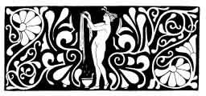
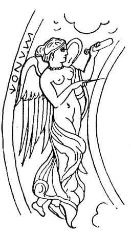
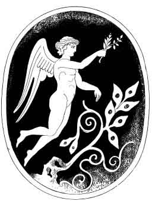

[Intangible Textual Heritage](../../index)  [Neo-Paganism](../index) 
[Index](index)  [Previous](err09)  [Next](err11) 

------------------------------------------------------------------------

p. 122

# CHAPTER VII

### TITUNO

"Tituno is the spirit of thunder--*forgore*--and he is known in all the
Romagnie." So asserts Naudo Papetti. Another authority (Peppino) gives
the name as Tit'uno "*lo spirito del folgore*," adding that he regrets
that he cannot communicate much on the subject, but that when the season
of the silk-worms shall have passed he will go forth among the
*contadini*, and gather up what unearthly lore he can. Meanwhile he has
noted down as to Tit'uno the following:--

"This spirit did marvellous things in the ancient time when
Jupiter [1](#fn_15) was wont to let loose his
thunderbolts over great plains, destroying everything. Then the people
invoked this spirit, saying:--

"Spirito infernale ti scongiuro  
In nome di Dio e del santo Isodorio.'

Then they took salt and holy water and sprinkled the house or the place
where they were. Then the thunder departed and did not return to repeat
the mischief, the invocation being a protection. And I have found a
*contadino* who repeats it, but he says there was a time when every one
in the Romagna did so."

It cannot have failed to strike the reader, as I have indeed observed it
more than once in this book, that there are many spirits of thunder and
lightning, which was also the case with the Etruscans of olden time,

p. 123

#### ALBINA

Obstinet dicebant antiqui quod nunc ostendit, ut in veteribus
carminibus: sed iam se cælo cedens Aurora obstinet suum
patrem."--FESTUS, p. 197

It will come to pass, and that at no very distant day, when--although
there will be no lack of people who will understand this book perhaps
better than I do--there will not be a soul living who can *feel* it. For
a copy may be kept in some library, even unto the time when there will
be no more wild woods, or wildernesses, either rural or human; when
every tree and rock will be recorded, and every man and woman be well
educated--and all the better for them--probably into something far more
sensible than sentimentalism or superstition, but the ancient spirit in
which the past was lived will be irrecoverably lost. I have no fear that
the *outlines*, or drawing, of my humble pictures will perish, but I
know that the colours will inevitably fade, and yet it is the colour
which most impresses me as I now write. A few days ago a dealer in
bric-a-brac here in Florence showed me a picture which he said was by
Beato Angelico. It was not by that master, for it was very correctly and
beautifully drawn; what was remarkable in it was that it was utterly
faded, all was dead grey-white, figures as well as ground being quite
uniform. But the artist had outlined, or stamped every detail with
tracer or wheel, so that the original conception of form still remained,
and I--knowing the time and school to which it belonged--could
conjecture what it must once have been. So I beg the reader to endeavour
to re-colour or revive these outlines. After all, that is a poor
portrait which only conveys an idea of the great *skill* of the artist;
at least half of its effect should consist in giving us some vivid idea
of what the original must have been, as man or woman, and a very badly
executed sketch often does that, better than a very artistic work, as
cheap popular caricatures of public characters abundantly prove.

These thoughts occurred while disentangling the meaning of a rude
fragment which was half-recited and half-sung to me, and then written
down as roughly as it had been repeated, yet in which there is a certain
mysterious beauty, as of a dayspring obscured by clouds. It is of a
spirit of the dawn who, is supposed very appropriately to herald a
bright day, or promise hope to unfortunate lovers.

"Albina is a fairy who appears when morning dawns--*quando spunta
l'alba*--to lovers who love in vain. She herself once, when in life,
loved and was beloved, but she was in the power of an aunt who was a
sorceress, and who opposed her love, and said to her: 'Leave this lover
of thine, or evil shall befall thee. Firstly, thou shalt be a fairy, and
when I die thou wilt take my witchcraft and never more have peace nor
happiness.'

p. 124

"Albina replied: 'Though all the world should perish, I will wed my
love, and if I must become witch or fairy, then I will use all my power
to benefit lovers.'

"'I will do evil to women who betray their lovers.' So Albina kept her
word. If a youth in love prays to her at early dawn he will be sure to
gain her favour.

"When a youth loves and meets with no return he must rise before
daybreak, and, kneeling in an open field, say:--

"'Alba, alba, che tu spunti  
Fa spuntar per me l'aurora!  
Che l'Albina venga fuori  
Una grazia mi deve fare  
A lei mi vengo a raccomandare,  
Dalla mia amante sono disccaciato,  
Sa anche l'Albina per amore,  
Quante mia passate sa che l'amore,  
E tanto forte che si preferisce,  
Preferisce piu tosto la morte,  
Che da un amante abandonati.'

 

Albina is, by name, allied to Alba the dawn, or is plainly enough Aurora
herself. Further questioning I leave to the learned. But what is worth
remarking is that in this wild, imperfect sketch we have the fragment of
some ancient and possibly far more perfect poem, utterly beyond the
creative power of a mere illiterate *contadina*. Albina dreads the
becoming a fairy, spirit, or witch. It may be observed that in all this
lore there is something mysterious and terrible, to gentle natures,
connected with the transfiguring of mortality into *folletti*. Albina
fears it, but rather than relinquish her faith to her lover, and even
though she lose him, she will not yield one whit, and declares that if
unearthly power be forced upon her, she will exert it in behalf of
unfortunate lovers. Which is realised.

All of this is not clearly and artistically developed in the
incantation, but it was apparent enough in the glances and expression of
the *strega*, who simply had a rough diamond which she could not polish.
To better understand this let the reader suppose a Hampshire peasant
singing such a song.

There was an old Roman, now Tuscan, town called *Albinia*.

#### VERBIO

The strange manner in which dim recollections of ancient myths are
handed down in names, and how they are worked over and varied by the
people, is illustrated by the following story from the Romagnola:--

"*Verbio* was a beautiful youth, as good as he was beautiful, and he
loved with all his heart a maid who seemed to return his love.

 

p. 125

 

"But she soon was tempted,  
Tempted by another  
Youth of greater beauty,  
Which was like enchantment  
Yet be was a stranger,  
And he bad no story,  
For this handsome stranger,  
Verbio was slighted.

"Then Verbio fell ill in despair, and seemed to be dying, and the girl
learning this repented, and in grief said to her new lover: 'I have done
wrong, and I now see that Verbio loved me truly as thou dost not and no
one can.' Then her lover gazed at her and she saw he was not a man but a
devil. And he said:--

'See what thou hast done,  
See how thou art wicked,  
Leaving one who loved thee  
With all soul sincerely!  
Yet for me you left him,  
Yes, for me, a devil;  
Now you both are lost,  
For thou'st truly promised  
To be mine for ever,  
As thou boldest Verbio.  
But if you will sign  
With your blood a contract  
To be mine, I'll grant ye  
Many, many years  
Of happiness together.'

Now Verbio did not believe in the power of devils, and was only too glad
to get his love again, and so signed the contract, as she did also. And
they lived happily indeed for many years but years must end, and so it
came to pass that when the time of the contract expired both died at
once. And all at once there was an awful storm over all the land, the
heavens grew dark by day, and horrible fires flashed out of the
darkness, and amid the storm was heard a voice which sang:--

'Women, learn to love  
One true love, and truly;  
When you're truly loved  
Be warned by my example  
Now I pay the fee  
For my fatal falsehood.'

And since that time the two have gone about as spirits knowing no rest."

 

Virbius was the attendant--"*genius* or *indiges* of the forests of
Diana, or the oldest king and priest--*rex Nemorensis*--who founded her
worship." He was, says PRELLER, a male demon, worshipped with Diana. He
was compared with

p. 126

and in fact was, " the Greek Hippolytus who, after he had been trampled
to death by the wild horses of Poseidon, was revived and carried away by
Diana."

Diana is known popularly to-day as the Queen of the Witches, but rather
as Hecate, in a dark and terrible sense. And if Verbio be the modern
form of Virbius it is evident how he has become a spirit of the night,
knowing no rest. I suspect that in an older version of this story Verbio
dies and is revived.

Pico de Mirandola, attacking the moral character of Diana, declares that
"she was very liberal with that virginity which she feigned to adore,
possibly to stimulate those who hated luxury. Thus, as the moon,
Endymion lay with her, as did Hippolytus and Virbio." And Tertullian
(*De falsa Religione*, lib. i., cap. 17), who naturally wanted to
destroy the good fame and name of every lady in every mythology not
Christian, holds forth in much the same manner, asking why she should
take such pains to save Virbius from being killed by the horses--"*qui
erat turbatis distractus equis*"--*unless*--"What, I ask," cries the
holy man, inspired, "does all this nasty horse-business mean? (*quid
equorum tam pertinax abominatio*)--unless it be a conscientia stupri, et
amorem minime virginalem?--a consciousness of--ahem!--and a love of
anything but a virginal sort?" Exactly. And so, ever since then Diana,
as the ever-wandering moon, and Virbio--the man in the moon--have gone
wandering over the face of the heavens "as spirits finding no rest."

I suspect that there is much more to be found out about this Romagnolo
Verbio, and that what I have given is like many other accounts-only a
mere fragment of some much completer story. The idea of signing a
compact and assigning the soul is a very late Christian invention,
though Horst finds traces of it a thousand years ago.

#### DUSIO

"Augustine (testimonio famoso) dice al quindicesimo libro della Citta di
Dio, che i Silvani ed i Fauni (volgarmente detti Incubi), di molte volte
sono stati maligni verso le donne, e che le hanno desiderate, e
finalmente son giacuti con loro, e che alcuni demonj, chiamati da
Franzesi *Dusi* del continuo vanno cercandotal disonestà, e mettonla ad
effetto."--*La Strega di Pico della Mirandola*.

In what may be called the Irregular Minor Mythology of Anglo-Saxony, or
Saxonyankeedom, and in which Jingo and the Dickens are prominent
deities, there is one power known as the *Deuce*. I have always inclined
to think that this word is only the Latin *Deus*, but philologists
deduce it from a French goblin, one *Dus*, who is described as early as
the fifth century as *Dusius*. *Deus* means God, while *Dus*, according
to DU CANGE, is found in almost all the Slavonic, Celtic, and Teutonic
tongues of Europe, always as a kind of devilkin, a seducer of virgins

p. 127

and a being of familiar, easy, make-yourself-at-home habits. It is true,
however, that the word for God has been elsewhere made to do diabolical
service. In English gypsy it is *Dùvel*, from the same Aryan root as
Deus. Some years ago an English lady teaching religion to some gypsy
children, asked them how the Creator was called? Whereupon a small
traveller, thinking the name was wanted in Romany, cried out "*Dùvel*."
Soon after there appeared in the newspapers an Appalling instance of
Ignorance and Depravity, showing that the lower orders actually believed
that the world and all things were made by the devil--*à la* MOLOCH or
MALLOCH. For they do indeed sound very much alike (*i.e.,* Duvel and
Devil), and when we consider the extraordinary preponderance of power
awarded to the devil in Catholic Christianity, it is a marvel that these
names were not interchanged long ago.

Isidore of Seville (*in Gloss*) speaks of Dusii as *demones*. Another
ancient authority declares that there are actually women so devoid of
decency or so worldly-minded as to solicit the embraces of those demons,
*quos Galli Dusios nuncupant, qua assidue hanc peragunt
immunditiam*--"whom the French call Dusii because they so constantly
persevere in such impurity." PAPIAS writes: "*Dusios nominant quas
Romani faunos ficarias vocant*" ("They call those Dusii whom the Romans
call Faunos ficarios"). THOMAS of CANTERBURY speaks of them as forest or
sylvan gods in Prussia, and that the "gentiles" there dare not cut the
woods consecrated to them. And a Codex of the eighth century, cited by
Du CANGE, speaks of *aliqui rustici homines*, "some rustics who believe
in witches, *dusiolas* and *acquaticas* or *genisons*."

But the word seems to exist in most Northern languages. ZEUSS gives
*Dusmus*, *diabolus*, for Dusius. DIEFENBACH (*Origines*) finds a
Prussian Dussia or Dussas, "perhaps *dwœse*, *geist*, a spirit." And
VILLEMARQUÉ, gives as British or Breton, *Dus*, *Duz*, plural, *Duzed*,
an incubus. *Dus* appears also in Old Friesic as Dûs, and in Middle High
German as *Daus*. I conjecture that there was an Etruscan or Sabine
*Dus*--the parent or origin of the domestic goblin, also of the fauns.
There occurs very often on vases the fox-tailed, phallic, laughing god
with a flat face and snubbed nose--always as wanton and indecent.

None of the authors whom I have cited mention any Italian equivalent for
the word. I was therefore pleased at finding on inquiry that not only
was the name at once recognised, but that the description of the goblin
corresponded in every detail to that which appears in all the earlier
writers. This is the more interesting because *Dus*, at present, in all
the rest of Europe is little heard of, and may perhaps be put down as
one of the gods gone to sleep. This is what was told me:--

p. 128

"*Dusio* is a mischievous little *folletto*, or goblin. He teases girls,
sometimes he acts as a nightmare, very often he inspires lascivious
dreams and has connection with women. Sometimes as a little imp not more
than three inches high he perches on their pillows. He is not bad, but
mischievous. He haunts houses and fireplaces."

Afterwards the following was first narrated and then written out for
me:--

Dusio is a *folletto*--goblin or spirit-who sits on girls' shoulders. In
a district of La Romagna there was a girl at service in a gentleman's
family. In this palace the aunt of the proprietor had died. The family
consisted only of two brothers, a young son, and a girl. After the aunt
died, . . . the father also passed away. And after these deaths there
was no peace in the house for strange noises.

"At first the girl was afraid, but she soon became accustomed to the
sounds. Steps were heard all the time going up and down stairs, doors
banging. Then Virginia--such was her name--beheld at times a form as of
a lady dressed in black enter and sweep by. And then came the *Dusio*,
who played her all kinds of wanton tricks, *e faceva l'amore*. Now
Virginia did not like this, for she had a lover who wrote frequently to
her, and she had carefully hidden these letters for fear lest *i
padroni* or her masters and mistresses should find them. One night Dusio
entered, and began his pranks. First he teased her in every way--*faceva
tutti i dispetti*--and pulled all the bed-covering, sheets and all, from
Virginia. Then he went and brought out some of her letters, and lighting
them at the candle burned them all up in the *scaldino*, or brasier.

"The next day she went to walk with an old woman who was to her as a
mother, to whom she told all the tricks which Dusio played, and how he
was teasing the very life out of her. Then the old woman said Should he
try to do that again say to him:--

"'Dusio--*diosio*--vattene via!  
Vattene in pace che Dio ti benedica!

"'And then he will go away and trouble you no more.'

"But Virginia was so forgetful, or so much excited, that instead of
repeating these words she said:--

"'Dusio, Dusio, cosa fai?'

That is, 'Dusio, Dusio, what are you doing?' And he, bursting into a
loud laugh, said: 'Taking care lest your master and mistress find your
letters.'"

I have omitted from this story some family details and their name and
the place where it occurred. I was assured with great earnestness that
it all really took place as I have given it. What is remarkable in it,
beyond the fact that Dusio corresponds exactly to the wanton sprite
*Dusius* of the old writers, is the word *diosio* in the incantation. My
informant could not explain it. I think I have met with it before, but
cannot remember where. I conjecture, haphazardly, that it is equivalent
to " Thou who mayest be, or art, a god"--*i.e.,* *dio sia*!

Prætorius has, in his *Blockes Berges Berichtung* (1669), something to
say about Dusius, and of course in his fashion it is something quaint
and strange. "It hath been observed," he states, "yea, and experienced
and made known by many credible men, that the Sylvani or Little Forest
men and *Inni*, which are otherwise commonly known as Incubos and
Squatters (*Auflröcker*) are madly lewd

p. 129

for women. And there are others of the same kind whom the French call
*Dusii* who are fully their equals in such impurity, so that it is
verily a sin and a shame, and Giraldus, Livy, and Isidore l. 1, testify
to it. But they have all been wrecked on the word Dusius. For it should
be *Drusius*, and mean forest-devil, whom the Latins in the same sense
call *Silvanus*. So that which Saint Augustine saith, that our ancestors
of old time called these spirits and devils *Druten* is most probable,
since the word agrees well with that of *Druids* who lived in wood and
forests."

Which may or may not be. *Dus* is distinctly marked in all its early
forms, although the intercalation of *r* is extremely common, even to
children.

Pliny tells us that hand-mills were invented at Volsinii, and that some
of them turned of their own accord (Pliny, xxxvi. 29), "from which,"
says Dennis, "it would appear probable that 'that shrewd and knavish
sprite called Robin Goodfellow' was of Etruscan origin--a fact worthy
the attention of all Etrusco-Celtic theorists." The reader will find in
several chapters of this my book much to confirm this conjecture.

#### REMLE

The following account as to this spirit came from a family living near
Forli:--

 

"*Remle* is the spirit of the mills, and when a peasant who has offended
him in any manner takes his corn to be ground, then the miller finds
that something is out of order and that the wheel will not turn, because
Remle has meddled with the works (*va in mezzo alla macina*), and
hinders the grinding of the grain.

Then the miller must say:--

"'Remile, Remle, a ti mi raccomando,  
Che siei tanto buono e grande,  
Ti prego la macina lasciami andare,  
Perche a da fare, e il contadino ti mandero,  
A far ti ringraziare!'"

("'Remle, Remle, on thee I wait,  
For thou art so good and great,  
I pray thee let the mill-wheel go,  
For there's work to do, and the peasant shall know  
How much to thee he doth truly owe!"')

 

I can find no name like that of *Remle* connected with any early Tuscan
or Latin divinity. In Italian *Remolare* means to retard, or to hinder,
and as Remle retards or hinders the working of the mill, it is most
probable that this is the origin of the word. *Mola*, a mill-stone,
*permolare*, to grind, *moláto* (Ital.) ground, seem all to be closely
associated with it. In Romagnolo the word *Remle* is the same as the
Italian *crusca*, or bran. Yet I doubt whether this be

p. 130

the original name or indicative of its real meaning. It is worth noting
that it seems very natural to suppose that there is a goblin dwelling in
the mysterious chiaro-oscuro of a mill--

 

"Made misty by the floating meal."

 

#### JANO, MEANA, MONTULGA, AND TALENA

Now, by two-headed Janus!  
Nature hath formed strange fellows in her time."

Quod quidem apud Thuscos Italiæ populos accidisse, historia traditur,
neque ego hæc loquor quasi poëticum fabulam."--*Psellus de Daemonibus*.

As my limits forbid much further printing, I include in one section four
spirits who came flying in late after the rest. The first of these is
*Jano*, who is thus described:--

 

"JANO is a spirit with two heads, one of a Christian (*i.e.*, human),
and one of an animal, and yet he hath a good heart, especially that of
the animal, [1](#fn_16) and whoever desires a
favour from them should invoke (*deve pregarle*) both, and to do this he
must take two cards of a *tarocco* pack, generally the wheel of fortune
and the *diavolo indiavolato*, and put them on the iron (frame) of the
bed, and say:--

"'Diavolo che sei capo  
Di tutti i diavoli!  
La testa ti voglio stiacciare  
Fino che o spirito di Jano,  
Per me non vai a pregare!'"

("'Thou devil who art chief  
Of all the fiends!  
I will crush thy head  
Until the spirit of Jano  
Thou callest for me!'")

 

Jano is here plainly enough Janus, who was of yore a god of chance and
fortune, and who has descended legitimately and naturally, as surveying
the past and future, to association with cards. I have seen an early
Romanesque or Lombard statue of this god in which one of the heads was
of an animal and the other human (*vide* *Gypsy Sorcery*, p. 208, in
which, however, both heads are erroneously given as animal).

I believe that there were few gods with whom there were so many occult,
strange, and forbidden mysteries connected, as with Janus, and there are
marked

p. 131

traces of this in the modern tradition. As having two heads, or being
all-seeing, he became the symbol of Prudence--the *Prudentia* of
*Gothic* sculpture, which is also the mystic Baphomet, or two-headed
figure girt with a serpent, of the Knights Templars. There is one of
these on the door of the Baptistery here, in Florence. The Baphomet
signified secrecy and "illumination"--or, properly, freethought,
nature-worship, or agnosticism to the *adepti*. Janus was *the god of
the door*, *i.e.*, the entrance or admission to the mysteries. By him
the chief devil (or evil) is conquered, and fortune or fate mastered.
The incantation to Jano is therefore of great interest and value as
possibly indicating a very curious tradition handed down from the old
initiation. He is the weird, *i.e.*, prophetic spirit.

 

MEANA--Of this spirit I have the following written:--

 

Meana is a spirit who is amiably inclined to people, and especially to
lovers. When we desire a favour of her we should say:--

"'Per l'imagine di Meana  
E per la sua bella persona  
Uno che la guardi bisogna  
Che l'adori sulla sua tomba  
Preghero fin che il suo spirito non vedro,  
Se vederlo io protro il suo spirito  
Sempre preghero che nessun spirito maligno  
Mi possa molestare  
E Satanas le converra  
Sempre lasciarmi stare  
Lo spirito di Meana sempre preghero  
E saro certo che mai non periro!'"

 

As this is to me intranslatable nonsense, I have not attempted to give a
version of it. MEANA, according to Eduard Gerhard (*Gesammelte
Akademische Abhandlungen*, 1866), the Etruscan name of a winged goddess
of fate. He connects it with *mens*, *Menerva* (Minerva) and Mnemosyne.
Her pictures as given indicate an aerial, *lasa-like* spirit, resembling
Bellaria, or such as in popular tradition is connected with benevolence
and love.

Since writing the foregoing there has fallen into my possession, "for
the second time in life," a copy of the *Miracles of the Living and of
the Dead*, by Henry Kornmann, Frankfort, 1614. I have not now space
wherein to print all that I have learned regarding *Meana*; suffice it
to say that as a love-goddess, specially devoted to *brides*, she is
identical with *Mena*, thus described by Kornmann in language which I
really *must* be excused from translating:

p. 132

"*Quæstiuncula. Cur novis nuptis Mena appareat*?

"Latet ibi mysterium magnum serpentis antiqui. Id quod et Romanis
ignotum non fuit. Quis nova nupta super ingentem fascinum, id est
membrum Priapi sedere jubebatur, qui erat in loco altiori, quem indicat
Lucanus inquiens. Torvus stat, id est, stratum, pendulum, et erectum. In
quod ascendebatur gradibus ebore ornatis, hoc autem fiebat propterea, ut
illarum pudicitiam prior Deus delibasse videretur, docet ex Varrone
Aurel. Augustinus lib. 6, Civit Dei, c. 9, et Lactantius, lib. 1.

According to that strange book, the *Delineatio Impotentiæ Conjugalis*
of John G. Simon, 1682, the serpent, if not conciliated and buried under
the threshold, prevented conception. *Vide* also *De Natura
Hermaphroditorum*, of Caspar Bauhinus, 1614, containing interesting
chapters on satyrs, fauns, &c. The tale of the Æolian virgin and her
serpent-love belongs to this series.

Last of all there was sent to me a very long paper stating that MENA or
MERNA is a spirit who appears to brides in the Romagna Toscana in the
form of a serpent. But only to those who know the proper invocation.
Should the serpent appear *perpendicularly*, at full length (*i.e.*,
Phallic), this means a long life, and happy; if twisted up, it presages
many sorrows, &c.; but if Mena comes as a woman, it forbodes unhappiness
and discord. The incantation is as follows in such a case:--

 

"Ti scongiuro, O Serpente!  
Merna! Merna! Merna!  
Del malaugurio, e che  
Tu mi faccia tornare  
In pace col mio marito!  
Se no come mi indichera  
La fata Merna, io ti confinero  
Nel pin profondo abisso  
Che possa esistere  
Soprá la terra. Merna! Merna!"

 

Then if Mena appears as a serpent all is well; but if not, the bride
must sit for three nights under a juniper-tree by a running stream, and
cast into it three juniper berries, make a fire of three twigs of birch
(*beto*), throw the ashes into the brook, and repeat:--

 

Fata Merna, ti 'nvoco  
Per la tranquillita.  
Dell' anima mia, e per quello  
Di mio caro marito!"

 

Then the spirit will appear in the form of a fish, and bid the bride
take of the mud of the stream, mingle it with salt and oil, warm it, if
possible, against the husband's body, make it into a box (or take a box)
and put the mud into it shaped like fish, carry it into the church where
the wedding took place.

p. 133

Then Mena appears and tells the bride in long detail to be three nights
in the church, and to burn the box and fish with cypress wood, and cause
the husband to swallow the ashes in soup. Then all will be well.

 

MONTULGA-Of this spirit I am told:--

 

Montulga is a very beautiful spirit, called *Montulga della Bellaria*.
Unto him who believes in her all his affairs will prosper. He who would
invoke her should go into a pine-tree grove and say:--

"'Qui si resposa,  
Al odore dei pini  
L'odore piu bello,  
Piu bello che ci sia,  
E qui inginnochio  
. . . di un pino io mi metto  
A pregare la regina--  
La regina delle stelle--  
O sia regina della luna  
E del sole la prottetrice--  
Prottetrice dell' amore  
Lo regina dell' aria pura  
Che di par bene  
Agli infelici  
Sempre si chura (cura).'"

 

I believe that *Montulga* may be the Etruscan Munthuch. A *Bellaria* in
modern Tuscan tradition is an aerial spirit of grace, and flowers, of
which family are Albina, or Alpena, and these are the companions or
counterparts of Venus. Of Munthuch I learn from Corssen that the name
had also the older form, *Munthu-châ*. "She belongs to the world of
plants in spring. In one mirror she dances with a satyr," all of which
associates her with fields and forests, "piny grove and shady fountain."
If Muntucha be the name, the *l* and *g* come naturally into *Muntulga*
in Bolognese.

 

MUNTHUCHA, OR MONTULGA

 

TALENA--This is written Salena, I think, in the letter in which this
spirit is given, but I am altogether uncertain as to the initial. She is
thus described:--

 

"Talena is a female spirit which causes terror in the night. She is clad
in white." [1](#fn_17)

 

p. 134

 

BELLARIA

 

p. 135

if this name be Talena there is nothing in the description which
connects it with that of Talena, or Thalna, of the Etruscans, of whom
Gerhard says, "Thalna, and Thalne, and perhaps also *Talena* . . . is on
the Etruscan mirrors a goddess," of whom I may briefly say (to condense
the mass of authorities whom he cites) has been believed to be a form of
Venus, Juno, and Diana, *none* of whom is a nightmare. If it be Salena
there is no deity known to me with whom she corresponds.

The woman who sent me the information relative to these four spirits,
adds in a postscript "This is all which I have been able to learn from
several people." I believe that the information was chiefly, if not all,
derived from Volterra, but to what degree I could not verify.

#### PICO

Of this spirit I am very uncertain, and regarding him I know nothing. I
find him entered among notes taken and neglected as "un piccolo spirito
colla beretta," a goblin with a cap, probably a form of the Red Caps or
House Goblins. He is, almost certainly, the ancient Picus, or red-headed
woodpecker spirit.

Still later, while this work was being printed, I collected, or received
in letters, accounts of, or tales relating to, a number of spirits,
which, if fully translated, would have made perhaps sixty more pages,
for which there is, of course, no space. These were briefly and in part
as follows:--

Nurbia e la Pietra di Salute (cf. *Nurbia*, the spirit of disease, who
is invoked while preparing the stone of health, or a pebble used to cure
rheumatism, &c.).

Lamia, or the serpent-witch. A story and a long poem, now lost, I fear.

La Strega Zumia.

Il prete Stregone Arrimini ("The wizard-priest Arrimini").

La fata Julda. A tale. Including an account of the three spirits
*Trillo*, *Jullo*, and *Burillo*.

The Witch-spirits Gerda and *Meta*. With a tale.

The Baker Tozzi and his Daughter Fiorlinda. A tale.

La Penna Maligna. An indescribably revolting ceremony with incantation.
From Volterra.

La Corda, or the Incantation of the Vintage (Roman Catholic).

To these I may add many poems or ballads all referring to witchcraft,
and all, with one exception, as yet unpublished. These would fill about
one hundred and fifty pages.

------------------------------------------------------------------------

### Footnotes

[122:1](err10.htm#fr_15) This was written by a
youth who had received some education, hence the association with
*Giove* or Jove. Here the latter is *deus ex machina*.

[130:1](err10.htm#fr_16) There is manifest
confusion here.

[133:1](err10.htm#fr_17) The manuscript being
here illegible it was mislaid, hence a portion is wanting.

------------------------------------------------------------------------

[Next: Part One: Chapter VIII--FLORIA](err11)
