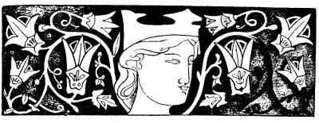
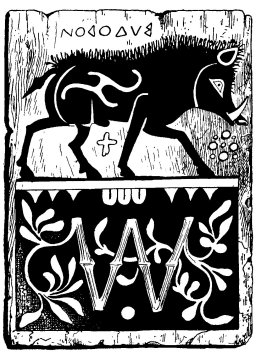
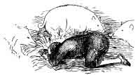
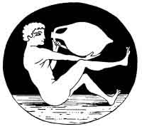

[Intangible Textual Heritage](../../index)  [Neo-Paganism](../index.md) 
[Index](index)  [Previous](err13)  [Next](err15.md) 

------------------------------------------------------------------------

p. 251

# PART SECOND

## INCANTATION, DIVINATION, CHARMS AND CURES, MEDICINE, AMULETS

## CHAPTER I

### LA STALLA DI MAIALE--DREAMING IN A PIGSTY AND SWINE LORE

WE are told in the *Heimskringla*, an early history of
Norway, that when Ragnhild, the wife of King Halfdan the Swarthy, was
with child she dreamed marvellous dreams. Once she seemed to be standing
in a garden trying to take a thorn out of her chemise, but the thorn
grew in her hand until it was like a long spindle. One end of it took
root in the earth, while the other shot

p. 252

up into a great tree, so high that her eye could scarcely reach the top
of it. The lower part of the trunk was red as blood, further up it was
green and fair, while the branches were white as snow. They were of very
unequal size, and it seemed to her that they spread out over the whole
kingdom of Norway.

King Halfdan hearing this wished to dream also, to further explain the
mystery. He consulted a magician, who told him that the sure way to have
truly prophetic dreams was to sleep in a pigsty. The king did so, and
dreamed that his hair grew to be very long and beautiful. It fell in
bright locks about his head and shoulders, but they were of unequal
length and colour; and one lock was longer, brighter, and more beautiful
than the others. This was interpreted to mean that a mighty race of
kings should spring from him, though they would be unequal in fame. The
largest lock was in after days, according to Snorro Sturleson, supposed
to indicate Olof the Saint. As for the queen she bore a son, Harold, who
became famous for his long locks whence he was called Harold Harfagr,
or, Harold the Fair-haired.

The belief that prophetic dreams can be secured by sleeping in a pig-pen
is widely spread. The Roumanians and so-called Saxons, and probably all
the Slavonian and gypsy inhabitants of Hungary, are familiar with it.
Therefore I was not astonished when on asking my fortune-teller from the
Tuscan Romagna whether people ever slept in a *stalla di maiale*, or
pig-pen, she at once replied that *per avere un vero sogno*--to have a
true dream-it was the most approved method known, and proceeded to
explain how it should be done, in these words:--

 

"To learn the future in a dream one must sleep in a pigsty, and above
all be sure that the pen is occupied by *a maiala incinta o gravida*--a
sow with young. And he must sleep *alla boccone*, that is on his face,
and crouched up, or else flat on his back, but not on his side. And
before going to sleep he must say:--

"'Mi addormento  
Per fare un buon sogno,  
Sant' Antonio che siete  
Sopra i maiale,  
Fate mi la grazia  
Che possa fare  
Un buon sogno,  
Secondo il mio desidirio!'

"'I sleep that I may  
Have a propitious dream.  
Saint Antonio who art  
Placed over the pigs  
Grant me the grace,  
That I may have a good dream,  
Such as I desire!')

"And doing this he will surely see in a dream that which will set forth
or explain what he wishes to know."

 

p. 253

"In Germany," says De Gubernatis, "common people often go to sleep on
Christmas Day in the pigsty, hoping to dream there; and this dream is
the presage of good luck. The new sun is born in the sty of the winter
hog."

It is worth observing that as everything which was connected with
generation or begetting, such as life, love, revival, birth,
fruitfulness, and coupling of the sexes, was associated with light and
reviving springtime, therefore the pig, though it was as a wild boar a
symbol of death and darkness, yet because it is enormously prolific "and
one of the most libidinous of animals, was sacred to Venus, and for this
reason, according to the Pythagoreans, lustful men are transformed into
hogs " (*De Gubernatis*, vol. ii., p. 6). In fact the *pudendum fem*.
itself, as a symbol of

 

THE ATTITUDE FOR DREAMING

 

fruitfulness, was known as a pig, and has for this reason always been
worn as a charm for luck. The cowrie shell, from its resemblance to the
same organ was also called a pig, and is extensively used at the present
day in the East as a charm against the evil eye. In Varro (De re
Rustica, ii. 4) we read:--

 

"Nuptiarum initio, antiqui reges ac sublimes viri in Hetruria in
conjunctione nuptiali nova nupta, et novus maritus primum porcum
immolant; prisci quoque Latini et etiam Græci in Italia fecisse
videntur, nam et nostræ mulieres, maxime nutrices *naturam*, qua fœminæ
sunt, in virginibus appellant *porcum*, et Græce choiron, significantes
esse dignum insigni nuptiarum."

 

As sleeping in a pigsty gives true dreams, so the pig seems of old in
many lands to have been closely allied to truth, for Romans,
Scandinavians, and Germans all swore by it (*Livius*, i., 24; *Mome,
Geschichte des Heidenthums*, i., p. 259; *Claudius Paradinus Symbola
heroica* (Antwerp, 1583), p. 8. Also in the *Hervor Saga*, King Heidreck
swears by a boar, the symbol sacred to Frey. The pig was so generally

p. 254

used in sacrifices, and was so closely connected with mysteries and holy
rites, that a German, Casselius, published a work on the subject--*De
Sacrificiis porcinis in cultu deorum veterum*, Bremen, 1769. For much
erudition on the subject of swine in ancient mythology and legend the
reader may consult *Die Symbolik und Mythologie der Natur*, von J. B.
Friedrich. Wurzburg, 1859. It is not generally known that the reason
which the Turks give for not eating pork is that all living things were
converted to Mahometanism except the pig, who remained a heathen. And in
the Netherlands the peasants have a proverb of "the pig under the
barrel," which refers to the Jews refraining from "the unclean beast,"
and tell a story accounting for it:--

 

"When Christ once went to Flanders the Jews ridiculed His teaching, and
to test His wisdom they hid one of their number under a barrel, and
asked Him what was there; and He answered, "A pig." So they laughed Him
to scorn. But lo! when they lifted the barrel, there was their friend
changed into a hog. And he ran forth and mingled with the other swine,
and because the Jews could not pick him out, to this day they have eaten
no pork for fear of devouring him or his descendants."

 

There is another old and curious Norse story of dreaming in a pig-pen.
When Earl Haakon was fleeing (A.D. 995), from his subjects, who had
risen in rebellion, he went with a single thrall, a slave named Kark,
who had been his playmate from his boyhood, to his mistress Thora of
Rimul. And she hid the two in a deep ditch under her pigsty. This was
covered over with boards and earth, and the pigs were over it.

 

"Then came Olaf Tryggvesson, of the race of Harold the Fair-haired, to
Rimul to seek and slay Haakon. And calling his men together he mounted a
great stone close to the pigsty and declared in a loud voice that he
would give a great reward to any one who would find the earl and slay
him.

"The earl heard this, and saw that the thrall Kark was listening
eagerly.

"'Why art thou now so pale,' asked the earl, 'and now again as black as
earth? Is it that thou wilt betray me?'

"'No,' replied Kark.

"'We were both born in the same night,' said the earl, 'and our deaths
will not be far apart.'

"They sat in silence. At last Kark slept, but he tossed and talked in
his steep. The earl waked him, and asked what he had dreamed.

"'I dreamed,' answered Kark, 'that we were both on board a ship, and
that I stood at the helm.'

"'That must mean that thou rulest over thy own life as well as mine. Be
faithful to me and I will reward thee when better times come.'

"Once more the thrall fell asleep, and had a nightmare. The earl woke
him again, and asked him his dream.

"'I thought I was at Hlode,' said Kark, 'and Olaf Tryggvesson put a
golden ring about my neck.'

"'The meaning of that,' said the earl, 'is that Olaf will put a red ring
about thy neck if thou goest to seek him. Therefore beware of him, and
be true to me.'

"But when the earl fell asleep Kark slew his master with his knife,
thrusting it into his throat. Soon after he came to Olaf with Haakon's
head, and claimed the reward promised. But Olaf verified the murdered
man's prophecy. He put, not a ring of gold, but one of blood round
Kark's neck, for he beheaded him.

p. 255

 

"For though Haakon Jarlo Earl Haco had been his bitterest foe, and done
him great evil all his life long, he little liked it that so great a man
should be treacherously slain by a slave whom he had ever treated
kindly. And as the saga ends:--

"Oc er Olafr kiendi thetta var hofut Hakonar Jarlo, tha reddist ban
thrælnum, oc bad han uppfesta, oc sagdi hann hofa skild maklig laun,
fyri sin Drottin svik. Sveik hann Hakon Jarl, svikia. mann hann mik, ef
han ma. Enn sua skal leida drottins svikun."

 

English:--

 

"And when Olaf knew that it was the head of Earl Haakon he was enraged
at the thrall, and ordered him to be hanged, and said, 'He shall have
evil boot for betraying his master. For if he deceived Earl Haakon so
would he betray me if he could--and so shall all treason to a master be
rewarded.'"

 

As we are influenced by surroundings, it is natural that certain places
should have been chosen to dream in. "We have read," says Pico de
Mirandola in his Witch, "that the physicians of Calabria and Taurus were
wont to sleep in the sepulchre of Podalirius, and others in that of
Esculapius." A pig-pen is, however, several degrees removed from a
temple, or even a tomb. As the former seems to be distinctly Northern,
it may have come into the Romagna from the Lombards. It may be observed
that it is only in the Italian traditions that the minutiæ of the
ceremony are given. The presence of the sow with pig is significant. It
was by a prediction referring to such a sow that Odin caused himself to
be suspected by King Heidreck in the Hervor Saga.

But not long after I had written the foregoing remarks, I came across a
certain passage in the *Symbolik* of Creuzer (whom, by the way, I knew
in Heidelberg in 1847), which seems to cast much light on this
connection of the pig-pen with the temple. [1](#fn_30.md)

"Unto Demeter or Ceres pregnant sows were specially offered in
sacrifice, as Cornutus, the Stoic, who lived sixty-eight years after
Christ, informs us, as does Arnobius (*Disput. adversus Gentes*, edit.
Elmenhorst, p. 135), adding that it was because of the great fertility
of this animal." Therefore it came to pass that pigs were kept in the
cellars of the temple of Ceres and Proserpine, as Creuzer relates: "In
honour of these goddesses the Böotians put little pigs into subterranean
chapels, which the next year were seen in the meadows of Dodona.
Pausanias and Clemens Alexandrinus speaks of the same thing as observed
in other places." [2](#fn_31.md) Ceres was
pre-eminently a goddess of fertility, therefore of good luck and all
genial influences; hence little gold and silver pigs were offered to
her, and also worn by Roman ladies, partly to insure pregnancy, and
partly for luck-a custom

p. 256

which was revived as a fashion a few years ago in Paris, and a very
funny one it was when adopted by unmarried virgins. Of which gold and
silver pig-norance some note has been taken in a French novel, entitled
*Le Cochon d'Or*.

It is remarkable that the Italian superstition requires that there must
be in the pig-pen a sow with young. According to Aristophanes, the
sacrifice of the sow must be made when any one was initiated into the
mysteries. For information on this subject consult also *Bayerische
Sagen und Bräuche, Beitrag zur Deutschen Mythologie, von Friedrich
Panzer*. *München*, 1848.

From what is here cited it appears that of old people slept in certain
temples of the gods to have true dreams, and that these temples were
used partially as pig-pens. And this much seems to be certain, that
Ceres was greatly consulted by means of dreams, and that this dreaming
was specially in her temples in which pigs were kept.

#### THE SPELL OF THE IVY AND THE STATUE

"Cur hederâ cincta est? hedera est gratissima Baccho,  
Hoc quoque, curita sit, dicere nulla mora est.  
Nysiades Nymphæ puerum quærente noverâ  
Hanc frondem cunis apposuêre novis."  
                                   OVID, Fasti. iii

The first of the medical magical cures of MARCELLUS of Bordeaux is as
follows:--

 

"Herba in capite statuæ cujus libet nasci solet, ea decrescente luna,
sublata capitique circumligata dolorem tollit."

("If grass growing on the head of any statue be plucked in the waning of
the moon and taken away, be bound about the head, it removes pain.")

 

The sixth is much the same:--

 

Herba vel hedera in capite statuæ cujus libet nasci solet, ea si in
panno rufo ligata capiti vel temporibus alligetur, mirum remedium
hemicraniæ vel heterocraniæ prestabit."

(" If grass or ivy grows on the head of any statue and it be gathered
and tied in a red cloth to the head or temples, it will be a marvellous
remedy for headache or neuralgia.")

 

I inquired for a long time in Florence before I found the following cure
for a headache. It was not only repeated to me, but also written:--

 

"When you take grass from the head of a statue to cure a headache you
must say:--

 

p. 257

 

"'Non prendo l'erba,  
Ma prendo la magia  
Che il mal di capo mi vada via,  
E chi mi ha dato la malia  
Il diavolo la porta via.'

"And then you must make *le carne* (the sign of the horns or
*jettatura*) behind you."

 

That is to say, cast it in the old Roman fashion over your right
shoulder. In English this is:--

 

"I do not take the grass or ivy,  
But I take the magic power,  
That the headache may leave me,  
And may the devil carry away  
The one who gave it to me!"

 

Now it may be observed that whenever any of these magical prescriptions
are wanting, as regards an incantation, they are always imperfect.

MARCELLUS, as the imperial court physician, probably did not obtain his
prescriptions very accurately from the people. I am quite sure that this
Italian incantation is far older than the third century. It is in the
same form as many others; but what is most conclusive, it assumes, as a
matter of course, that even a headache must be the result of evil magic.
This is the very oldest form of sorcery.

I have no doubt that Ivy was the original plant used in this cure. In
early religious symbolism, as wreathing the head of Bacchus, it meant
life itself, and that very deeply and significantly. Therefore, when it
was found growing of itself on a statue, it was of course supposed to be
very effective. The early Christians borrowed much from the
Dionysiacs--among other things, the Ivy. They laid it in coffins as a
symbol of new life in Christ. [1](#fn_32.md)

I have said that ivy on the head of a statue was especially typical of
health and life in Roman symbolism. It also signified on any head--as a
garland, a fillet, or wreath-poetry, inspiration, or active genius. As
appears from the following from Ovid:--

p. 258

 

"Siquis habes nostris similes in imagine vultus,  
Deme meis hederas Bacchica serta comis,  
Ista decent lætos felicia signa poetas,  
Temporibus non est apta corona meis."  
                                       *Tristium*, lib. i., cl. 6

 

Of which crowning with ivy or roses, and many other customs, it can be
truly said that we know very little as regards all the feeling,
sentiment, and associations which attached to them in the days of yore.

It is remarkable that, according to the very ancient and widely-spread
tradition, any plant which grows off, away from, or above the earth, is
believed to have magic or healing virtues, or to be spirit-haunted. The
mistletoe, from its aerial nature, became almost the centre of Druid
observance, and moss has many mysteries. The house-leek--in German
*Hauswurz* or *Donnerkraut*--is believed to guard a house from lightning
(Grimm, *D. M.*, 2 ed. B. 1, s. 445)--the mountain-ash being also
dedicated to Thor, or thunder. But remember that whenever you see grass
or herbage, ivy or flowers, on old walls or ruins grey, there the owls
wone, and elves and fairies delight to dwell or dance, or pass the time,
as has been so well approved by much observation that to deny it were
enough to deny all testimony of tradition. So rest ye firm in the faith
that wherever--

 

"High on the towers  
Grow beautiful flowers,  
    Wall-flowers, ivy and grass  
There in the light  
Of a moonshine night  
    You can see the fairies pass."

THE SPELL OF THE HARE

"Flevit lepus parvulus  
Clamans altis vocibus,  
Quid feci hominibus:  
Ut me sequuntur canibus?"  
                         

German Latin Song, Twelfth Century

"First catch your hare . . . "  
                           

Attributed, wrongly, to Mrs. Glasse

 

There is among the spells Of MARCELLUS one (84, GRIMM) to relieve the
*coli dolor*--inflammation of the colon, possibly here the colic--which
is very curious:--

"Lepori vivo talum abstrahes, pilos ejus de sub ventre tolles atque
ipsum vivum dimittes. De illis pilis vel lana filum validum facies, et
ex eo, talum leporis conligabis corpusque laborantis præcinges: miro
remedio

 

p. 259

 

subvenies. Efficacius tamen erit remedium, ita ut incredibile sit, si
casu os ipsum, id est talum leporis in stercore lupi inveneris, quod ita
custodire debes, ne aut terram tangat aut a muliere contingatur, sed nec
filum illud de lana leporis debet mulier ulla contingere. Hoc autem
remedium cum uni profuerit ad alios translatum cum volueris, et quotiens
volueris proderit. Filum quoque, quod ex lana vel pilis, quos de ventre
leporis tulis, solus purus et nitidus facies, quod si ita ventri
laborantis subligaveris plurimum proderit, ut sublata lana leporem vivum
dimittas et dicas ei, dum dimittis eum:--

"'Fuge, fuge lepuscule!  
Et tecum aufer dolorem!'"

("Take from a live hare the ankle-bone (or heel-bone), remove the hair
from his belly, and let him go alive. From that hair, or fur, make a
thread, and with it bind the bone to the body of the sufferer, and you
will see a wonderful cure. But the remedy will be more efficacious--yea,
incredible--should you by chance find that bone in the dung of a wolf.
In which case so guard it that it shall not touch the earth nor be
touched by a woman, nor should any woman touch the thread made of the
hare's wool. But the remedy may be transferred from one to another
patient as often as you will. But carefully wash the thread, every time,
for more avail. And when you shall have shorn it away, let the hare run
away alive and say:--

"'Run, run little hare  
And carry the colic with you!'")

 

The following prescription is given word for word as it was told me in
Florence:--

 

"Take or catch a hare without doing it the least harm and say:--

"'Lepre vi prendo,  
Ti porto a casa mia,  
Che tu mi porti  
La buona fortuna,  
Fa porti via la male di . . .'

("'Hare, I take you,  
I bear you to my home,  
That you may bring me  
A good fortune;  
Bear away the illness of . . .")  
\[Here the name of the patient is mentioned.\]

"And when the hare is carried home you must cut, or shave, away its fur
in the form of a cross. And this done, hold the hare towards the invalid
with a third person, and put it on the neck of the one who suffers. Then
let the hare run away, making the sign of the chestnut (or *la fica*),
saying:--

"'Vai! e la malora  
E il male tu possa portarlo con te  
E lasciarci noi  
Tutti in liberta,  
Colla buona salute!

 

p. 260

 

("'Go! and mayst thou bear  
All the trouble and ill with thee  
And leave us free  
With good health.')

"Then spit behind you thrice, *and look not behind you*, and go not out
from the house for three-quarters of an hour."

 

I have no doubt that the incantation on catching the hare is as old as
the rest, but was unknown to Marcellus. The cutting the fur away in the
form of a cross is evidently modern. The spitting thrice and the sign of
the *castagna* are old Roman, and formed a part of all such ceremonies.
It will be seen that all of the Roman prescription is given in the
Italian version, the concluding incantations being almost identical. I
suspect that Marcellus really abridged most of his accounts. They may
have been at first hurriedly noted down, and transcribed a long time
after from the notes. GRIMM, in fact, points out, with much sagacity,
that they bear evidences of copying. It is, indeed, not in the nature of
things that such a troublesome task as catching and shaving a hare, and
extracting the *talus*, &c., should have been " worked off," or
dismissed, so abruptly as Marcellus describes it.

There is not a negro in North America, and I suppose very few white men,
who have not heard that the fore-foot of a rabbit (the hare being there
unknown), is a charm for luck. The fore-foot. brings fortune, the
hind-foot prevents evil from overtaking the bearer. This world-old,
widely-spread belief owes its origin to a faith in the talus, or
ankle-bone. I possess specimens of these amulets, or fetishes. which
were obtained from Voodoo sorcerers by Miss Mary Owen, of Saint Joseph,
Missouri.

All mediæval magic, as well as Roman, abounds in allusions to the effect
that while engaged in incantation the operator must not look behind him.
And if a traveller be followed by an evil spirit or fiend, the latter
will have no power over him until he "turns around his head."

The injunction not to look behind one involves some very curious and
very ancient lore. In Tuscany if one gathers ashes or other objects for
magic, he or she in departing must not look round. So in Theocritus
(Idyl 91), on gathering ashes such retrospection is forbidden. Also
Virgil (Eclogue 8) writes:--

 

"Fers cineris Amarylli foras, rivoque fluenti  
Transque caput jace ne respexeris."

 

HILDEBRAND (*Theurgia*, p. 29.7) tells a marvellous tale, how a young
man of noble birth was tormented by demons. His guardian angel promised
him that if he would pray to God, not drink with the devils, and not
once look behind him,

p. 261

bey Verlust seines Lebens--on his life, and could hold out till
cock-crow, he would be all right. Which so happened. PRÆTORIUS, who
gives several pages to the subject "Why witches when riding on their
brooms must not look behind them lest they fall off"--which it seems is
a condition of broom and goat-riding (*Blocksberg*, p. 414)--very
shrewdly conjectures that Satan got the idea from Lot's wife. This not
turning round is probably connected with the unbroken attention or
unintermitted thought which enters largely into all execution of spells.
When the witch's attention is distracted by intricate patterns, grains,
or by songs, her evil power for the time is suspended.

#### THE SPELL OF THE SPIDER

"L'araignée est un signe de bonheur et annonce particulierement de
l'argent pour la personne sur laquelle est trouvè."

As is very natural, the spider appears in Folk-lore as both bad and
good, lucky and unlucky. From its ugliness and poison it is an emblem of
enmity and hatred. "The Tarantula causes by its bite a species of
madness, which, according to popular superstition, can only be cured by
dancing." For this cure there is a physical explanation. Violent
exercise often works off ill humours in the blood. A typhoid fever may
be averted by hard labour. In Western America a man bitten by a
rattlesnake must drink all the whiskey he can swallow, and run or walk
till he drops with fatigue. Thus the Tarantella is a well-known dance,
which popular superstition assigns to witches. It is the awakening dance
at their Treguenda, or Sabbat.

There is a legend which states that this Tarantella dance originated as
follows: A priest bearing the sacrament passed by a party of dancers who
did not salute it. So he caused them to dance on and more madly than
ever (*Naturgeschichte zur Dämpfung des Aberglaubens* (Hamburg, 1793),
p. 102). But while there are many legends of evil spirits appearing as
spiders, on the other hand the extraordinary instinct, or ingenuity
displayed by the insect in making its web, and its habit of always being
in one place at home, and its foresight as regards the weather, have
made it a generally recognised symbol for industry, cleverness, domestic
steady habits, and prophecy. Therefore it brings good luck, and is a
type of thrift and wealth. If a spider creeps over you and you do it no
harm "there is money coming." Again, its wonderful perseverance in
re-spinning its web, or in getting to a predetermined place, has pointed
many a moral and adorned many a tale from the days of the Bruce to these
our own times.

p. 262

Of course it found a place in magical medicine. MARCELLUS (cap. 14, p.
104) gives the following:--

 

"Araneam quæ sursum versus subit et taxit prendes, et nomen ejus dices
cui medendum erit, et adjicies: Sic cito subeat uva ejus--quem nomino,
quomodo aranea haec sursum repit et texit, tum ipsam araneam in chartam
virginem lino ligabis et collo laborantis suspendes die Jovis, sed dum
prendes araneam vel phylacterium, alligas ter in terram spues."

 

Which is to the effect that when you see a spider weaving upwards, you
name your invalid, and take the spider, and put it in a bag of virgin
linen, and hang it round the neck of the patient, but while taking and
bagging your spider, spit thrice on the ground.  [1](#fn_33.md)

All of which is nearly the same in Tuscany, but with it there must be
pronounced the following incantation:--

"Ragno, o mio bel ragno;  
Benedetto che tu sia!  
La tela che tu fai,  
Lascia la in casa mia,  
La tela che tu fai,  
Falla con buona fortuna,  
E con malissima fortuna,  
E che la fortuna resti in casa mia,  
Quando la tela l'hai fatta,  
Vattene o ragno mio!  
Ma non di casa mia,  
Vattene dalla tela,  
Che tu mi hai fatto,  
Mi hai fatto con buona fortuna;  
E io la prendero  
In un sacchetto di lana rosso la mettero.  
E dentro un marengo d'oro vi uniro,  
E cosi sempre più buona fortuna io l'avro,  
E questo sacchetino  
Come un oracolo la terro,  
E la terro dentro al seno,  
E mai più lo lasciero!"

("Spider, O my pretty spider,  
Blessed be thou!  
The web which thou weavest,  
Leave it in my house!

p. 263

 

The web which thou makest  
Make it lucky (with good fortune),  
Or with the worst fortune.  
And may the luck abide in my house,  
When thy web is spun  
Leap out, O my spider  
But not from my house.  
Go from thy web,  
Which thou hast woven for me,  
Which thou hast made with good luck,  
And I will take it,  
I will put it in a bag of red woollen!  
And there with a golden spangle,  
Thus I shall ever have good luck,  
And this bag  
I will always keep as an oracle,  
I will keep it within my bosom,  
And I will never leave it!")

 

This incantation speaks of putting the web and not the spider in a bag
of red woollen. But MARCELLUS in other cases orders the red woollen bag.
As for the spitting thrice on the ground, it is a common formula at the
end of many Tuscan incantations. I may say that it and the sign of the
fica, also of the *jettatura*, go *ad libitum* with all of them.

There is no proof, but there is always a possibility, that all these
modern incantations may be translations from the Latin, while it is
almost certain that the Latin were in turn taken from the Etruscan, or
Oscan, or some early tongue. If so, future researches into the earliest
languages of Italy may verify the assertion.

As regards the web of the spider, there is a pretty German fancy that
when the Virgin Mary ascended to heaven, her veil, falling off, was
carried about and torn to pieces by the winds. Therefore the silvery
spider-webs which are seen in summer floating in the air are called
*Mariengarn*, or Mary's yarn, or that which is spun.

It is worth noting that in SCOTT'S novel of *Waverley*, Meg Merrilies
while braiding differently coloured threads in a charm-which custom
still exists in Italy--sings:--

"Twist ye, twine ye even so,  
Mingle threads of joy and woe!"

And that this is almost exactly the same with a passage in the Tuscan
incantation to the spider:

p. 264

"La tela che tu fai  
Fa la con buona fortuna  
E con malissima fortuna!"

The spider is, according to several learned authorities, often carried
in Germany in a walnut-shell as an amulet, and then, after several
years, it turns to a gem. The explanation of this is that, as the yolk
of a very hard-boiled egg, if kept for several years, becomes almost
like a stone, so the mass of substance from which a spider spins her web
hardens to a semi-transparent ball. Here I may remark that wherever we
find any such superstitious custom followed without an incantation, we
may be sure that it is imperfect, for in early times nothing was "
locked," or made sure, without its charm. In Tuscany this spider spell
exists in its ancient form, and I here give it literally in nuce-in a
nut-shell:--

 

"Do you want a charm to bring good fortune or much money? This is the
way to make it--the more you believe in it the better your luck will be:
Take a great spider. *Si mette in una nuoce*--you put it into a
walnut-shell; and, if you can get it, let this be a walnut-shell of
*three* pieces--*una nuoce a tre canti*--and put with the spider,
*comigno*--cummin--frankincense, and salt, and a little bit of a red
(woollen) garment, and a bit of iron magnet. Then close the shell, glue
it up, and say:--

"'Non porta nuoce,  
    Ma porto la fortuna,  
Che non mi abbandone mai!'"

("'I do not bear the nut,  
    But I carry the good luck,  
That it never may leave me!'")

This is an extremely curious and ancient formula of declaring that
whatever one does is not to stop at a certain point. By means of it
almost any action is turned into magic. Thus to find and pick up
*anything*, at once converts it into a fetish, or insures that all will
go well with it if we say when taking it: "I do not pick up",--naming
the object--"I pick up good luck, which may never abandon me!" It is an
incantation of universal application, enabling one to secure a wish out
of every chance occurrence.

The spider is also used in divination. I find the following in a popular
chapbook:--

 

"*Il Ragno Industrioso*. In the *Book of Dreams*, and in the works of
the famous cabalists Rutilio Benicosa, Casamia, l'Indovino, Il
Palmaverde, Nostradamus, and the ancient Sybils or Haruspices, we often
find methods of divining the secret of getting numbers by the lottery.
Among the many extraordinary experiments made, the most singular is that
by means of the spider.

"Take one of these insects-let it be very large-and put it, without
hurting it, in a little box, on the bottom of which are many small
pieces of paper, numbered from one to ninety. Cover it with a
transparent veil, and give the spider time to weave a web.

 

p. 265

 

"Naturally the insect in going here and there will turn up certain
numbers. These must be noted. Do this three times, and then let the
spider go. Many have won lucky numbers in the lottery by means of this
experiment."

 

It may be observed that it is necessary to the success of this
*sortilege* that we let the spider go. So in several of the charms Of
MARCELLUS, the animal used in such spells must be dismissed in
safety--*Ecce dimitto te vivam*!

The spider, it may be observed, can also be used for other divination as
well as for lucky numbers in the lottery. Thus, if you write "Yes" or
"No," she will turn up for you an affirmative or negative for any
question, or select the names of friends or enemies, or pick out lucky
days.

But there is an appalling and revolting side to the character of the
spider. All the spinners whom we see are females. The male is a little
insignificant creature, in no proportion as regards size or strength to
his mate, who, indeed, very often devours him as if he were a midget.
But he is impelled by an irresistible impulse to couple with her, and,
when she consents, and the *liaison* is accomplished, he is eaten whole
for dessert. Sometimes the Arachne eats a number of suitors before
yielding; so that every web is really a *Tour de Nesle*. There is a
class of women in Paris--not unknown elsewhere-of any one of whom one
may hear it said, in tribute to her irresistible sorcery of charms,
"Elle a mangée sept hommes"--*i.e.,* ruined seven spendthrifts. Of whom
the type is the spider.

Therefore the spider is revolting. She is poisonous, crafty,
remorseless, a cannibal of her kind, and always horribly--morally--ugly.
There is a very deep significance in the fact, which I speak of in
another chapter, that there is some higher law than mere chance, or our
own associations, in this making poisonous, repulsive, and discordant
things show their nature by certain signs, or why sounds agree with the
forms from which they came, and that there is something strangely human
in the expression of not only flowers, but of innumerable phenomena.
From which it may justly be inferred that there are in all objects
certain phases of sensation, feeling, emotion, or a kind of thought, of
which we have as yet no real conception. There are spirits in all
things--but how we know not.

#### THE SPELL OF THE GREEN LIZARD

"An old lizard said to me, 'Nothing in this world ever goes backwards.
All pushes ever onward--stones become plants, plants become animals,
animals become human beings, and human beings gods.'

"'And what becomes of the old gods?'

"' 'Twill all be arranged,' quoth the lizard."--HEINE'S

Pictures of Travel

Among his prescriptions for disorders of the eyes, MARCELLUS gives one
to the

p. 266

effect that we should take a green lizard, blind it with a copper
needle, and put it into a glass vase, with rings of gold or silver,
iron, amber, or even copper--*aut etiam cupreis*--then plaster it
up--*deinde vas gypsabis*. Open it on the fifth or seventh day, and you
will find the lizard--*sanis luminibus*--with his eyes well again. Then
you let him go away, but keep the rings and wear them, and touch the
eyes with them; but especially you must look sometimes through the hole
or circle of the ring. [1](#fn_34.md)

When an old woman in Florence was asked if she knew this spell, she said
"Yes," adding that it was, however imperfect, because the incantation
was wanting. This she supplied in these words:--

 

"Quando la lucertola si leva del vaso e si manda via, si dice:--

"'Lucertola, va via!  
E il veleno portate lo via,  
Ma indietro non ti rivoltare,  
Che il mal d'occhi non mi debba ritornare."

 

In English:--

 

"'When the lizard runs, say:-  
Lizard, run away!  
Carry the poison (disease) away,  
And till thou comest again,  
May the trouble of my eyes never return!'"

 

There is very good reason to believe that this spell is old
Roman-Etruscan. Firstly, there are other incantations in MARCELLUS, in
which some animal is caught and made to bear a disorder, and then
dismissed with an injunction. But, secondly, MARCELLUS gives another
medical charm for liver complaint:--

 

"Take a green lizard--*et de acuta parte canna jœur ei tolle*--and put
him in a red woollen or naturally black bag, and hang it on the part
afflicted; then let the lizard go; but say to him: '*Ecce dimitto te
vivam, vide ut ego quemcunque hinc tetigero epar non doleat*!' ('Behold,
I send thee away alive; see that I, whenever I touch this, may be free
from pain in the liver.')"

 

All things considered, this is quite enough to form almost an identity
with the Italian charm.

It is certain that by rings MARCELLUS here means also *beads*. What
renders

p. 267

this certain is, that he says some may be of amber. Now it is very
remarkable that to this day, all over the world, amber beads are carried
by people for weak eyes, and it is essential that they should be *looked
through*, to strengthen the sight. I have a string of fifty-two amber
beads, at least one hundred and fifty years old. There were twice as
many, but the rest were given away, one by one, to people in
Pennsylvania, suffering from their eyes. The old Etruscan spell of the
lizard has been forgotten, save in Tuscany; but the belief in the amber
bead survives.

The connection of amber with the eyes is very ancient. It was supposed
to be wept by the sun--*i.e.,* it came from the eyes of the Eye of the
Universe. A later myth makes it come from the tears of the Heliades, who
so regretted their brother Phaeton. Moore refers to this in his poem,
"Farewell to thee, Araby's daughter."

Lizards are sometimes found with two tails, as is mentioned in MARYATT'S
*Pasha with many Tales*. I find the following in my manuscript
collection of Tuscan Folk-lore:--

 

"If one can have a lizard with two tails, and will always carry it, it
will be very fortunate--,*parla una immensa fortuna*. It is sure that if
he plays he can never lose; *mai altro*--quite the contrary, he will
always win, and be lucky in all things."

 

MARCELLUS gives another prescription relating to the lizard, as follows
(cap. 29):--

 

"Lacerturn viridem, quem, Græci σαι\~ρον {Greek *sai\~ron*} vocant,
capies per ejus oculos acum cupream cum licio quam longo volueris
trajicies, perforatisque oculis cum ibidem loci ubi ceperas dimittes, ac
turn filum præcantabis dicens:--

"'Trebio, potnia, telapho.'

Hoc, ter dicens filum munditer recondes, cumque dolor colici alicujus
urgebit, præcinges eum totum super umbilicum et ter dicas carmen supra
scriptum."

 

In this the eyes of the lizard are blinded, as before, with a copper
needle and thread, then the lizard is dismissed and the thread is
enchanted with three magic words. The thread is then bound about the
patient suffering from colic. What the three words mean I do not know.
But the manifest conclusion is that the spell is of old Etruscan origin,
and the modern Tuscan charm is, on the whole, identical with it.

MARCELLUS (cap. 23, p. 166) gives another charm with a green lizard:--

 

"Lacerta viridis viva in ostio splenitei ante cubiculum ejus
suspenditur, ita ut procedens et rediens eam semper manu sinistra et
capite contingat, quo facto mire ad sanitatem proficiet."

 

p. 268

That is, the lizard must be hung up alive in the door before the bed of
the sufferer from the spleen, so that he may touch it while going out or
in. "Which being done, wonderfully conduces to health."

The-same thing is done at present in Tuscany, but I was told that the
chief condition is here wanting. It must be a lizard with two tails.

The reason why the lizard is connected with the sight and light is to be
found in ancient symbolism. For it was believed that when the lizard
became old and blind it went into the sunlight and recovered its sight.
And as an old book on animals deduces, "Therefore man, who is blinded by
sin, should turn to Christ who is the true Sun." For which reason
RAPHAEL painted a lizard with the Virgin in the celebrated *Madonna
della lucertola* (KUGLER, *Handbuch der Geschichte der Malerei*, 1837,
vol. i., p. 248). It was also a type of divination as well as of light,
whence it was a symbol of Apollo, the god of light *Galeotes* (lizard),
the Sicilian soothsayer, was begotten by Apollo on Themisto ( θεμιστεια
{Greek *ðemisteia*}), or Prophecy (ÆLIAN, xii., 46; also CICERO, *De
divinat*, i., 20). Hence the connection with amber, "the tears of the
sun," and its use as a cure for the eyes.

It was because the lizard was anciently a symbol of heat and light that
the salamander, which is a yellowish brown lizard, was supposed to live
in fire. This was not, however, a common salamander, such as Heine, when
a boy, once burned, but a very different and spiritual kind of creature,
of the same form, which dwelt habitually in the flame, and such as was
seen once by Benevenuto Cellini, who tells us that on the occasion his
father gave him very solemnly a good whipping to make him remember it.
Of which, as I have remarked in my translation of Heine's
*Germany*, [1](#fn_35.md) the same flagellation to
prevent him from lying would not have been misapplied.

As the lizard is such a bright, uncanny, lively, odd, and wild little
creature, flitting like a green gold-spotted ray of light over grey
rocks, as if endowed with strange intelligence, it is not remarkable
that many have seen in it an elf which sometimes takes human form. Which
came unto me in a waking dream as follows, as I watched them to-day in
the garden at Via Reggio:--

 

"As I rode by the night o'er the brown heath bare,  
In the bright moonlight stood a castle fair;  
Lords and ladies, great and small,  
Were crowding in to a festival,  
Grass in the wind a-waving.

 

p. 269

 

They bade me enter, and in I went,  
I drank good wine to my heart's content,  
I laughed and danced with ladies fair,  
Ne'er in my life had I such cheer;  
Grass in the wind a-waving.

When all at once I heard a cry:  
*Haro by yaro*! Asleep fell I,  
While the lady dancing by my side  
Seemed like a lizard away to glide;  
Grass in the wind a-waving.

I woke in the early morning still,  
In an old grey ruin on a hill,  
Over the rock and in the sun,  
I saw a golden lizard run!  
And grass in the wind a-waving!"

 

------------------------------------------------------------------------

### Footnotes

[255:1](err14.htm#fr_30.md) L. *Annæus Cornutus de
natura deorum*, 211, pub. by Fr. Osann, 1844

[255:2](err14.htm#fr_31.md) Pausanii De. Græciæ,
lib. ix., c. 8

[257:1](err14.htm#fr_32.md) "Hedera quoque vel
laurus et hujusmodi: quæ semper servant vivorem in sarcophago corpori
substernantur ad significandum, quod qui moriantur in Christo, vivere
non desinant, nam licet mundo noriantur secundum corpus, tamen secundum
animam vivunt et reviviscunt in Deo."--DURANDUS, *Ration. Div. Offic*.,
lib, vii., c. 35

[262:1](err14.htm#fr_33.md) The spiders that come
to your house (so says the negro), indicate the number of your friends.
If you kill a spider you will certainly lose a friend. At the same time,
certain kinds of spiders cooked in the food are supposed to cause death.
"A spider in the dumpling " is a name for secret poisoning. Spider-webs
are found on the bodies of feeble babies.--Note by MARY A. OWEN

[266:1](err14.htm#fr_34.md) Mr. Neville told me the
Cingalese kill a lizard over a slow fire, and the froth that runs from
its eyes is a cure for sore eyes.--Note by MARY A. OWEN

[268:1](err14.htm#fr_35.md) *Vide* *Germany*, by
Heinrich Heine, translated, with notes, by Charles G. Leland. London: W.
Heinemann. 1872

------------------------------------------------------------------------

[Next: Part Two: Chapter II--BIRDS AND TREASURES](err15.md)
