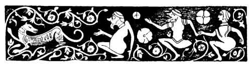
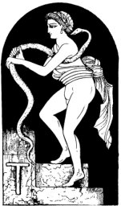
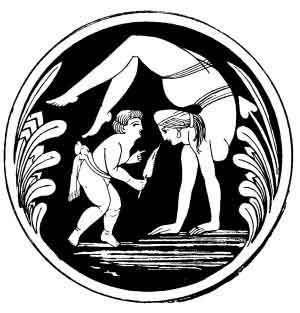

[Intangible Textual Heritage](../../index)  [Neo-Paganism](../index.md) 
[Index](index)  [Previous](err16)  [Next](err18.md) 

------------------------------------------------------------------------

p. 326

# CHAPTER IV

### EVIL INCANTATIONS

THERE exist among the Tuscan witches a very great
number of spells, the object of which is to injure or even kill enemies,
and there is reason to believe that these are the most ancient of all.
For the further we go back behind the genial embodiment of the forces of
Nature and Polytheism the darker and more vindictive does sorcery
become. This may be tested by races still existent. For just as the babe
in the womb is said to pass through the stages corresponding to those of
lower forms of animals, to the higher,

p. 327

so we may see the primitive or prehistoric man more or less modified by
soil or climate, in the Fuegian, Papuan, or Australian, and specially in
the African races. Among all these the horrible old witchcraft, which
aims far more at death and injury and revenge than at doing good,
predominates over benevolence. And that there should still be so much of
it, employing the earliest known forms of sorcery, in Italy, is an
almost conclusive proof of its antiquity. As animals must destroy life
before they can enjoy it, so man seems in his animal stage to have found
his first great pleasure in injuring or killing others.

It is perfectly true that races in a low or primitive state of society,
even if separate and without intercourse, would, under similar
conditions, develop the same superstitions or myths. But it does not
follow from this that there has been no "borrowing" or tradition. On the
contrary, an impartial examination of all such folk-lore with the most
scrupulous comparative analysis, shows that there has been an immense,
if often mysterious, amount of transmission, and that the theory of
innate ideas--or what amounts to the same thing--must be very sparingly
exercised.

It may, however, certainly be conceded that the Romagnola spells did not
grow of themselves of late years, but really sprang from ancient
sources. For those who now hold them live in the same country as the
Etruscans or old Latins, who were their progenitors, and as they retain
innumerable customs of their ancestors--as recorded by classic
writers-none but the most captious critic can be disposed to contest
closely the possibility of their having inherited their superstitions.

I have such a number of these spells to do harm that I can give only a
few of them. The first is as follows. It is from a large manuscript
collection made for me by an expert. It was taken from the archives of
the witches, that is to say copied, as were many of these recipes from
others which are jealously preserved from publicity, as the wise woman
naturally prefers to impart her wisdom *viva voce*. The "evil" in this
case was naively explained as that which was done to the man's mistress
by withdrawing his love!

"TO DO AN EVIL--*per fare una malia*--so that a man may be drawn from
loving another woman, and only he attached to his wife--take three
Indian chestnuts or wild horse-chestnuts (*marroni d'Indi, marroni
selvatici*) and powder them fine, as fine as possible." (MARCELLUS lays
stress an the same trituration.) "Then take a new earthen pot, and put
into it the powder, and mix with it three drops of the husband's blood,
or of the woman whom he loves, and put this blood with the rest, and, if
it be possible, add to this as much more blood of either as can be
obtained, and to this a half litre of spirits (a full pint) and some
water, and boil it in a *bagno maria* (*balneum Mariæ*), that is, the
pot in another pot of water, and when it shall have boiled for a quarter
of an hour, put the pot under the bed, and then at midnight, the wife,
should leave the bed and bathe the head of the husband a little, in the
form of a cross, also bathe *sotto negli in testicoli*, and say:--

p. 328

"'Non bagno te, bagno il tuo cuore,  
Che sempre più tu mi possa amare,  
E più tu non mi possa lasciare,  
E con altre donne tu non possa andare,  
E quell' affare  
Con altre donne non ti si possa alzare.'

("'I bathe not thee, I bathe thy heart,  
That thy love from me may ne'er depart!  
That thou shalt to me be true for aye!  
Nor with other women go thy way,  
Nor deal with them, be it as it may.')

And this must be done for seven nights, thrice in a night. Then throw
the pot and all its contents into a running stream, saying:--

"'Butto via questo pento',  
E butto via it pensiero  
Del mio marito per altre,  
E che porti tutto l'amore  
E me che io pure tanto l'amo.'

("'Now I cast this pot away,  
With my husband's thought to stray,  
To others' love that I may see  
Him true, as I shall ever be!')

And having thrown it into the water, walk away without looking behind
you, and for three days after do not pass by that place."

"Rivoque fluenti--jace ne respexeris"--"by the running water--look not
back again." This portion is as old as the days of VIRGIL, and I doubt
not that the whole spell was ancient in his time.

The next is entitled, "TO INJURE AN ENEMY":--

"To make a man or woman suffer, take a peppercorn and a \[illegible\],
such as is found in the fields, and boil it with the hair of the man or
woman and repeat:--

"'Non faccio bollire questi capelli,  
Ma faccio bollire questa robba,  
Unita a l'anima e it cuore  
Di quello che non possa più vivere,  
E non possa. più stare,  
In mezzo alle strege  
Tu ti debbi sempre trovare!'

("'I do not boil the hair alone,  
But all these things together thrown,  
With his heart and soul that he,  
May perish and for ever be  
Only in witches' company.'")

p. 329

The success of such charms depends chiefly on the seriousness or
earnestness with which they are pronounced. When the witch utters them
for herself or for another, she does it with an air of terrible
vindictiveness, such as would cause any one to shudder. In a community
where everybody is very superstitious, and where even the established
religion earnestly teaches the terrors of exorcism and excommunication
and the virtues of amulets, it is to be expected that the ignorant will
also dread the same in another kind of sorcery. Therefore if a man
believes that he has been or is to be Voodooed, be it by priest or
witch, he is in mortal terror; nay, he may even die of apprehension.

Another charm is as follows --

"*Take a toad*. Obtain some of the hairs of your victim. Tie them to the
left leg of the toad, and put the animal into a covered pot. As it
suffers the enemy will suffer, when it dies he will die. But if he is
only to suffer and not die, remove the hair from the leg of the toad and
let it go."

To torture an animal and cause its sufferings to pass by means of spells
to a human being is common in witchcraft. Such is the following:--

"To put misfortune (*il male auguro*) into a house, so that all things
may go wrong, take a black cat and cut away all its skin, for so much as
it suffers so much will the person suffer whom you would bewitch. [1](#fn_38.md) And letting the cat go, say:--

"'Ti ho tagliato il pelo,  
Perche tu mandi alla malora.'

("'I have cut the skin from thee  
That thou shalt carry misery-to------.')

Then name the one whom you wish to suffer. Then take the skin or hair,
with nettles, skins of Indian figs with the prickles, powdered horse.
scrapings, pepper, wild chestnuts, carrots, and garlic, and with these
the hairs of the person, and pulverise all very finely (*fine, fine, che
sia possibile*). Then take linseed and hempseed, seeds of melons and
pumpkins, and put them all in a black glazed pot, which place on the
hole of a privy. Then take two candles tied with black and red thread,
and let it remain for three days, first lighting the candles, and as
soon as they are burned out renew them. And when three days are passed,
then, exactly at midnight, put the pot on the fire, and say:--

"'Non faccio bollire questa pentola,  
Ma faccio bollire il corpo e l'anima  
Di. . . .'

("'It is not this pot which I boil,  
But I boil the body and soul  
Of . . .')

p. 330

"This liquid is then put into a small bottle, and thrown into the house
of the one to whom you wish harm, and from that time that person will
have no peace."

This amiable *pot-pourri* is interesting from the character of its
ingredients, all of which are found in the ancient recipes for injuring
enemies. Thus carrots as a species of *rapum*, *rapa*, or *raphanus*, by
name are allied to *rabio*, *rabo*, ραπιω {Greek *rapiw*}, to quarrel.
"Whence it is," says FRIEDRICH, "a symbol of discord." There is much
curious tradition showing its connection with evil and evil spirits.

A short and simple method of setting people by the ears is to buy some
of the herb known as *discordia*: "And when you wish for a vendetta" (no
uncommon want in Italy), "throw it into a house, and say:--

"'Non butto questo pezzo di roba,  
Ma butto la discordia,  
Che non possia dare pia  
Pace in questa casa!'"

("'It is not this thing which I throw,  
But discord, that they ne'er may know  
Peace in this house--so let it go!'")

Also the following:--

"*For an Enemy*. Take salt and pepper and put it into his clothing, or
in his house, and say:--

"'Vi metto questo pepe,  
E questo sale,  
Che in vita vostra  
Pace e felicita  
Non vi possa dare.'"

("'I put this pepper on you,  
And this salt thereto,  
That peace and happiness  
You never more may know.'")

Pepper is supposed to cause ill-feeling and promote quarrels. "Les
anciens livres des songes," says DE GUBERNATIS (*Mythologie des
Plantes*, vol. ii.), "prétendent que le poivre vu en songe est de
mauvais augure, et une source des querelles dans la maison et dehors, et
toutes sortes de déplaisirs."

I have two spells for bewitching people on their wedding-day, so that
they may be utterly miserable, and never agree. One is as follows:--

"If you desire that a woman shall never find happiness in marriage, take
on the wedding-day an orange flower, and put into it a little fine salt,
pepper, and cummin, with *sconcordia* (*discordia*), and attach this to
the bride's back, saying:--

p. 331

"'Tu sia maladetta!  
Tu non possa avere  
Un giorno di pace!  
E quando vai  
Inginnochiarte  
Avanti l'altare,  
Tu possa essere gia pentiti  
Del passa che tu fai!'

("'Be thou accursed!  
Mayst thou never know  
A single day of peace!  
And even when thou dost go  
To kneel before the altar,  
Mayst thou feel forsaken,  
And bitterly regret  
The step which thou hast taken!'")

In another, *si deve prendere del sangue menstruale chi viene alla
donna*, mixed with rue and cummin, boil all in pure water, and make it
into comfits. Give these to the bride and groom on their wedding-day.
And while preparing the comfits, repeat:--

"Faccio queste confette,  
Per che portano  
La maledizione,  
E la scomunica,  
Ai due spose!  
(E pronunciaro qui loro nome),  
Che non possono vivere uniti!  
Tutti giorni possono leticare!  
E uniti un anno  
Non possono stare!  
Questa e la contezza  
Che se devono dare,  
Basta!'"

('"I make these comfits, may they bear  
Deep affliction, malediction,  
Here upon this married pair!  
(Here the names are given)  
May they never be united!  
May they quarrel every day!  
May their marriage bond be slighted  
Ere a year has passed away!  
This shall be the life between them,  
Let that life be as it may!  
Enough!")

p. 332

Which last word is doubtless repeated by the reader. I have more of
these spells of black witchcraft too abominable to repeat, therefore I
am glad that my limits forbid me to give further cursing. Very nearly
allied to these spells are those levelled against witches, and others
intended to bring faithless lovers, male or female, back to their
forsaken ones.

The malediction is the mainstay of witchcraft. BROWNING has made his
Spanish monk say:--

"If hate killed men, Brother Laurence,  
God's blood could not mine kill you!"

The *strege* believe, however, as do all among whom they live, that
concentrated, intense venomous hatred, or *will*, allied to spells *can*
kill. And there are many who, believing themselves to be thus hated, do
die. And when the hate has really been awakened by a deep wrong, be it
from conscience or the mysterious working of destiny, and causes beyond
our ken, it is wonderful to see how often the arrow strikes--sooner or
later! Believe in *nothing* if thou wilt, neither in the heaven above or
in the earth below, but " cast up the account of Orcus--the account
thereof cast up," and if there is one on earth whom thou hast deeply,
deliberately *wronged*, thou shalt find thy Nemesis. " Dread him whom
thou hast struck."

There is a generally prevailing popular opinion carefully inculcated by
teachers of religion, to the effect that the man who seeks for revenge
is always *entirely* in the wrong. This is, in spirit, allied to the
republican doctrine that the minority have no rights--or simply *væ
victis*! It was all very pretty in a rough past, but at present it
cannot be denied that our laws, legal or social--as religion has made
them--protect us only against the *gross* outrages, such as are incident
to a state beyond which we have passed. For a very great proportion of
the bitterest and most biting injuries which the cultivated man can
endure there is no legal or social punishment whatever. This, like the
precept to endure all wrongs patiently--or to turn the other cheek--is
against human nature and justice. It might possibly be enforced in a
monastery, but it is inapplicable to life in general. And thus it is
that the witch, the Shaman, and the lawyer and priest get a living.
There would be fewer of them if we had less exalted ideals. If we were
to sell all we have and give it to the poor, we should, so far from
doing any good, build up an immense army of beggars, and the general
application of the principle of turning the other cheek to be smitten,
would simply develop bullying, cruelty and smiting, beyond all
toleration. It was indeed very extensively preached by monks during the
Middle Ages, with the result of creating more cruelty, torture, and
outrage than had ever before been known in any civilised countries. In
due proportion,

p. 333

or rather out of all proportion, to meek virgins, Beato Angelicos, and
illimitable saintly charities, were the squeezings of the last farthing
from peasants, rapine, torture and murder. The ideal of excess in
goodness produced its natural result in excess of evil. The softer the
light the blacker the shadows, and it is a rule, with little exception,
that in galleries where Angelicos and Memlings, and all such works of
"ineffable sweetness" and divine tenderness abound, there too we find
revolting pictures of breaking on the wheel, flaying alive, scalding,
disjointing, and roasting, executed with a genial strength which shows
that such subjects were dear to the hearts of all in those days. One of
the most horrible inventions of legal mediæval torture was in the
likeness of the blessed Virgin.

#### THE SPELL OF THE HOLY STONE AND THE SALAGRANA

"Look through a holy stone  
And see the fairies pass.  
O a violet blue Is a fairy shoe!  
Blue violets in the grass."

The reader is probably aware that if he be at the bottom of a deep
uncovered well he can see the stars at noonday. Or that if he look
through a long tube he can distinguish objects more clearly--for it is
not generally known that all the properties of a telescope are not
entirely in the glasses. Nay, even a small roll of cardboard like a
funnel helps us to see pictures in a gallery. And if we only look
through our hand in a cylinder, or shade our eyes, or draw the lids
together, we, by keeping off the "side-lights," improve our vision. The
reader who wishes to preserve his sight unimpaired should never read by
night facing a light. Then he will have a double strain on the eyes, one
from the light, and one from the type. Let him read with his back to all
light.

It was the discovery of this principle that led to an old belief that by
looking through certain consecrated rings, or stones with holes in them,
or a wreath of verbena, one could improve the sight, or see things
invisible at ordinary times. How far the imagination aided in this with
people who habitually "see visions and dream dreams" I cannot say. But
the ceremony by which it is effected in Tuscany is as follows:--

"To see spirits, take a stone from the sea, one which has a hole in it,
*un buco tondo*--a round hole--then go to a burying-ground, and,
standing at a little distance from it, close one eve, and, looking at
the cemetery with the other, through the stone, repeat:

p. 334

"'In nome di San Pietro,  
E di San Biagio!  
Fate che da questa pietra  
Io possa vedere che forma  
Fanno gli spiriti.'

Then repeat a *de profundis* thus:--

"'De profundis clamao,  
In te Domine, Domine!  
Et Domine, et fiantatis,  
Bugsein et regina materna,  
Edognis Domine!'

English:--

"'In the name of great Saint Peter  
And for Saint Blasius' sake,  
By this stone I fain would see,  
What form the spirits take!'

"Then you may see by means of that stone the spirits which have no
peace, all in flame, *chaminare in persona chome quando, erano
vivi*--wandering in such forms as they were when alive--some like
priests in white or black garments, some in black, some as friars or an
old woman with a torch in her hand. And of these are many who, being
avaricious in their life, left behind them hidden treasures, the thought
of which gives them no rest.

"Then if any one who is bold and brave, will, while they are talking
among themselves, speak out and say, 'If in the name of God you would be
at rest (salvo) tell me where your treasure is, and what I must do to
obtain it, so shall ye be saved!'

"Then if he be poor and would be rich, it is enough that he have no fear
to do this thing, and this is an easy way to become wealthy."

Truly, "easy, enough if it be true"--and I would remark by the way that
the old woman with the torch in her hand is a classical character. But
there is much strange lore as regards stones with holes in them which is
worth studying. It begins apparently in India. There are found by the
river Gundak in Nepaul, stones called *Salagrama*, which are regarded as
very sacred. [1](#fn_39.md) Once when Vishnu the
Preserver was followed by Shiva the Destroyer he implored the aid of
Maia (Illusion or Glamour) who turned him to a stone. Through this
stone, Shiva, in the form of a worm, bored his way. But Vishnu escaped,
and when he had resumed his form he commanded that this stone of
delusion (*sala-maya*) should be worshipped. As they are found by
Salipura or Salagra, they receive their name from the latter. They are
generally about the size of an orange, and are really a kind of
ammonite.

p. 335

In the later Edda we read that Odin once, in order to steal the mead of
poetry, turned himself into a worm and went his way through a hole in a
rock. Hence all stones with holes in them were called Odin-stones, or,
in England, holy-stones. There are many superstitions attached to them,
as is well known to every one who is at all familiar with British
folk-lore, but what is most important is the fact that as an amulet
against witchcraft or nightmare, and in being lucky-stones, they
correspond exactly to the Salagrama stones of India. I know of a family
in Yorkshire which has a stone in the shape of a harp with a hole in it,
which always hangs behind the front door of their house. What is to be
specially noted in the Hindu myth is a principle which appears very
strongly in the Norse and Algonkin mythologies. This is that of Maia, or
Glamour, or Illusion. Thor is fooled by it when he goes to Jötunheim; it
plays all the time like summer-lightning through the midnight mysteries
of Norse tradition; even Oddo the monk in his life of King Olof declares
that all the incredible marvels narrated in the old legends were due to
it. It is quite as clearly enounced and illustrated in the Algonkin
sagas which were in all probability directly derived from the Norsemen.

It is therefore interesting to know that this reverence for the holed or
holy worm-stones is found in a very peculiar form in Tuscany. Once I had
sent to me from the Romagna as a remarkable gift from the witch-company,
a stone, which I was assured had been, I may say, worshipped for a very
long time. That it had been really reverenced was evident in its being
surrounded by the little ornaments of coloured bread-paste, &c., which
we often see on images of saints and the infant Jesus. It was a piece of
stalagmite full of cavities. I have since seen such stones for sale in a
curiosity-shop at a price out of all proportion to their value, because
they were amulets, and again I found one which had been evidently
carried and lost.

Flints with holes in them, as well as ammonites, are common in England,
but not at all in Italy, therefore the stalagmite has been substituted.

I conjecture, without proof, that the English saying, "He can see
through a mill-stone as far as any man" really had its origin in the
belief that by looking through the hole in a mill-stone the sight was
improved. As every mill-stone has a hole through it there is not much
sense in the literal acceptation of the proverb. But if looking through
the hole improved the sight, then he whose sight was most improved would
see furthest.

Since writing the foregoing I have learned much which is very curious
relating to the stalagmites which are regarded with such reverence in
Tuscany. I had found one in the street which, on being examined by
experts, was pronounced to be an undoubted excellent amulet. But to make
it all right it was reconsecrated

p. 336

in a proper manner by having the appropriate incantation pronounced over
it, and by its being put into a red bag with cummin. But what was my
astonishment to learn that the proper name for such a stone is a
Salagrana, which certainly very much resembles the Indian word
Salagrama. I was particular in my inquiry from many persons, and
received the following statement in relation to it:--

"Salagrana is a stone which much resembles in form a sponge. It is
called a stone, but is not stone, for it is the dung of the animals
called *ronbrigoli* (*lombrici*, or earthworms), which only eat earth
and throw up little hills which take the form of a stone, or rather of a
sponge, which petrify. They are commonly found in grottoes. They keep
away witches. One should make a small red bag, and put the salagrana in
it and with it gold and silver and a little handful of *concordia* (an
herb), and this sack must be kept a secret from everybody. And first
say:--

"'Questo sacchetino bello e preparato  
Mi e stato regolato,  
E sempro lo voglio conservare  
Perche voi altre strege indegne.  
Non mi potete ammaliare,  
Perche nella pietra che contiene,  
Il mio sacchetino sono tante grane,  
Che non potete arrivare  
A contare;  
E contiene pure tanti buchi  
Che non vi fanno vacare,  
La soglio dell uscio  
E cosi la malia  
Non mi potete dare,  
Altro che fortuna in casa mia  
Non mi puo restare,  
Fortuna d'interesse come pure d'amore,  
Tutta quella che mi richiede il cuore!'"

("'Here the bag I hold and see,  
Bag presented unto me,  
That no wicked witch may come  
To do me evil in my home.  
In the stone which it contains,  
Are so many veins and grains,  
That no witch can count them all,  
And so many fissures small,  
That she cannot cross the door  
And do me evil any more;  
May I have good luck and love,  
Which I prize all things above!'")

The exact resemblance of the stalagmite to the heap of an earthworm is
remarkable, and it was very natural that it should be supposed they were
thus

p. 337

made. But curious as is the coincidence of *salagrana* and *salagrama*,
there is something far more interesting in the incantation. This is the
passage which declares that "there are so many grains that no witch can
count them all," and "so many holes that she cannot cross the door."
This involves a very ancient and mysterious belief that when a witch is
confronted with a great number of seeds or grains, she can go no further
in her work till she has counted them every one. Thus all the world
over--as among the negroes in America--it is believed that if a man is
hag-ridden, he must put a great number of small grains of some kind in
the form of a cross about his bed. Then the witch coming cannot get to
him till she has counted every one. And in the *Arabian Nights'
Entertainment*, Amina the ghost must eat her rice, grain by grain, with
a bodkin.

A traveller in Persia has observed that the patterns of carpets are made
intricate, so that the evil eye, resting on them and following the
design, loses its power. This was the *motive* of all the interlaces of
Celtic and Norse designs. When the witch sees the salagrana her glance
is at once bewildered with its holes and veins. As I have elsewhere
remarked, the herb *rosalaccio*--not the corn-poppy, but a kind of small
house-leek, otherwise called Rice of the Goddess of the Four
Winds--derives its name from looking ere it unfolds, like confused
grains of *rice*, and when a witch sees it she cannot enter till she has
counted them, which is impossible; therefore it is used to protect rooms
from witchcraft. The reader cannot fail to observe that this recalls the
story of Amina and also the salagrana. That "the Tuscan word may have
come from the gypsies" is a suggestion by Senator D. Comparetti.

In addition to the resemblance of the words salagrana and salagrama we
have the very curious fact that the former is believed, though
erroneously, to be made by worms, while the holes in the latter,
according to the tradition, were made by a worm. Thus, quite apart from
the similarity of names, we have the far more singular coincidence of
worm-stones worshipped in both India and Italy. The Italian salagrana
has not always, literally, holes in it, but it presents that granulated
hole-like or corrugated appearance which is supposed to bewilder the
evil eye. [1](#fn_40.md)

#### THE SPELL OF THE SHELL AND THE TONE OF THE STONE

"Shake one and it awakens, then apply  
Its polished lips to your attentive ear,  
And it remembers its august abodes,  
And murmurs as the ocean murmurs there."

p. 338

"Fingebantur autem ille cecinisse; ut est in veteri epigrammate de cantu
Sirenum.

"Quod tuba, quod litui quod cornua rauca quarantur  
Quodque leves calami quod suavis cantat."

JOHANNES PRÆTORIUS 1665

Few persons are aware of the ease with which the ear may be trained to
apparently conduce imaginary sounds to the perceptive faculty. The fairy
who supplies us with images by means of hearing must be a very credulous
little lady, and easily imposed upon. If we only believe, and have our
attention called to any continuous sound, we can imagine that we hear
words in it, and if the reader will experiment for himself he will be
astonished at the success of the trial. Thus, if an audible draught of
wind be blowing and six persons in a room hear it, and five of them
converse together to the effect that they can distinguish in the sound
certain words, they can bring the sixth to firmly believe that he also
hears them.

The gypsies in Hungary (*vide Gypsy Sorcery*) believe, or make others
believe, that by listening to a shell words may be heard. The dupe hears
the sound which is always heard in a large shell. Then he is
blindfolded, and a shell substituted which has a hole at one end, to
which a long tube is attached. Through this the gypsy speaks. One of
these shells with the tube attached was shown to me by a gypsy woman
near Budapest.

Very closely allied to this telephone-tube is the following, which I
learned from a Tuscan witch:--

"For the shell you take a thread or cord which is tied to a tree, it
must be three or five *braccie* in length, or more, but always in uneven
number, and an end is tied to a shell, and you say:--

"'O Spirito delta Conchiglia!  
Una cosa a te vengo demandare,  
Purche tu mi possa dare  
Soddisfazione si questa grazia  
Che io desidero,  
Tu mi farai,  
Da questa conchiglia  
At mio orecchio  
Tre cose mi farai sentire:  
    Gallo cantare,  
    Cane abbiare,  
    E gatto miolare.  
Si queste tre cose io sentiro,  
    E segno che la grazia  
    Che io desidero,  
    Sicuro io avro.'"

p. 339

"'O Spirit of the Shell!  
A favour I desire,  
I pray thee give to me  
The thing which I require,  
And in this thy shell,  
Which I hold to my ear,  
There are three sounds, and one  
Of them I fain would hear:  
The crow of a cock,  
A dog barking for me,  
The mew of a cat  
If one of the three  
I shall clearly hear, 'twill be a sign  
That what I seek shall ere long be mine!'")

This is obscure, but one thing is clear-that the cord is a telephonic
line used to convey the voice of the sorceress, just as it is carried
through the tube. So they work the oracle.

In a little work called *Il Libretto di Stregonerie*, printed in
Florence--"The Book of Witchcraft"--I find another method of divining by
sound, or really by auricular deception. It is called *L'amante nel
pozzo*, or--

#### THE LOVER IN THE WELL

"Take a stone of rather large size, as round as you can get it, and go
by night to a covered well; it is best if it were in the middle of some
field or garden. And just as the clock strikes one, cast the stone, *con
gran fracasso*--with as much noise as you can make--into the water.

"Then listen with care to hear the sound produced by the fall of the
stone. Although it may be a little obscure or confused, and not always
very intelligible, yet with a little patience and attention one can
detect in the sound which the stone makes in the water the name of the
person whom one is to marry, or else an answer to any question."

From a much better--that is, from a living--authority, I learn that this
charm may be so executed as to injure an enemy. Go to a running river,
and cast in the stone as violently and spitefully as you can, saying:--

"'Non butto questa pietra,  
Ma butto il bene e la fortuna  
Della persona . . . che il bene  
Gli vada nell'acqua corrente  
E cosi non abbia più bene."

("'It is not a stone which I throw,  
But all the fortune here below  
Of (here the name) as the waters flow  
And as they roll from this river's share,  
May his happiness pass for evermore!'")

p. 340

There was an ancient way of divining by means of stones thrown into
water, but it appealed to the sight, and not to the ear. The author of
the *Tractatus Magicus* (1611) gives it without reference, but his
authorities are almost all from classic writers.

"Variæ ejus sunt species divinationis per aquas . . . alia conjectis in
aquam stativam tribus lapillis et observatis gyris, qui trifariam
invicem implexi circa lapillas sumitur."

That is, throw three pebbles into the water, and judge from the rings
which they make how matters will go. Which I have done with only this
conclusion: that the circles are much like men's reputations for deeds
which are very great--it may be at first in one place, whence they soon
vanish--spreading afar, but growing thinner as they spread. Yes, yes:--

"Glory is like a circle in the water."

It was anciently believed that all stones had in them a voice which
could be drawn out in different ways. In an interesting article on
Divination in the *St. James's Gazette*, February 27, 1886, which I have
elsewhere cited, I find the following:--

We have it on the distinguished authority of many sixteenth and
seventeenth century magicians that Helenus predicted the fall of Troy by
the form of divination known as "Lithomancy." During the night a number
of stones were washed by torchlight at a spring, and it was essential to
the success of the experiment that the person handling them should be
veiled. Several prayers having been recited and numerous genuflexions
made, the stones, in tones sweet and low, gave answer to the question
that had been put."

Truly there are sermons in stones, and a legend tells us that they know
a good sermon when they hear one. An Irish saint, who was blind, was
once induced by a mischievous boy to preach to a multitude of
cobble-stones, and when he ended all the *lapides* cried! "*Amen*!"

#### THE SPELL OF THE SNAIL

Snails were regarded from very ancient times as mysterious creatures.
For as they leave a slimy trail behind them, it was supposed that they
also left in it their life. So in Psalm lviii. 8, it is said of unjust
judges: "As a snail which melteth, let every one of them pass away." As
the slug or shell-less snail quite disappears when salt is put on it,
they naturally appeared to be diabolical, because devils cannot endure
salt. And there is a very ancient species of

p. 341

divination, which consisted in putting snails near sticks and in judging
from the one which they ascended how an affair would result. For *quas
esse androgynas putat* Herodotus, they are hermaphrodites--*therefore*
capable of determining double or doubtful events.

This old divination by snails still exists in Tuscany. It is as
follows:--

"To determine if a lover be faithful take a *chiocciola* or *lumaca*
(*lumaca*, snail or slug), such as are in gardens, and which leave a
streak as of silver behind them.

"Take one of these and a vase, and much ivy and vine leaves and
calamint, and arrange the vase on a tree like an umbrella (reversed?),
and within it put two portraits--that of the lover and of the lady--that
is, of the one whom he is supposed to woo--one on one side of the vase,
one on the other, and cover it with a white cloth, and put within the
snail, and leave it there for three days, having first said:--

"'In nome del Padre,  
E del Figlio,  
E dello spirito maligno,  
Che mi possa dire la verita,  
Se il mio marito (o amante)  
A una altra donna?'

("'In the name of the Father,  
And of the Son,  
And of the Evil Spirit,  
May they declare to me the truth  
If my husband or lover  
Has another love?')

Then after three days examine whether the snail has gone to the picture
of the man or the woman. And if it be on the former, he is true; but if
on the woman, it is a sign that he is unfaithful."

#### IL CANTO DEL GALLO

One day I asked one of the wise women if she thought there had been much
change of late years among the *contadini* as regarded education and new
ideas. She replied:--

"*Da vero*, Signore, it is not now as it was with all these old affairs.
Things go better perhaps with the *contadini*, but they are getting new
ideas and hardly know what to think. If anything went wrong once, it was
always a *malocchio*--there was bad fortune put upon them and they
conjured it away. And there were always good signs--if a cock crowed it
was a good omen. Then they said: *quando il gallo canto*:--

"'O bel gallo--tu che canti  
La mattina allo spuntar del alba!  
Canta in cortesia,  
La buona fortuna per casa mia!'

p. 342

("'Beautiful cock, who dost sing  
In the morning at day-spring,  
Sing now, I pray to thee,  
Good luck to mine and me!'")

The witch was right in saying, or in meaning to say, that these omens
were once very serious matters which entered into every phase of life.
And cock-crowing was a very cheering and important omen to all
Christians. Thus the Reverend Georgius STRIGENITIUS, who was *Pfarrherr
Superintendens, Thumprediger* and Assessor of the Churfurstliche
Sachsische Consistorii at Meissen, in the seventeeth century, preached
in his Gallinacio, or sermon, on the crowing of the cock of the high
priest in Jerusalem, as follows:--

"Other birds serve mankind with their song only for joy and merriment.
But the domestic cock helps housekeeping and other work, so that it
shall not be neglected."

And the ancient bishop Ambrosius (l. 5, *Hexam*., c. 24) tells us in
soft Latin which is almost a song: "Est galli suavis in noctibus, nec
solum suavis sed etiam utilis. . . . Hoc canente lutro suas relinquit
insidias. Hoc ipso Lucifer excitatus oritur, cœlumque illuminat."

With much more which I thus translate:--

It is a pleasant thing to hear the cock  
Crow in the night, and, what is better still,  
The sound is profitable unto man:  
For as a trusty watchman he awakes  
And cheers the sorrowful and troubled soul,  
And tells the weary wanderer on his way  
So much of night is gone. And when he crows  
The thief alarmed ceases his evil work,  
And with that sound the Morning Star awakes  
And spreads his brilliant light o'er all the sky  
In ruddy glory. Then the mariner  
Is glad at heart, and sings because be knows  
That as the day comes on the wind abates,  
And the wild sea grows calm; and when he crows  
The pious man at once begins his prayers,  
And earnest scholars turn them to their books  
*Legendi quoque! munus instaurat*--  
Because the light has come and they can read;  
And when the cock crowed thrice Saint Peter saw  
How great his sin had been--which he before  
Had twice denied. And when he crows,  
Hope wakes in every heart--the invalid p.
343  
*Ægris levatur incommodum*, he  
Picks up a heart; the sorely wounded man  
Feels less pain in his wounds--and for a time  
The burning agonies of fever cease."

It is a good sign when cocks crow often through the night. [1](#fn_41.md) Which the Bœotians knew (PLINY, 1. 10, c.
25), and it inspired them so much that they conquered the Spartans. "For
when the cock is beaten he does not crow." Which JOHANNES PRÆTORIUS
declares is a fond and vain thing whereat all the people should say
"Tush!", because Moses forbade the Jews to give heed to, or divine by,
the songs of birds: recalling a passage in one of Lever's novels, in
which the hero is fined at Trinity College, Dublin, for keeping "singing
birds"--the birds in question being *game-cocks*. However, we may still
believe with SHAKESPEARE that on Christmas Eve:--

"The bird of dawning singeth all night long."

But good Ambrosius, as his writings show, was far more familiar with the
New Testament than with the Old. However, the Jews made an exception in
favour of the cock, since in the Talmud it is said that when it crows
one should say, "Blessed be the Eternal One who has given unto the cock
understanding to know day from night." And, as FRIEDRICH sagaciously
remarks, "Because they had no watches in those days, therefore in every
house they kept a cock."

Which reminds me of a dream which I once actually had in Brighton in the
year 1871. I beheld in a vision a certain man, and he said unto me, "In
the ancient times men knew the hour only by the crowing of cocks, now
they ascertain it by mechanical means." To which I, scornful that he
should tell me such a well-known thing as if I were a child, replied,
"Yes--I see. Now we ask what o'clock it is--then they inquired what
*o'cock* it was." And in great joy I awoke.

Apropos of this wondrous dream I will narrate another, which is even
stranger. It was in this city of Florence, in the month of January,
1891. I thought I was in a brilliant French circle of a century ago,
whose *coryphée* was a witty and beautiful duchess. One gets into good
society in dreams. And there was present a gentleman who was far from
being clever, but whose son, who was not only witty himself but the
cause of wit in others, inspired him

p. 344

by a suggestion to say a very good thing. Whereupon our hostess, with
exquisite piquancy, said to the young man, "Mais Monsieur, voila une
merveille sans pareille--vous avez absolument fecondé votre père!"

It haunted me that this dream (which I recalled as distinctly when I
awoke as if it had been printed) was directly derived from, and
suggested by, what was previously written by me on cocks and magic, but
I could not at first make out the connection, when all at once it
occurred to me, that in ancient days it sometimes happened that a cock,
inspired by a demon, laid an egg from which was hatched a basilisk--a
creature of terrible brilliancy--*i.e.,* a *bon mot*--thus he was
*fecondé*: and it was this which the duchess (who had probably been
talking with Saint Germain) had in her mind.

For, as Lactantius observes (I have a copy of his works--edition Geneva,
1613--which I bought for threepence from the wheelbarrow before
mentioned), the demons, who are neither angels nor men, are intelligent
beings--*peritos ac rerum scios*. "They invented astrology and Etruscan
divination, augury, oracles, magic, mythology, and moreover taught men
how to make ornate and feigned images of exquisite beauty of kings long
passed away, and endowed them with other names." Hence temples and new
images again--*hinc templa devoventur et vovæ imagines
consecrantur*--therefore it must have been easy for them to make a
basilisk, or a joke. Then they rose to be gods, as they had once been
men. Which is the doctrine of Euhemerus of Messina, which pervades all
this Romagnola mythology.

"As cocks were eggs in earlier humble state,  
So gods were men, though now they be so great."

"Namque Deus, Dæmon et heros, unus idemque erat rudibus hominibus"--God,
devil, and hero were all the same thing to the rude men of yore, as
Elias Schedius declares.

Divination was naturally enough attached--perhaps without much
tradition--to a bird which so mysteriously knew the time of day or
night.

A writer in the *St. James's Gazette* (February 17, 1886) once set this
forth "fully and finely" as follows:--

"Divination is among the most ancient of the black arts, and for ages it
was one of the most popular. Of the scores of divinatory processes known
to the mediæval magicians the divining-rod is almost the only one which
remains in use among civilised peoples. It is by no means the most
interesting and curious; and, as so much has been written upon this
method of finding water, it may well give place here to the description
of some more uncanny fashions of divination. Some of these forgotten
rites date from the formulation of cabalism; others were invented by the
wizards of the golden days of magic. They were of all sorts: simple,
fantastic, revolting. The secrets of the future and the history of the
past could alike be laid bare by the order in which a cock pecked up a
given number of grains of wheat, by writing the name of a suspected

p. 345

person upon an onion, by the flickerings of the flame of a lamp, by the
movement or non-movement of the jaws of an ass while it was being
roasted, and in a vast number of more unholy ways.

"Divination by the cock (in mystic language 'Alectryomancy') was a
favourite method of ascertaining the name of a person--whether it was
that of a thief, an enemy, a successor, or a future husband or wife.
When either the sun or the moon was in Aries, there were scattered upon
the floor of an enclosed space as many heaps of grains of wheat as there
are letters in the alphabet--a few grains to each heap. While this was
being clone the verse commencing 'Ecce enim veritatem' was said. Then a
young cock, perfectly white, was taken, and its claws cut off. The claws
were wrapped in a small piece of parchment from the lamb, upon which two
Hebrew words were inscribed, and then swallowed by the cock--when, it is
to be presumed, he was hungry enough to commence his repast in this
unusual fashion. Holding the cock in his hands, the sorcerer recited the
conjuration: 'O Deus creator omnium, qui firmamenturn pulchritudine
stellarum formasti, constituens eas in signa et tempora, infunde
virtutem tuam operibus nostris, ut per opus in eis consequentur
effectum. Amen." Then the cock was set down in front of the heaps of
grain while the two verses from the Psalms, beginning 'Domine, dilexi
decorem' were repeated. A careful note was made of the letter attributed
to each heap as the cock pecked it up, particular record being kept of
any unfinished heap to which he returned, by reason of the frequent
recurrence of the same letter in proper names. The letters thus
indicated spelled the name required. The Emperor Valens is said to have
employed this method to ascertain the name of his successor. The letters
were Theod.; and surely enough he was succeeded by Theodosius the
Great."

There is a survival of this in Italy, which has passed to London; I
refer to divination by means of little trained birds, who pick out
fortunes, or printed predictions, for a penny.

#### DIVINATION WITH ASHES

"Solet etiam divinatio interdum ex cineribus fieri"--Tractatus Magicus,
1611

This is extremely interesting from its great antiquity, being mentioned
in many works. Of it the author of the *Tritium Magicum*, referring
apparently to DION CASSIUS, says:--

"And they were accustomed to divine sometimes with the ashes from the
sacrifices. And to this day there is a trace of it, when that which is
to be divined is written on the ashes with the finger or with a stick.
Then the ashes are stirred by the fresh breeze, and one looks for the
letters which they form by being moved. Or if th*ree maids* wish to
learn which of them shall be married to a man, then they draw three
lines in the ashes. He commands each one to choose a line (*sulcum*) and
to turn her back so as not to see the lines, which meanwhile another
indicates with the tongs, until one of them shall have chosen the same
furrow three times, and when that one chooses his, she will be his
future wife."

The Tuscan rite as taught me is as follows:--

"Take a goblet or cup full of pure water (hot) and three chairs in which
three girls or women of the same age must sit. Each must take a pinch of
salt and put it into the boiling water all together or at once. The one
whose salt dissolves first will be the most fortunate. Then each must
take a little bag of red woollen stuff full of ashes which have been
very finely sifted; let them sit with the cup in the middle, all three
clad in black with black veils, and each has a sacred wafer which is
marked with a cup.

"And to obtain these the three women go to church and partake of the
communion, and when the priest

p. 346

gives them the consecrated wafer to put in their mouths they must slip
it into their hands without the priest's knowing it. Then as these three
wafers are marked with a cup, therefore it is not necessary to bless
them, but two must be marked with special marks or pictures as of a
heart or flower, that they may be known thus over the cup they make with
a pin's point the heart or flower.

Then each throws her ashes with the wafer into the boiling water and
says, or one says

"'Non butto la cenere,  
Ma butto l'ostia,  
Non butto l'ostia,  
Ma butto il corpo e l'anima  
(Secondo la persona che vuole nominare).  
Che non n'abbia più pace,  
E ne bene, fino che questa cosa  
Non ho ottenuto per bene.'

("'I do not throw the ashes,  
But I throw the wafer.  
I do not throw the wafer,  
But I throw the body and soul of . . .  
    (Here the person is named)  
That he may no more have peace or happiness  
Until I have obtained this my desire!' [1](#fn_42).md)

"Then they must place their hands behind them and make the sign of the
*castagna*, and not turn round to see the cup for a quarter of an hour;
and when they at last look they will see whether the wafers are floating
on the surface. In this case they will all three have obtained their
wish, and if only one swims, then the one whose it is will be favoured;
but if none float, no favour will be granted. *Allora se ne vada senza
mai voltarsi indietro*--then they go without looking behind them."

This agrees with the ancient ceremony in this--that there are ashes used
by three women, who go away without turning round. The whole is finally
thrown into a running stream. In which we have a souvenir of VIRGIL and
of THEOCRITUS.

"Hinc cineres sub primum sideris ortum,  
Colligat, et fluvii ferat ad vada proxima vivi  
Una ministrarum, venitque ad flabra secundi  
Spurgat arenosis petris  
Namque ipsa retrorsum  
Respiciens properé redeat."

What renders this Tuscan incantation even more interesting is that it is
the only complete account which I have ever met with of the manner in
which the witches of the: Middle Ages used the consecrated wafer in
their sorcery. PAULUS GRILLANDUS, in his work *De Sortilegiis*, speaks
of it with great horror, and tells us that it was specially used by
women for love-spells. "In istis etiam

p. 347

sortilegiis ad amorem ut plurimum admiscentur sacramenta ecclesiarum,
sicut est hostia consecrata" (PAULUS GRILLANDUS, *Tractatus de Hæreticis
et Sortilegiis* (Lyons, 1547), lib. ii., fol. 20, 21), GRILLANDUS had
several cases of the kind; one of a priest "who took the *sacratissimam
hostiam ipsam*--the very most sacred host itself, uttering as
incantation--*verba satis turpia atque nephandaque hic referre non
expediat* ("words utterly vile and wicked which it is not expedient to
introduce here"). I have no doubt that these "nephanda," or wicked
words, were the same which are given in the Italian incantation.
"Nephanda" abundantly proves that if GRILLANDUS would not give his
readers bad spells he certainly did not object to let them have bad
spelling. His witches sometimes wrote "horrible words" with blood on the
wafers; at other times they powdered and administered them in wine. It
is very remarkable that he--fully believing that such use of the wafer
was a great sin--should publish the fact. He indeed tells us in one case
he did not see or *perceive* any effect from it--which looks as if he
had tried it; but believers in magic might very well say that it was
possible the party acted on did not "manifest" in his presence. Or did
he publish the peculiar particulars hoping to make business? Sometimes
witches strew ashes on people and so cause terrible cutaneous disorders.
While reading the proofs of this work in Homburg les Bains, I met with a
very old blind man who was very well related to several professors, &c.,
though he had been only a poor carpenter; and he told me that the
witches, from a peculiar kind of coal-pebbles, prepared *ashes* which
they strewed on their victims, and that lie had thus suffered for six
years. "Many people," he said, "ridicule this, but it is true."

Ashes in ancient symbolism signified that which is dead and past, or
gone into oblivion. *Pulvis et umbra sumus*. It is remarkable that among
the old Slavonians there was a divination by means of ashes which was
much like the Roman. Women sat round the hearth and drew lines at random
in the ashes. Then these were counted, and if the number of lines was
even, the omen was fortunate (SCHWENK, *Mythologie der Slaven*, p. 24).
Nearly the same oracle is still consulted in Poland. Ashes are strewn on
the floor around the bed of an invalid, and a "wise woman predicts from
the lines whether the patient will recover" (GRIMM, *Deutsche
Mythologie*, vol. ii., p. 1117).

Apropos of ashes and of the dead, I may here mention that in the year
1855 a German in Pennsylvania burned the body of his wife--which act was
generally bitterly reprobated as heathenish, vile, revolting, and
unchristian by the press. I, however, wrote in the *Philadelphia Evening
Bulletin* an editorial article defending the German, and declaring that
it would be an excellent thing for

p. 348

public health--as well as for the interests of the coal trade--should
the practice of burning the dead become general. It would probably
extinguish cholera and yellow fever for ever. These remarks of mine were
considered at the time as very bold, even in the United States, where
freedom of expression is not unusual. I do not know positively that I
was the first person to advocate cremation in modern times, but I
believe that I may claim to have been at least one of its *Vorgänger*,
or pioneers.

------------------------------------------------------------------------

### Footnotes

[329:1](err17.htm#fr_38.md) A bad trick has its
power greatly increased if the materials (red clover, sulphur, pounded
glass, and red flannel, or the red seeds of the Indian turnip) are tied
up in a bit of skin torn from the haunch of a live cat.--M. A. OWEN

[334:1](err17.htm#fr_39.md) NORK,
*Etmologisch-symbolisch*, *Mythologisches Realwörterbuch*, vol. iv., p.
198. WILFORD, Asiatic Researches, vol. xiv., p. 413. FRIEDRICH, *Symb.
der Natur*, p. 124. TEMME, *Volksagen v. Pommern und Rogen*, p. 125.
Also a monograph pamphlet by G. OPPERT.

[337:1](err17.htm#fr_40.md) This chapter on the
*salagrana*, somewhat extended, was read as a paper before the Oriental
Congress in London, 1891

[343:1](err17.htm#fr_41.md) It is a very bad omen
if you hear a cock crow before midnight. It betokens unpleasant
surprises before the next night, so say all negroes.--Note by MARY A.
OWEN

[346:1](err17.htm#fr_42.md) *I.e.*, his love

------------------------------------------------------------------------

[Next: Part Two: Chapter V--THE AMETHYST](err18.md)
