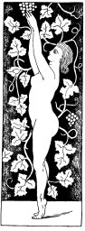
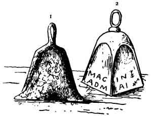
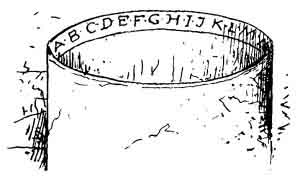
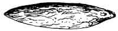
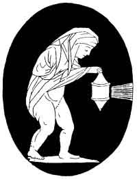
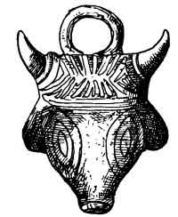

[Intangible Textual Heritage](../../index)  [Neo-Paganism](../index) 
[Index](index)  [Previous](err17) 

------------------------------------------------------------------------

p. 349

# CHAPTER V

### THE AMETHYST

"The February-born will find  
Sincerity and peace of mind,  
Freedom from passion and from care,  
If they the Amethyst will wear."  
                               Birthday Mottoes

"L'Amethiste a un lustre violet rouge, et est ainsi nommé, comme
n'estant yure, aussi il resiste à l'yuronguerie . . . et profite aussi à
ceux qui se veulent addonner à l'estude."--JEAN BAPTISTA PORTA, *De la
Magie Naturelle*.

I ONCE knew a young Frenchman who affirmed that he was
the only man living who knew the ancient language of Carthage--or some
such town--which he had recovered from its ancient monuments. So you
really can read ancient Phœnician I exclaimed in admiration. "*Mais,
Monsieur*," was the reply. "*Je le Parle*." "And with whom do you talk
it?" I inquired. And he replied, "*Monsieur, je fais des monologues*."

I often feel as regards all this old Etrusco-Roman folk-lore as if I had
rediscovered or dug up and deciphered it, like a forgotten tongue and
after all were, with my Frenchman, the only soul on earth who knew the
long-buried language or cared for it, and that when I speak of it must
do so *en monologue*. And there is a charm and a solemn beauty in the
spiritual or wizard language of the olden time; and no wonder, for there
was an era when it moved the world, and oracles spoke in it, and grand
religions lived in it, and with them lived, in all their deep faith and
many-hued gleams of glory, the Etruscan and the Roman.

And when I now and then find a flower of early faith still growing under
the vile broad-leafing rank weeds which have covered all this antique
garden, my heart leaps up and I begin

p. 350

to soliloquise even as I am doing now. What moved me to it was this:
There is a lady in Florence to whom a nun, to whom she had been kind,
sent three singular stones for a gift of gratitude, saying that she had
nought else to give. As soon as I beheld them I saw that they were
amulets, probably given up by some sinful penitent believer in
witchcraft to a father-confessor. One was an amethyst, of no great value
as a gem, but about two and a half inches in length, which has been, I
think, originally a *celt*, and has at some later time had its edge
ground off. It was probably of earliest ages; then carried by some old
Roman, and so lost and found till it was given to me for a Christmas
present in a red silk bag, December 25, 1891. Of the other two stones,
one was a *salagrana* and the second a piece of antimony.

Everybody knows that the amethyst derives its name from its anti-vinous
properties; for if you bear one you cannot be injured by wine. This I
knew, and nothing more, till I carried the stone to my sybil and asked
for a professional opinion on it. And it came in a form which
subsequently startled me. I noticed as a very remarkable thing that,
though she made no mention of it, she seemed to regard the stone as
something personally known to her, at least by report, and that she
studied it with great respect. It occurred at once to me that it was
some very famous fetish which had long been lost, but of which the
tradition had been preserved, like the black Voodoo stones of America.
And I am now more convinced of it than ever.

"That is a magnificent amulet," she said, as if surprised, "very ancient
and beautiful, This *pietra avvinata*--this stone mixed with wine
(wine-stone)--buried and disinterred many years, must be carried to
cause a good memory. Should any one wish to intoxicate you to betray you
(*per farci qualche tradimento*), if you wear it he will not succeed.
Wear it always at your side, and say:--

"'Pietra che da qualche stregone o strega  
Tu sei certo stato sotterato,  
Perche la fortuna ad altri non hai voluto lasciare;  
Ma si vede che tu ne sei pentita  
Ed hai voluto nelle mie mani farla ricapitare  
Ed io sapro bene conservarla  
E sempre al mio fianco portarla.  
Ti scongiuro o pietra!

Scongiuro questa pietra che sempre fortuna mi voglia portare  
E da ogni male mi voglia liberare'  
Specialmente dai nemichi che volessero farmi  
Qualche traditimento  
Questa pietra mi possa liberare  
E se mi volessero ubbriachare, p. 351  
O con vino o con liquore,  
Questo pezzo di pietra avinato sara sempre  
Il mio stregone liberatore!  
Ti scongiuro o pietra!'"

("'Stone, who by some wizard or some witch  
Hast certainly been buried long ago,  
Because thou wouldst not bring good luck to others,  
Now it is plain that thou hast repented,  
And hast wished to recall it unto me  
And I know right well how to preserve it,  
And I ever by my side will bear it.  
I conjure thee, O stone!

I conjure this stone to ever bring me fortune!  
And that it may free me from all evil.  
Specially from foes who fain would cause me  
Some deceit.  
May this stone free me!  
Should any wish to intoxicate me  
With wine, or other liquor,  
This piece of wine-stone shall ever be  
My wizard, freeing me from it!  
I conjure thee, O stone!'")

Now I knew that the amethyst was esteemed of old to be infallible
against intoxication, or, as Baptista Porta saith: "*L'amethiste attaché
au col sur la bouche du ventricule (al fianco) deliure de
l'yurongnerie.*" But I did not know that it was "good for the memory,"
by which my witch meant, in her simple way, as I found, also intellect
and intelligence. The belief of the fortune-teller very evidently was
that this famous amulet--of which there was a tradition--had been buried
by or with its owner, long ago, in order that others should not inherit
it, but that it had by wizard influences been brought to light again,
especially for me.

I have by me about two dozen books, but was not aware that among them I
possessed a treatise--*De Gemmis*--by Franciscus Rueus, printed at
Frankfort in 1608. It had escaped me, being bound up at the end of *De
Miraculis Occultis*, by Levinus Lemnius. And turning over my small
library, hoping against hope to find something to confirm this
connection of the amethyst with intellect, I found that I, by mere
chance, had just the very book of all books in the world which I
required. For in it there is a chapter--xi., *De Amethysto*--in which it
is said to not only protect against intoxication, but to stimulate
genius--even as the witch had declared. "Addunt et alii malas illum
arcere cogitationes, et præcox felixque ingenium efficere" ("It drives
away bad thoughts, and confers ripe and happy genius"). And it also
brings luck; but here Rueus remembers

p. 352

himself, and declares that he will not impart the heathenish and
unchristian superstitions which are reported of it--as I have done.

All of which reminds me of a story of my early days. When I was a small
boy in Philadelphia, I had a Quaker schoolmaster, named Jacob Pierce,
who delivered to us lectures on mineralogy, and encouraged us to make
collections, giving us on every Saturday "specimens" as rewards of good
conduct--in which distribution I, to my shame be it said, rarely had the
first or any other choice (though it once happened to me that the
rejected corner-stone which fell to my lot was the very gem of all).
Being therefore a zealous mineralogist, it befell that one day on the
wharf I found in the discarded ballast of stones brought by a vessel
from Tampa Bay, Florida, many *ammonites*, among which was one which had
been converted to pure chalcedony from its surroundings. With overloaded
pockets I went into the office of a certain broker and banker, who,
having examined my find with his friends, pronounced it to be "nothing
but common oyster-shells and such-like rubbish." And after I had with
pains investigated my three amulet-stones, I was told that they were in
all likelihood only three common mineralogical specimens which the nun
had picked up--which may, of course, be true--Italian nuns and their
poor retainers being, as is well known, universally addicted to science
in general and geology in particular.

The specimen prize which I got from my teacher was an amethyst, which I
"traded" with another boy for an air-balloon, which caught fire while I
was inflating it, and so perished. *Dii avertite omen*! and grant that
this my amethyst--balloon of a book may soar to the skies--without
burning my fingers!

May I add that the Rabbis called the amethyst *achlamah*, from *chalam*,
to dream; for they believed that it attracted to its wearer marvellous
dreams. And Saint Isidore compared it to the Trinity, because it hath in
it three colours: firstly, *purple*, which is imperial, and denotes God
the Father and Ruler of the world; that of *violet*, or humility (God
the Son in His lowliness among men); and that of *rose*, which is
expressive of love and of the Holy Spirit (*vide* Picinelli, *Mundus
Symbolic*, p. 684).

Among the Egyptians the amethyst corresponded to the Zodiacal sign of
the Goat (Kircher, *Œdip-Ægypt*, ii., p. 2). And as the goat was an
enemy to vines, so the amethyst was a foe to wine.

Apropos of which citations I must, in frankness and simple honesty,
remark that if there be here and there in this book some slight show of
erudition--which I doubt not provokes the gently-pitying smile of many a
learned folk-lorist--it is chiefly due to the girl with the wheelbarrow
from whom I purchase antique lore, parchment-bound, at from a penny to
threepence (this latter in cases of great

p. 353

temptation) the volume. This I take home and perfectly master, which
accounts for these learned extracts. That is the way it is done. Then
there is my tobacconist, who has for months past wrapped up cigars for
me in leaves of the old Encyclopædie Française; or from a Latin folio of
legal lore, to which I am greatly indebted. And on another occasion,
when I bought two Etruscan vases for seven francs, I induced the dealer
to throw in the work of Marsilius Ficinus on the Neo Platonists
Iamblichus, &c. (Lyons, 1577), which edition I had been after for many a
long year. And as it included the *Pimander*, &c., of Hermes
Trismegistus (which work I copied entirely in my sixteenth year, not
being able to buy it) you may judge if I was glad to get it!

#### THE SPELL OF THE BLACK HEN

"When thy black hen dies, thank God,  
Else thoud'st been lying 'neath the sod."

"When a black hen over a miser flies  
Soon after that the miser dies."  
                             

German Proverbs

In the year 1886 there was found in the belfry of a church in England a
curious object of which all that could be learned at first was from the
authority of an old woman and that it was called a witch's ladder. An
engraving of it was published in the *Folk-Lore Journal*, and several
contributors soon explained its use. It consisted of a cord tied in
knots at regular intervals, and in every knot the feather of a fowl had
been inserted.

I was in Italy when I saw this engraving, and read that the real nature
of the object had not been ascertained. I remarked that I would soon
find it out, which I did, and that most unexpectedly. For by mere
chance, the very first Italian woman with whom I conversed, being asked
if she knew any stories about witches, began with the following:--

"Si. There was in Florence four years ago a child which was bewitched.
It pined away. The parents took it to all the shrines in vain, and it
died.

"Some time after something hard was felt in the bed on which the child
had slept. They opened the bed and found what is called a *guirlanda
delle strege*, or witches' garland. It is made by taking a cord and
tying knots in it. While doing this pluck feathers one by one from a
living hen, and stick them into the knots, uttering a malediction with
every one. There was also found in the bed the figure of a hen made of
stuff (cotton or the like)."

The next day I showed the woman the engraving of the witch-ladder in the
*Folk-Lore Journal*. She was astonished, and said, "Why that is

la guirlanda delle

p. 354

strege which I described yesterday." I did not pay any attention at the
time to what was said of the image of a cock or hen being found with the
knotted cord, but I have since ascertained that it formed the most
important part of the whole incantation.

This is the spell of *Il Pollo nero*, or the Black Hen. It is as
follows:--

"To bewitch one till he die: Take a black hen and pluck from it every
feather; and this done, keep them all carefully, so that not one be
lost. With these you may do any evil to grown people or children.

"Take the hairs of the person, or else the stockings, and those not
clean, for there must be in them his or her perspiration. Then with
black and red thread sew the stockings across one another. And if you
have the hairs of the person, make of them a *guirlanda unita cop
stoppa*--a cord spun with flax or hemp--then take the feathers and *si
cuopre questa robba* you cover (or work up) this thing in the form of a
hen, and, taking the feathers, work or weave them with black and red
thread into the covering of the hen, and put black pins ill the form of
a cross into the hen. It must then be hidden in the mattress or straw
bed of the one whom you wish to bewitch, and say:--

"'Questo pollo e maladetto,  
E maladetto sia tutte  
Le maledizioni la portate via,  
Dal fondo del inferno,  
Ma ora per una ora,  
Le coma gliele voglio fare,  
Che la maledizione la possa lasciare,  
Et te (*il nome*) te la possa portare  
Tu non abbia più pace!  
E ne giorno e me notte!  
Fino che la stregeria  
Che ti io ho fatto  
Non ti vengo a. levare!'"

("'This hen is accursed,  
And cursed be all!  
May the curses carry him away  
Curses from the depths of hell  
Now, for an hour  
I would give him horns,  
May the curse leave them on him!  
And thou (the name) mayst thou bear them,  
And have no more peace  
Neither by day or night,  
Until the bewitchment  
Which I have wrought  
Be removed by me!'"

THE COUNTER-CHARM-"To remove this bewitchment you must open the mattress
and find the hen and wreath, and throw all that holds it into
running-water.

"And then take the person bewitched, man, woman, or child, *che sia*,
its it may be, and carry him or her Into a church while a baptism is
going on, and say:--

p. 355

"'In nome di Gesu, di Giuseppe,  
E di Maria la benedizione  
Di quel bambino benedisca  
L'anima mia!'

This the one who is bewitched must say, but if it be a child who cannot
speak, then the person who carries it must say:--

"'In the name of Jesus and of Joseph,  
And of Mary, may the blessing  
Of that infant also bless  
The soul of this child!''

Then carry it to some place near and bathe it in holy water."

This spell is considered as very terrible, and I had some difficulty in
getting it. There is much curious lore connected with it, and there is
every reason to believe that it is extremely ancient. In the museum
(archæological) of Geneva, among the very old relics from Lacustrine
dwellings, there is one of a hen, flat, knitted or felted from black
hair or wool, or both, I copied it with some care, and my witch
authority in Florence at once declared it to be a black hen made for
magic. As it was found in water it may have been thrown there to destroy
the spell, as the counter-charm prescribes. And that it is very ancient
is effectively proved by the fact that other objects of the same
material, and of the stone age, were found with it. This is presumptive
evidence that the spell belongs to prehistoric or neolithic times.

The black hen, being an object of great fear and reverence, was
worshipped by the Wends. From them it passed as a crest to the house of
Henneberg (*vide* the *Symbolik* of FRIEDRICH) and to the quarterings of
the Prince of Wales (*Puck*, 3 vols., 1852, by Dr. Bell). The gypsies in
Hungary, to effect a certain cure, apply the body of a black hen to the
sufferer, pronouncing an incantation. In Roumania when a Jewish girl has
an *affaire du cœur* with the devil--or possibly with a devil of a
fellow--the result is a black hen. But what is very nearly connected
with this is the following: In Wallachia if a man has been robbed he
goes to some sorcerer to take up "the black fast" against him. To do
this the wizard must, in company with a black hen, fast for nine
Fridays. Then the thief will either bring back the plunder or die. Mrs.
Gerard, who gives this account, says nothing of what the ceremonies are
attendant on the charm. I have no doubt that if we had the whole we
should find that the Italian ceremony requires the nine Fridays' fast,
and that the Wallachian Transylvanian spell is directed against any
enemy, as well as a thief (*vide* *Gypsy Sorcery*, by CHARLES G.
LELAND).

p. 356

One of these Italian witch-garlands was exhibited by Mr. Tylor at the
Folk-Lore Congress in 1891, and I have another which was given to me for
a Christmas present. It is in a box covered with red flannel. In the box
was a sprig of thorn leaves. The wreath had been completed by attaching
it to a small *Japanese* cock made of feathers.

I have found in a number of works on folk-lore and superstitions such a
number of spells and incantations, of which the black hen forms the
chief item, that I find it impossible to include them within the limits
of this work. I may mention, however, that when I was a boy in
Philadelphia, in America, once hearing that a whole dead chicken, quite
dried up, had been found in a feather bed.

As feathers for beds are always picked over, I have little doubt that
this object had been put into the bed by some black person as a Voodoo
charm.

#### THE SPELL OF THE BELL

"Much the witches fear the spell,  
When by night they bear a bell  
Off they fly, over the sky,  
When they hear *dondo, dondo, dondo*!"  
                                        

Romagnola Song

The chief, if not the only use of bells in ancient days was to drive
away demons, or dispel evil in every form; and it is very evident that
they were introduced to Christian churches far more for this purpose
than to call to prayer. For, as in Ireland, the church bells were
generally of the size and shape of the average cow-bell of America,
making no more noise than the latter. There was found not many years ago
in Rome a *tintinnabulum*, or little bell of silver bearing magical
characters, the purport of which was to avert the evil eye. I have a
facsimile of this presented by the late Sir Patrick Colquhoun. And also
a very small bronze Etruscan (or Roman, according to Professor Milani)
bell found at Chiusi--resting on my paper as I write--and what an aid it
would be here an it could speak all that it e'er has seen!

These little square old bronze Roman bells with round corners are much
prized among the peasantry for amulets. In the mountain land they are
always kept in one of the two small cupboards, or recesses, on either
side of the chimney-piece. I have a quaint little song in the
Bolognese-Romagnola dialect, setting forth the fear of the witches when
they hear at twilight-tide "those evening bells."

The following from Volterra, which is given word for word, sets forth
the

p. 357

manner in which the old campanologistic faith has been preserved to the
present day:--

"The little bell (*campanello*) is held of great esteem in the Romagna,
as well as in Volterra, as a *jettatura*, or sign against witches. When
one goes out of an evening he should carry one in his pocket--*ma pero
bisogna che sia di bronzo e quadrato*--but it should be of bronze, and
four-cornered; and while going along the bell jingles in the pocket; but
because it sounds there the ring is indistinct, and the witches cannot
count the strokes of the clapper (*quante volte pallino batte*), and are
thus obliged to fly, and cannot approach the bearer nor do him harm.

"Then putting it into the recess, or small cupboard by the chimney-piece
(*buco del cammino*), repeat this incantation:--

"'Metto nel buco del cammino,  
Questo campanello per tenere lontano  
Pluto e le sue compagne,  
Che in questa casa non si possino presentare;

1.--ETRUSCAN BRONZE BELL, FROM CHINUSI, WORN AS AN AMULET (In possession
of the writer ) 2.-OLD ROMAN MAGIC BELL

Ne in forma di cane e ne di gatto,  
Ne di topo, ne di civetta,  
Ne di serpe, e ne di cornacchia,  
Quando alla mia casa si vengano  
A presenta questa campano, suonare  
E tutti maligni si possino allontanare.'"

("'In this comer of the cupboard,  
I put this bell to drive afar  
Pluto and his company,  
That in this house they may not come,  
Neither in form of dog or cat,  
Nor of mole, nor of an owl,  
Nor of serpent, nor of crow  
Should they come into my home,  
May the bell ringing drive the wretches away!'")

p. 358

Pluto--not Satan--here appears as leader of the witches. I have observed
that the further we get from the Romagnola mountains into the plains,
the more do the Roman gods appear. The shoemaker who gave this
incantation had, however, some tincture of letters, having studied and
read. Pluto may be a survival, but he is gently doubtful. But as I would
not deprive a dying god of his very last chance for life on earth, I add
that subsequent inquiry removed this dire suspicion. Pluto still lives.
It may be noted here, by the way, that the belief that bells ring of
themselves, and that chains rattle, to announce the presence Of spirits,
is of old Roman origin, as I find confirmed by Maffei in his *Magica
Distrutta*--a work in which the author rides full tilt at the windmill
of sorcery, utterly annihilating it, but never perceiving that he also
destroys with the same lance another black spectre known as *la Santa
Fede Cattolica*, or *La Chiesa Apostolica*, all of whose marvels and
miracles came out of the same old tub. Think of this, O friend, when, in
some darkened and gloomy hour, you are in church and hear the padre ring
his little bell, and let a happy thrill of heathenism pass at the sound
through your heart!

Not only bells, but trumpets and cymbals were used to drive away
demons--which reminds me that few know whence came the idea of the last
trump at the Day of judgment--

"Tuba mirum spargens sonum,  
Per sepulchras regionum,  
Cogens onmes ante thronum."

It is the great blast to be blown at the death-bed of a dying world, and
was derived from a heathen source, as is set forth in the following
passage from the same *Arte Magica Distrutta* of Maffei (17 5 7):--

"There was a strange religious ceremony which the Gentiles observed when
dying. This was to play (luring the last agony on the horn, or trumpet,
or instruments of metal, and of great noise. The motive to this was
doubtless the belief that it drove away *larve* (demons) which, as it
was believed, hated the sound of metal, which vulgar opinion is set
forth by Lucian in *Philops*. The *Dire* were witches who flew through
the air, concerning the driving away of whom by noise Pliny writes (1.
28, c. 2). Eusebius tells us that demons were driven away by the sound
of *timpans*."

\[*Timpani* are tambourines, and it is an awfully curious thing, by the
way, that when bees swarmed these *timpans* were anciently used, and
that *tin pans* are now beaten in their stead.\]

That bells have souls, wills, and ways of their own is apparent from the
number of marvellous instances recorded of their having rung of
themselves without any human aid--as they did at the death of Von
Rodenstein--albeit

p. 359

Prætorius, who devotes several pages to this important subject in his
marvellous and rare *Glückskopf* (1669), suggests that it may have been
done by a Poltergeist, which is a spirit much given to noise and
mischief, and which makes its appearance, in my belief, very often in
the form of a medical student, but always as a youth.

Remains to be remarked that the little bronze bell is supposed to be a
fairy lady--as her form suggests--and is the more human as having a
voice. Which fancy did not escape the monks, who addressed them as
saints, as you may read in the chapter on Bells in Southey's "Doctor":--

"Bellula bella, mi puella:  
Tu me corde tenes!"

#### THE SPELL OF THE BOILING CLOTHES

The reader must not suppose that the charms, incantations, and
devilments of different kinds which are here solemnly confided to him,
are known to the multitude. Many have, it is true, leaked out; but most
of them are secrets rich and rare, treasured up among the elect who,
dying, leave them as a rich legacy unto their issue. This was recalled
to me by a curious incident alluded to in the preface. Firstly, I pray
you read the following, as taken down four years ago--in 1888--from a
witch:--

"*Quando si ha uno bambino stregato* ("When a babe is bewitched"). Take
the clothes of the child, and put them in a pot to boil at midnight. All
the garments must go in, with shoes and stockings. Then take a new and
very large knife, and sharpen it at a table, and say, sticking it in the
table:--

"'Non infilo questo coltello  
Ma infilo la maladetta strega  
Che non viene! Che non viene!  
Non possa resistere  
Sinquando in mio bambino  
Il salute non lo fa ritornare!'

("'I do not sharpen this knife,  
I whet the accursed witch,  
That she cannot resist coming  
Until unto my child  
She again restores health!')

"Then the witch will appear at the window--it may be at the door--in the
form of a cat, or dog, or some form or spectre. But be in no fear, for
these are but shifting forms (*forme cambiate*), and do not take the
knife from the table nor let the clothes cease to boil till three
o'clock.

"And being by this charm compelled to come and obey, the witch will
remove the illness from the child."

p. 360

In the *Secolo* of Milan, which has by far the most extensive
circulation of any journal in Italy, there appeared, March 3, 1891, the
following account of a serious and very singular disturbance:--

"

A Mediæval Scene at Porta Ticinese

"We seem to dream, and yet this which we relate occurred yesterday
morning here in Milan, and it is true in every one of its startling and
shocking details.

"In the Via Ripa Porta Ticinese, No. 61, in a modest room on the fourth
floor, dwelt the family of a journeyman varnisher, Malaterra Franciusi
and his wife, Virginia, aged twenty-five, a glove-maker, with two
children, one of which has been ill for a month with some unknown,
obstinate, and strange disorder.

"A neighbour of the Franciosis, a woman who pretended to some knowledge
of medicine, declared that the child was bewitched; that it would be
quite useless to have recourse to physicians and priests, and that the
only way to cure it would be to discover the sorceress who had made the
mischief. But how was it to be done?

"The woman, as a great secret, after much entreaty from the Franciosis,
taught them how it was to be done by putting the clothes of the child
into a pot with water and boiling them. She declared that at the instant
of the boiling, the witch would be drawn to the place by an irresistible
diabolical force, and thus compelled to make herself known. This war,
done, and the clothes put in the pot and the pot on the fire.

"By mere chance, just as the water began to boil, a woman entered. This
was one Angela Micheletti, thirty-four years of age, seven months gone
with child. She was the wife of a labourer. Being a friend of the
Franciosis, and on her way with a pair of wooden shoes to have them
mended, she dropped in to inquire as to the health of the child.

"At seeing her the mother screamed '*Dalli alla strega*!' ('Give it to
the witch!') La Micheletti, thinking that her friend had gone mad, tried
to calm her, but the other, more exasperated, howled with all her force,
'*Aiuto! La strega*!' ('Help! the witch!') La Micheletti fled into the
street.

"In an instant a great crowd had assembled, who, hearing the cry and
accusation, all set upon La Micheletti as if she had been a mad dog,
*per lacerarla à brani*--seeking to tear her to pieces. So she fled,
pursued by the mad mob, crying, '*Dalli alla strega*!' The poor
creature, more dead than alive, took refuge in the church of Santa Maria
del Naviglio, but the crowd rushed in, and while she knelt before the
grand altar, raising her hands in supplication, weeping and screaming
for mercy, her hair was literally torn from her head and divided among
the women who attacked her, and then she was very cruelly beaten. The
*parocco*, or parish priest, tried to shield her, but in vain, and he
himself escaped narrowly from being knocked down.

"The poor victim was then carried, amid all abuses and curses, from the
church, and haled along to the room of the Franciosis. Here was another
savage scene. La Micheletti being required to disenchant the child, to
which she replied asserting her innocence of all such evil, and received
howls, curses, and blows.

"Finally the Delegate, Sig. Omodeo, succeeded, with some military police
and with great trouble, in dispersing the mob. Then the woman Franciosi,
convinced too late of her unpardonable folly, fell on her knees before
La Micheletti exclaiming, 'I am not to blame; I was advised to do so by
another--I was blinded by love of my child!'

"In the afternoon the poor Micheletti, accompanied by her husband and
Sig. Omodeo, was taken home in a brougham and put to bed. This morning
she was better but still trembling from her terrible experience. The sad
impression of this savage mediaeval scene will long be remembered in the
suburb of Porta. Ticinese.

"The women who tore the hair from the head of La Micheletti, went to
their homes and burned it, pronouncing incantations, and than ran to the
room of the Franciosis to see if the child was cured. And as they
declared they had found It somewhat better, they cried, '*Ecco se non è
vero ch'è stata stregata*!' ('See now, if it is not true that she is a
witch!')"

p. 361

Sometimes gloves or stockings alone are boiled for certain peculiar
"points" in bewitching. Of the burning of hair to remove bewitchment I
have elsewhere spoken. But the real moral meaning of this horrible story
will not appear at once as it should to every reader. It is this: It was
all very well for the *parocco*, or parish priest, to try to shield the
woman at the altar, &c., but had that priest ever in all his life once
told the people that there is no such thing as witchcraft, and that it
is all delusion? Did any priest in Italy, or any of the Catholic
teachers whose duty it is to enlighten their flocks, ever tell them
plainly that there is no such thing as sorcery. No; of course not. For
that would be to attract doubts as to the truth of their own peculiar
sorts of sorcery, incantation, and magic--just as the small American
boy, who, when informed by his father that there was no such Christmas
spirit as Santa Claus, asked reproachfully, "And have you been playing
it off on me in the same way about Jesus too?"

The Church at Rome does not deny the existence of modern witchcraft and
sorcery. There are three, and I know not how many more, Roman Catholic
books written to prove that all the mighty miracles of modern
spiritualists, such as carrying cigarettes to secret places, playing
banjoes in the dark, and bringing penny bouquets from Paradise, are all
done by the devil, and these books have been licensed and approved by
the Pope. Can anybody imagine that if these Milanese had been
Protestants they would have acted as they did? By their fruits shall ye
know them!

Now in all such superstition Milan is as light to darkness compared to
our Florence, and Florence in this respect is the same in relation to
the Toscana Romagna.

I have also from Peppino, the youth frequently alluded to, a long and
detailed account as to how quite recently, a child which was dying in
the village of Premilcore in the Romagna Toscana, was saved by boiling
its clothes and saying:--

"Diavoli tutti  
Del inferno scatenatevi,  
Tutti e fate venire,  
La strega del mio bambino,  
In mia presenza. Sia!"

Then the witch appeared, and by casting the usual gomitolo, or skein,
into the air, the child was cured. Then the witch was taken by two other
witches into the fields and rolled unmercifully over the ground till she
lost all her power of witchcraft.

p. 362

#### RING SORCERY

"A droite l'anneau presage  
Prompt et heureux mariage,  
A gauche il figure:  
Abandon, rupture."  
               

Le Jeu de Cartes de Mlle. Lenormand

Divination by means of rings was well known to the early Romans, and is
thus described (*Trac. Magicus*, p. 92): "Dactylomantia divinat annulis
ad certam cœli posituram constructis vel incantamentis, et super
tripodem ad certa verba motis" ("Dactylomancy is divining by means of
rings made at certain planetary conjunctions, or with incantations, and
moved on the tripod with certain words"). For tripod read tambourine,
and for rings any small objects, and we shall have one of the most
ancient forms of divination in existence. These small objects are, among
the Hungarian gypsies, seeds of the deadly thorn-apple; in Lapland, the
small image of a frog.

In modern Italy there is another kind of ring prophecy. It is, however,
very ancient, and is known in many countries. Take a bowl, or vase, or
cylinder, divide its inner edge into so many parts as there are letters
of the alphabet.

Take a gold, or any other ring, and let it be consecrated. (*Consacrasi
l'anello prima dell operazione*.) Then tie a thread to it and hold the
end of the thread in the right hand and a sprig of verbena in the left.
Let the ring hang in the cylinder. According to one authority the thread
should be wrapped round the thumb and pass over the pulse so as to
secure the right vibration. Then ask a question and the ring will begin
to swing, and strike on the letters and spell out the reply.

As I have said, this is a very ancient species of prediction or
invocation. It is the same in principle with the planchette, but
requires only one operator. It may be observed that when the person who
holds the thread is deeply in earnest, or believing, and has prepared
himself to work the oracle by serious reflection, the replies spelled
out are often very remarkable, not to say startling, and whether
produced by involuntary mental action or by external causes, they are in
most cases curious. I have met with the assertion that by means of the
thread and ring

p. 363

one can always ascertain exactly what o'clock it is when the edge of the
cup is divided in twelve parts. "How would it be where the day is
divided into twenty-four hours?" It would be just the same, and true
answers would be often given, because the action is subjective, or comes
from the operator.

Another variety of this kind of divination is to place an evenly
balanced rod, or needle like that of a mariner's compass, on a pivot, in
the centre of a plate. Around the edge, in circles, are letters and
numbers. This is a kind of roulette. Give the bar a turn and when it
ceases revolving observe the letter or number opposite which it stops.

Again, take a round, flat surface, say a wooden plate surrounded by a
border half an inch in height. This surface is covered with numbers and
letters. Then take a ring and spin it as one spins a coin. We draw
conclusions from the letters, &c., on which it falls.

Apropos of roulette and the ancients there is at Homburg les Bains a
collection of ancient Roman remains, and in an adjoining room the
roulette table which was last used in 1871. Two or three of the average
class of English, or American, tourists, being shown through the
collection, cried, on seeing the wheel, "And is that old Roman, and did
the Romans play roulette! How interesting!" For the truth of which I
vouch "with both hands," having heard it.

An ancient ring which has been long worn is said to be the best for
divination. I have one of silver with the image of a toad cut in
hæmatite in it, about four hundred years old, which has, I doubt not,
been frequently tried in spells. Also a silver and enamel messenger ring
which once belonged to King Roger of Sicily, which, if it could tell all
it ever witnessed, might describe the story of Schiller's Diver.

#### AMULETS, OMENS AND SMALL SORCERIES

I include in this chapter certain odds and ends of folk-lore which are
not without interest. The first which I shall give is *the pine-cone*.

"Take a pine-cone, after all the *pinoli* (nuts or seeds) have been
removed. Then on every scale, or within it between the scales, put a
*lupine* (dry). Then take a flower-pot and fill it with fine earth, and
plant the cone in it quite covered with earth or buried. Put it out in
the air, and water it like any flower. Should it grow well and look
prettily it is a sign that all things will go well with you. But its
growing badly is a bad sign. But you must always keep it by you to
secure the good luck, and even carry it with you when you travel, And to
maintain the principle (*bisogna tenere la sistema*) you should plant a
new cone every year."

American young ladies have a somewhat similar oracle in the sweet potato
which also makes a very pretty fortune-teller, If it flowers or leaves
well, it is a

p. 364

sign that the owner will be magnificently dressed on her wedding-day,
and have a grand festa, which, I suppose, will be "in all the papers."
Apropos of this very small gardening, it may be mentioned that since
Roman times, all d perhaps much earlier, the planting of cress, mustard,
or seeds of any sort to divine luck by their growth, has been common in
all countries. One very easy form is as follows: If you keep a bird--say
a canary--get an empty box, a raisin box, eighteen inches or two feet in
length, fill it with earth and hang the cage over it. Throw into the
earth the cleanings of the cage and a few canary or hemp seeds. These
will soon grow, and when sprouting or about all inch high will be
devoured by the bird with avidity. This is very lucky for the canary.

Very old keys are good amulets for luck. They may be carried in the
pocket or hung up by a red ribbon in the room. And it is very lucky to
find one. While picking it up you should say:--

"Non prendo questo chiave l'ho trovato.  
E lo porto con me, ma non porto  
La chiave pero la fortuna  
Che sia sempre appresso di me.

("'Tis not a key which I have found  
Nor one which I shall bear around,  
But fortune which I trust will be,  
Ever my friend and near to me.)

"And this may be said for anything else which is found."

The special meaning of the key is success with women, the word key
(*chiave*) being applied to the virile organ, and *chiavare*, "to key"
to the act of copulation. Its general signification as an omen is
success in your next undertaking. Thus to dream of a key or see one is a
good sign:--

"La clef près de ta main  
Annonce qu' à la fin  
Tu auras du succès  
Dans tes derniers projets."

If you blow or whistle in a key, especially an old one, it will call to
you spirits or fairies, who will be favourable to you and aid you, in
love above all things.

We can divine with keys in several ways. By locking a padlock when a
couple are married, one can stop all intimacy between them. But it is
with the sieve that Master Key becomes a great sorcerer, as was once set
forth in the *St. James's Gazette*:--

p. 365

"Methods of discovering the names of thieves and the whereabouts of
stolen goods were endless; and many an old hag, down almost to our own
time, has driven a profitable trade with 'infallible' means of
divination as old as the fire-worshippers. The formulae most frequently
used for these purposes were known as 'the key' and 'the sieve.' The
name of the suspected person was written upon a piece of paper placed
around a key; the key was tied to a volume of Scripture, and the whole
suspended by a cord spun for the purpose, from the finger of a young
unmarried woman. Three times she repeated in a low voice the verse
'Exurge, Domine'; and if at the words the key and the book turned, the
guilt of the suspect was proved. If neither of them moved his innocence
was clear. Divination by the sieve was long in high favour, for this was
deemed to be the most certain of all methods. Hence, says Erasmus, the
proverb 'To divine with the sieve'--to express the certainty of a thing.
A sieve was suspended from a pair of scissors held by two assistants.
The operator, having pronounced the name of the suspected person,
repeated a shibboleth consisting of six words--*dies, mies, jesquet,
benedoe, fet, dovina*--'which neither he or his assistants understood.'
If the person whose name was mentioned were guilty, the six magical
words 'compelled the demon to make the sieve spin round.' Pierre
D'Abanne--the author of a most entertaining manuscript work on the
elements of magic, preserved in the Bibliothèque de l'Arsenal [1](#fn_43)--recounts that he used this method three
times with the most complete success, and then gave it up; fearing that
the demon, in revenge for having been compelled to tell the truth three
times in succession to one man--greatly, no doubt, to his chargin, since
he is by nature a liar--would draw his tormentor into toils from which
there would be no escape.

Never pass by a coin, however trifling; should you let it lie your luck
will pass to the person who finds and takes it. But on picking it, up
repeat the same lines.

"To know the future or how any event will end, or what your luck will be
in a lottery: Take a dry poppy-pod, make a hole in it, shake out the
seed and place in it a paper on which your question is written. Then put
it beneath your pillow and repeat:--

"'In nome del cielo, delle stelle, della luna,  
Fate mi face il sogno secondo . . . (le mie intenzione).'"

("'In the name of heaven the stars and the moon!  
May I dream and that full soon,  
If this I see . . . (here repeat your wish).'")

The poppy was not only sacred to the god of dreams and of sleep, but
owing to the immense number of its seeds was a type of fertility and
wealth. Hence the gilt poppy-heads, so commonly seen in the
apothecaries' windows, which are or were originally amulets to bring
money.

Another amulet allied to dreaming is made by taking twigs or bits of
small boughs from an oak-tree (in England of mountain-ash). Bind two of
these so as to make a cross, or lay them across one another on the
table, or stand, by your bed, and repeat before going to sleep:--

"Non metto questa quercia,  
Ma metto la fortuna,  
Che non possa abbandonar'  
Mai la casa mia."

p. 366

("'Tis not oak which here I place,  
But good fortune--by its grace  
May it never pass away,  
But ever in my dwelling stay.")

The sticks should be bound with red ribbon (woollen), and the cross thus
formed and spelled becomes an amulet which may be hung up to bring good
luck or drive away misfortune.

Whenever one puts on a new garment, he or she should repeat this
spell:--

"Porto questo vestito  
Per maggior fortuna  
Sia maladetto, maladetto sia!  
Chi cerca nella mia vita  
Di portar qualche malia!"

("This coat I wear, this garment bear,  
To bring good luck to me;  
If any man begrudge that luck,  
May he accursed be!")

Should you find, or pick up, or even see any object, you may divine by
it what is to happen. Thus if the first bit of ribbon, or string, or
cloth which you find is of any colour, especially if it be new and
fresh, it will portend:--

Red (especially scarlet)--Good fortune, prosperity, successful love.  
*Yellow*--jealousy; according to some, gold.  
*Grey*--Peace, calm, content.  
*Silver*--Disquiet, disturbance, passion, pain.  
*Gold*--Fortune, prosperity, gain, intelligence.  
*Black*--Vexation, discontent, trouble.  
*Orange*--Misfortune.

The belief in the magic virtue of red, especially of red wool, is as
general in Italy as it is ancient. As it is the colour of the blood and
of fire, it is sacred to life and heat. So a red ribbon or cloth hung
from a window or over a bed brings luck.

"When one sees a very fine large butterfly, catch it as carefully as you
can without hurting it, and look under its wings, for there you may
often find characters which indicate winning numbers in the lottery, or
Yes or No to a question. Then let it go again, for your luck will depend
on not injuring it. And this is the case with serpents or any animals
which are marked, for there is writing in all things if we can but read
it."

To find a horse-shoe is as lucky in Tuscany as it is elsewhere. Hay is
also luck-bringing, If you find a horse-shoe, make a red bag and put the
horse-shoe

p. 367

into it with hay, and it will be an admirable amulet. It is to be kept
always in the bed.

"If a youth loves a maid he will do much to win her affections should he
give her *amorino*, that is mignonette."

In this case we can infer that *nomen est omen*.

Shoes or gloves when boiled in water yield a liquid which if not
palatable is however of great use in witchcraft, though I am not
informed as to the exact manner in which this *soupe au shoe* is served
up. [1](#fn_44)

When children see a *lucciola*, a fire-fly, they sing a strange little
song which is also an incantation for luck:--

"Lucciola! Lucciola.  
Viene a gara!  
Mette la briglia  
A la cavalla,  
Mette la briglia  
Al figluolo del re,  
Che la fortuna  
Venga con me,  
Luciola mia  
Viene da me!"

("Fire-fly! O Fire-fly!  
Enter the course;  
Come, put the bridle  
Now on the horse!  
Come, put the bridle  
On the king's son,  
So that good fortune,  
By me may be won!  
Fire-fly! O Fire-fly  
Make it my own!")

When a woman has a sore throat (*effeto di lu gola abassata*), she must
take her own apron and measure or fold it in a cross thrice (*misuararla
in croce*), for three mornings in succession. Then when she has done
this she must, before eating, put three pins crossed with a sharpened
knife stuck into the table and say:--

"Diavolo, vi discongiura!  
In carne ed ossa,

p. 368

Si questa donna e stregata  
Questa strega tenerla stregata,  
Più non possa,  
Sinoquando questa donna non guarira  
Questo coltello del tavola non sortira  
E cosi la strega più pace non avra!"

("Devil, I conjure thee alone,  
In flesh and in bone!  
If this woman bewitched be,  
The witch at once shall set her free  
Till she's freed from all her pain  
The knife i' the table shall remain,  
And the witch shall feel the knife  
In her soul and in her life!")

This is interesting as indicating the Shamanism according to which every
pain or the least disorder is supposed to be caused by sorcery--a
doctrine which exists in full force in another form known as Prayers for
the Sick.

Egg-shells are witches' goblets for drinking. Therefore lest they use
them for such, one should after eating an egg break the shell to
fragments, and throw them into a running stream and say:--

"Se sei una strega  
Va al diavolo,  
Che tu porta via  
Assieme call' acqua corsia!"

("If thou art a witch,  
Go, O devil's daughter!  
And be borne away  
On the running water!")

It is commonly said that--

"Spilling or dropping wine  
Is a very lucky sign;  
But spilling or dropping oil,  
Much good luck will spoil."

However, when the wine upsets, some think it is witch-work, and so they
put the palm of the hand in the wine, and then strike it on the forehead
and say, making the sign of the cross:--

p. 369

"In name del cielo,  
    Delle stelle e della luna!  
A chi me ha data il malaugurio,  
    Me lascia la buona fortuna!"

("In the name of heaven,  
    Of the stars and moon;  
May the one who gave misfortune,  
    Bring me better luck and soon!")

But that, *vin repandu porte bonheur*, is a very old belief It forms the
theme of an old Norman-French fabliau. There is a very curious custom
observed in La Romagna, which was thus described:--

"When it has not rained for a long time and the fields are dry, they
take stones and roll them through the field and say:--

"'Queste pietre voglio rullare,  
Ma non rullo le pietre,  
Rullo le pietre, rullo l'acqua  
Che in terra possa venire,  
Ed i campi mi possa umidire,  
E cosi buona raccolta possa venire!"

("'I wish indeed to roll this stone,  
And yet it is not it alone,  
I roll the stone that water may  
Come in these fields so dry to-day,  
And water well the thirsty field,  
So that it may good harvest yield!"')

PRELLER states (*Rom. Myth.*, p. 312) that in the temple of Mars there
was kept a great stone cylinder which, when there was a great drought,
was rolled by his priests through the town. And we know that such an
application of similar stones was common in Italy in dry seasons,
especially in the country. And LABEO in his work on the Etruscan books
of ritual, writes: "Fibræ jecoris sandaracei coloris dum fuerint,
manales tunc vertere opus, est petras, id est quas solebant antiqui in
modum cylindrorum per limites trahere pro pluviæ commutanda inopia."
Traces of the custom are found in other countries.

As among the Romans, the picture of a bunch of grapes, rudely painted,
is placed in vineyards in Northern Italy, as an amulet to secure a good
crop.

There are many curious ideas current as to old Roman and Etruscan
relics, which are, however, generally supposed to be connected with
ancient sorcery. On this subject I obtained the following very curious
information:--

"When a woman is *incinta*, or *enceinte*, she should not look at
animals, and especially beware seeing those figures depicted or set
forth in bronze, leather, or cloth, which are half animals and half men,
with heads

p. 370

like goats and legs of Christians (*col capo di capra, e le gambe di
Cristiano*), or faces with the legs of devils, like those of a horse
(*i.e.*, Pan and the sylvan gods).

"If a woman at such a time looks at these it may easily happen that she
will have a son like them, for it may come to pass in such cases that he
will be born in similar form and so easily become a wizard."

That is, the old latent sorcery will pass to the child and be developed
in it. The images here referred to are mostly the old Roman bronze
figures of rural deities or *lares*, which are so frequently found in
*schiavi*, or excavations. Among these are many *ex voto* offerings, the
same in nature with the little figures of wax so common in Catholic
churches. It is worth observing that the ancients went to much greater
expense in such marks of gratitude for divine aid than do modern
Catholic Christians. Bronze was dearer then than wax is now, but it was
quite as freely employed by the faithful.

Certain spells are used in Tuscany with a double meaning, that is to
say, they are employed either to injure a certain person, or else to
defeat an evil witch, or to break a spell or cure a disease. Among these
are the following: A plant or herb, having had an incantation pronounced
over it (nearly the same in form with several which I have given) is
left to wither, the belief being that, as it fades, the person or
disease or enchantment will slowly die or vanish. Again, an apple is cut
to pieces--a common form of magic--or an orange or lemon is stuck full
of pins and left to dry up, with the same consequences. Also a stick is
broken, which is similarly a formula known in the West where it has
become a legal form, or else a piece of woollen felted or woven cloth is
pulled apart. All of these spells are very ancient and may be found in
certain conjurations, given in Lenormant's *Magie Chaldaïenne*, for
which they were translated from Accadian cylinders. The author remarks
that while pronouncing them the operator had to perform certain
conjurations resembling those described in the *Pharmaceutria* of
Theocritus and in Virgil's VIII. the Eclogue, which are also essentially
those now in use. The Assyrian incantations are as follows:--

I

As this plant withers, so shall also the spell!  
The burning fire shall devour it!  
It shall not be arranged on the lines of a vine arbour;  
it shall not be trained into an orchard, an . . .;  
the earth shall not receive its root;  
its fruit shall not grow, and the sun shall not smile upon it;  
it shall not be offered at the festivals of kings and gods!  
The man who has cast the evil fate, his wife,  
the violent operation, the finger pointing, the written spell, the
curses, the sins, p. 371  
the evil that is in my body, in my flesh, in my bruises,  
may \[all that\] be withered like this plant!  
May the burning fire devour it this day!  
May the evil fate depart and may I behold the light again!

II

As this fruit is divided into pieces, so shall also the spell be!  
The burning fire shall devour it;  
it shall not return to the supporting branch from which it is cut off;  
it shall not be offered at the festivals of kings or gods!  
The man who has cast the evil fate, his wife,  
the violent operation \[i.e., evil invocation\], the finger pointing,
the written spell, the curses, the sins,  
the evil that is in my body, in my flesh, in my bruises,  
may all \[that\] be divided in pieces like this fruit!  
May the burning fire devour it this day!  
May the evil fate depart, and may I behold the light again!

III

As this twig is plucked up and broken in pieces, so shall also the spell
be,  
The burning fire shall devour it!  
its fibres shall not again unite themselves to the trunk;  
it shall not arrive at a perfect state of splendour!  
The man who has cast the evil fate, his wife,  
the violent operation, the pointing with the finger, the written spell,
the curses, the sins,  
The evil which is in my body, in my flesh, in my bruises,  
may \[all that\] be broken in pieces and plucked up like this twig!  
May the burning fire devour it this day!  
May the evil fate depart, and may I behold the light again!

IV

As this wool is rent so also shall the spell be,  
The burning fire shall devour it!  
It shall not return to the back of its sheep;  
it shall not be offered for the garments of kings and gods!  
The man who has cast the evil fate, his wife,  
the evil spell, the finger pointing, the written spells, the curses, the
sins,  
the evil which is in my body, in my flesh, in my bruises,  
may all \[that\] be rent like this wool!  
May the burning fire devour it this day!  
May the evil fate depart, and may I behold the light again!

Like unto this are two other incantations, one applied to rending a
banner, the other to tearing up a piece of frilled stuff. I call
attention to the fact that these are so strikingly like the modern
Tuscan both as regards subject, spirit, and general treatment, that the
burden of disproof in reference to a common origin should in common
sense fall on the sceptic. These Chaldæan cylinders speak of
seventy-seven fevers--*i.e.,* all diseases--as coming from the seven
primary demons of disease. The Bogomile Slavonian heretics of the
fourteenth century also recognised

p. 372

the seventy-seven fevers and had an exorcism for them. And in an old
German spell current in Pennsylvania we have as a cure for fever the
following:--

"Good-morning, dear Thursday! Take away from--the seventy-seven fevers!
O thou dear Lord Christ, take them away from him. . . ."

In the Chaldæan incantation against the plague (*i.e.,* the
seventy-seven personified) the operator must turn his face towards the
setting sun. In the German spell he must not speak to any one till after
sunrise, which involves the same idea.

It is very remarkable that all over the world a black pebble of kidney
shape is supposed to be one of the most powerful of amulets. At the
Folk-Lore Congress of 1891, such stones were exhibited from widely
different countries. I myself possess one which was brought from
Missouri and presented to me by Miss Mary A. Owen, to which most
extraordinary value and reverence was attached by the black Voodoos and
their disciples. It had been kept with the most jealous care for many
generations in the families of these sorcerers, and came originally from
Africa. To become an ordinary Voodoo, the postulant must fast and watch,
undergo revolting penances, and cultivate "power" and "will" all his
life. But the possession of an authenticated "cunjerin'," or
conjuring-stone, renders all this unnecessary, the owner by the mere act
of possession becomes a grand past-master Voodoo, or *multote*, and
requires no further initiation. Even the chief black sorcerer in
Missouri, or the king, has never been able to get one. [1](#fn_45) It would be useless to attempt to palm off
a similar black pebble for a real one, since it is said that there are
in all North America only six-or rather five, mine being one of the
half-dozen--and their possessors are all well known, as is every mark in
the stones. Black believers have been known to make a pilgrimage of a
thousand miles to be touched with this marvellous stone--or to hold it
in the hand. I hold it in my left hand as I write, mildly trusting that
I may thereby charm, or at least interest thee, O reader. It must, like
all Voodoo amulets, be carried in a wrapping, or a bag, which may be
closed by wrapping a string round. it, which must not, however, be tied,
as that would prevent the free egress or ingress of the spirit which
dwells in it. Once a week it should be dipped in, or touched with,
whiskey, but I am assured that *eau de Cologne* will answer just as
well, which it surely ought to do, since the recipe for it was given by
an angel to Saint Elizabeth of Hungary.

p. 373

#### LEAD AND ANTIMONY

"Talismani erano pietre, o gemme co *pezzetti di metallo* . . . in forza
di quale si credeva avessero straordinarie virtú, e singolari, ma la
frequenza loro, e il credito venne da' Gnostici, e da Basilidiano, de
quali assai parla nel suo libro, santo Ireneo."--*Arte Magica
Distrutta*, MAFFEI, 1757

"Non solùm verò in plantis quæ vestigium habent vitæ, sed etiam in
lapidibus aspicere licet, imitationem et participationem, quandam
luminum supernorum."--*Proclus de Sacrificio et Magia* (Interpre
MARSILIO FICINO), LUGDUNI, 1577

A piece of lead ore is supposed to possess peculiar virtue as an amulet
against *malocchio*, or to bring luck. Of these I have seen three, two
of which I possess, with the invocation which must be pronounced when
one is tied up in the usual red woollen bag. Far more potent, however,
are the old Roman sling-stones, or pointed slugs of lead, of which such
numbers are everywhere found, and of which I have two, which I bought
for a half-franc each, as talismans for the evil eye. But more effective
still is a lump of crude antimony. This is supposed

ROMAN SLING-STONE

to also contain zinc and copper, which give it great power. For these I
have also the *scongiurazioni*, which are as follows. I believe them,
however, to be imperfectly recalled:--

"Antimonio che sei di zingo e di rame:  
Il più potente ti tengo sempre con me,  
Perche in mi alontani le cattive gente,  
Da me alontanera,  
E la buona fortuna a me attirerai!"

("Antimony, who art of zinc and copper!  
Thou most powerful, I keep thee ever by me,  
That thou mayest banish from me evil people,  
And bring good luck to me.")

That for lead was obtained for me, written in the following words,
*verb. et lit.*:--

"Antimogno che di piombo sei  
Non ai la stessa forza della zingo e rame,  
Ma prestati per la forza che in ai  
Tutte le chattive persone da me alontanerai  
Ela buona fortuna mi attirerai!"

p. 374

("Thou antimony, who art lead,  
Not having the force of zinc and copper,  
But grant that by the power which thou hast,  
That thou wilt keep all evil people from me!")

It will be observed that in both of these invocations great stress is
laid on the virtue of *copper*, which is probably derived from the old
Roman religious feeling regarding it, as the "body" of bronze. But after
much weary inquiry, owing to the difficulty which my informant had to
put her ideas into form, I elicited these ideas: "The metals have all
their occult virtues and their light--that is, their lustre--when
broken; deep in the earth, and in darkness, this light still shines in
itself; it is a light dreaded by evil beings. Copper and gold have the
reddest light; this is the most genial, or luck-bringing; and copper is
supposed to form part of antimony. Antimony is stronger than lead,
because it consists of three metals, or rather always has in it copper
and lead."

There is strong confirmation of this theory in Cardanus (*De Rerum
Varietate*, xvi., 8, 9) and Peter of Aries (*Sympathia septem metallorum
et septem selectorum lapidum ad planetas*. Paris, 1711), or as it is set
forth by Nork in his *Etymologisch-symbolisch-mythologisches
Realwörterbuch*:--

"What the stars are in the nightly heaven, that are the gleaming metals
in the dark abyss of the earth, therefore it is intelligible that those
earthly gatherers of light should be associated with the heavenly ones,
and as the worship of light was concentrated in the sun and planets, so
unto every leading planet there was assigned a glittering metal
according to its degree of radiance."

This is also curious since it suggests the source whence Novalis drew
his famed simile that miners are inverted astrologers, reading in the
earth the past, just as other seers read in the heavens the future. And
it seemed to linger quaintly in the fancy that copper and antimony and
lead have all their "light" and magic mystic power.

A few days ago I bought in an old shop an amulet of lead ore in which a
piece of copper was embedded. This was, as the American negroes say, "a
mighty strong cunjerin' stone." So I purchased it for a franc--the
bargain including two little old bronze Etruscan images, one of Aplu and
the other of god Nosoo, or the *deus incognitus*.

Apropos of this shop, it was one where the *prezzi fissi* principle was
carried out, that is, of fixed prices marked on the wares. This does not
mean at all in Italy that a dealer will not take less, but that he binds
himself not to take any more. The price is convenient as giving a basis
for a bargain. Its being "fixed," according to the Italian idea, is that
the piece of paper marked is "*fisso*," *i.e.,* fixed,

p. 375

or stuck on the article indicated. Now this young man had the first
volume of the *Museum Etruscum* of Antonio F. Gori, 1737, marked "ten
francs," but seeing that I wanted it he offered it for eight.

"Throw in that fourteenth-century Virgin on a panel, with a gold
background," I said, "and it's a bargain."

So the Madonna was thrown in in a hurry--she was really well worth about
tenpence--and we were all satisfied.

This was indeed--as the French advertisement in a shop for the sale of
Roman Catholic "idolatries" announced--"une Vièrge d'occasion." I may
here mention that these are the only kind of pictures which I ever buy;
in which I very much resemble a young gentleman of my acquaintance who
only admires ladies with large fortunes. All of his madonnas, like mine,
have gold backgrounds.

The picture was fearfully dilapidated, but with gesso and gouache
colours, and white of eggs, and gum, and gold, I restored it so that it
seems better than new for it looks every whit of its four hundred and
fifty years, or even older. But then the surroundings are favourable to
such work--for Florence is a famous place for rehabilitating damaged
Virgins--and I have heard some marvellous stories about such
*rifatture*--which I omit for want of space.

p. 376

BRONZE ETRUSCAN AMULET AGAINST THE EVIL EYE  
(In Possession of the Author )

------------------------------------------------------------------------

### Footnotes

[365:1](err18.htm#fr_43) It has been several
times published; the last edition is by Scheibele of Stuttgart (in his
*Kloster*).

[367:1](err18.htm#fr_44) In Voodoo if a woman
gets another's shoes which have just been taken off, and takes off her
own and laces them inside the other pair, and so leaves them till
morning, the man is sure to fall in love with her.--Note by MARY A. OWEN

[372:1](err18.htm#fr_45) This remarkable man who
was known as "King Alexander" died while this work was being printed.
