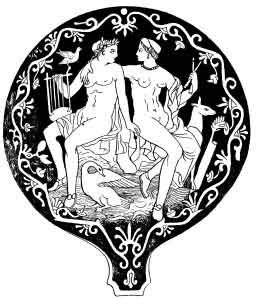

[Intangible Textual Heritage](../../index)  [Neo-Paganism](../index) 

------------------------------------------------------------------------

<table width="75%">
<colgroup>
<col style="width: 50%" />
<col style="width: 50%" />
</colgroup>
<tbody>
<tr class="odd">
<td width="50%"></td>
<td width="50%"><h1 id="etruscan-roman-remains-in-popular-tradition" data-align="CENTER">Etruscan Roman Remains in Popular Tradition</h1>
<h2 id="by-charles-godfrey-leland" data-align="CENTER">by Charles Godfrey Leland</h2>
<h4 id="section" data-align="CENTER">[1892]</h4></td>
</tr>
</tbody>
</table>

------------------------------------------------------------------------

[Contents](#contents)  [Start Reading](err00)

------------------------------------------------------------------------

Charles Godfrey Leland, who also wrote [Aradia, Gospel of the
Witches](../aradia/index), was a 19th century journalist, author and
folklorist, specializing in Native American, Gypsy and Italian
traditions. This book is a classic study of the folklore of the Tuscan
region of Italy (to the northwest of Rome, around Florence). It ties
these traditions to ancient Etruscan and Roman pagan practices. The
central focus is the ideology and practice of *Stregheria*, Italian
traditional witchcraft.

This is essentially an ethnography of what neopagans term a 'family
tradition': that is, practical magic--but with an Italian flavor. We
meet the Goddess of Truffles, learn the details of divining by oil, fire
and molten lead; how to bring back the dead, and coerce nature spirits
into performing favors. Leland carefully documents his field notes, and
includes the full text of numerous spells and songs in Italian,
particularly the Tuscan dialect. The text includes many fairy-tales of
the sort that are not suitable for children. Leland draws on often
obscure sources which tie his data into classical and pre-classical
pagan traditions, particularly the little-known Etruscan religion.

But--as the saying goes--wait, there's more. Leland takes numerous
witty, but somewhat bipolar, tangents. He is both a rationalist and a
romantic; one moment he is off on an anti-clerical rant, the next he is
revealing that he was initiated into witchcraft at an early age by a
Pennsylvania Dutch nanny. He patronizes his informants with a wink and a
nudge to the reader; then rhapsodizes over the innate spiritual
qualities of the natural world in language that would make a neo-druid
blush.

In short, Leland was obviously not the detached observer which modern
social science demands. This has not helped acceptance of his books by
academics, and even some neopagans are deeply suspicious of his work.
However, he makes it clear that he isn't writing for a rigorous academic
audience, but for posterity. As a progressive Victorian, Leland believed
that modernism would soon overwhelm and extinguish these traditions. The
antiquarian in him worked to bring them to light.

Although difficult reading at points, this book will reward anyone
seeking details about the actual practice of a folk magic, which despite
Lelands' prediction of its impending demise, persists to this day.

--J.B. Hare 7/16/2002

------------------------------------------------------------------------

[Title Page](err00)  
[Contents](err01)  
[List of Illustrations](err02)  
[Introduction](err03)  
[Part One: Chapter I--TINIA](err04)  
[Part One: Chapter II--MASO](err05)  
[Part One: Chapter III--FERONIA](err06)  
[Part One: Chapter IV--FAFLON](err07)  
[Part One: Chapter V--LARES, LASA, AND LASSI](err08)  
[Part One: Chapter VI--CARRADORA](err09)  
[Part One: Chapter VII--TITUNO](err10)  
[Part One: Chapter VIII--FLORIA](err11)  
[Part One: Chapter IX--IL SPIRITO DEL SCALDINO](err12)  
[Part One: Chapter X--CUPRA](err13)  
[Part Two: Chapter I--LA STALLA DI MAIALE](err14)  
[Part Two: Chapter II--BIRDS AND TREASURES](err15)  
[Part Two: Chapter III--THE EXORCISM OF DEATH](err16)  
[Part Two: Chapter IV--EVIL INCANTATIONS](err17)  
[Part Two: Chapter V--THE AMETHYST](err18)  
