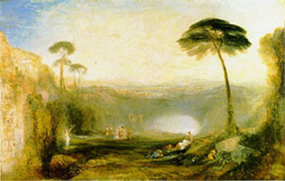

[Intangible Textual Heritage](../../index)  [Neopaganism](../index) 

------------------------------------------------------------------------

<table>
<colgroup>
<col style="width: 50%" />
<col style="width: 50%" />
</colgroup>
<tbody>
<tr class="odd">
<td></td>
<td><h1 id="the-golden-bough">The Golden Bough</h1>
<h2 id="by-sir-james-george-frazer">by Sir James George Frazer</h2>
<h3 id="section">[1922]</h3></td>
</tr>
</tbody>
</table>

*Image: (J.M.W. Turner) Aeneas and the Sybil have
just presented the Golden Bough, which allows entry to the Elysian
Fields, to the gatekeeper.*

[Chapter 1. The King of the Wood. Section 1. Diana and
Virbius.](gb00101)  
[Chapter 1. The King of the Wood. Section 2. Artemis and
Hippolytus.](gb00102)  
[Chapter 1. The King of the Wood. Section 3. Recapitulation.](gb00103)  
[Chapter 2. Priestly Kings.](gb00200)  
[Chapter 3. Sympathetic Magic. Section 1. The Principles of
Magic.](gb00301)  
[Chapter 3. Sympathetic Magic. Section 2. Homoeopathic or Imitative
Magic.](gb00302)  
[Chapter 3. Sympathetic Magic. Section 3. Contagious Magic.](gb00303)  
[Chapter 3. Sympathetic Magic. Section 4. The Magician's
Progress.](gb00304)  
[Chapter 4. Magic and Religion.](gb00400)  
[Chapter 5. The Magical Control of the Weather. Section 1. The Public
Magician.](gb00501)  
[Chapter 5. The Magical Control of the Weather. Section 2. The Magical
Control of Rain.](gb00502)  
[Chapter 5. The Magical Control of the Weather. Section 3. The Magical
Control of the Sun.](gb00503)  
[Chapter 5. The Magical Control of the Weather. Section 4. The Magical
Control of the Wind.](gb00504)  
[Chapter 6. Magicians as Kings.](gb00600)  
[Chapter 7. Incarnate Human Gods.](gb00700)  
[Chapter 8. Departmental Kings of Nature.](gb00800)  
[Chapter 9. The Worship of Trees. Section 1. Tree-spirits.](gb00901)  
[Chapter 9. The Worship of Trees. Section 2. Beneficent Powers of
Tree-Spirits.](gb00902)  
[Chapter 10. Relics of Tree Worship in Modern Europe.](gb01000)  
[Chapter 11. The Influence of the Sexes on Vegetation.](gb01100)  
[Chapter 12. The Sacred Marriage. Section 1. Diana as a Goddess of
Fertility.](gb01201)  
[Chapter 12. The Sacred Marriage. Section 2. The Marriage of the
Gods.](gb01202)  
[Chapter 13. The Kings of Rome and Alba. Section 1. Numa and
Egeria.](gb01301)  
[Chapter 13. The Kings of Rome and Alba. Section 2. The King as
Jupiter.](gb01302)  
[Chapter 14. The Succession to the Kingdom in Ancient
Latium.](gb01400)  
[Chapter 15. The Worship of the Oak.](gb01500)  
[Chapter 16. Dianus and Diana.](gb01600)  
[Chapter 17. The Burden of Royalty. Section 1. Royal and Priestly
Taboos.](gb01701)  
[Chapter 17. The Burden of Royalty. Section 2. Divorce of the Spiritual
from the Temporal Power.](gb01702)  
[Chapter 18. The Perils of the Soul. Section 1. The Soul as a
Mannikin.](gb01801)  
[Chapter 18. The Perils of the Soul. Section 2. Absence and Recall of
the Soul.](gb01802)  
[Chapter 18. The Perils of the Soul. Section 3. The Soul as a Shadow and
a Reflection.](gb01803)  
[Chapter 19. Tabooed Acts. Section 1. Taboos on Intercourse with
Strangers.](gb01901)  
[Chapter 19. Tabooed Acts. Section 2. Taboos on Eating and
Drinking.](gb01902)  
[Chapter 19. Tabooed Acts. Section 3. Taboos on Showing the
Face.](gb01903)  
[Chapter 19. Tabooed Acts. Section 4. Taboos on Quitting the
House.](gb01904)  
[Chapter 19. Tabooed Acts. Section 5. Taboos on Leaving Food
over.](gb01905)  
[Chapter 20. Tabooed Persons. Section 1. Chiefs and Kings
tabooed.](gb02001)  
[Chapter 20. Tabooed Persons. Section 2. Mourners tabooed.](gb02002)  
[Chapter 20. Tabooed Persons. Section 3. Women tabooed at Menstruation
and Childbirth.](gb02003)  
[Chapter 20. Tabooed Persons. Section 4. Warriors tabooed.](gb02004)  
[Chapter 20. Tabooed Persons. Section 5. Manslayers tabooed.](gb02005)  
[Chapter 20. Tabooed Persons. Section 6. Hunters and Fishers
tabooed.](gb02006)  
[Chapter 21. Tabooed Things. Section 1. The Meaning of
Taboo.](gb02101)  
[Chapter 21. Tabooed Things. Section 2. Iron tabooed.](gb02102)  
[Chapter 21. Tabooed Things. Section 3. Sharp Weapons
tabooed.](gb02103)  
[Chapter 21. Tabooed Things. Section 4. Blood tabooed.](gb02104)  
[Chapter 21. Tabooed Things. Section 5. The Head tabooed.](gb02105)  
[Chapter 21. Tabooed Things. Section 6. Hair tabooed.](gb02106)  
[Chapter 21. Tabooed Things. Section 7. Ceremonies at
Hair-cutting.](gb02107)  
[Chapter 21. Tabooed Things. Section 8. Disposal of Cut Hair and
Nails.](gb02108)  
[Chapter 21. Tabooed Things. Section 9. Spittle tabooed.](gb02109)  
[Chapter 21. Tabooed Things. Section 10. Foods tabooed.](gb02110)  
[Chapter 21. Tabooed Things. Section 11. Knots and Rings
tabooed.](gb02111)  
[Chapter 22. Tabooed Words. Section 1. Personal Names
tabooed.](gb02201)  
[Chapter 22. Tabooed Words. Section 2. Names of Relations
tabooed.](gb02202)  
[Chapter 22. Tabooed Words. Section 3. Names of the Dead
tabooed.](gb02203)  
[Chapter 22. Tabooed Words. Section 4. Names of Kings and other Sacred
Persons tabooed.](gb02204)  
[Chapter 22. Tabooed Words. Section 5. Names of Gods
tabooed.](gb02205)  
[Chapter 23. Our Debt to the Savage.](gb02300)  
[Chapter 24. The Killing of the Divine King. Section 1. The Mortality of
the Gods.](gb02401)  
[Chapter 24. The Killing of the Divine King. Section 2. Kings killed
when their Strength fails.](gb02402)  
[Chapter 24. The Killing of the Divine King. Section 3. Kings killed at
the End of a Fixed Term.](gb02403)  
[Chapter 25. Temporary Kings.](gb02500)  
[Chapter 26. Sacrifice of the King's Son.](gb02600)  
[Chapter 27. Succession to the Soul.](gb02700)  
[Chapter 28. The Killing of the Tree-Spirit. Section 1. The Whitsuntide
Mummers.](gb02801)  
[Chapter 28. The Killing of the Tree-Spirit. Section 2. Burying the
Carnival.](gb02802)  
[Chapter 28. The Killing of the Tree-Spirit. Section 3. Carrying out
Death.](gb02803)  
[Chapter 28. The Killing of the Tree-Spirit. Section 4. Bringing in
Summer.](gb02804)  
[Chapter 28. The Killing of the Tree-Spirit. Section 5. Battle of Summer
and Winter.](gb02805)  
[Chapter 28. The Killing of the Tree-Spirit. Section 6. Death and
Resurrection of Kostrubonko.](gb02806)  
[Chapter 28. The Killing of the Tree-Spirit. Section 7. Death and
Revival of Vegetation.](gb02807)  
[Chapter 28. The Killing of the Tree-Spirit. Section 8. Analogous Rites
in India.](gb02808)  
[Chapter 28. The Killing of the Tree-Spirit. Section 9. The Magic
Spring.](gb02809)  
[Chapter 29. The Myth of Adonis.](gb02900)  
[Chapter 30. Adonis in Syria.](gb03000)  
[Chapter 31. Adonis in Cyprus.](gb03100)  
[Chapter 32. The Ritual of Adonis.](gb03200)  
[Chapter 33. The Gardens of Adonis.](gb03300)  
[Chapter 34. The Myth and Ritual of Attis.](gb03400)  
[Chapter 35. Attis as a God of Vegetation.](gb03500)  
[Chapter 36. Human Representatives of Attis.](gb03600)  
[Chapter 37. Oriental Religions in the West.](gb03700)  
[Chapter 38. The Myth of Osiris.](gb03800)  
[Chapter 39. The Ritual of Osiris. Section 1. The Popular
Rites.](gb03901)  
[Chapter 39. The Ritual of Osiris. Section 2. The Official
Rites.](gb03902)  
[Chapter 40. The Nature of Osiris. Section 1. Osiris a
Corn-god.](gb04001)  
[Chapter 40. The Nature of Osiris. Section 2. Osiris a
Tree-spirit.](gb04002)  
[Chapter 40. The Nature of Osiris. Section 3. Osiris a God of
Fertility.](gb04003)  
[Chapter 40. The Nature of Osiris. Section 4. Osiris a God of the
Dead.](gb04004)  
[Chapter 41. Isis.](gb04100)  
[Chapter 42. Osiris and the Sun.](gb04200)  
[Chapter 43. Dionysus.](gb04300)  
[Chapter 44. Demeter and Persephone.](gb04400)  
[Chapter 45. The Corn-Mother and the Corn-Maiden in Northern
Europe.](gb04500)  
[Chapter 46. The Corn-Mother in Many Lands. Section 1. The Corn-mother
in America.](gb04601)  
[Chapter 46. The Corn-Mother in Many Lands. Section 2. The Rice-mother
in the East Indies.](gb04602)  
[Chapter 46. The Corn-Mother in Many Lands. Section 3. The Spirit of the
Corn embodied in Human Beings.](gb04603)  
[Chapter 46. The Corn-Mother in Many Lands. Section 4. The Double
Personification of the Corn as Mother and Daughter.](gb04604)  
[Chapter 47. Lityerses. Section 1. Songs of the Corn
Reapers.](gb04701)  
[Chapter 47. Lityerses. Section 2. Killing the Corn-spirit.](gb04702)  
[Chapter 47. Lityerses. Section 3. Human Sacrifices for the
Crops.](gb04703)  
[Chapter 47. Lityerses. Section 4. The Corn-spirit slain in his Human
Representatives.](gb04704)  
[Chapter 48. The Corn-Spirit as an Animal. Section 1. Animal Embodiments
of the Corn-spirit.](gb04801)  
[Chapter 48. The Corn-Spirit as an Animal. Section 2. The Corn-spirit as
a Wolf or a Dog.](gb04802)  
[Chapter 48. The Corn-Spirit as an Animal. Section 3. The Corn-spirit as
a Cock.](gb04803)  
[Chapter 48. The Corn-Spirit as an Animal. Section 4. The Corn-spirit as
a Hare.](gb04804)  
[Chapter 48. The Corn-Spirit as an Animal. Section 5. The Corn-spirit as
a Cat.](gb04805)  
[Chapter 48. The Corn-Spirit as an Animal. Section 6. The Corn-spirit as
a Goat.](gb04806)  
[Chapter 48. The Corn-Spirit as an Animal. Section 7. The Corn-spirit as
a Bull, Cow, or Ox.](gb04807)  
[Chapter 48. The Corn-Spirit as an Animal. Section 8. The Corn-spirit as
a Horse or Mare.](gb04808)  
[Chapter 48. The Corn-Spirit as an Animal. Section 9. The Corn-spirit as
a Pig (Boar or Sow).](gb04809)  
[Chapter 48. The Corn-Spirit as an Animal. Section 10. On the Animal
Embodiments of the Corn-spirit.](gb04810)  
[Chapter 49. Ancient Deities of Vegetation as Animals. Section 1.
Dionysus, the Goat and the Bull.](gb04901)  
[Chapter 49. Ancient Deities of Vegetation as Animals. Section 2.
Demeter, the Pig and the Horse.](gb04902)  
[Chapter 49. Ancient Deities of Vegetation as Animals. Section 3. Attis,
Adonis, and the Pig.](gb04903)  
[Chapter 49. Ancient Deities of Vegetation as Animals. Section 4.
Osiris, the Pig and the Bull.](gb04904)  
[Chapter 49. Ancient Deities of Vegetation as Animals. Section 5.
Virbius and the Horse.](gb04905)  
[Chapter 50. Eating the God. Section 1. The Sacrament of
First-Fruits.](gb05001)  
[Chapter 50. Eating the God. Section 2. Eating the God among the
Aztecs.](gb05002)  
[Chapter 50. Eating the God. Section 3. Many Manii at
Aricia.](gb05003)  
[Chapter 51. Homeopathic Magic of a Flesh Diet.](gb05100)  
[Chapter 52. Killing the Divine Animal. Section 1. Killing the Sacred
Buzzard.](gb05201)  
[Chapter 52. Killing the Divine Animal. Section 2. Killing the Sacred
Ram.](gb05202)  
[Chapter 52. Killing the Divine Animal. Section 3. Killing the Sacred
Serpent.](gb05203)  
[Chapter 52. Killing the Divine Animal. Section 4. Killing the Sacred
Turtles.](gb05204)  
[Chapter 52. Killing the Divine Animal. Section 5. Killing the Sacred
Bear.](gb05205)  
[Chapter 53. The Propitiation of Wild Animals By Hunters.](gb05300)  
[Chapter 54. Types of Animal Sacrament. Section 1. The Egyptian and the
Aino Types of Sacrament.](gb05401)  
[Chapter 54. Types of Animal Sacrament. Section 2. Processions with
Sacred Animals.](gb05402)  
[Chapter 55. The Transference of Evil. Section 1. The Transference to
Inanimate Objects.](gb05501)  
[Chapter 55. The Transference of Evil. Section 2. The Transference to
Animals.](gb05502)  
[Chapter 55. The Transference of Evil. Section 3. The Transference to
Men.](gb05503)  
[Chapter 55. The Transference of Evil. Section 4. The Transference of
Evil in Europe.](gb05504)  
[Chapter 56. The Public Expulsion of Evils. Section 1. The Omnipresence
of Demons.](gb05601)  
[Chapter 56. The Public Expulsion of Evils. Section 2. The Occasional
Expulsion of Evils.](gb05602)  
[Chapter 56. The Public Expulsion of Evils. Section 3. The Periodic
Expulsion of Evils.](gb05603)  
[Chapter 57. Public Scapegoats. Section 1. The Expulsion of Embodied
Evils.](gb05701)  
[Chapter 57. Public Scapegoats. Section 2. The Occasional Expulsion of
Evils in a Material Vehicle.](gb05702)  
[Chapter 57. Public Scapegoats. Section 3. The Periodic Expulsion of
Evils in a Material Vehicle.](gb05703)  
[Chapter 57. Public Scapegoats. Section 4. On Scapegoats in
General.](gb05704)  
[Chapter 58. Human Scapegoats in Classical Antiquity. Section 1. The
Human Scapegoat in Ancient Rome.](gb05801)  
[Chapter 58. Human Scapegoats in Classical Antiquity. Section 2. The
Human Scapegoat in Ancient Greece.](gb05802)  
[Chapter 58. Human Scapegoats in Classical Antiquity. Section 3. The
Roman Saturnalia.](gb05803)  
[Chapter 59. Killing the God in Mexico.](gb05900)  
[Chapter 60. Between Heaven and Earth. Section 1. Not to touch the
Earth.](gb06001)  
[Chapter 60. Between Heaven and Earth. Section 2. Not to see the
Sun.](gb06002)  
[Chapter 60. Between Heaven and Earth. Section 3. The Seclusion of Girls
at Puberty.](gb06003)  
[Chapter 60. Between Heaven and Earth. Section 4. Reasons for the
Seclusion of Girls at Puberty.](gb06004)  
[Chapter 61. The Myth of Balder.](gb06100)  
[Chapter 62. The Fire-Festivals of Europe. Section 1. The Fire-festivals
in general.](gb06201)  
[Chapter 62. The Fire-Festivals of Europe. Section 2. The Lenten
Fires.](gb06202)  
[Chapter 62. The Fire-Festivals of Europe. Section 3. The Easter
Fires.](gb06203)  
[Chapter 62. The Fire-Festivals of Europe. Section 4. The Beltane
Fires.](gb06204)  
[Chapter 62. The Fire-Festivals of Europe. Section 5. The Midsummer
Fires.](gb06205)  
[Chapter 62. The Fire-Festivals of Europe. Section 6. The Hallowe'en
Fires.](gb06206)  
[Chapter 62. The Fire-Festivals of Europe. Section 7. The Midwinter
Fires.](gb06207)  
[Chapter 62. The Fire-Festivals of Europe. Section 8. The
Need-fire.](gb06208)  
[Chapter 63. The Interpretation of the Fire-Festivals. Section 1. On the
Fire-festivals in general.](gb06301)  
[Chapter 63. The Interpretation of the Fire-Festivals. Section 2. The
Solar Theory of the Fire-festivals.](gb06302)  
[Chapter 63. The Interpretation of the Fire-Festivals. Section 3. The
Purificatory Theory of the Fire-festivals.](gb06303)  
[Chapter 64. The Burning of Human Beings in the Fires. Section 1. The
Burning of Effigies in the Fires.](gb06401)  
[Chapter 64. The Burning of Human Beings in the Fires. Section 2. The
Burning of Men and Animals in the Fires.](gb06402)  
[Chapter 65. Balder and the Mistletoe.](gb06500)  
[Chapter 66. The External Soul in Folk-Tales.](gb06600)  
[Chapter 67. The External Soul in Folk-Custom. Section 1. The External
Soul in Inanimate Things.](gb06701)  
[Chapter 67. The External Soul in Folk-Custom. Section 2. The External
Soul in Plants.](gb06702)  
[Chapter 67. The External Soul in Folk-Custom. Section 3. The External
Soul in Animals.](gb06703)  
[Chapter 67. The External Soul in Folk-Custom. Section 4. The Ritual of
Death and Resurrection.](gb06704)  
[Chapter 68. The Golden Bough.](gb06800)  
[Chapter 69. Farewell to Nemi.](gb06900)  
