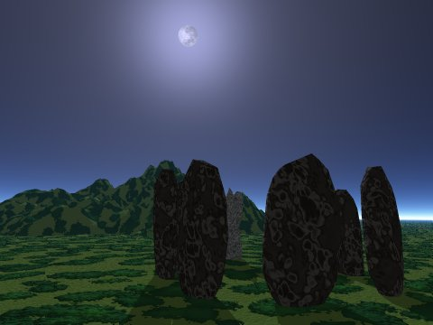

  
[Intangible Textual Heritage](../../index)  [Neopaganism](../index) 

------------------------------------------------------------------------

<table width="75%">
<colgroup>
<col style="width: 50%" />
<col style="width: 50%" />
</colgroup>
<tbody>
<tr class="odd">
<td></td>
<td><h3 id="the-gardnerian-book-of-shadows" data-align="CENTER">The Gardnerian Book of Shadows</h3></td>
</tr>
</tbody>
</table>

[Contents](#contents)    [Start Reading](gbos00)

------------------------------------------------------------------------

This is the text of the Gardnerian Book of Shadows. In one sense, this
is the central sacred text of the Wicca religion. However, it is
important to point out that there is no 'official' Book of Shadows.
Typically each coven has a hand-written copy of *a* Book of Shadows,
sometimes in cypher or code, which reflects its own practices and
knowledge. This particular text is derived from a file posted on the
Internet in the early 90s, and quotes previously published material
which was known to be in use by Gardner and his group.

The Book of Shadows was attributed by Gardner to an ancient, clandestine
witch cult, which he claimed to have been initiated into. However,
modern researchers have concluded that it was composed by Gardner. The
text shows influences from English and Celtic Folk-lore, the Enochian
system of John Dee, Thelema, the Golden Dawn, Stregaria, Tantric Yoga,
the KJV Bible and even Kipling. This version organizes the material in
chronological order and has estimated dates for each section, ranging
from 1949 to 1961.

The copyright status of this text can best be described as 'orphaned.'
This version was compiled by Aidan A. Kelly. It was originally posted on
the Internet in the mid-90s as part of the [Internet Book of
Shadows](../../bos/index) material. Text in square brackets is Kelly's
commentary.

------------------------------------------------------------------------

[Casting the Circle](gbos00)  
[Drawing Down the Moon](gbos01)  
[The Charge](gbos02)  
[Initiation: First Degree](gbos03)  
[Initiation: Second Degree](gbos04)  
[Initiation: Third Degree](gbos05)  
[Cakes and Wine](gbos06)  
[The Sabbat Rituals: November Eve](gbos07)  
[The Sabbat Rituals: February Eve](gbos08)  
[The Sabbat Rituals: May Eve](gbos09)  
[The Sabbat Rituals: August Eve](gbos10)  
[On Chants](gbos11)  
[To Help the Sick](gbos12)  
[The Scourge and the Kiss](gbos13)  
[The Priestess and the Sword](gbos14)  
[The Warning](gbos15)  
[Of the Ordeal of the Art Magical](gbos16)  
[The Eightfold Way](gbos17)  
[To Gain the Sight](gbos18)  
[Power](gbos19)  
[Properly Prepared](gbos20)  
[The Meeting Dance](gbos21)  
[To Leave the Body](gbos22)  
[The Working Tools](gbos23)  
[Skyclad](gbos24)  
[A Revision of the Casting Procedure](gbos25)  
[The Prose Charge](gbos26)  
[Cakes and Wine](gbos27)  
[The Sabbat Rituals: Spring Equinox](gbos28)  
[The Sabbat Rituals: Summer Solstice](gbos29)  
[The Sabbat Rituals: Autumn Equinox](gbos30)  
[The Sabbat Rituals: Winter Solstice](gbos31)  
[The Eightfold Path or Ways](gbos32)  
[The First-Degree Initiation](gbos33)  
[The Second-Degree Initiation](gbos34)  
[The Third-Degree Initiation](gbos35)  
[The Witches' Chant or Rune](gbos36)  
[Consecrating Tools](gbos37)  
[The Old Laws](gbos38)  
[The Verse Charge](gbos39)  
[Casting and Charging](gbos40)  
[Forming the Circle](gbos41)  
