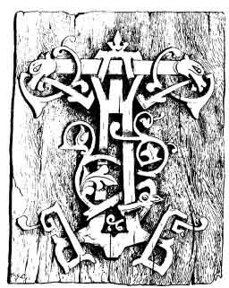

  
[Intangible Textual Heritage](../../index)  [Neo-Paganism](../index) 
[Roma](../../neu/roma/index)  [Index](index)  [Previous](gsft01) 
[Next](gsft03) 

------------------------------------------------------------------------

[Buy this Book at
Amazon.com](https://www.amazon.com/exec/obidos/ASIN/B002DUCMSI/internetsacredte)

------------------------------------------------------------------------

  
*Gypsy Sorcery and Fortune Telling*, by Charles Godfrey Leland,
\[1891\], at Intangible Textual Heritage

------------------------------------------------------------------------

p. v

# PREFACE

  THIS work contains a
collection of the customs, usages, and ceremonies current among gypsies,
as regards fortune-telling, witch-doctoring, love-philtering, and other
sorcery, illustrated by many anecdotes and instances, taken either from
works as yet very little known to the English reader or from personal
experiences. Within a very few years, since Ethnology and Archæology
have received a great inspiration, and much enlarged their scope through
Folk-lore, everything relating to such subjects is studied with far
greater interest and to much greater profit than was the case when they
were cultivated in a languid, half-believing, half-sceptical spirit
which was in reality rather one of mere romance than reason. Now that we
seek with resolution to find the whole truth, be it based on
materialism, spiritualism, or their identity, we are amazed to find that
the realm of marvel and mystery, of wonder and poetry, connected with
what we vaguely call "magic," far from being explained away or exploded,
enlarges

p. vi

before us as we proceed, and that not into a mere cloudland, gorgeous
land, but into a country of reality in which men of science who would
once have disdained the mere thought thereof are beginning to stray.
Hypnotism has really revealed far greater wonders than were ever
established by the *fascinatores* of old or by mesmerists of more modern
times. Memory, the basis of thought according to PLATO, which was once
held to be a determined quantity, has been proved, (the word is not too
bold), by recent physiology, to be practically infinite, and its perfect
development to be identical with that of intellect, so that we now see
plainly before us the power to perform much which was once regarded as
miraculous. Not less evident is it that men of science or practical
inventors, such as DARWIN, WALLACE, HUXLEY, TYNDALE, GALTON, JOULE,
LOCKYER, and EDISON, have been or are all working in common with
theosophists, spiritualists, Folk-lorists, and many more, not diversely
but all towards a grand solution of the Unknown.

Therefore there is nothing whatever in the past relating to the
influences which have swayed man, however strange, eccentric,
superstitious, or even repulsive they may seem, which is not of great
and constantly increasing value. And if we of the present time begin
already to see this, how much more important will these facts be to the
men of the future, who, by virtue of more widely extended knowledge and
comparison, will be better able than we are to draw wise conclusions
undreamed of now. But the chief conclusion for us is to collect as much
as we can, while it is yet extant, of all the strange lore of the olden
time, instead of wasting time in forming idle theories about it.

In a paper read before the *Congrès des Traditions populaires* in Paris,
1889, on the relations of gypsies to Folk-lore, I set forth my belief
that these people have always been the humble priests of what is really
the practical religion of all peasants and poor people; that is their
magical ceremonies and medicine. Very few have any conception of the
degree to which gypsies have been the colporteurs of what in Italy is
called "the old faith," or witchcraft.

p. vii

As regards the illustrative matter given, I am much indebted to DR.
WLISLOCKI, who has probably had far more intimate personal experience of
gypsies than any other learned man who ever lived, through our mutual
friend, Dr. ANTHON HERRMANN, editor of the *Ethnologische Mitteilungen*,
Budapest, who is also himself an accomplished Romany scholar and
collector, and who has kindly taken a warm interest in this book, and
greatly aided it. To these I may add Dr. FRIEDRICH S. KRAUSS, of Vienna,
whose various works on the superstitions and Folk-lore of the South
Slavonians—kindly presented by him to me—contain a vast mine of
material, nearly all that of which he treats being common property
between peasants and the Romany, as other sources abundantly indicate.
With this there is also much which I collected personally among gypsies
and fortune-tellers, and similar characters, it being true as regards
this work and its main object, that there is much cognate or allied
information which is quite as valuable as gypsy-lore itself, as all such
subjects mutually explain one of the others.

Gypsies, as I have said, have done more than any race or class on the
face of the earth to disseminate among the multitude a belief in
fortune-telling, magical or sympathetic cures, amulets and such small
sorceries as now find a place in Folk-lore. Their women have all
pretended to possess occult power since prehistoric times. By the
exercise of their wits they have actually acquired a certain art of
reading character or even thought, which, however it be allied to
deceit, is in a way true in itself, and well worth careful examination.
MATTHEW ARNOLD has dwelt on it with rare skill in his poem of "The Gypsy
Scholar." Even deceit and imposture never held its own as a system for
ages without some ground-work of truth, and that which upheld the
structure of gypsy sorcery has never been very carefully examined. I
trust that I have done this in a rational and philosophic spirit, and
have also illustrated my remarks in a manner which will prove attractive
to the general reader.

There are many good reasons for believing that the greatest portion of
gypsy magic was brought by the Romany from the East or India. This is
specially true as regards those now dwelling in Eastern Europe.

p. viii

\[paragraph continues\] And it is
certainly interesting to observe that among these people there is still
extant, on a very extended scale indeed, a Shamanism which seems to have
come from the same Tartar-Altaic source which was found of yore among
the Accadian-Babylonians, Etruscan races, and Indian hill-tribes. This,
the religion of the drum and the demon as a disease-or devil
doctoring-will be found fully illustrated in many curious ways in these
pages. I believe that in describing it I have also shown how many
fragments of this primitive religion, or cult, still exist, under very
different names, in the most enlightened centres of civilization. And I
respectfully submit to my reader, or critic, that I have in no instance,
either in this or any other case, wandered from my real subject, and
that the entire work forms a carefully considered and consistent whole.
To perfect my title, I should perhaps have added a line or two to the
effect that I have illustrated many of the gypsy sorceries by instances
of Folk-lore drawn from other sources; but I believe that it is nowhere
inappropriate, considering the subject as a whole. For those who would
lay stress on *omissions* in my book, I would say that I have never
intended or pretended to *exhaust* gypsy superstitions. I have not even
given all that may be found in the works Of WLISLOCKI alone. I have,
according to the limits of the book, cited so much as to fully
illustrate the main subject already described, and this will be of more
interest to the student of history than the details of gypsy chiromancy
or more spells and charms than are necessary to explain the leading
ideas.

What is wanted in the present state of Folk-lore, I here repeat, is
collection from original sources, and material, that is from people and
not merely from books. The critics we have—like the poor—always with us,
and a century hence we shall doubtless have far better ones than those
in whom we now rejoice—or sorrow. But material abides no time, and an
immense quantity of it which is world-old perishes every day. For with
general culture and intelligence we are killing all kinds of old faiths,
with wonderful celerity. The time is near at hand when it will all be
incredibly valuable, and then men will wish

p. ix

sorrowfully enough that there had been more collectors to accumulate and
fewer critics to detract from their labours and to discourage them, For
the collector must form his theory, or system great or small, good or
bad, such as it is, in order to gather his facts; and then the theory is
shattered by the critic and the collection made to appear ridiculous.
And so collection ends.

There is another very curious reflection which has been ever present to
my mind while writing this work, and which the reader will do well
carefully to think out for himself. It is that the very first efforts of
the human mind towards the supernatural were gloomy, strange, and wild;
they were of witchcraft and sorcery, dead bodies, defilement, deviltry,
and dirt. Men soon came to believe in the virtue of the repetition of
certain rhymes or spells in connection with dead men's bones, hands, and
other horrors or "relics." To this day this old religion exists exactly
as it did of yore, wherever men are ignorant, stupid, criminal, or
corresponding to their prehistoric ancestors. I myself have seen a dead
man's hand for sale in Venice. According to DR. BLOCK, says a writer in
*The St. James's Gazette*, January 16, 1889, the corpse-candle
superstition is still firmly enshrined among the tenets of thieves all
over Europe. In reality, according to *The Standard*, we know little
about the strange thoughts which agitate the minds of the criminal
classes. Their creeds are legends. Most of them are the children and
grandchildren of thieves who have been brought up from their youth in
the densest ignorance, and who, constantly at war with society, seek the
aid of those powers of darkness in the dread efficacy of which they have
an unshaken confidence.

"Fetishism of the rudest type, or what the mythologists have learned to
call 'animism' is part and parcel of the robber's creed. A 'habit and
repute' thief has always in his pocket, or somewhere about his person, a
bit of coal, or chalk, or a 'lucky stone,' or an amulet of some sort on
which he relies for safety in his hour of peril. Omens he firmly trusts
in. Divination is regularly practised by him, as the occasional quarrels
over the Bible and key, and the sieve and shears, testify. The supposed
power of witches and wizards make many of them live in terror, and pay
blackmail, and although they will lie almost without a motive, the
ingenuity with which the most depraved criminal will try to evade
'kissing the book,' performing this rite with his thumb instead, is a
curious instance of what

p. x

may be termed perverted religious instincts. As for the fear of the evil
eye, it is affirmed that most of the foreign thieves of London dread
more being brought before a particular magistrate who has the reputation
of being endowed with that fatal gift than of being summarily sentenced
by any other whose judicial glare is less severe."

This is all true, but it tells only a small part of the truth. Not only
is Fetish or Shamanism the real religion of criminals, but of vast
numbers who are not suspected of it. There is not a town in England or
in Europe in which witchcraft (its beginning) is not extensively
practised, although this is done with a secrecy the success of which is
of itself almost a miracle. We may erect churches and print books, but
wherever the prehistoric man exists—and he is still to be found
everywhere by millions—he will cling to the old witchcraft of his remote
ancestors. Until you change his very nature, the only form in which he
can realize supernaturalism will be by means of superstition, and the
grossest superstion at that. Research and reflection have taught me that
this sorcery is far more widely and deeply extended than any cultivated
person dreams—instead of yielding to the progress of culture it seems to
actually advance with it. Count ANGELO DE GUBERNATIS once remarked to
one of the most distinguished English statesmen that there was in the
country in Tuscany ten times as much heathenism as Christianity. The
same remark was made to me by a fortune-teller in Florence. She
explained what she meant. It was the *vecchia religione*—"the old
religion"—not Christianity, but the dark and strange sorceries of the
*stregha*, or witch, the compounding of magical medicine over which
spells are muttered, the making love-philters, the cursing enemies, the
removing the influence of other witches, and the manufacture of amulets
in a manner prohibited by the Church.

It would seem as if, by some strange process, while advanced scientists
are occupied in eliminating magic from religion, the coarser mind is
actually busy in reducing it to religion alone. It has been educated
sufficiently to perceive an analogy between dead man's hands and
"relics" as working miracles, and as sorcery is more entertaining than
religion, and has, moreover, the charm of secrecy, the prehistoric man,
who is still

p. xi

with us, prefers the former. Because certain *forms* of this sorcery are
no longer found among the educated classes we think that superstition no
longer exists; but though we no longer burn witches or believe in
fairies, it is a fact that of a kind and fashion proportionate to our
advanced culture, it is, with a very few exceptions, as prevalent as
ever. Very few persons indeed have ever given this subject the attention
which it merits, for it is simply idle to speculate on the possibility
of cultivating or sympathizing with the lowest orders without really
understanding it in *all* its *higher* forms. And I venture to say that,
as regards a literal and truthful knowledge of its forms and practices,
this work will prove to be a contribution to the subject not without
value.

I have, in fact, done my best to set forth in it a very singular truth
which is of great importance to every one who takes any real interest in
social science, or the advance of intelligence. It is that while almost
everybody who contributes to general literature, be it books of travel
or articles in journals, has ever and anon something clever to say about
superstition among the lower orders at home or abroad, be it in remote
country places or in the mountains of Italy, with the usual cry of
"Would it be believed—in the nineteenth century?" &c.; it still remains
true that the amount of belief in *magic*—call it by what name we
will—in the world is just as great as ever it was. And here I would
quote with approbation a passage from "The Conditions for the Survival
of Archaic Customs," by G. L. Gomme, in *The Archæological Review* of
January, 1890:—

"If Folk-lore has done nothing else up to this date it has demonstrated
that civilization, under many of its phases, while elevating the
governing class of a nation, and thereby no doubt elevating the nation,
does not always reach the lowest or even the lower strata of the
population. As Sir Arthur Mitchell puts it, 'There is always a going up
of some and a going down of others,' and it is more than probable that
just as the going up of the few is in one certain direction, along
certain well-ascertained lines of improvement or development, so the
going down of the many is in an equally well-ascertained line of
degradation or backwardness The upward march is always towards political
improvement, carrying with it social development; the downward march is
always towards social degradation, carrying with it political
backwardness. It seems difficult indeed to believe that monarchs like
Alfred, Eadward, William, and Edward, could have had within their
Christianized kingdom

p. xii

groups of people whose status was still that of savagery; it seems
difficult to believe that Raleigh and Spenser actually beheld specimens
of the Irish savage; it seems impossible to read Kemble and Green and
Freeman and yet to understand that they are speaking only of the
advanced guard of the English nation, not of the backward races within
the boundary of its island home. The student of archaic custom has,
however, to meet these difficulties, and it seems necessary, therefore,
to try and arrive at some idea as to what the period of savagery in
these islands really means."

Which is a question that very few can answer. There is to be found in
almost every cheap book, or "penny dreadful" and newspaper shop in Great
Britain and America, for sale at a very low price a Book of Fate—or
something equivalent to it, for the name of these works is legion—and
one publisher advertises that he has nearly thirty of them, or at least
such books with different titles. In my copy there are twenty-five pages
of incantations, charms, and spells, every one of them every whit as
"superstitious" as any of the gypsy ceremonies set forth in this volume.
I am convinced, from much inquiry, that next to the Bible and the
Almanac there is no one book which is so much disseminated among the
million as the fortune-teller, in some form or other. [1](#fn_0) That is to say, there are, numerically, many
millions more of believers in such small sorcery now in Great Britain
than there were centuries ago, for, be it remembered, the superstitions
of the masses were always petty ones, like those of the fate-books; it
was only the aristocracy who consulted Cornelius Agrippa, and could
afford *la haute magic*. We may call it by other names, but fry, boil,
roast, powder or perfume it as we will, the old faith in the
supernatural and in occult means of getting at it still exists in one
form or another—the parable or moral of most frequent occurrence in it
being that of the Mote and the Beam, of the real and full meaning of
which I can only reply in the ever-recurring refrain of the Edda:
Understand ye this—or what?

------------------------------------------------------------------------

### Footnotes

[xii:1](gsft02.htm#fr_0) I was once myself made
to contribute, involuntarily, to this kind of literature. Forty years
ago I published a Folk-lore book entitled "The Poetry and Mystery of
Dreams," in which the explanations of dreams, as given by
ASTRAMPSYCHIUS, ARTEMIDORUS, and other ancient oneirologists, were
illustrated by passages from many poets and popular ballads, showing how
widely the ancient symbolism had extended. A few years ago I found that
some ingenious literary hack had taken my work (without credit), and,
omitting what would not be understood by servant girls, had made of it a
common sixpenny dream-book.

------------------------------------------------------------------------

[Next: Chapter I: The Origin of Witchcraft, Shamanism and
Sorcery](gsft03)

