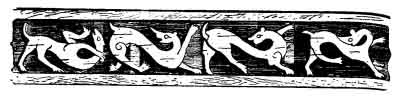
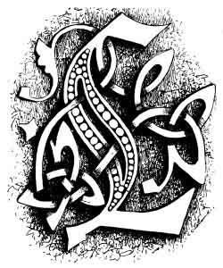
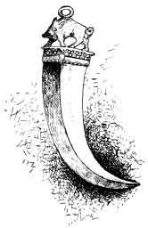

  
[Intangible Textual Heritage](../../index)  [Neo-Paganism](../index.md) 
[Roma](../../neu/roma/index)  [Index](index)  [Previous](gsft07.md) 
[Next](gsft09.md) 

------------------------------------------------------------------------

[Buy this Book at
Amazon.com](https://www.amazon.com/exec/obidos/ASIN/B002DUCMSI/internetsacredte.md)

------------------------------------------------------------------------

  
*Gypsy Sorcery and Fortune Telling*, by Charles Godfrey Leland,
\[1891\], at Intangible Textual Heritage

------------------------------------------------------------------------

p. 100

 

 

 

# CHAPTER VI

OF PREGNANCY AND CHARMS, OR FOLK-LORE CONNECTED WITH IT—BOAR'S TEETH AND
CHARMS FOR PREVENTING THE FLOW OF BLOOD

 LIKE all Orientals the
gypsy desires intensely to have a family. Superstition comes in to
increase the wish, for a barren woman in Eastern Europe is generally
suspected of having had intercourse with a vampire or spirit before her
marriage, and she who has done this, willingly or unconsciously, never
has children. They have recourse to many magic medicines or means to
promote conception; one of the most harmless it, Hungary is to eat grass
from the grave in which a woman with child has been buried. While doing
this the woman repeats:—

"Dui riká hin mire minč,  
Dui yârá hin leskro kor,  
Avnás dûi yek jelo,  
Keren ákána yek jeles."

p. 101

Or else the woman drinks the water in which the husband has cast hot
coals, or, better still, has spit, saying:—

"Káy me yákh som  
Ac tu ángár,  
Káy me brishind som,  
Ac tu pâni!"

"Where I am flame  
Be thou the coals  
Where 1 am rain  
Be thou the water!"

Or at times the husband takes an egg, makes a small hole at each end,
and then blows the yolk and white into the mouth of his wife who
swallows them.

There are innumerable ways and means to ensure pregnancy, some of which
are very dangerous. Faith in the so-called "artificial propagation" is
extensively spread. "Will der zigeuner einen Sohn erzielen, so gürtet er
sich mit dem Halfterzaume eines männlichen Pferdes und ümgekehrt mit dem
einer Stüte, will er eine Tochter erzeugen." ("Gebräuche d. Trans. Zig."
Dr. H. von WLISLOCKI. "Ill. Zeitschrift. Band," 51. No. 16.)

If a gypsy woman in Transylvania wishes to know whether she be with
child, she must stand for nine evenings at a cross-road with an axe or
hammer, which she must wet with her own water, and then bury there.
Should it be dug up on the ninth morning after, and found rusty, it is a
sign that she is "in blessed circumstances."

To bring on the *menses* a gypsy woman must, while roses are in bloom,
wash herself all over with rose-water, and then pour the water over a
rose-bush. Or she takes an egg, pours its contents into a jug, and makes
water on it. If the egg swims the next morning on the surface she is
*enceinte*; if the yolk is separate from the white she will bear a son,
if they are mingled a daughter. In Tuscany women wishing for children go
to a priest, get a blessed apple and pronounce Over it an incantation to
Santa Anna, which was probably addressed in

p. 102

Roman days to Lucina, who was very probably, according to the Romagna
dialect, *lu S'anna*—Santa Anna herself. I have several old Roman spell,
from MARCELLUS, which still exist word for word in Italian, but fitted
to modern usage in this manner like old windows to new houses.

Should a woman eat fish while pregnant the child will be slow in
learning to speak, but if she feed on snails it will be slow in learning
to walk. The proverbs, "Dumb as a fish," and "Slow as a snail," appear
here.

To protect a child against the evil eye it is hung with amulets,
generally with shells (*die eine Aehnlichkeit mit der weiblichen Scham
haben*). And these must be observed on all occasions, and for
everything, ceremonies, of which there are literally hundreds, showing
that gypsies, notwithstanding their supposed freedom from
conventionalisms, are, like all superstitious people, harassed and vexed
to a degree which would seem incredible to educated Europeans, with
observances and rites of the most ridiculous and vexatious nature. The
shells alluded to are, however, of great interest, as they indicate the
transmission of the old belief that symbols typical of generation,
pleasure, and reproductiveness, are repugnant to witchcraft which is
allied to barrenness, destruction, negation, and every kind of pain and
sterility.

Hence a necklace of shells, especially cowries or snail shells, or the
brilliant and pretty *conchiglie* found in such abundance near Venice,
are regarded as protecting animals or children from the evil eye, and
facilitating love, luxury, and productiveness. I have read an article in
which a learned writer rejects with indignation the "prurient idea" that
the cowrie, which gave its name *porcellana* to porcelain, derived it
from *porcella, in sensu obsceno*; *porcella* being a Roman word not
only for pig but for the female organ. But every donkey-boy in Cairo
could have told him that the cowrie is used in strings on asses as on
children because the shell has the likeness which the writer to whom I
refer rejects with indignation. The pig, as is well known, is a common
amulet, the origin thereof being that it is extremely prolific. It has
within a few

p. 103

years been very much revived in silver as a charm for ladies, and may be
found in most shops where ornaments for watch-chains are sold. The
boar's tooth, as I have before mentioned, has been since time immemorial
a charm; I have found them attached to chatelaines and bunches of keys,
specially in Austria, from one to four or five centuries past. They are
found in prehistoric graves. The tusk is properly a male emblem; a pig
is sometimes placed on the base. These are still very commonly made and
sold. I saw one worn by the son of a travelling basket-maker, who spoke
Romany, and I purchased several in Vienna (1888), also in Copenhagen in
1889. In Florence very large boars' tusks are set as brooches, and may
be . found generally in the smaller jewellers' shops and on the Ponte
Vecchio. They are regarded as protective against *malocchio*—a general
term for evil influences—especially for women during pregnancy, and as
securing plenty, *i.e.*, prosperity and increase, be it of worldly
goods, honour, or prosperity. There is in the museum at Budapest a
boar's tusk, mounted or set as an amulet, which is apparently of Celtic
origin, and which certainly belongs to the migration of races, or a very
early period. And it is in this eastern portion of Europe that it is
still most generally worn as a charm.

 

 

BOAR'S TOOTH. VIENNA.

 

In connection with pregnancy and childbirth there is the *profluvium*
excessive flow of blood, or menses or hemorrhages, for which there exist
many charms, not only among gypsies but all races. This includes

p. 104

the stopping any bleeding—an art in which Scott's Lady of Deloraine was
an expert, and which many practised within a century.

"Tom Potts was but a serving man,  
    And yet he was a doctor good,  
He bound a handkerchief on the wound.  
    And with some kind of words he staunched the blood."

What these same kind of words were among old Germans and Romans may be
learned from the following: JACOB GRIMM had long been familiar with a
German magic spell of the eleventh century—*ad stringendum sanguinem*,
or stopping bleeding—but, as he says, "noch nicht zu deuten vermochte,"
could not explain them. They were as follows:—

"Tumbo saz in berke,  
Mit tumbemo kinde in arme,  
Tumb hiez der berc  
Tumb hiez daz kint,  
Der heiligo Tumbo  
Versegne disc wunta."

"Tumbo (*i.e.*, dumm or stupid) sat in the hill  
With a stupid child in arms,  
Dumb (stupid) the hill was called  
Dumb was called the child,  
The holy Tumbo (or dumb).  
Heal (bless) this wound!"

Some years after he found the following among the magic formulas, of
MARCELLUS BURDIGALENSIS:—

"Carmen utile profluvio mulieri:—

"Stupidus in monte ibat,  
Stupidus stupuit,  
Adjuro te matrix  
Ne hoc iracunda suscipias.

"Pari ratione scriptum ligabis."

I.e.: "A song useful for a flow of blood in woman:—

"The stupid man went into the mountain,  
The stupid man was amazed;  
I adjure thee, oh womb,  
Be not angry!

p. 105

"Which shall also be bound as a writing," *i.e.*, according to a
previous direction that it shall be written on virgin parchment, and
bound with a linen cord about the waist of him or of her—*quæ patietur
de qualibet parte corporis sanguinis fluxum*—who suffers anywhere from
flow of blood.

It is possible that the Stupidus and his blessing of women has here some
remotely derived reference to the reverence amounting to worship of
idiots in the East, who are described as being surrounded in some parts
of India by matrons seeking for their touch and benediction, and
soliciting their embraces. This is effected very often in an almost
public manner; that is to say, by a crowd of women closely surrounding
the couple, *i.e.*, the idiot or lunatic and one of their number are
joined, so that passers-by cannot see what is going on. The children
born of these casual matches are not unusually themselves of weak mind,
but are considered all the more holy. This recalls the allusion in the
charm

"Stupid sat in the hill  
With a stupid child in arms."

This obscure myth of the stupid god appears to be very ancient.

"This Tritas is called intelligent. How then does he appear sometimes
stupid? The language itself supplies the explanation. In Sanskrit
*bâlas* means both child and stolid, and the third brother is supposed
to be stolid because, at his first appearance especially, he is a child.
(Tritas is one of the three brothers or gods, *i.e.*, the trinity)."
("Zoological Mythology," by ANGELO DE GUBERNATIS, 1872).

I am indebted to the as yet unpublished collection of Gypsyana made by
Prof. ANTON HERRMANN for the following:—

There is a superstition among our gypsies that if the shadow of a cross
on a grave falls on a woman with child she will have a miscarriage, and
this seems to be peculiarly appropriate to girls who have "anticipated
the privileges of matrimony." The following rhyme seems to describe the
hesitation of a girl who has gone to a cross to produce

p. 106

the result alluded to, but who is withheld by love for her unborn
infant:—

"Cigno trušul pal handako  
Hin ada ušalinako;  
The žiav me pro ušalin,  
Ajt' mange lašavo na kin.

Sar e praytin kad' chasarel,  
Save šilc barvâl marel,  
Pal basavo te prasape,  
Mre čajori mojd kâmâle."

"Cross upon a grave so small  
Here I see thy shadow fall,  
If it fall on me they say  
All my shame will pass away.

As the autumn leaf is blown,  
By the wind to die alone,  
Yet in shame and misery,  
My baby will be clear to me!"

There is a belief allied to this of the power of the dead in graves to
work wonders, to the effect that if any one plucks a rose from a grave,
he or she will soon die. In the following song a gypsy picks a rose from
the grave of the one be loved, hoping that it will cause his death:—

"Cignoro hrobosa  
Hin sukares rosa  
Mange la pchagavas,  
Doi me na kâmavas.

Beš'las piranake,  
Hrobas hin joy mange,  
Pchgavas, choč žanav  
Pal lele avava  
Te me ne brinzinav.  
The me počivinav."

"On her little tomb there grows  
By itself a lovely rose,  
All alone the rose I break,  
And I do it for her sake.

p. 107

I sat by her I held so dear,  
Now her grave and mine are near,  
I break the rose because I know  
That to her I soon must go,  
Grief cannot my spirit stir,  
Since I know I go to her!"

M. Kounavine (contribution by Dr. A. Elysseeff, *Gypsy-Lore Journal*,
July, 1890), gives the following as a Russian gypsy spell against
barrenness:—

"Laki, thou destroyest and dost make everything on earth; thou canst see
nothing old, for death lives in thee, thou givest birth to all upon the
earth for thou thyself art life. By thy might cause me ——— to bear good
fruit, I who am deprived of the joy of motherhood, and barren as a
rock."

According to Dr. Elysseeff, Laki is related to the Indian goddess
Lakshmi, although differing from her in character. Another incantation
of the same nature is as follows:—

"Thou art the mother of every living creature and the distributor of
good thou doest according to thy wisdom in destroying what is useless or
what has lived its destined time; by thy wisdom thou makest the earth to
regenerate all that is new. . . . Thou dost not seek the death of any
one, for thou art the benefactress of mankind."

------------------------------------------------------------------------

[Next: Chapter VII: The Recovery of Stolen Property, Love
Charms](gsft09.md)

