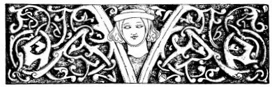
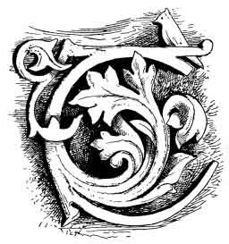
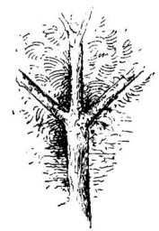

  
[Intangible Textual Heritage](../../index)  [Neo-Paganism](../index.md) 
[Roma](../../neu/roma/index)  [Index](index)  [Previous](gsft11.md) 
[Next](gsft13.md) 

------------------------------------------------------------------------

[Buy this Book at
Amazon.com](https://www.amazon.com/exec/obidos/ASIN/B002DUCMSI/internetsacredte.md)

------------------------------------------------------------------------

  
*Gypsy Sorcery and Fortune Telling*, by Charles Godfrey Leland,
\[1891\], at Intangible Textual Heritage

------------------------------------------------------------------------

p. 152

 

 

 

# CHAPTER X

OF THE HAUNTS, HOMES, AND HABITS OF WITCHES IN THE SOUTH SLAVIC
LANDS—BOGEYS AND HUMBUGS

 THE witches in Slavonian
gypsy-lore have now and then parties which meet to spin, always by full
moonlight on a cross-road. But it is not advisable, says KRAUSS, to pass
by on such occasions, as the least they do to the heedless wayfarer is
to bewitch and sink him into a deep

p. 153

sleep. But they are particularly fond of assembling socially in the tops
of trees, especially of the ash, walnut, and linden or lime kinds,
preferring those whose branches grow in the manner here depicted.

 

 

 

It is but a few days ago, as I write, that I observed all along the
route from Padua to Florence thousands of trees supporting vines, which
trees had been trained to take this form, the farmers being as much
influenced by "luck" in so doing as utility; for it is not really
essential that the tree shall so exactly receive this shape, to hold a
vine, as is proved by the fact that there are plantations here and there
where this method of training the trees is not observed. It is very
suggestive of the *triçula* or trident of Siva, which originated the
*trushul*, or cross of the gypsies. As regards the properties of the ash
tree KRAUSS remarks that "roots with magic power grew under ash trees,"
and quotes a song of a maiden who, having learned that her lover is
untrue, replies:—

"Ima trava u okolo Save,  
I korenja okolo jasenja,"

"There are herbs by the Save,  
And roots around ash trees,"

—meaning that she can prepare a love-potion from these. There is in the
Edda a passage in which we are also told that there are magic powers in
the roots of trees, the reference being probably to the ash, and
possibly to the *alraun*, or images made of its roots, which are
sometimes misnamed mandrakes.

p. 154

Other resorts of Slavonian gypsy witches are near or in deep woods and
ravines, also on dung-hills, or places where ashes, lye, or rubbish is
thrown, or among dense bushes. Or as soon as the sun sets they assemble
in orchards of plum trees, or among ancient ruins, while on summer
nights they hold their revels in barns, old hollow trees, by dark hedges
or in subterranean caverns. The peasants greatly dread dung-hills after
dark, for fear of cruel treatment by them. When a wild wind is blowing
the witches love dearly to dance. Then they whirl about in eddying
figures and capers, and when the sweat falls from them woe to the man
who treads upon it!—for he will become at once dumb or lame, and may be
called lucky should he escape with only an inflammation of the lungs. In
fact, if a man even walks in a place where witches have been he will
become bewildered or mad, and remain so till driven homeward by hunger.
But such places may generally be recognized by their footprints in the
sand; for witches have only four toes—the great toe being wanting. These
mysterious four toe-tracks, which are indeed often seen, are supposed by
unbelievers to be made by wild geese, swans, or wild ducks, but in reply
to this the peasant or gypsy declares that witches often take the form
of such fowl. And there is, moreover, much Rabbinical tradition which
proves that the devil and his friends have feet like peacocks, which are
notoriously birds of evil omen, as is set forth by a contributor to The
*St. James's Gazette*, November 16, 1888:—

"Again, take peacocks. Nobody who has not gone exhaustively into the
subject can have any adequate idea of the amount of general
inconvenience diffused by a peacock. Broken hearts, broken limbs,
pecuniary reverses, and various forms of infectious disease have all
been traced to the presence of a peacock, or even a peacock feather, on
the premises."

The evil reputation of the peacock is due to his having been the only
creature who was induced to show Satan the way into Paradise. (For a
poem on this subject, *vide* "Legends of the Birds," by C. G. LELAND,
Philadelphia, 1864).

If any one should by chance pop in—like Tam O'Shanter—to an assembly of
witches, he must at once quickly cover his head, make the sign of the
cross, take three steps backwards and a fourth forwards. Then the
witches

p. 155

cannot injure him. Should a gentleman in London or Brighton abruptly
intrude into a five o'clock tea, while Peel or Primrose witches are
discussing some specially racy scandal, he should, however, make
instantly so many steps backwards as will take him to his overcoat or
cane, and then, after a turn, so many down-stairs as will bring him into
the street.

If any man should take in his hand from the garden fence anything which
a witch has laid there, he will in the same year fall sick, and if he
has played with it he must die. There be land-witches and
water-witches—whoever goes to swim in a place where these latter are
found will drown and his body never be recovered. Sometimes in these
places the water is very deep, but perfectly clear, in others it is
still and very muddy, to which no one can come within seven paces
because of an abominable and stifling vapour. And, moreover, as a dead
cat is generally seen swimming on the top of such pools, no one need be
endangered by them.

The fact that the gypsy and South Slavonian or Hungarian Folklore is
directly derived from classic or Oriental sources is evident from the
fact that the Shemitic-Persian devil, who is the head and body of all
witchcraft in Western Europe, very seldom appears in that of the Eastern
parts. The witches there seem invariably to derive their art from one
another; even in Venice they have no unusual fear of death or of a
future state. A witch who has received the gift or power of sorcery
cannot die till she transfers it to another, and this she often finds it
difficult to do, as is illustrated by a story told me in Florence in
1886 by the same girl to whom I have already referred.

"There was a girl here in the city who became a witch against her will.
And how? She was ill in a hospital, and by her in a bed was *una
vecchia, ammalata gravamente, e non poteva morire*—an old woman
seriously ill, yet who could not die. And the old woman groaned and
cried continually, '*Oimé! muoio! A chi lasció? non diceva che*.' 'Alas!
to whom shall I leave?'—but she did not say what. Then the poor girl,
thinking of course she meant property, said: '*Lasciate à me—son tanto
povera*!' ('Leave it to me—I am so poor!) At once the old woman died,
and '*La povera giovana se é trovato in eredita della streghoneria*'—the
poor girl found she had inherited witchcraft.

p. 156

"Now the girl went home, where she lived with her brother and mother.
And having become a witch she began to go out often by night, which the
mother observing, said to her son, '*Qualche volta tu troverai tua
sorella colla pancia grossa*.' ('Some day you will find your sister with
child.') 'Don't think such a thing, mamma,' he replied. 'However, I will
find out where it is she goes.'

"So he watched, and one night he saw his sister go out of the door,
*sullo punto della mezza notte*—just at midnight. Then he caught her by
the hair, and twisted it round his arm. She began to scream terribly,
when—*ecco*! there came running a great number of cats—*e cominciarono a
miolare, e fare un gran chiasso*—they began to mew and make a great row,
and for an hour the sister struggled to escape—but in vain, for her hair
was fast—and screamed while the cats screeched, till it struck one, when
the cats vanished and the *sorella* was insensible. But from that time
she had no witchcraft in her, and became a *buona donna*, or good girl,
as she had been before—*come era prima*.'"

It is very evident that in this story there is no diabolical agency, and
that the witchcraft is simply a quality which is transferred like a
disease, and which may be removed. Thus in Venice—where, as is evident
from the works of BERNONI, the witches are of Gypsy-Slavic-Greek
origin—a witch loses all her power if made to shed even one drop of
blood, or sometimes if she be defeated or found out to be a witch. In
none of these countries has she received the horrible character of a
mere instrument of a stupendous evil power, whose entire will and work
is to damn all mankind (already full of original sin) to eternal
torture. For this *ne plus ultra* of horror could only result from the
Hebrew-Persian conception of perfect malignity, incarnate as an
*anti*-god, and be developed by gloomy ascetics who begrudged mankind
every smile and every gleam of sunlight. In India and Eastern Europe the
witch and demon are simply awful powers of nature, like thunder and
pestilence, darkness and malaria, they nowhere appear as aiming at
destroying the *soul*. For such an idea as this it required a theology
and mythology emanating from the basis of an absolutely perfect
*monotheos*, which gave birth to an antithesis; infinite good, when
concentrated, naturally suggesting a shadow counterpart of evil. In
Eastern Europe the witch is, indeed, still confused with the Vila, who
was once, and often still is, a benevolent elementary spirit, who often
punishes only the bad, and gladly favours the good. It is as

p. 157

curious as it is interesting to see how, under the influence of the
Church, everything which was not directly connected with the current
theology was made to turn sour and bitter and poisonous, and how
darkness and frost stole over flowery fields which once were gay in
genial sunshine. It is a necessary result that in attaining higher
ideals the lesser must fade or change. Devilism, or the dread of the
child and savage of the powers of darkness and mysterious evil, ends by
incarnating all that is painful or terrible in evil spirits, which
suggest their opposites. From Devilism results Polytheism, with one
leading and good spirit, who in time becomes supreme. Then we have
Monotheism. But as evil still exists, it is supposed that there are
innately evil powers or spirits who oppose the good. By following the
same process the leader of these becomes an anti-type, Lucifer, or
Satan, or arch-devil, the result being Dualism. In this we have a spirit
endowed with incredible activity and power, who is only not omnipotent,
and whose malignity far transcends anything attributed to the gods or
devils of Polytheism. His constant aim is to damn all mankind to all
eternity, and his power is so great that to save even a small portion of
mankind from this fate, God himself, or His own Son, must undergo
penance as a man—an idea found in the Buddhism of India. This is all the
regular and logical sequence of Fetishism and Shamanism. Witchcraft, and
the tales told of it, follow in the path of the religion of the age. In
the earliest time women were apparently the only physicians-that is to
say magicians-and as man was in his lowest stage the magic was a vile
witchcraft. Then came the Shaman—a man who taught in Animism a more
refined sorcery, which was, however, as yet the only religion. But the
witch still existed, and so she continued to exist, *pari passu*,
through all the developments of religion. And to this day every form and
phase of the magician and witch exist somewhere, it sometimes happening
that traces of the earliest and most barbarous sorcery are plain and
palpable in the most advanced faith. There may be changes of name and of
association, but in simple truth it is all "magic" and nothing else.

p. 158

Gypsy, Hungarian, Slavonian, Indian, and Italian witches, however they
may differ from those of Western Europe on theological grounds, agree
with them in meeting for the purposes of riotous dancing and debauchery.
It has been observed that this kind of erotic dancing appears to have
been cultivated in the East, and even in Europe, from the earliest
times, by a class of women who, if not absolutely proved to be gypsies,
had at any rate many points of resemblance with them. "The Syrian girl
who haunts the taverns round," described by VIRGIL, suggests the Syrian
and Egyptian dancer, who is evidently of Indo-Persian—that is to say of
Nuri, or gypsy—origin. The Spanish dancing girls of remote antiquity
have been conjectured to have come from this universal Hindoo Romany
stock. I have seen many of the Almeh in Egypt—they all seemed to be
gypsyish, and many were absolutely of the Helebi, Nauar, or Rhagarin
stocks. This is indeed not *proved*—that all the deliberately cultivated
profligate dancing of the world is of Indo-Persian, or gypsy origin, but
there is a great deal, a very great deal, which renders it probable. And
it is remarkable that it occurred to PIERRE DELANCRE that the Persian
*ballerine* had much in common with witches. Now the dancers of India
are said to have originated in ten thousand gypsies sent from Persia,
and who were of such vagabond habits that they could not be persuaded to
settle down anywhere. Of these Delancre says:—

"The *Persian* girls dance at their sacrifices like witches at a
Sabbat—that is naked—to the sound of an instrument. And the witches in
their accursed assemblies are either entirely naked or *en chemise*,
with a great cat clinging to their back, as many have at divers times
confessed. The dame called *Volta* is the commonest and the most
indecent. It is believed that the devil taught three kinds of dances to
the witches of Ginevra, and these dances were very wild and rude, since
in them they employed switches and sticks, as do those who teach animals
to dance.

"And there was in this country a girl to whom the devil had given a rod
of iron, which had the power to make any one dance who was touched with
it. She ridiculed the judges during her trial, declaring they could not
make her die, but they found a way to blunt her petulance.

"The devils danced with the most beautiful witches, in the form of a
he-goat, or of any other animal, and coupled with them, so that no
married woman or maid ever

p. 159

came back from these dances chaste as they had gone. They generally
dance in a round, back to back, rarely a solo, or in pairs.

"There are three kinds of witch-dances; the first is the *trescone alla
Boema*, or the Bohemian rigadoon" (perhaps the polka), "the second is
like that of some of our work-people in the country, that is to say by
always jumping" (this may be like the Tyrolese dances), "the third with
the back turned, as in the second rigadoon, in which all are drawn up
holding one another by the hand, and in a certain cadence hustling or
bumping one another, *deretano contro deretano*. These dances are to the
sound of a tambourine, a flute, a violin, or of another instrument which
is struck with a stick. Such is the only music of the Sabbat, and all
witches assert that there are in the world no concerts so well
executed."

"A tambourine, a violin, a flute," with perhaps a *zimbel*, which is
struck with a stick. Does not this describe to perfection gypsy music,
and is not the whole a picture of the wildest gypsy dancing wherever
found? Or it would apply to the Hindoo debauches, as still celebrated in
honour of Sakktya, "the female principle" in India. In any case the
suggestion is a very interesting one, since it leads to the query as to
whether the entire sisterhood of ancient strolling, licentious dancers,
whether Syrian, Spanish, or Egyptian, were not possibly of Indian-gypsy
origin, and whether, in their character as fortune-tellers and
sorceresses, they did not suggest the dances said to be familiar to the
witches.

Mr. DAVID RITCHIE, the editor, with Mr. FRANCIS GROOME, of the *Journal
of the Gypsy-Lore Society*, has mentioned (vol. i. No. 2) that
KLINGSOHR, a reputed author of the "Nibelungen Lied," was described as a
"*Zingar* wizard" by DIETRICH the Thuringian. Like ODIN, this KLINGSOHR
rode upon a wolf—a kind of steed much affected by witches and sorcerers.
There is an old English rhyming romance in which a knight is represented
as disguising himself as an Ethiopian minstrel. These and other
stories—as, for instance, that of Sir Estmere—not only indicate a
connection between the characters of minstrel and magician, but suggest
that some kind of men from the far East first suggested the identity
between them. Of course there have been wild dancers and witches, and
minstrel-sorcerers, or *vates*, prophet-poets, in all countries, but it
may also be borne in mind that nowhere in history do we find the female
erotic

p. 160

dancer and fortune-teller, or witch, combined in such vast numbers as in
India and Persia, and that these were, and are, what may be truly called
gypsies. Forming from prehistoric times a caste, or distinct class, it
is very probable that they roamed from India to Spain, possibly here and
there all over Europe. The extraordinary diplomatic skill, energy, and
geographic knowledge displayed by the first band of gypsies who, about
1417, succeeded in rapidly obtaining permits for their people to wander
in every country in Europe except England, indicate great unity of plan
and purpose. That these gypsies, as supposed sorcerers, appearing in
every country in Europe, should not have influenced and coloured in some
way the conceptions of witchcraft seems to be incredible. If a
superstitious man had never before in his life thought of witches
dancing to the devil's music, it might occur to him when looking on at
some of the performances of Spanish and Syrian gypsy women, and if the
man had previously been informed—as everybody was in the fifteenth
century or later—that these women were all witches and sorceresses, it
could hardly fall to occur to him that it was after this fashion that
the sisters danced at the Sabbat. Of which opinion all that can be said
is, that if not proved it is extremely possible, and may be at least
probed and looked into by those of the learned who are desirous of
clearly establishing all the grounds and origins of ancient religious
beliefs and superstitions, in which pies it may be found that witches
and gypsies have had fingers to a far greater extent than grave
historians have ever imagined.

The English gypsies believe in witches, among their own people, and it
is very remarkable that in such cases at least as I have heard of, they
do not regard them as *âmes damnées* or special limbs of Satan, but
rather as some kinds of exceptionally gifted sorceresses or magicians.
They are, however, feared from their supposed power to make mischief.
Such a witch may be known by her hair, which is straight for three or
four inches and then begins to curl—like a waterfall which comes down
smoothly and then rebounds roundly on the rocks. It may be here remarked
that all this gypsy conception of the witch is distinctly Hindoo and not
in

p. 161

the least European or of Christians, with whom she is simply a human
devil utterly given over to the devil's desires. And it is very
remarkable that even the English gypsies do not associate such erring
sisters—or any other kind—with the devil, as is done by their more
cultivated associates.

The witch, in gypsy as in other lore, is a haunting terror of the night.
It has not, that I am aware, ever been conjectured that the word
*Humbug* is derived from the Norse *hum*, meaning night, or shadows
(*tenebræ*) (JONÆO, "Icelandic Latin glossary in Niall's Saga"), and
*bog*, or *bogey*, termed in several old editions of the Bible a bug, or
"bugges." And as bogey came to mean a mere scarecrow, so the hum-bugges
or nightly terrors became synonymes for feigned frights. "A humbug, a
false alarm, a bug-bear" ("Dean Milles MS." HALLIWELL). The fact that
*bug* is specialty applied to a nocturnal apparition, renders the reason
for the addition of *hum* very evident.

There is a great deal that is curious in this word Bogey. Bug-a-boo is
suggestive of the Slavonian *Bog* and *Buh*, both meaning God or a
spirit. *Boo* or *bo* is a hobgoblin in Yorkshire, so called because it
is said to be the first word which a ghost or one of his kind utters to
a human being, to frighten him. Hence, "he cannot say *bo* to a goose."
Hence boggart, bogle, boggle, bo-guest, *i.e.*, bar-geist, boll, boman,
and, probably allied, bock (Devon), fear. Bull-beggar is probably a form
of bu and bogey or boge, allied to boll (Northern), an apparition.

------------------------------------------------------------------------

[Next: Chapter XI: Gypsy Witchcraft—Magical Power and
Fortune-telling](gsft13.md)

