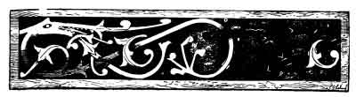
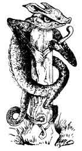

  
[Intangible Textual Heritage](../../index)  [Neo-Paganism](../index.md) 
[Roma](../../neu/roma/index)  [Index](index)  [Previous](gsft15.md) 
[Next](gsft17.md) 

------------------------------------------------------------------------

[Buy this Book at
Amazon.com](https://www.amazon.com/exec/obidos/ASIN/B002DUCMSI/internetsacredte.md)

------------------------------------------------------------------------

  
*Gypsy Sorcery and Fortune Telling*, by Charles Godfrey Leland,
\[1891\], at Intangible Textual Heritage

------------------------------------------------------------------------

 

 

 

p. 209

**CHAPTER XIV** [1](#fn_20.md)

A GYPSY MAGIC SPELL—HOKKANI BÂSO—LELLIN DUDIKABIN, OR THE GREAT
SECRET—CHILDREN'S RHYMES AND INCANTATIONS—TEN LITTLE INDIAN BOYS AND TEN
LITTLE ACORN GIRLS OF MARCELLUS BURDIGALENSIS

 THERE is a meaningless
rhyme very common among children. It is repeated while "counting off
"—or "out"—those who are taking part in a game, and allotting to each a
place. There are many versions of it, but the following is exactly word
for word what I learned when a boy in Philadelphia:—

Ekkeri (or ickery), akkery, u-kéry an,  
Fillisi', follasy, Nicholas John,  
Queebee—quabee—Irishman (or, Irish Mary),  
Stingle 'em—stangle 'em—buck!

With a very little alteration

p. 210

in sounds, and not more than children make of these verses in different
places, this may be read as follows:—

Ek-keri (yekori) akairi, you kair an,  
Fillissin, follasy, Nákelas jân  
Kivi, kávi—Irishman,  
Stini, stani—buck!

This is, of course, nonsense, but it is Romany or gypsy nonsense, and it
may be thus translated very accurately

First—here—you begin!  
Castle, gloves. You don't play!  
          Go on !  
*Kivi*—a kettle. How are you?  
*Stáni*, buck.

The common version of the rhyme begins with:—

"One—ery—two—ery, ickery an."

But one-ery is an *exact* translation of *ek-keri*; *ek*, or *yek*,
meaning one in gypsy. (*Ek-orus*, or *yek-korus*, means once). And it is
remarkable that in-

"*Hickory* dickory dock,  
The rat ran up the clock,  
The clock struck one,  
And down he run,  
*Hickory* dickory dock."

We have *hickory*, or *ek-keri*, again followed by a significant one. It
may be observed that while my first quotation abounds in what are
unmistakably Romany words, I can find no trace of any in any other
child-rhymes of the kind. I lay stress on this, for if I were a great
Celtic scholar I should not have the least difficulty in proving that
every word in every rhyme, down to "Tommy, make room for your uncle,"
was all old Irish or Gaelic.

p. 211

Word for word every person who understands Romany will admit the
following:—

*Ek*, or *yek*, means one. *Yekorus*, *ekorus*, or *yeckori*, or
*ekkeri*, once.

*U-kair-an*. *You kair an*, or begin. *Kair* is to make or do, *ânkair*
to begin. "Do you begin?"

*Fillissin* is a castle, or gentleman's country scat (H. SMITH).

*Follasi*, or *follasy*, is a lady's glove.

*Nâkelas*. I learned this word from an old gypsy. It is used as
equivalent to *don't*, but also means *ná* (*kélas*), you don't play.
From *kel-ava*, I play,

*Ján*, *Já-an*, Go on. From *jâva*, I go. Hindu, *jána*, and *jáo*.

*Kivi*, or *keevy*. No meaning.

*Kavi*, a kettle, from *kekâvi*, commonly given as *kâvi*. Greek,
κεκκάβοσ {Greek *kekkábos*}. Hindu, *kal*, a box.

*Stini*. No meaning that I know.

*Stáni*. A buck.

Of the last line it may be remarked that if we take from *ingle 'em*
(*angle 'em*), which is probably added for mere jingle, there remains
*stán*, or *stáni*, "a buck," followed by the very same word in English.

With the mournful examples of Mr. BELLENDEN KERR'S efforts to show that
all our old proverbs, saws, sayings, and tavern signs are Dutch, and Sir
WILLIAM BETHAM's Etruscan-Irish, and the works of an army of
"philologists," who consider mere chance resemblance to be a proof of
identical origin, I should be justly regarded as one of the seekers for
mystery in moonshine if I declared that I positively believed this to be
Romany. But it certainly contains words which, without any stretching or
fitting, are simply gypsy, and I think it not improbable that it was
some sham charm used by some Romany fortune-teller to bewilder Gorgios.
Let the reader imagine the burnt-sienna, wild-cat-eyed old sorceress
performing before a credulous farm-wife and her children, the great
ceremony of *hâkkni pánki*—which Mr. BORROW calls *hokkani bâro*, but
for which there is a far deeper name—that of the great secret"—which
even my best Romany friends tried to conceal from me. This is to *lel
dûdikabin*—to "take lightment." In the oldest English canting,
*lightment* occurs as an equivalent for theft—whether it came from
Romany, or Romany from it, I cannot tell.

p. 212

This feat-which is described by almost every writer on Gypsies—is
performed by inducing some woman of largely magnified faith to believe
that there is hidden in her house a magic treasure, which can only be
made "to come to hand" by depositing in the cellar another treasure, to
which it will come by natural affinity and attraction. "For gold, as you
sees, draws gold, my deari, and so if you ties up all your money in a
pocket-handkercher, an' leaves it, you'll find it doubled. An' wasn't
there the Squire's lady—you know Mrs. Trefarlo, of course—and didn't she
draw two hundred old gold guineas out of the ground where they'd laid in
an old grave-and only one guinea she gave me for all my trouble; an' I
hope you'll do better than that for the poor old gypsy, my deari—."

The gold and the spoons are all tied up-for, as the enchantress sagely
observes, "there may be silver too"—and she solemnly repeats over it
magical rhymes, while the children, standing around in awe, listen to
every word. It is a good subject for a picture. Sometimes the windows
are closed, and candles lighted—to add to the effect. The bundle is left
or buried in a certain place. The next day the gypsy comes and sees how
the charm is working. Could any one look under her cloak, he might find
another bundle precisely resembling the one containing the treasure. She
looks at the precious deposit, repeats her rhyme again solemnly and
departs, after carefully charging the house-wife that the bundle must
not be touched, looked at, or spoken of for three weeks. "Every word you
tell about it, my deari, will be a guinea gone away." Sometimes she
exacts an oath on the Bible, when she *chivs o manzin apré lâtti*—that
nothing shall be said.

Back to the farmer's house never again. After three weeks another
Extraordinary Instance of Gross Credulity appears in the country paper,
and is perhaps repeated in a colossal London daily, with a reference to
the absence of the schoolmaster. There is wailing and shame in the
house—perhaps great suffering—for it may be that the savings of years,
and bequeathed tankards, and marriage rings, and inherited jewellery,
and mother's souvenirs have been swept away. The charm has worked.

p. 213

"How *can* people be such fools!" Yea—how *can* they? How can fully
ninety-nine out of one hundred, and I fear me nine hundred and
ninety-nine out of a thousand, be capable of what amounts to precisely
the same thing—paying out their cash in the hopes that the Invisible
Influences in the Inscrutable Cellar or Celestial Garret will pay it
back to them, cent. per cent.? Oh, reader, if you be of middle age (for
there are perhaps some young agnostics beginning to appear to whom the
cap does not fit), and can swear on your hat that you never in your life
have been taken in by a *dûdikabin* in any form—send me your name and I
will award you for an epitaph that glorious one given in the *Nugæ
Venales*:

"Hic jacet ille qui unus fuit inter mille!"

The charm has worked. But the little sharp-eared children remember it,
and sing it over, and the more meaningless it sounds in their ears, the
more mysterious does it become. And they never talk about the
bundle—which when opened was found to contain only stones, sticks, and
rags—without repeating it. So it goes from mouth to mouth, until, all
mutilated, it passes current for even worse nonsense than it was at
first. It may be observed, however—and the remark will be fully
substantiated by any one who knows the gypsy language—that there is a
Romany turn to even the roughest corners of these rhymes. *Kivi,
stingli, stangli*, are all gypsyish. But, as I have already intimated,
this does not appear in any other nonsense verses of the kind. There is
nothing of it in—

"Intery, mintery, cutery corn,"

or in anything else in "Mother Goose." It is alone in its sounds and
sense—or nonsense. But there is not a wanderer on the roads in England
who on hearing it would not exclaim, "There's a great deal of Romanes in
that ere!" And if any one doubts it let him try it on any gypsy who has
an average knowledge of Romany.

I should say that the word *Na-Kelas*, which means literally "Do not
play," or, "You do not play," was explained to me by a gypsy

p. 214

as signifying not speaking, or keeping quiet. Nicholas John has really
no meaning, but "You don't play—go on," fits exactly into a counting-out
game.

The mystery of mysteries in the Romany tongue—of which I have spoken—is
this: The *hokkani bâro*, or *huckeny boro*, or great trick, consists of
three parts. Firstly, the getting into a house or into the confidence of
its owner, which is effected in England by offering small wares for
sale, or by begging for food, but chiefly by fortune-telling, the latter
being the usual pretence in America. If the gypsy woman be at all
prepared, she will have learned enough to amaze "the lady of the house,"
who is thereby made ready to believe anything. The second part of the
trick is the conveying away the property, which is, as I have said, to
*lel dûdikabin*, or "take lightning," possibly connected with the old
canting term for conveyance of *bien lightment*. There is evidently a
confusion of words here. And third is to "*chiv o manzin apré lâti*" to
put the oath upon her—the victim—by which she binds herself not to speak
of the affair for some weeks. When the deceived are all under oath not
to utter a word about the trick, the gypsy mother has a safe thing of
it.

The *hâkkani boro*, or great trick, or *dûdikabin*, was brought by the
gypsies from the East. It has been practised by them all over the world,
and is still played every day somewhere. And I have read in the Press of
Philadelphia that a Mrs. BROWN—whom I sadly and reluctantly believe is
the wife of an acquaintance of mine who walks before the world in other
names—was arrested for the same old game of fortune-telling, and
persuading a simple dame that there was treasure in the house, and all
the rest of the "grand deception." And Mrs. BROWN—"good old Mrs.
Brown"—went to prison, where she doubtless lingered until a bribed
alderman, or a purchased pardon, or some one of the numerous devices by
which justice is easily evaded in Pennsylvania, delivered her.

Yet it is not a good country on the whole for *hâkkani boro*, since

p. 215

the people, especially in the rural districts, have a rough and ready
way of inflicting justice, which sadly interferes with the profits of
aldermen and other politicians. Some years ago, in Tennessee, a gypsy
woman robbed a farmer of all he was worth. Now it is no slander to say
that the rural folk of Tennessee resemble Indians in several respects,
and when 1 saw thousands of them during the Civil War, mustered out in
Nashville, I often thought, as I studied these dark brown faces, high
cheek-bones, and long, straight, wiry hair, that the American is indeed
reverting to the aboriginal type. The Tennessee farmer and his friends
reverted to it at any rate with a vengeance, for they turned out
altogether, hunted the gypsies down, and having secured the sorceress,
burned her alive at the stake. Which has been, as I believe, "an
almighty warning" to the Romany in that sad section of the world. And
thus in a single crime, and its consequence, we have curiously combined
a world-old Oriental offence, an European Middle Age penalty for
witchcraft, and the fierce torture of the Red Indian.

In the United States there is often to be found in a gypsy camp a negro
or two [...](errata.htm#2.md) a few years ago a coloured sorcerer appeared
in Philadelphia, who, as I was assured, "persuaded half the
[negroes](errata.htm#3.md) in Lombard Street to dig up their cellars to
find treasure—and carried off all the treasures they had." He had been,
like MATTHEW ARNOLD'S scholar, among the tents of the Romany, and had
learned their peculiar wisdom, and turned it to profit.

In Germany the Great Sorcery is practised with variations, and indeed in
England or America or anywhere it is modified in many ways to suit the
victims. The following methods are described by Dr. RICHARD LIEBICH, in
"Die Zigeuner in ihrem Wesen und in ihrer Sprache" (Leipzig, 1863):—

"When a gypsy has found some old peasant who has the reputation of being
rich or very well-to-do he sets himself to work with utmost care to
learn the disposition

p. 216

of the man with every possible detail as to his house and habits." (It
is easy and congenial work to people who pass their lives in learning
all they can of other folks' affairs to aid in fortune-telling, to find
out the soft spots, as *Sam Slick* calls the peculiarities by which a
man may be influenced.) "And so some day, when all the rest of the
family are in the fields, the gypsy—man or woman—comes, and entering
into a conversation, leads it to the subject of the house, remarking
that it is a belief among his people that in it a treasure lies buried.
He offers, if he may have permission to take it away, to give
one-fourth, a third, or a half its value. This all seems fair enough,
but the peasant is greedy and wants more. The gypsy, on his side, also
assumes suspicion and distrust. He proves that he is a conjuror by
performing some strange tricks—thus he takes an egg from under a hen,
breaks it, and apparently brings out a small human skull or some strange
object, and finally persuades the peasant to collect all his coin and
other valuables in notes, gold, or silver, into a bundle, cautioning him
to hold them fast. He must go to bed and put the packet under his
pillow, while he, the conjuror, finds the treasure. This done—probably
in a darkened room—he takes a bundle of similar appearance which he has
quickly prepared, and under pretence of facilitating the operation and
putting the man into a proper position, takes the original package and
substitutes another. Then the victim is cautioned that it is of the
utmost importance for him to lie perfectly still;"

Nor move his hand nor blink his 'ee  
If ever he hoped the goud to see  
For aye aboot on ilka limb,  
The fairies had their 'een on him."

The gypsy is over the hills and far far away ere the shades of evening
fall, and the family returning from their fields find the father in bed
refusing to speak a word; for he has been urgently impressed with the
assertion that the longer he holds his tongue and keeps the affair a
secret the more money he will make. And the extreme superstition of the
German peasant is such that when obliged to tell the truth he often
believes that all his loss is due to a premature forced revelation of
what he has done—for the gypsy in many cases has the cheek to caution
the victim that if he speaks too soon the contents of the package will
be turned to sand or rags—accordingly as he has prepared it.

Another and more impudent manner of playing this pretended sorcery, is
to persuade the peasant that he must have a thick cloth tied

p. 217

around his head, and if any one addresses him to reply only by what in
German is called *brummen*—uttering a kind of growl. This he does, when
the. entire party proceed to carry off everything portable—

"Chairs and tables knives and forks,  
Tankards and bottles and cups and corks,  
Beds and dishes and boots and kegs,  
Bacon and puddings and milk and eggs,  
The carpet lying on the floor,  
And the hams hung up for the winter store,  
Every pillow and sheet and bed,  
The dough in the trough and the baken bread,  
Every bit of provant or pelf;  
All that they left was the house itself."

One may imagine what the scene is like when the rest return and find the
house plundered, the paterfamilias sitting in the ruins with his head
tied up, answering all frantic queries with *brum—brum—brum*! It may
recall the well-known poem—I think it is by PETER PINDAR WOLCOTT—Of the
man who was persuaded by a bet to make the motion of a pendulum, saying,
"Here she goes—there she goes!" while the instigator "cleared out the
house and then cleared out himself." I have little doubt that this poem
was drawn from a Romany original.

Or yet, again, the gypsy having obtained the plunder and substituted the
dummy packet, persuades the true believer to bury it in the barn,
garden, field, or a forest, performs magic ceremonies and repeats
incantations over it, and cautions him to dig it up again, perhaps six
months later on a certain day, it may be his saint's or birth day, and
to keep silence till then. The gypsy makes it an absolute condition—nay,
he insists very earnestly on it—that the treasure shall not be dug up
unless he himself is on the spot to share the spoil. But as he may
possibly be prevented from coming, he tells the peasant how to proceed:
he leaves with him several pieces of paper inscribed with cabalistic
characters which are to be burnt when the money is removed, and teaches
him what he is to repeat while doing it. With sequence as before.

p. 218

It *might* be urged by the gypsy that the taking a man's money from him
under the conditions that he shall get it all back with immense interest
six months after, does not differ materially from persuading him to give
his property to Brahmins, or even priests, with the understanding that
he is to be amply rewarded for it in a future state. I n both cases the
temptation to take the money down is indeed great—as befel a certain
very excellently honest but extremely cautious Scotch clergyman, to whom
there once came a very wicked and wealthy old reprobate who asked him
"If I gie a thousand puns till the kirk d'ye think it wad save my soul?"
"I'm na preparit to *preceesely* answer that question," said the shrewd
dominie, "but I would vara urgently advise ye *to try it*."

Oh thou who persuadest man that for money down great good shall result
to him from any kind of spiritual incantation—twist and turn it as ye
will—*mutato nomine, de te fabula narratur*:

"With but a single change of name,  
The story fits thee quite the same."

And few and far between are the Romanys—or even the Romans—who would not
"vara earnestly advise ye to try it."

Since I wrote that last line I have met, in the *Journal of American
Folk-Lore*, with a very interesting article on the Counting-out Rhymes
of Children, in which the writer, H. CARRINGTON BOLTON, avows his belief
that these doggerel verses or rhymes are the survivals of sortileges or
divination by lot, and that it was practised among the ancient heathen
nations as well as the Israelites:—

"The use of the lot at first received divine sanction, as in the story
of Achan related by Joshua, but after this was withheld the practice
fell into the hands of sorcerers—which very name signifies lot-taker.
The doggerels themselves I regard as a survival of the spoken charms
used by sorcerers in ancient times in conjunction with their mystic
incantations. There are numerous examples of these charms, such as-

"'Huat Hanat Huat ista pista sista domiabo damnaustra.'  
                 (CATO, 235 B.C.)

"And—

"'Irriori, ririori essere rhuder fere.'

p. 219

"And—

"'Meu, treu, mor, phor  
Teux, za, zor  
Phe, lou, chri,  
Ge, ze, on.'  
(ALEXANDER OF TRALLES.)

 

"TYLOR in his 'Primitive Culture' holds that things which occupy an
important place in the life-history of grown men in a savage state
become the playthings of children in a period of civilization; thus the
sling and the bow and arrow, which formed the weapons of mankind in an
early stage of its existence, and ate still the reliance of savage
tribes, have become toys in the hands of all civilized children at the
present day. Many games current in Europe and America are known to be
sportive imitations of customs which formerly had a significant and
serious aspect.

"Adopting this theory, I hold that counting-out is a survival of the
practice of the sorcerer, using this word in its restricted and
etymological meaning, and that the spoken and written charms originally
used to enforce priestly power have become adjuncts to these puerile
games, and the basis of the counting-out doggrels under consideration.

"The idea that European and American children engaged in 'counting-out'
for games, are repeating in innocent ignorance the practices and
language of a sorcerer of a dark age, is perhaps startling, but can be
shown to have a high degree of probability. The leader in 'counting out'
performs an incantation, but the children grouped round him are free
from that awe and superstitious reverence which characterized the
procedure in its earlier state. Many circumstances make this view
plausible, and clothe the doggrels with a new and fascinating interest."

Mr. BOLTON remarks, however, that "in only one instance have I been able
to directly connect a child's counting-out rhyme with a magic spell.
According to LELAND the rhyme beginning with

'One-cry, two-ery, ickery, Ann,'

is a gypsy magic spell in the Romany language."

It occurred to me long, long ago, or before ever the name "Folk-lore"
existed, that children's rhymes were a survival of incantations, and
that those which are the same backward and forward were specially
adapted to produce marvellous effects in lots. But there was one form of
counting-out which was common as it was terrible. This was used when
after a victory it was usual to put every tenth captive to death—whence
the greatly abused word to "decimate"—or any other number

p. 220

selected. When there was a firm belief in the virtues of numbers as set
forth by PYTHAGORAS, and PLATO in the *Timæus*, and of cabalistic names
inspired by the "Intelligences," it is not remarkable that the diviners
or priests or sorcerers or distributors of *sortes* and sortileges
should endeavour to prove that life and death lay bound up in mystic
syllables. That there were curious and occult arithmetical means of
counting-out and saving elected persons is shown in certain mystic
problems still existent in Boys Own Books, and other handbooks of
juvenile sports. It was the one on whom the fatal word of life or death
fell who was saved or condemned, so that it was no wonder that *the
word* was believed to be a subtle, mysterious existence: an essence or
principle, yea, a spirit or all in one—*diversi aspetti in un, confuse e
misti*. He who knew the name of Names which, as the Chaldæan oracles of
old declared, "rushes into the infinite worlds," knew all things and had
all power; even in lesser words there lingered the fragrance of God and
some re-echo of the *Bath Kol*—the Daughter of the Voice who was herself
the last echo of the divine utterance. So it went down through the
ages-coming, like Caesar's clay, to base uses—till we now find the
sacred divination by words a child's play: only that and nothing more.

Truly Mr. BOLTON spoke well when he said that such reflection clothes
these doggerels with a new and fascinating interest. Now and then some
little thing awakens us to the days of old, the rosy, early morning of
mankind, when the stars of magic were still twinkling in the sky, and
the dreamer, hardly awake, still thought himself communing with God. So
I was struck the other day when a gypsy, a deep and firm believer in the
power of the *amulet*, and who had long sought, yet never found, his
ideal, was deeply moved when I showed him the shell on which NAV, or the
Name, was mystically inscribed by Nature. Through the occult and broken
traditions of his tribe there had come to him also, perhaps from Indian
or Chaldæan sources, some knowledge of the ancient faith in its power.

I think that I can add to the instance of a child's counting-out

p. 221

game based on a magic spell, yet another. Everybody knows the song of
John Brown who had

Ten little, nine little, eight little, seven little,  
Six little Indian boys;  
Five little, four little, three little, two little,  
One little Indian boy, [1](#fn_21.md)

And of the fate which overtook them all, one by one, inevitable as the
decrees of Nemesis. This song is in action a game. I have heard it in
Romany from a gypsy, and have received from a gypsy scholar another
version of it, though I am sure that both were versions from the
English. But in Romany, as in all languages, there have existed what may
be called additional and subtractive magic songs, based on some primæval
Pythagorean principle of the virtues of numbers, and, as regards form,
quite like that of the ten little Indians. In the charms of MARCELLUS
BURDIGALENSIS (third century), it appears as a cure for pains or
disorders in the jaws (*remedium valde certum et utile faucium
doloribus*), in the Song of the Seven Acorn Sisters, which the
Latin-Gaul doctor describes as *carmen mirum*, in which opinion the
lover of Folk-lore will heartily concur.

"CARMEN MIRUM AD GLANDULAS.

Glandulas mane carminabis, si dies minuetur, si nox ad vesperam, et
digito medicinali ac pollice continens eas dices—

Novem glandulæ sorores,  
Octo glandulæ sorores,  
Septem glandulæ sorores,  
Sex glandulæ sorores,  
Quinque glandulæ sorores,  
Quatuor glandulæ sorores,  
Tres glandulæ sorores,  
Duæ glandulæ sorores,  
Una glandula soror!

p. 222

Novem fiunt glandulæ,  
Octo fiunt glandulæ,  
Septem fiunt glandulæ,  
Sex fiunt glandulæ,  
Quinque fiunt glandulæ,  
Quattuor fiunt glandulæ,  
Tres fiunt glandulæ,  
Duæ fiunt glandulæ,  
Una fit glandula,  
Nulla fit glandula!"

(*I.e.*, "Nine little acorn sisters (or girls),  
Eight little acorn sisters," &c.)

This is simply the same count, forwards and backwards.

It rises before us as we read—a chorus of rosy little Auluses and
Marcellas, Clodias, and Manliuses, screaming in chorus—

"Ten little, nine little, eight little, seven little,  
Six little acorn girls!"

Until it was reduced to *una glandula et nulla fit*—then there was
none., They too had heard their elders repeat it as a c arm against the
Jaw-ache—and can any man in his senses doubt that they applied it in
turn to the divine witchcraft of fun and the sublime sorcery of sport,
which are just as magical and wonderful in their way as anything in all
theurgia or occultism, especially when the latter is used only to excite
marvels and the amazement which is only a synonym for amusement. But it
is not credible that such a palpable "leaving out" song as that of the
Ten Little Acorn Girls should not having been utilized by such
intelligent children as grew up into being the conquerors of the
world—"knowing Latin at that."

There is yet another old Roman "wonderful song to the Acorns,"
apparently for the same disorder, given by the same author.

p. 223

"Albula glandula,  
Nec doleas nec noceas,  
Nec paniculas facias,  
Sed liquescas tanquam salis (mica) in aqua!

"Hoc ter novies dicens spues ad terram et glandulas ipsas pollice et
digito medicinali perduces, dum carmen dices, sedante solis ortum et
post occasum facies id, prout dies aut nox minuetur."

There appears in these formulas to be either a confusion or affinity as
regards *glandulas*, the tonsils, and the same word signifying small
acorns. As is very often the case, the similarity of name caused an
opinion that there must be sympathetic curative qualities. Perhaps
acorns were also used in this ceremony. In a comment on this GRIMM
remarks: "*Die Glandula wird angeredet, die Glandulæ gelten für
Schwestern, wie wenn das alt hoch-deutsch druos glandula (GRAFF 5, 263)
personification aukündigte? Alt Nordisch ist drôs, femina*."

There is another child's rhyme which is self-evidently drawn from an
exorcism, that is to say an incantation. All my readers know the nursery
song:—

"Snail, snail, come out of your hole,  
Or else I'll beat you as black as a coal  
Snail, snail, put out your head,  
Or else I'll beat you till you are dead!"

It is very remarkable that in Folk-lore the mole and the snail are
identified, and, as DE GUBERNATIS states, both are the same with the
grey mouse, or, as he might more accurately have declared with the mouse
in general. A critic objects to this simply because it occurs in the
work of DIE GUBERNATIS, among his "fanciful theories," but it need not
follow that every citation or opinion in his book is false. FRIEDRICH,
who certainly is not a fanciful theorist, asserted nearly thirty years
ago that the mouse, owing to its living underground and in dark places
as well as to its gnawing and destroying everything, is a *chthonisches
Thier*, one of the animals of darkness and evil. Also "the mole, because
it is of subterranean life, has received a chthonic, demoniac,
misanthropic reputation."

p. 224

\[paragraph continues\] In support of
these statements he cites a great array of authorities. The connection
between the mole and mouse is evident enough, that between both and the
snail is also clear: firstly, from the fact that "the snail of popular
superstition is demoniacal," or evil; and secondly, from the rhyme which
I now quote, which is applied to both moles and snails. According to DU
CANGE it was usual in the Middle Ages for children to go about carrying
poles, on the ends of which was straw, which they lighted, and going
round the gardens and under the trees shouted:—

"Taupes et mulots,  
Sortez de vas clos,  
Sinon je vous brulerai la bathe et les os!"

But in Germany there are two and in Italy five versions of the same song
addressed to *snails*. It is evidently a Roman Catholic formula, based
on some early heathen incantation. Thus in Tuscany they sing

"Chiocciola marinella  
Tira fuori le tue cornelle,  
E se tu non le tirerai  
Calcie pugni tu buscherai."

Both the snail and mole and mouse were, as I have said, *chthonic*, that
is diabolical or of darkness. The horns of the former were supposed to
connect it with the devil. "In Tuscany it is believed that in the month
of April the snail makes love with serpents."

There is another nursery counting-out rhyme whose antiquity and
connection with sorcery is very evident. It is as follows:—

"One, two, three, four, five,  
I caught a hare all alive.  
Six, seven, eight, nine ten,  
I let her go again."

The following from the medical spells and charms Of MARCELLUS
BURDIGALENSIS manifestly explains it:—

"Lepori vivo alum abstrahes, pilósque ejus de subventre tolles atque
ipsum *vivum dimittes*. De illis pilis, vel lana filum validum facies et
ex eo talum leporis

p. 225

conligabis corpusque laborantis præcinges; miro remedio subvenies.
Efficacius tamen erit remedium, ita ut incredibile sit, si casu os
ipsum, id est talum leporis in stercore lupi inveneris, quod ita
custodire debes, ne aut terram tangat aut a muliere contingatur, sed nec
filum illud de lana leporis debet mulier ulla contigere. Hoc autem
remedium cum uni profuerit ad alias translatum cum volueris, et quotiens
volueris proderit. Filum quoque, quod ex lana vel pilis, quos de ventre
leporis tuleris, solus purus et nitidus facies, quod si ita ventri
laborantis subligaveris plurimum proderit, ut sublata lana leporem vivum
dimmittas, et dicas ei dum dimittis eum:

"'Fuge, fuge, lepuscule, et tecum auter coli dolorem!'"

That is to say, you must "first catch your hare," then pluck from it the
fur needed *ad dolorem coli*, then "let it go again," bidding it carry
the disorder with it. In which the hare appears as a scapegoat. It may
be observed that all this ceremony of catching the hare, letting it go
and bidding it run and carry away the disorder, is still in familiar use
in Tuscany.

It has been observed to me that "any nursery rhyme may be used as a
charm." To this we may reply that any conceivable human utterance may be
taken for the same purpose, but this is an unfair special pleading not
connected with the main issue. Mr. CARRINGTON BOLTON admits that he has
only found one instance of coincidence between nursery rhymes and
spells, and I have compared hundreds of both with not much more result
than what I have here given. But those who are practically familiar with
such formulas recognize this affinity. On asking the Florentine
fortune-teller if she knew any children's counting-out rhymes which
deemed to her to be the same with incantations, she at once replied

"In witchcraft you sometimes call on people one by one by name to
bewitch them. And the little girls have a song which seems to be like
it." Then she sang to a very pretty tune

"Ecco l'imbasciatore,  
Col tra le vi la lera,  
Ecco l'imbasciatrice,  
Col tra la li ra la! p. 226  
Cosa volete col tua la li la,  
Col tra le li va la,  
Voglio Giuseppina,  
Col tra le li va le va.  
Voglio la Cesarina,  
Col tra le li ra le ra.  
Voglio la Armida, &c,  
Voglio la Gesualda,  
Voglio la Barbera,  
Voglio la Bianca,  
Voglio la Fortunata,  
Voglio la Uliva,  
Voglio la Filomena,  
Voglio la Maddalena,  
Voglio la Pia,  
Voglio la Gemma,  
Voglio la Ida,  
Voglio la Lorenzina,  
Voglio la Carolina,  
Voglio la Annunciatina,  
Voglio la Margo," &c.

There is one thing of which those who deny the identity of any
counting-out rhymes with spells are not aware. These incantations are
very much in vogue with the Italian peasantry, as with the gypsies. They
are repeated on all occasions for every disorder, for every trifle lost,
for every want. Every child has heard them, and their jingle and even
their obscurity make them attractive. They are just what children would
be likely to remember and to sing over, and the applying them to games
and to "counting-out" would follow as a matter of course. In a country
where every peasant, servant-girl and child knows at least a few spells,
the wonder would be if some of these were *not* thus popularized or
perverted. It is one thing to sit in one's library and demonstrate that
this or that *ought* not to be, because it is founded on a "theory" or
"idea," and quite another to live among people where these ideas are in
active operation. WASHINGTON IRVING has recorded that one of the Dutch
governors of New York achieved a vast reputation for wisdom by

p. 227

shrugging his shoulders, at everything and saying, "I have my doubts as
to that." And truly the race Of WOUTER VAN TWILLER is not extinct as yet
by any means among modern critics.

It is worth noting in this connection that in Mrs. VALENTINE'S Nursery
Rhymes (Camden edition) there are fifteen charms given which are all of
a magical nature.

Since the foregoing chapter was written I have obtained in Florence
several additional instances of children's rhymes which were spells.
Nearly allied to this subject of sorcery in the nursery is The Game of
the Child-stealing Witch, which, as W. Wells Newell has shown in a very
interesting and valuable contribution to the *American Folk-Lore
Journal*, vol. iii., April, 1890, is found in many languages and lands.

In connection with divination, deceit, and robbery, it may be observed
that gypsies in Eastern Europe, as in India, often tell fortunes or
answer questions by taking a goblet or glass, tapping it, and pretending
to hear a voice in the ring which speaks to them. This method of
divination is one of the few which may have occurred sporadically, or
independently in different places, as there is so much in a ringing,
vibrating sound which resembles a voice. The custom is very ancient and
almost universal; so Joseph (Genesis xliv. 5) says ("Vulgate"),
"*Scyphus quam furati estis, ipse est, in quo bibit Dominus meus, et in
quo augurari solet*." "The goblet which ye have stolen, is it not this
wherein my lord drinketh and in which he is wont to *divine*?" Joseph
says again (ver. 15), "Know ye not that such a man as I can certainly
divine." A great number of very orthodox scholars have endeavoured to
show that "divine" here means merely "to conjecture wisely," or "to see
into," in order to clear Joseph from the accusation of fortune-telling:
but the cup and his interpretation of dreams tell another story. In
those days in the East, as now, clever men made their way very often by
fortune-telling and *theurgia* in different forms in great families,
just as ladies and gentlemen are "invited out" in London and Paris to
please the company with palmistry.

p. 228

This divining by goblets is still common in the East. In NORDEN'S "Reise
nach Egypten," &c., we are told that a native said to the travellers
that he had interrogated his coffee-cup, and it had replied that the
travellers were those of whom the Prophet had predicted they would come
as spies and lead the way for a great immigration of Franks. In an
Arabic commentary of the twelfth century the replies which the goblet
gave to Joseph when it tapped on it are given in full. As
coffee-drinking is very ancient it is probable that divination by means
of the grounds grew out of foretelling with the cup.

Horst ("Dæmonomagie," vol. ii.) remarks that "prediction by means of
drinking or coffee-cups," &c., is called in magic, *Scyphomancy*, and
that the reader may judge how common it was in Germany in the first half
of the eighteenth century by consulting the famous humorous poem of the
"Renomist," Song iii. ver. 47. Certain goblets of thin glass will give
out quite a loud ring if only blown upon, and by blowing or breathing in
a peculiar way the sound may be greatly increased or modified, so as to
sound like the human voice. This was shown me by an old *custode* in the
museum at the Hague. It is a curious trick worth trying—especially by
those who would pass for magicians!

There is yet another kind of magic cup known only by tradition, the
secret of which, I believe, I was the first to re-discover. It is said
that the Chinese knew of old how to make bottles, &c., which appeared to
be perfectly plain, but on which, when filled with wine, inscriptions or
figures appeared, and which were used in divination as to answer
questions. In the winter of 1886-87, Sir HENRY AUSTIN LAYARD went with
me through his glass factory at Venice. [1](#fn_22.md) As we were standing by the furnace
watching the workmen it flashed upon me quite in a second how the
mysterious old goblets of the Chinese could be made. This would be by
blowing a bottle, &c., of thin white glass and putting on the interior
in all parts *except the pattern*, a coating of glass half an inch in
thickness. The outside should then be lightly ground, to conceal the

p. 229

heavy portion. If red wine or any dark fluid should then be poured into
the bottle the pattern would appear of the same colour. Sir Austin
Layard at once sent for his very intelligent foreman, Signor CASTELLANI,
who said that he had indeed read of such goblets, but that he regarded
it as a fable. But when I explained to him what had occurred to me, he
said that it was perfectly possible, but that the great expense of
making such objects would probably make the manufacture practically
impossible. Apropos of which I may mention that those who would
investigate the curiosities of glass, especially the art of making it
malleable, may find a great deal in A. Nevi, "De Arte Vitraria"
(Amsterdam), and its German translation of 1678 (which contains a
chapter, "Wie die Malleabilitat dem Glase beygebracht werden konne").

It is probable that the celebrated cup of Djemschid, in Persian story,
which showed on its surface all that passed in the world, owed its
origin to these Chinese bottles.

 

 

 

------------------------------------------------------------------------

### Footnotes

[209:1](gsft16.htm#fr_20.md) This chapter is
reproduced, but with much addition, from one in my work entitled "The
Gypsies," published in Boston, 1881, by HOUGHTON and MIFFLIN. London:
TRÜBNER & Co. The addition will be the most interesting portion to the
folk-lorist.

[221:1](gsft16.htm#fr_21.md) This song which, with
its air, is very old in the United States, has been vulgarizcd by being
turned into a ballad of ten little nigger boys. It is given in Mrs.
VALENTINE'S Nursery Rhymes as "Indian boys."

[228:1](gsft16.htm#fr_22.md) It is not generally
known that Sir H. A. Layard and Sir William Drake were the true revivers
of the glass manufacture of Venice.

------------------------------------------------------------------------

[Next: Chapter XV: Gypsy Amulets](gsft17.md)

