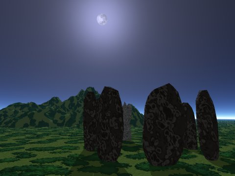

  
[Internet Book of Shadows](../bos/index)  [Grimoires](../grim/index.md) 
[Esoteric and Occult](../eso/index)  [Legends and Sagas](../neu/index.md) 
[Shamanism](../sha/index)  [Classical Paganism](../cla/index.md) 
[Women](../wmn/index)  [Tarot](../tarot/index.md)  [Sacred
Sexuality](../sex/index.md)  [OCRT: Neo-Pagan Religious
Traditions](https://www.religioustolerance.org/neo_paga.md)  [OCRT: Asatru
(Norse Paganism)](https://www.religioustolerance.org/asatru.md)  

------------------------------------------------------------------------

<table width="100">
<colgroup>
<col style="width: 50%" />
<col style="width: 50%" />
</colgroup>
<tbody>
<tr class="odd">
<td data-valign="center" width="50%"> 
 Image © Copyright J.B. Hare 1999, All Rights Reserved</td>
<td data-valign="center" width="50%">Wicca and Neo-Paganism</td>
</tr>
</tbody>
</table>

------------------------------------------------------------------------

[Twentieth Century](#20thcen)     [Victorian](#victorian.md)     [The
Burning Times](#burning)     [Druids](#druid.md)    
[Antiquity](#antiquity)     [Miscellaneous](#misc.md)

------------------------------------------------------------------------

[Current Phase of the Moon](../time/cal/pom.md)

------------------------------------------------------------------------

Neopaganism covers a wide range of belief systems which have emerged in
the past 50 years, primarily in the UK, Europe, and the United States.
This includes the better known Wicca, which is a synthesis of traditions
from the British Isles, as well as many less visible groups which draw
inspiration from other parts of the world. Based on folk-lore,
traditional spiritual practices, anthropology, and a synthesis of
esoteric systems, Neopaganism does not have any sacred texts of the same
vintage as other religions, although unverifiable claims have been made
in a couple of cases (e.g. [Aradia](aradia/index.md), and [The Gardnerian
Book of Shadows](gbos/index).md).

Rather, the books presented here are source texts of Neopaganism, and
other books which deal with related topics. Many of these books contain
outdated or speculative material, and some of the texts here are the
product of the Renaissance witch hunters. As a whole, the books here are
of historical importance rather than a roadmap to modern pagan practice,
and shouldn't be construed as such. As always, we encourage readers to
think critically.

descriptions of contemporary Neopagan practice and beliefs can be found
in the [Internet Book of Shadows](../bos/index.md) section of this site.

------------------------------------------------------------------------

### Twentieth Century

[The Books of Gerald Gardner](gardner.md)

 [The Gardnerian Book of
Shadows](gbos/index.md)   The Book of Shadows is a
Wiccan text which is maintained by the initiated in manuscript
form. A Book of Shadows contains description of rituals, spells,
and other knowledge. This tradition was carried on by Gerald Gardner, who (depending on the account) either
synthesized Wicca, or took it public, during the 1950s. 

  
 [The White Goddess](twg.md)  
Robert Graves' primary contribution to modern
Neopaganism. 

 [The works of Margaret
Murray](murray.md)  
 An essay by J.B.
Hare.   

 [The Witch-Cult in Western
Europe](wcwe/index.md)   by Margaret Murray
\[1921\]   Were there ever
REAL witches? If not, what were all the witch trials about? And
how about those fairies? Murray tries to answer these and other
questions objectively with plenty of documentary evidence. She is often
cited as a primary source for Gerald Gardners' ideology. 

 [The Golden
Bough](frazer/index.md)   by Sir James
Frazer \[1922\]   A
massive study of the mythological cycle of the Godesses' lover, the
solar God who dies and is reborn. The Golden Bough had a huge
influence on [Margaret Murray](murray), [Robert Graves](twg.md) and
[Gardner](gardner.md). 

------------------------------------------------------------------------

### Victorian

 [Aradia, Gospel of the
Witches](aradia/index.md)   by Charles G.
Leland \[1899\]   Evidence of a surviving underground Italian pagan
religion?   
 [Etruscan Roman Remains in Popular
Tradition](err/index.md)   by Charles G.
Leland \[1893\]  
Stregheria is Italian traditional witchcraft.
These are considered historical source documents of the Wicca movement.
Some contemporary scholars have questioned the authenticity of Lelands'
scholarship. Recent publications by Raven Grimassi have also added a
great deal of depth to the subject of Italian witchcraft. See
[www.stregheria.com](https://www.stregheria.com/.md) \[external site\] for
more information.  
  [Gypsy Sorcery and Fortune
Telling](gsft/index.md)   by Charles G.
Leland \[1891\]   Leland investigates another traditional system of magic,
that of the Rom, or Gypsies. 

 [Letters on Demonology and
Witchcraft](scott/index.md)   by Sir Walter
Scott \[1885\].   Scott covers much of the same evidence for the Witch cult as
Murry (albeit in a more popular style). Scott draws few
conclusions other than that our ancestors were extremely superstitous.

 [The Sorceress](sor/index.md)  
by Jules Michelet, tr. by Alfred Richard Allinson \[1939\]   The story of witchcraft
from the medieval to the 17th century, as a covert women's
rebellion which led to modern science and medicine. 

------------------------------------------------------------------------

### The Burning Times

From the 14th to the 17th Century a hysteria spread across Europe which
involved torturing and executing people based on accusations that they
were witches. Whether any actual practicioners of a pre-Christian pagan
tradition were persecuted as the result of a witch trial is up for
debate. These books and texts are period documents which illustrate the
methods, rationale (such as it was) and history of this persecution.
They shouldn't be taken as illustrative of Neopaganism, but as a warning
about religious tolerance and the fragile nature of justice.

  
 [The Malleus
Maleficarum](mm/index.md)  
\[1486\], translated by Montague Summers \[1928\]  
The best known witch-hunt manual, a primary source of
information on this chilling subject. 

 [Dæmonology](kjd/index.md)   by
King James the First. \[1597\] With *Newes from
Scotland* \[1591\]   Two texts, one an essay on demons and other denizens of the
night, the second a broadside with an account of a famous witch
trial from the same period. 

 [The
Witch-Persecutions](twp/index.md)  
Edited by George L. Burr \[1896\].   A short collection of
translations of historical documents of the witch craze. 

------------------------------------------------------------------------

### Druids

Although little is actually known about the Druids, that didn't stop
18th and 19th century intellectuals from building a romantic mythology
around them. This was closely associated with the rebirth of [Celtic
nationalism](../neu/index.htm#celtic.md), as well as the Romantic and
[Gothic](../goth/index.md) movements. This body of fact and speculation
later became a central source of modern Wicca and Neo-Pagan belief and
practice.

 [Irish Druids and Old Irish
Religions](idr/index.md)   by James Bonwick
\[1894\].   A scholarly
perspective on the Druids in Ireland, weaving together strands of
mythology and anthropology to build a picture of ancient Irish
paganism. 

 [The Veil of Isis or Mysteries of
the Druids](motd/motd.md)   by W. Winwood
Reade \[1861\]. *277,613 bytes*   A typical example of the romantic and misconcieved mid-19th
Century literature about Druidry. We now know that the
construction of Stonehenge preceded the historical Celts by many
centuries. 

 [The Religion of the Ancient
Celts](../neu/celt/rac/index.md)   by J. A.
MacCulloch \[1911\]   An authoritative and factual study of ancient Celtic
religion, including extensive material on what is actually known
about the Druids. 

[The Barddas of Iolo Morganwg, Vol.
I](../neu/celt/bim1/index.md) \[1862\]  
 [The Barddas of Iolo Morganwg, Vol.
II](../neu/celt/bim2/index.md) \[1874\]  
Iolo Morganwg was one of the first to revive Druidry
in the 18th century; however, it is questionable whether these
texts are as old as they claim to be. These are nevertheless considered
primary source material for the modern Druid revivial. 

------------------------------------------------------------------------

### Antiquity

 [The Syrian
Goddess](../cla/luc/tsg/index.md)  
translated by Herbert A. Strong \[1913\]   Lucian of Samosata's late
classical account of Goddess worship, referenced by Robert Graves
and other writers as a primary source of information on worship of the
Ancient Near Eastern Goddess. 

------------------------------------------------------------------------

### Miscellaneous

 [The Book of
Hallowe'en](boh/index.md)   by Ruth Edna
Kelley \[1919\]   Learn about Halloween and its pagan roots. 

 [Irish Witchcraft and
Demonology](iwd/index.md)   by St. John D.
Seymour \[1913\].   This is a fascinating study of the witch-persecutions in
Ireland, along with accounts of paranormal activity. 

 [Pagan Prayers](ppr/index.md)  
by Marah Ellis Ryan \[1913\]   Traditional spirituality
from around the world. 
