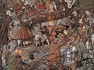

  
[Intangible Textual Heritage](../../index)  [Paganism](../index.md) 
[Celtic](../../neu/celt/index)  [Index](index)  [Previous](iwd00.md) 
[Next](iwd02.md) 

------------------------------------------------------------------------

[Buy this Book at
Amazon.com](https://www.amazon.com/exec/obidos/ASIN/B002BA65ME/internetsacredte.md)

------------------------------------------------------------------------

  
*Irish Witchcraft and Demonology*, by St. John D. Seymour, \[1913\], at
Intangible Textual Heritage

------------------------------------------------------------------------

p. v

# CONTENTS

<table data-border="0" width="778">
<colgroup>
<col style="width: 50%" />
<col style="width: 50%" />
</colgroup>
<tbody>
<tr class="odd">
<td data-valign="TOP" width="89%">
CHAPTER I

SOME REMARKS ON WITCHCRAFT IN IRELAND
</td>
<td data-valign="BOTTOM" width="11%">
<a href="iwd02.htm#page_1">1</a>
</td>
</tr>
<tr class="even">
<td data-valign="TOP" width="89%">
CHAPTER II

A.D. 1324

DAME ALICE KYTELER, THE SORCERESS OF KILKENNY
</td>
<td data-valign="BOTTOM" width="11%">
<a href="iwd03.htm#page_25">25</a>
</td>
</tr>
<tr class="odd">
<td data-valign="TOP" width="89%">
CHAPTER III

A.D. 1223-1583

THE KYTELER CASE AND ITS SURROUNDINGS OF SORCERY AND HERESY--MICHAEL SCOT--THE FOURTH EARL OF DESMOND--JAMES I AND THE IRISH PROPHETESS--A SORCERY ACCUSATION OF 1447--WITCHCRAFT TRIALS IN THE SIXTEENTH CENTURY--STATUTES DEALING WITH THE SUBJECT--EYE-BITERS--THE ENCHANTED EARL OF DESMOND
</td>
<td data-valign="BOTTOM" width="11%">
<a href="iwd04.htm#page_46">46</a>
</td>
</tr>
<tr class="even">
<td data-valign="TOP" width="89%">
p. vi
</td>
<td data-valign="BOTTOM" width="11%">
 
</td>
</tr>
<tr class="odd">
<td data-valign="TOP" width="89%">
CHAPTER IV

A.D. 1606-1656

A CLERICAL WIZARD--WITCHCRAFT CURED BY A RELIC--RAISING THE DEVIL IN IRELAND--HOW HE WAS CHEATED BY A DOCTOR OF DIVINITY--STEWART AND THE FAIRIES--REV. ROBERT BLAIR AND THE MAN POSSESSED WITH A DEVIL--STRANGE OCCURRENCES NEAR LIMERICK--APPARITIONS OF MURDERED PEOPLE AT PORTADOWN--CHARMED LIVES--VISIONS AND PORTENTS--PETITION OF A BEWITCHED ANTRIM MAN IN ENGLAND--ARCHBISHOP USSHER'S PROPHECIES--MR. BROWNE AND THE LOCKED CHEST
</td>
<td data-valign="BOTTOM" width="11%">
<a href="iwd05.htm#page_77">77</a>
</td>
</tr>
<tr class="even">
<td data-valign="TOP" width="89%">
CHAPTER V

A.D. 1661

FLORENCE NEWTON, THE WITCH OF YOUGHAL
</td>
<td data-valign="BOTTOM" width="11%">
<a href="iwd06.htm#page_105">105</a>
</td>
</tr>
<tr class="odd">
<td data-valign="TOP" width="89%">
CHAPTER VI

A.D. 1662-1686

THE DEVIL AT DAMERVILLE--AND AT BALLINAGARDE--TAVERNER AND HADDOCK'S GHOST--HUNTER AND THE GHOSTLY OLD WOMAN--A WITCH RESCUED BY THE DEVIL--DR. WILLIAMS AND THE HAUNTED HOUSE IN DUBLIN--APPARITIONS SEEN IN THE AIR IN CO. TIPPERARY--A CLERGY-MAN p. vii AND HIS WIFE BEWITCHED TO DEATH-BEWITCHING OF MR. MOOR--THE FAIRY-POSSESSED BUTLER--A GHOST INSTIGATES A PROSECUTION--SUPPOSED WITCHCRAFT IN CO. CORK--THE DEVIL AMONG THE QUAKERS
</td>
<td data-valign="BOTTOM" width="11%">
<a href="iwd07.htm#page_132">132</a>
</td>
</tr>
<tr class="even">
<td data-valign="TOP" width="89%">
CHAPTER VII

A.D. 1688

AN IRISH-AMERICAN WITCH
</td>
<td data-valign="BOTTOM" width="11%">
<a href="iwd08.htm#page_176">176</a>
</td>
</tr>
<tr class="odd">
<td data-valign="TOP" width="89%">
CHAPTER VIII

A.D. 1689-1720

PORTENT ON ENTRY OF JAMES II--WITCHCRAFT IN CO. ANTRIM--TRADITIONAL VERSION OF SAME--EVENTS PRECEDING THE ISLAND--MAGEE WITCH-TRIAL--THE TRIAL ITSELF--DR. FRANCIS HUTCHINSON
</td>
<td data-valign="BOTTOM" width="11%">
<a href="iwd09.htm#page_194">194</a>
</td>
</tr>
<tr class="even">
<td data-valign="TOP" width="89%">
CHAPTER IX

A.D. 1807

TO PRESENT DAY MARY BUTTERS, THE CARNMONEY WITCH--BALLAD ON HER--THE HAND OF GLORY--A JOURNEY THROUGH THE AIR--A "WITCH" IN 1911--SOME MODERN ILLUSTRATIONS OF CATTLE- AND MILK- MAGIC--TRANSFERENCE OF DISEASE BY A <em>cailleach</em>--BURYING THE SHEAF--J.P.'S COMMISSION--CONCLUSION
</td>
<td data-valign="BOTTOM" width="11%">
<a href="iwd10.htm#page_224">224</a>
</td>
</tr>
</tbody>
</table>

 

------------------------------------------------------------------------

[Next: Chapter I: Some Remarks On Witchcraft In Ireland](iwd02.md)
