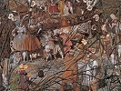

  
[Intangible Textual Heritage](../../index)  [Paganism](../index.md) 
[Celtic](../../neu/celt/index)  [Index](index)  [Previous](iwd02.md) 
[Next](iwd04.md) 

------------------------------------------------------------------------

[Buy this Book at
Amazon.com](https://www.amazon.com/exec/obidos/ASIN/B002BA65ME/internetsacredte.md)

------------------------------------------------------------------------

  
*Irish Witchcraft and Demonology*, by St. John D. Seymour, \[1913\], at
Intangible Textual Heritage

------------------------------------------------------------------------

p. 25

# CHAPTER II

#### A.D. 1324

## DAME ALICE KYTELER, THE SORCERESS OF KILKENNY

THE history of the proceedings against Dame Alice Kyteler and her
confederates on account of their dealings in unhallowed arts is to be
found in a MS. in the British Museum, and has been edited amongst the
publications of the Camden Society by Thomas Wright, who considers it to
be a contemporary narrative. Good modern accounts of it are given in the
same learned antiquary's "Narratives of Witchcraft and Sorcery" in
*Transactions of the Ossory Archæological Society*, vol. i., and in the
Rev. Dr. Carrigan's *History of the Diocese of Ossory*, vol. i.

Dame Alice Kyteler (such apparently being her maiden name), the *facile
princeps* of Irish witches, was a member of a good Anglo-Norman family
that had been settled

p. 26

in the city of Kilkenny for many ears. The coffin-shaped tombstone of
one of her ancestors, Jose de Keteller, who died in 128-, is preserved
at S. Mary's church; the inscription is in Norman-French and the
lettering is Lombardic. The lady in question must have been far removed
from the popular conception of a witch as an old woman of striking
ugliness, or else her powers of attraction were very remarkable, for she
had succeeded in leading four husbands to the altar. She had been
married, first, to William Outlawe of Kilkenny, banker; secondly, to
Adam le Blund of Callan; thirdly, to Richard de Valle--all of whom she
was supposed to have got rid of by poison; and fourthly, to Sir John le
Poer, whom it was said she deprived of his natural senses by philtres
and incantations.

The Bishop of Ossory at this period was Richard de Ledrede, a Franciscan
friar, and an Englishman by birth. He soon learnt that things were not
as they should be, for when making a visitation of his diocese early in
1324 he found by an Inquisition, in which were five knights and numerous

p. 27

nobles, that there was in the city a band of heretical sorcerers, at the
head of whom was Dame Alice. The following charges were laid against
them.

1\. They had denied the faith of Christ absolutely for a year or a
month, according as the object they desired to gain through sorcery was
of greater or less importance. During all that period they believed in
none of the doctrines of the Church; they did not adore the Body of
Christ, nor enter a sacred building to hear mass, nor make use of
consecrated bread or holy water.

2\. They offered in sacrifice to demons living animals, which they
dismembered, and then distributed at cross-roads to a certain evil
spirit of low rank, named the Son of Art.

3\. They sought by their sorcery advice and responses from demons.

4\. In their nightly meetings they blasphemously imitated the power of
the Church by fulminating sentence of excommunication, with lighted
candles, even against their own husbands, from the sole of their foot to
the crown of their head, naming each part expressly, and then concluded
by extinguishing

p. 28

the candles and by crying *Fi! Fi! Fi! Amen*.

5\. In order to arouse feelings of love or hatred, or to inflict death
or disease on the bodies of the faithful, they made use of powders,
unguents, ointments, and candles of fat, which were compounded as
follows. They took the entrails of cocks sacrificed to demons, certain
horrible worms, various unspecified herbs, dead men's nails, the hair,
brains, and shreds of the cerements of boys who were buried unbaptized,
with other abominations, all of which they cooked, with various
incantations, over a fire of oak-logs in a vessel made out of the skull
of a decapitated thief.

6\. The children of Dame Alice's four husbands accused her before the
Bishop of having killed their fathers by sorcery, and of having brought
on them such stolidity of their senses that they bequeathed all their
wealth to her and her favourite son, William Outlawe, to the
impoverishment of the other children. They also stated that her present
husband, Sir John le Poer, had been reduced to such a condition by
sorcery and the use of powders that he had

p. 29

become terribly emaciated, his nails had dropped off, and there was no
hair left on his body. No doubt he would have died had he not been
warned by a maid-servant of what was happening, in consequence of which
be had forcibly possessed himself of his wife's keys, and had opened
some chests in which be found a sackful of horrible and detestable
things which he transmitted to the bishop by the hands of two priests.

7\. The said dame had a certain demon, an incubus, named Son of Art, or
Robin son of Art, who had carnal knowledge of her, and from whom she
admitted that she had received all her wealth. This incubus made its
appearance under various forms, sometimes as a cat, or as a hairy black
dog, or in the likeness of a negro (Æthiops), accompanied by two others
who were larger and taller than he, and of whom one carried an iron rod.

According to another source the sacrifice to the evil spirit is said to
have consisted of nine red cocks, and nine peacocks' eyes. Dame Alice
was also accused of having "swept the streets of Kilkenny betweene
compleine and twilight, raking all the filth

p. 30

towards the doores of hir sonne William Outlawe, murmuring secretly with
hir selfe these words:

"To the house of William my sonne  
Hie all the wealth of Kilkennie towne."

On ascertaining the above the Bishop wrote to the Chancellor of Ireland,
Roger Outlawe, who was also Prior of the Preceptory of Kilmainham, for
the arrest of these persons. Upon this William Outlawe formed a strong
party to oppose the Bishop's demands, amongst which were the Chancellor,
his near relative, and Sir Arnold le Poer, the Seneschal of Kilkenny,
who was probably akin to Dame Alice's fourth husband. The Chancellor in
reply wrote to the Bishop stating that a warrant for arrest could not be
obtained until a public process of excommunication had been in force for
forty days, while Sir Arnold also wrote requesting him to withdraw the
case, or else to ignore it. Finding such obstacles placed in his way the
Bishop took the matter into his own hands, and cited the Dame, who was
then in her son's house in Kilkenny, to appear before him. As might be
expected,

p. 31

she ignored the citation, and fled immediately.

Foiled in this, he cited her son William for heresy. Upon this Sir
Arnold came with William to the Priory of Kells, where De Ledrede was
holding a visitation, and besought him not to proceed further in the
matter. Finding entreaty useless he had recourse to threats, which he
speedily put into execution. As the Bishop was going forth on the
following day to continue his visitation he was met on the confines of
the town of Kells by Stephen le Poer, bailiff of the cantred of Overk,
and a posse of armed men, by whom he was arrested under orders from Sir
Arnold, and lodged the same day in Kilkenny jail. This naturally caused
tremendous excitement in the city. The place became *ipso facto* subject
to an interdict; the Bishop desired the Sacrament, and it was brought to
him in solemn procession by the Dean and Chapter. All the clergy, both
secular and religious, flocked from every side to the prison to offer
their consolation to the captive, and their feelings were roused to the
highest pitch by the preaching of a Dominican,

p. 32

who took as his text, *Blessed are they which are persecuted*, &c.
Seeing this, William Outlawe nervously informed Sir Arnold of it, who
thereupon decided to keep the Bishop in closer restraint, but
subsequently changed his mind, and allowed him to have companions with
him day and night, and also granted free admission to all his friends
and servants.

After De Ledrede had been detained in prison for seventeen days, and Sir
Arnold having thereby attained his end, viz. that the day on which
William Outlawe was cited to appear should in the meantime pass by, he
sent by the hands of his uncle the Bishop of Leighlin (Miler le Poer),
and the sheriff of Kilkenny a mandate to the constable of the prison to
liberate the Bishop. The latter refused to sneak out like a released
felon, but assumed his pontificals, and, accompanied by all the clergy
and a throng of people, made his way solemnly to S. Canice's Cathedral,
where he gave thanks to God. With a pertinacity we cannot but admire he
again cited William Outlawe by public proclamation to appear before him,
but before the day arrived the Bishop

p. 33

was himself cited to answer in Dublin for having placed an interdict on
his diocese. He excused himself from attending on the plea that the road
thither passed through the lands of Sir Arnold, and that in consequence
his life would be in danger.

De Ledrede had been arrested by Le Poer's orders in Lent, in the year
1324. On Monday following the octave of Easter the Seneschal held his
court in Kilkenny, to which entrance was denied the Bishop; but the
latter, fully robed, and carrying the Sacrament in a golden vase, made
his way into the court-room, and "ascending the tribunal, and reverently
elevating the Body of Christ, sought from the Seneschal, Justiciary, and
Bailiffs that a hearing should be granted to him." The scene between the
two was extraordinary; it is too lengthy to insert, and does not bear to
be condensed--suffice it to say that the Seneschal alluded to the Bishop
as "that vile, rustic, interloping monk (trutannus), with his dirt
(hordys) which he is carrying in his hands," and refused to hear his
arguments, or to afford him any assistance.

Though we have lost sight for a while

p. 34

of Dame Alice, yet she seems to have been eagerly watching the trend of
events, for now we find her having the Bishop summoned to Dublin to
answer for having excommunicated her, uncited, unadmonished, and
unconvicted of the crime of sorcery. He attended accordingly, and found
the King's and the Archbishop's courts against him to a man, but the
upshot of the matter was that the Bishop won the day; Sir Arnold was
humbled, and sought his pardon for the wrongs he had done him. This was
granted, and in the presence of the council and the assembled prelates
they mutually gave each other the kiss of peace.

Affairs having come to such a satisfactory conclusion the Bishop had
leisure to turn his attention to the business that had unavoidably been
laid aside for some little time. He directed letters patent, praying the
Chancellor to seize the said Alice Kyteler, and also directed the
Vicar-General of the Archbishop of Dublin to cite her to respond on a
certain day in Kilkenny before the Bishop. But the bird escaped again
out of the hand of the fowler. Dame Alice fled a second time, on this
occasion

p. 35

from Dublin, where she had been living, and (it is said) made her way to
England, where she spent the remainder of her days unmolested. Several
of her confederates were subsequently arrested, some of them being
apparently in a very humble condition of life, and were committed to
prison. Their names were: Robert of Bristol, a clerk, John Galrussyn,
Ellen Galrussyn, Syssok Galrussyn, William Payn de Boly, Petronilla of
Meath, her daughter Sarah, [1](#fn_4.md) Alice the
wife of Henry Faber, Annota Lange, and Eva de Brownestown. When the
Bishop arrived in Kilkenny from Dublin he went direct to the prison, and
interviewed the unfortunates mentioned above. They all immediately
confessed to the charges laid against them, and even went to the length
of admitting other crimes of which no mention had been made; but,
according to them, Dame Alice was the mother and mistress of them all.
Upon this the Bishop wrote letters on the 6th of June to the Chancellor,
and to the Treasurer, Walter de Islep, requesting them to order the
Sheriff to attach the bodies of these people and put

p. 36

them in safe keeping. But a warrant was refused, owing to the fact that
William Outlawe was a relation of the one and a close friend of the
other; so at length the Bishop obtained it through the Justiciary, who
also consented to deal with the case when he came to Kilkenny.

Before his arrival the Bishop summoned William Outlawe to answer in S.
Mary's Church. The latter appeared before him, accompanied by a band of
men armed to the teeth; but in no way overawed by this show of force, De
Ledrede formally accused him of heresy, of favouring, receiving, and
defending heretics, as well as of usury, perjury, adultery, clericide,
and excommunications--in all thirty-four items were brought forward
against him, and he was permitted to respond on the arrival of the
Justiciary. When the latter reached Kilkenny, accompanied by the
Chancellor, the Treasurer, and the King's Council, the Bishop in their
presence recited the charges against Dame Alice, and with the common
consent of the lawyers present declared her to be a sorceress, magician,
and heretic, and demanded that she should be handed over

p. 37

to the secular arm and have her goods and chattels confiscated as well.
judging from Friar Clyn's note this took place on the 2nd of July. On
the same day the Bishop caused a great fire to be lit in the middle of
the town in which he burnt the sackful of magical stock-in-trade,
consisting of powders, ointments, human nails, hair, herbs, worms, and
other abominations, which the reader will remember he had received from
Sir John le Poer at an early stage in the proceedings.

Further trouble arose with William Outlawe, who was backed by the
Chancellor and Treasurer, but the Bishop finally succeeded in beating
him, and compelled him to submit on his bended knees. By way of penance
he was ordered to hear at least three masses every day for the space of
a year, to feed a certain number of poor people, and to cover with lead
the chancel of S. Canice's Cathedral from the belfry eastward, as well
as the Chapel of the Blessed Virgin. He thankfully agreed to do this,
but subsequently refused to fulfil his obligations, and was thereupon
cast into prison.

p. 38

What was the fate of Dame Alice's accomplices, whose names we have given
above, is not specifically recorded, except in one particular instance.
One of them, Petronilla of Meath, was made the scapegoat for her
mistress. The Bishop had her flogged six times, and under the repeated
application of this form of torture she made the required confession of
magical practices. She admitted the denial of her faith and the
sacrificing to Robert, son of Art, and as well that she had caused
certain women of her acquaintance to appear as if they had goats' horns,
She also confessed that at the suggestion of Dame Alice she had
frequently consulted demons and received responses from them, and that
she had acted as a "medium" (mediatrix) between her and the said Robert.
She declared that although she herself was mistress of the Black Art,
yet she was as nothing in comparison with the Dame from whom she had
learnt all her knowledge, and that there was no one in the world more
skilful than she. She also stated that William Outlawe deserved death as
much as she, for he was privy to their sorceries, and for a year and

p. 39

a day had worn the devil's girdle [1](#fn_5.md)
round his body. When rifling Dame Alice's house there was found "a wafer
of sacramental bread, having the devil's name stamped thereon instead of
Jesus Christ, and a pipe of ointment wherewith she greased a staffe,
upon which she ambled and galloped through thicke and thin, when and in
what manner she listed." Petronilla was accordingly condemned to be
burnt alive, and the execution of this sentence took place with all due
solemnity in Kilkenny on 3rd November 1324, which according to Clyn fell
on a Sunday. This was the first instance of the punishment of death by
fire being inflicted in Ireland for heresy.

Whether or not Petronilla's fellow-prisoners were punished is not clear,
but the words of the anonymous narrator show us that the burning of that
unfortunate wretch was rather the beginning than the end of
persecution--that in fact numerous other suspected persons were followed
up, some of whom shared her terrible fate, while to others milder

p. 40

forms of punishment were meted out, no doubt in proportion to their
guilt. He says: "With regard to the other heretics and sorcerers who
belonged to the pestilential society of Robin, son of Art, the order of
law being pre, served, some of them were publicly burnt to death;
others, confessing their crimes in the presence of all the people, in an
upper garment, are marked back and front with a cross after they had
abjured their heresy, as is the custom; others were solemnly whipped
through the town and the market-place; others were banished from the
city and diocese; others who evaded the jurisdiction of the Church were
excommunicated; while others again fled in fear and were never heard of
after. And thus, by the authority of Holy Mother Church, and by the
special grace of God, that most foul brood was scattered and destroyed."

Sir Arnold le Poer, who had taken such a prominent part in the affair,
was next attacked. The Bishop accused him of heresy, had him
excommunicated, and committed prisoner to Dublin Castle. His innocency
was believed in by most people,

p. 41

and Roger Outlawe, Prior of Kilmainham, who also figures in our story,
and who was appointed Justiciary of Ireland in 1328, showed him some
kindness, and treated him with humanity. This so enraged the Bishop that
he actually accused the Justiciary of heresy. A select committee of
clerics vindicated the orthodoxy of the latter, upon which he prepared a
sumptuous banquet for his defenders. Le Poer died in prison the same
year, 1331, before the matter was finally settled, and as he was under
ban of excommunication his body lay unburied for a long period.

But ultimately the tables were turned with a vengeance. De Ledrede was
himself accused of heresy by his Metropolitan, Alexander de Bicknor,
upon which he appealed to the Holy See, and set out in person for
Avignon. He endured a long exile from his diocese, suffered much
hardship, and had his temporalities seized by the Crown as well. In 1339
he recovered the royal favour, but ten years later further accusations
were brought to the king against him, in consequence of which the
temporalities were a second time taken up, and other

p. 42

severe measures were threatened. However, by 1356 the storm had blown
over; he terminated a lengthy and disturbed episcopate in 1360, and was
buried in the chancel of S. Canice's on the north side of the high
altar. A recumbent effigy under an ogee-headed canopy is supposed to
mark the last resting-place of this turbulent prelate.

In the foregoing pages we have only given the barest outline of the
story, except that the portions relative to the practice of sorcery have
been fully dealt with as pertinent to the purpose of this book, as well
as on account of the importance of the case in the annals of Irish
witchcraft. The story of Dame Alice Kyteler and Bishop de Ledrede
occupies forty pages of the Camden Society's publications, while
additional illustrative matter can be obtained from external sources;
indeed, if all the scattered material were gathered together and
carefully sifted it would be sufficient to make a short but interesting
biography of that prelate, and would throw considerable light on the
relations between Church and State in Ireland in the fourteenth century.
With regard to the tale it is difficult to know

p. 43

what view should be taken of it. Possibly Dame Alice and her associates
actually tried to practise magical arts, and if so, considering the
period at which it occurred, we certainly cannot blame the Bishop for
taking the steps he did. On the other hand, to judge from the analogy of
Continental witchcraft, it is to be feared that De Ledrede was to some
extent swayed by such baser motives as greed of gain and desire for
revenge. He also seems to have been tyrannical, overbearing, and
dictatorial; according to him the attitude adopted by the Church should
never be questioned by the State, but this view was not shared by his
opponents. Though our sympathies do not lie altogether with him, yet to
give him his due it must be said that he was as ready to be persecuted
as to persecute; he did not hesitate to face an opposition which
consisted of some of the highest in the land, nor did fear of attack or
imprisonment (which he actually suffered) avail to turn him aside from
following the course he had mapped out for himself.

It should be noticed that the appointment of De Ledrede to the See of
Ossory

p. 44

almost synchronised with the elevation of John XXII to the Papacy. The
attitude of that Pope towards magical arts was no uncertain one. He
believed himself to be surrounded by enemies who were ever making
attempts on his life by modelling images of him in wax, to be
subsequently thrust through with pins and melted, no doubt; or by
sending him a devil enclosed in a ring, or in various other ways.
Consequently in several Bulls he anathematised sorcerers, denounced
their ill-deeds, excited the inquisitors against them, and so gave
ecclesiastical authorisation to the reality of the belief in magical
forces. Indeed, the general expressions used in the Bull *Super illius
specula* might be applied to the actions of Dame Alice and her party. He
says of certain persons that "they sacrifice to demons and adore them.
making or causing to be made images, rings, &c., with which they draw
the evil spirits by their magical art, obtain responses from them, and
demand their help in performing their evil designs." [1](#fn_6.md)

Heresy and sorcery were now identified, and the punishment for the
former was the

p. 45

same as that for the latter, viz. burning at the stake and confiscation
of property. The attitude of this Pontiff evidently found a sympathiser
in Bishop de Ledrede, who deemed it necessary to follow the example set
by the Head of the Church, with what results we have already shown: thus
we find in Ireland a ripple of the wave that swept over Europe at this
period.

It is very probable, too, that there were many underlying local causes
of which we can know little or nothing; the discontent and anger of the
disinherited children at the loss of the wealth of which Dame Alice had
bereft them by her exercise of "undue influence" over her husbands,
family quarrels, private hatreds, and possibly national jealousy helped
to bring about one of the strangest series of events in the chequered
history of Ireland.

------------------------------------------------------------------------

### Footnotes

[35:1](iwd03.htm#fr_4.md) Elsewhere given as
Basilia.

[39:1](iwd03.htm#fr_5.md) Magical girdles were used
for various purposes. Bosc in his *Glossaire* will have them to be the
origin of the magnetic belts, &c. that are so freely advertised at the
present day.

[44:1](iwd03.htm#fr_6.md) Français, *op. cit*.

------------------------------------------------------------------------

[Next: Chapter III: A.D. 1223-1583](iwd04.md)
