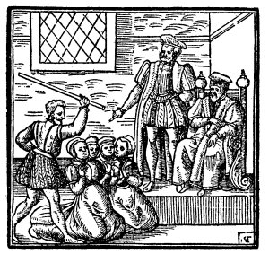

[Intangible Textual Heritage](../../index)  [Wicca and
Paganism](../index) 

------------------------------------------------------------------------

[The World of Mary, Queen of Scots](https://www.marie-stuart.co.uk/)
Explore the historical background of this text. \[Exterior Site\]

------------------------------------------------------------------------

<table width="100%">
<colgroup>
<col style="width: 50%" />
<col style="width: 50%" />
</colgroup>
<tbody>
<tr class="odd">
<td></td>
<td>
<h1 id="dæmonologie" data-align="CENTER">DÆMONOLOGIE</h1>
<h2 id="by-king-james-the-first" data-align="CENTER">by KING JAMES the FIRST</h2>
<h5 id="section" data-align="CENTER">(1597)</h5>
<em></em>
<h6 id="and" data-align="CENTER">and</h6>
<h2 id="newes-from-scotland" data-align="CENTER">NEWES FROM SCOTLAND</h2>
<h5 id="section-1" data-align="CENTER">(1591)</h5></td>
</tr>
</tbody>
</table>

The first text presented here, written by James I of England, is a
wide-ranging discussion of witchcraft, necromancy, possession, demons,
were-wolves, fairies and ghosts, in the form of a Socratic dialogue. The
second text is a sensational historical account of Scottish witch
persecution and is one of the sources cited by [Margaret
Murray](../murray). I have taken some care to transcribe these
historical documents letter for letter, without any attempt at
correction or modernization of spelling. These documents exemplify the
convoluted intellectual rationalizations used to justify the barbaric
witch hunts. The texts were scanned from an early 20th Century reprint.

------------------------------------------------------------------------

[Title Page](kjd00)  
[Introduction to the Bodley Head Edition](kjd01)  
[Dæmonologie - Original Title Page](kjd02)  
[Preface](kjd03)  
[Dæmonologie: The First Booke.](kjd04)  
[Dæmonologie: The Seconde Booke](kjd05)  
[Dæmonologie: The Thirde Booke](kjd06)  
[Errata](kjd07)  
[Newes From Scotland - Title Page](kjd08)  
[Newes from Scotland - Original Title Page,](kjd09)  
[To the Reader](kjd10)  
[Newes from Scotland](kjd11)  
