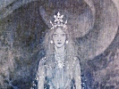

  
[Intangible Textual Heritage](../../index)  [Neopaganism](../index) 
[Index](index)  [Previous](sor02)  [Next](sor04) 

------------------------------------------------------------------------

[Buy this Book at
Amazon.com](https://www.amazon.com/exec/obidos/ASIN/B002DUCMUG/internetsacredte)

------------------------------------------------------------------------

  
*The Sorceress*, by Jules Michelet, \[1939\], at Intangible Textual
Heritage

------------------------------------------------------------------------

p. 1 p. 2

p. 3

### PART ONE

### 1

### *DEATH of the GODS*

THERE are authors who assure us that a little while before the final
victory of Christianity a mysterious voice was heard along the shores of
the Ægean Sea, proclaiming: "Great Pan is dead!"

The old universal god of Nature is no more. Great the jubilation; it was
fancied that, Nature being defunct, Temptation was dead too.
Storm-tossed for so many years, the human soul was to enjoy peace at
last.

Was it simply a question of the termination of the ancient worship, the
defeat of the old faith, the eclipse of time-honoured religious forms?
No! it was more than this. Consulting the earliest Christian monuments,
we find in every line the hope expressed, that Nature is to disappear
and life die out—in a word, that the end of the world is at hand.

The game is up for the gods of life, who have so long kept up a vain
simulacrum of vitality. Their world is falling round them in crumbling
ruin. All is swallowed up in nothingness: "Great Pan is dead!"

 

It was no new evangel that the gods must die. More than one ancient cult
is based on this very notion of the death of the gods. Osiris dies,
Adonis dies—it is true, in this case, to rise again. Æschylus, on the
stage itself, in those dramas that were played only on the feast-days of
the gods, expressly warns them, by the voice of Prometheus, that one day
they must die. Die! but how?—vanquished, subjugated to the Titans, the
antique powers of Nature.

Here it is an entirely different matter. The early Christians,

p. 4

as a whole and individually, in the past and in the future, hold Nature
herself accursed. They condemn her as a whole and in every part, going
so far as to see Evil incarnate, the Demon himself, in a flower. [1](#fn_2) So, welcome—and the sooner the better—the
angel-hosts that of old destroyed the Cities of the Plain. Let them
destroy, fold away like a veil, the empty image of the world, and at
length deliver the saints from the long-drawn ordeal of temptation.

The Gospel says: "The day is at hand." The Fathers say: "Soon, very
soon." The disintegration of the Roman Empire and the inroads of the
barbarian invaders raise hopes in St. Augustine's breast, that soon
there will be no city left but the City of God.

Yet how long a-dying the world is, how obstinately determined to live
on! Like Hezekiah, it craves a respite, a going backward of the dial. So
be it then, till the year One Thousand,—but not a day longer.

 

Is it so certain, as we have been told over and over again, that the old
gods were exhausted, sick of themselves and weary of existence? that out
of sheer discouragement they as good as gave in their own abdication?
that Christianity was able with a breath to blow away these empty
phantoms?

They point to the gods at Rome, the gods of the Capitol, where they were
only admitted in virtue of an anticipatory death, I mean on condition of
resigning all they had of local sap, of renouncing their home and
country, of ceasing to be deities representative of such and such a
nation. Indeed, in order to receive them, Rome had had to submit them to
a cruel operation, that left them poor, enervated, bloodless creatures.
These great centralised Divinities had become, in their official life,
mere dismal functionaries of the Roman Empire. But, though fallen from
its high estate, this Aristocracy of Olympus had in nowise involved in
its own decay the host of indigenous gods, the crowd

p. 5

of deities still holding possession of the boundless plains, of woods
and hills and springs, inextricably blended with the life of the
countryside. These divinities, enshrined in the heart of oaks, lurking
in rushing streams and deep pools, could not be driven out.

Who says so? The Church herself, contradicting herself flatly. She first
proclaims them dead, then waxes indignant because they are still alive.
From century to century, by the threatening voice of her Councils, [2](#fn_3) she orders them to die. . . . And lo! they
are as much alive as ever!

"They are demons . . ."—and therefore alive. Unable to kill them, the
Church suffers the innocent-hearted countryfolk to dress them up and
disguise their true nature. Legends grow round them, they are baptised,
actually admitted into the Christian hierarchy. But *are* they
converted? Not yet by any means. We catch them still on the sly
continuing their old heathen ways and Pagan nature.

Where are they to be found? In the desert, on lonely heaths, in wild
forests? Certainly, but above all in the house. They cling to the most
domestic of domestic habits; women guard and hide them at board and even
bed. They still possess the best stronghold in the world—better than the
temple, to wit the hearth.

 

History knows of no other revolution so violent and unsparing as that of
Theodosius. There is no trace elsewhere in antiquity of so wholesale a
proscription of a religion. The Persian fire-worship, in its
high-wrought purity, might outrage the visible gods of other creeds; but
at any rate it suffered them to remain. Under it the Jews were treated
with great clemency, and were protected and employed. Greece, daughter
of the light, made merry over the gods of darkness, the grotesque
pot-bellied Cabiri; but still she tolerated them, and even adopted them
as working gnomes, making her own Vulcan in their likeness. Rome,

p. 6

in the pride of her might, welcomed not only Etruria, but the rustic
gods as well of the old Italian husbandman. The Druids she persecuted
only as embodying a national resistance dangerous to her dominion.

Victorious Christianity, on the contrary, was fain to slaughter the
enemy outright, and thought to do so. She abolished the Schools of
Philosophy by her proscription of Logic and the physical extermination
of the philosophers, who were massacred under the Emperor Valens. She
destroyed or stripped the temples, and broke up the sacred images. Quite
conceivably the new legend might have proved favourable to family life,
if only the father had not been humiliated and annulled in St. Joseph,
if the mother had been given prominence as the trainer, the moral parent
of the child Jesus. But this path, so full of rich promise, was from the
first abandoned for the barren ambition of a high, immaculate purity.

Thus Christianity deliberately entered on the lonely road of celibacy,
one the then world was making for of its own impulse—a tendency the
imperial rescripts fought against in vain. And Monasticism helped it on
the downward slope.

Men fled to the desert; but they were not alone. The Devil went with
them, ready with every form of temptation. They must needs revolutionise
society, found cities of solitaries,—it was of no avail. Everyone has
heard of the gloomy cities of anchorites that grew up in the Thebaïd, of
the turbulent, savage spirit that animated them, and of their murderous
descents upon Alexandria. They declared they were possessed of the
Devil, impelled by demons,—and they told only the truth.

There was an enormous void arisen in Nature's plan. Who or what should
fill it? The Christian Church is ready with an answer: The Demon,
everywhere the Demon—*Ubique Dæmon*. [3](#fn_4)

Greece no doubt, like all other countries, had had its *energumens*,

p. 7

men tormented, possessed by spirits. But the similarity is purely
external and accidental, the resemblance more apparent than real. In the
Thebaïd it is no case of spirits either good or bad, but of the gloomy
children of the pit, wilfully perverse and malignant. Everywhere, for
years to come, these unhappy hypochondriacs are to be seen roaming the
desert, full of self-loathing and self-horror. Try to realise, indeed,
what it means,—to be conscious of a double personality, to really
believe in this second self, this cruel indweller that comes and goes
and expiates within you, and drives you to wander forth in desert places
and over precipices. Thinner and weaker grows the sufferer; and the
feebler his wretched body, the more fiercely the demon harries it. Women
in particular are filled, distended, inflated by these tyrants, who
impregnate them with the infernal aura, stir up internal storm and
tempest, make them the sport and plaything of their every caprice, force
them into sin and despair.

Nor is it human beings only that are demoniac. Alas! all Nature is
tainted with the horror. If the devil is in a flower, how much more in
the gloomy forest! The light that seemed so clear and pure is full of
the creatures of night. The Heavens full of Hell,—what blasphemy! The
divine morning star, that has shed its sparkling beam on Socrates,
Archimedes, Plato, and once and again inspired them to sublimer effort,
what is it now?—a devil, the great devil *Lucifer*. At eve, it is the
devil *Venus*, whose soft and gentle light leads mortals into
temptation.

I am not surprised at such a society turning mad and savage. Furious to
feel itself so weak against the demons, it pursues them everywhere, in
the temples and altars of the old faith to begin with, later in the
heathen martyrs. Festivals are abolished; for may they not be
assemblages for idolatrous worship? Even the family is suspect; for
might not the force of habit draw the household together round the old
classic Lares? And why a family at all? The empire is an empire of
monks.

Yet the individual man, isolated and struck silent as he is, still gazes
at the skies, and in the heavenly host finds once more

p. 8

the old gods of his adoration. "This is what causes the famines," the
Emperor Theodosius declares, "and all the other scourges of the
Empire,"—a terrible dictum that lets loose the blind rage of the fanatic
populace on the heads of their inoffensive Pagan fellow-citizens. The
Law blindly unchains all the savagery of mob-law.

Old gods of Heathendom, the grave gapes for you! Gods of Love, of Life,
of Light, darkness waits to engulf you! The cowl is the only wear.
Maidens must turn nuns; wives leave their husbands, or if they still
keep the domestic hearth, be cold and continent as sisters.

But is all this possible? Who shall be strong enough with one breath to
blow out the glowing lamp of God? So reckless an enterprise of impious
piety may well bring about strange, monstrous, and astounding results. .
. . Let the guilty tremble!

Repeatedly in the Middle Ages shall we find the gloomy story recurring
of the Bride of Corinth. First told in quite early days by Phlegon, the
Emperor Hadrian's freedman, it reappears in the twelfth century, and
again in the sixteenth,—the deep reproach, as it were, the irrepressible
protest of outraged Nature.

 

"A young Athenian goes to Corinth, to the house of the man who promises
him his daughter in marriage. He is still a Pagan, and is not aware that
the family he hopes to become a member of has just turned Christian. He
arrives late at night. All are in bed, except the mother, who serves the
meal hospitality demands, and then leaves him to slumber, half dead with
fatigue. But hardly is he asleep, when a figure enters the room,—a
maiden, clad in white, wearing a white veil and on her brow a fillet of
black and gold. Seeing him, she raises her white hand in surprise: 'Am I
then already so much a stranger in the house? . . . Alas! poor recluse.
. . . But I am filled with shame, I must begone.' 'Nay! stay, fair
maiden; here are Ceres and Bacchus, and with *you*, love! Fear not, and
never look so pale!' 'Back, back, I say! I have no right to happiness
any more. By a vow my sick mother

p. 9

made, youth and life are for ever fettered. The gods are no more, and
the only sacrifices now are human souls.' 'What! can this be you? You,
my promised bride I love so well, promised me from a child? Our fathers’
oath bound us indissolubly together under Heaven's blessing. Maiden! be
mine!' 'No! dear heart, I cannot. You shall have my young sister. If I
groan in my chill prison-house, you in her arms must think of me, me who
waste away in thoughts of you, and who will soon be beneath the sod.'
'No! no! I call to witness yonder flame; it is the torch of Hymen. You
shall come with me to my father's house. Stay with me, my best beloved!'
For wedding gift he offers her a golden cup. She gives him her
neck-chain; but chooses rather than the cup a curl of his hair.

"’Tis the home of spirits; she drinks with death-pale lips the dark,
blood-red wine. He drinks eagerly after her, invoking the God of Love.
Her poor heart is breaking, but still she resists. At last in despair he
falls weeping on the bed. Then throwing herself down beside him: 'Ah!
how your grief hurts me! Yet the horror of it, if you so much as touched
me! White as snow, and cold as ice, such alas! and alas! is your
promised bride.' 'Come to me! I will warm you, though you should be
leaving the very tomb itself. . . .' Sighs, kisses pass between the
pair. 'Cannot you feel how I burn?' Love unites them, binds them in one
close embrace, while tears of mingled pain and pleasure flow. Thirstily
she drinks the fire of his burning mouth; her chilled blood is fired
with amorous ardours, but the heart stands still within her bosom.

"But the mother was there, though they knew it not, listening to their
tender protestations, their cries of sorrow and delight. 'Hark! the
cock-crow! Farewell till to-morrow, to-morrow night!' A lingering
farewell, and kisses upon kisses!

"The mother enters furious, to find her daughter! Her lover strives to
enfold her, to hide her, from the other's view; but she struggles free,
and towering aloft from the couch to the vaulted roof: 'Oh! mother,
mother! so you begrudge me my night of joy,

p. 10

you hunt me from this warm nest. Was it not enough to have wrapped me in
the cold shroud, and borne me so untimely to the tomb? But a power
beyond you has lifted the stone. In vain your priests droned their
prayers over the grave; of what avail the holy water and the salt, where
youth burns hot in the heart? Cold earth cannot freeze true Love! . . .
You promised; I am returned to claim my promised happiness. . . .

"'Alack! dear heart, you must die. You would languish here and pine
away. I have your hair; ’twill be white to-morrow. [4](#fn_5) . . . Mother, one last prayer! Open my dark
dungeon, raise a funeral pyre, and let my loving heart win the repose
the flames alone can give. Let the sparks fly upward and the embers
glow! We will back to our old gods again.'"

------------------------------------------------------------------------

### Footnotes

[4:1](sor03.htm#fr_2) Compare Muratori, *Script.
It.*, i. 293, 545, on St. Cyprian; A. Maury, *Magie*, 435.

[5:2](sor03.htm#fr_3) See Mansi, Baluze; Council
of Arles, 442; Tours, 567; Leptines, 743; the *Capitularies*, etc.
Gerson even, towards 1400.

[6:3](sor03.htm#fr_4) See the *Lives of the
Fathers of the Desert*, and the authors quoted by A. Maury, *Magie*,
317. In the fourth century the Messalians, believing themselves to be
full of demons, were constantly blowing their noses, and spitting
unceasingly, in their incredible efforts to expectorate these.

[10:4](sor03.htm#fr_5) At this point of the story
I suppress an expression that may well shock us. Goethe, so noble in the
form of his writings, is not equally so in the spirit. He quite mars the
wonderful tale, fouling the Greek with a gruesome Slavonic notion. At
the instant when the lovers are dissolved in tears, he makes the girl
into a vampire. She curses because she is athirst for blood, to suck his
heart's blood. The poet makes her say coldly and calmly this impious and
abominable speech: "When he is done, *I will go on to others;* the new
generation shall succumb to my fury."

The Middle Ages dress up this tradition in grotesque garb to terrify us
with the devil Venus. Her statue receives from a young man a ring, which
he imprudently places on her finger. Her hand closes on it, she keeps it
as a sign of betrothal; then at night, comes into his bed to claim the
rights it confers. To rid him of his hellish bride, an exorcism is
required (S. Hibb., part iii. chap. iii. 174). The same story occurs in
the *Fabliaux*, but absurdly enough applied to the Virgin. Luther
repeats the classical story, if my memory serves me, in his
*Table-talk*, but with great coarseness, letting us smell the foulness
of the grave. The Spaniard Del Rio transfers the scene from Greece to
Brabant. The affianced bride dies shortly before the wedding-day. The
passing-bell is tolled; the grief-stricken bridegroom roams the fields
in despair. He hears a wail; it is the loved one wandering over the
heath. . . . "See you not," she cries, "who my guide is?" "No!" he
replies, and seizing her, bears her away to his home. Once there, the
account was very near growing over tender and touching. The grim
inquisitor, Del Rio, cuts short the thread with the words, "Lifting the
veil, they found a stake with a dead woman's skin drawn over it." The
Judge Le Loyes, though not much given to sensibility, nevertheless
reproduces for us the primitive form of the legend. After him, there is
an end of these gloomy story-tellers, whose trade is done. Modern days
begin, and the Bride has won the day. Buried Nature comes back from the
tomb, no longer a stealthy visitant, but mistress of the house and home.

------------------------------------------------------------------------

[Next: 2. What Drove the Middle Ages to Despair](sor04)
