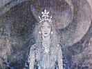

  
[Intangible Textual Heritage](../../index)  [Neopaganism](../index) 
[Index](index)  [Previous](sor17)  [Next](sor19) 

------------------------------------------------------------------------

[Buy this Book at
Amazon.com](https://www.amazon.com/exec/obidos/ASIN/B002DUCMUG/internetsacredte)

------------------------------------------------------------------------

  
*The Sorceress*, by Jules Michelet, \[1939\], at Intangible Textual
Heritage

------------------------------------------------------------------------

p. 150

### 16

### *THE BASQUE WITCHES* *1609*

THIS high-handed execution of priests shows plainly enough that M. de
Lancre was a man of an enterprising and independent spirit. The same is
true of him in politics. In his book *Du Prince* ("Of the Prince") 1617,
he makes no bones about declaring that "the Law is above the King."

Never have the Basques been better characterised than in his work
*L’Inconstance des Démons*, above mentioned. In France no less than in
Spain, the privileges they enjoyed really constituted them a virtual
republic. The French Basques owed nothing whatever to the King beyond
the obligation of serving him under arms; at the first tuck of drum they
were bound to put two thousand men in the field, under their own Basque
captains. The clergy were of small weight or account, and did little in
the way of punishing Sorcerers, being in the trade themselves. The
priests used to dance, wear swords, and take their mistresses with them
to the "Sabbath." These mistresses were the priests' sacristanesses or
*bénédictes*, the female officials who kept the church in order. The
curé quarrelled with no one, said his White Mass for God day by day, and
a-nights the Black Mass for the Devil,—sometimes actually in the same
church (Lancre).

The Basques of Bayonne and Saint-Jean-de-Luz, a reckless and fantastic
race, and marked by an incredible degree of audacious daring, accustomed
as they were to visit the wildest seas in pursuit of the whale fishery,
made many widows. Moreover, they crowded in numbers to the colonies
founded by King Henri IV., and formed the empire of Canada, leaving
their wives

p. 151

behind in the care of God or the Devil, as the case might be. As for the
children, these sailors, a very upright and godfearing set of men, would
have made more account of them, if they could only have been more sure
on the question of fatherhood. Returning after their long periods of
absence, they would reckon up the time and count the months,—and
invariably found themselves quite out of their calculations.

The women, pretty, bold-eyed and imaginative creatures, would pass the
whole day in the churchyards, sitting on the tombs and gossiping of the
Witches’ Sabbath, which they were going to attend so soon as night fell.
This was the passion, the infatuation of their lives.

Nature makes them Sorceresses from the cradle, these daughters of ocean
nurtured on weird and fantastic legends. They swim like fishes, every
one of them, and sport boldly amid the Atlantic rollers. Manifestly
their master the Prince of the Air, king of winds and wild dreams, the
same who inspired the Sibyl and whispered the secrets of the future in
her ear.

The very judge that burns them is all the while charmed with their
fascinations. "When you see them pass," he writes, "their hair flying in
the wind and brushing their shoulders, so well adorned and caparisoned
are they, as they go, with their lovely locks, that the sun glancing
through them as through a cloud, makes a flashing aureole of dazzling
radiance. . . . Hence the dangerous fascination of their eyes, perilous
for love no less than for witchery."

This worthy citizen of Bordeaux and amiable magistrate, the earliest
type of those polished men of the world who ornamented and enlivened the
Bench in the seventeenth century, plays the lute in the intervals of
judicial business, and even sets the Sorceresses dancing before having
them burned. He writes well and in a style of much greater lucidity than
any of his fellows. And yet at the same time we discern in his case a
fresh source of obscurity, arising inevitably from the circumstances of
his day, viz. that among so great a number of Witches, all of whom the

p. 152

judge cannot of course condemn to the stake, the greater part are quite
clever enough to understand he is likely to show indulgence towards such
as shall best enter into his preconceived ideas and feed his peculiar
passion. What passion was this? First and foremost, a common failing
enough, love of the marvellous and horrible for its own sake, the
pleasure of being startled and terrified, and added to this, it must be
admitted, the fun of indecent revelations. A touch of vanity besides;
the more formidable and fierce these women are artful enough to make the
Devil appear, the more is the judge flattered and exalted who can master
so fell an adversary. He savours the sweets of victory, gloats over his
silly success, poses triumphant amid all this foolish cackle.

The finest example is to be found in the Spanish official report of the
Auto-da-fé at Logroño (November 9th, 1610), as given in Llorente.
Lancre, who quotes it not without envy, and is by way of depreciating
the whole thing, yet admits the unspeakable charm of the fête, its
magnificence as a spectacle, and the profound effect of the music. On
one scaffold stood the condemned Sorceresses, a scanty band, and on
another the crowd of the reprieved. The repentant heroine, whose
confession was read out, stuck at nothing, however wild and improbable.
At the Sabbaths they ate children, hashed; and as second course dead
wizards dug up from their graves. Toads dance, talk, complain amorously
of their mistresses’ unkindnesses, and get the Devil to scold them. This
latter sees the Witches home with great politeness, lighting the way
with the blazing arm of an unbaptised infant, etc., etc.

Witchcraft among the French Basques showed a less fantastic aspect. It
would seem that with them the "Sabbath" was little more than a fête on a
large scale, which everybody, including even the nobles of the country,
attended in search of amusement. In the front rank appeared a row of
veiled and masked figures, believed by some to be Princes. "In former
days," Lancre says, "only the simple, dull-witted peasantry of the

p. 153

\[paragraph continues\] Landes were to be
seen at these assemblages. Now people of quality are to be found there."
By way of compliment to these local notabilities, Satan would
frequently, under such circumstances, elect a *Bishop of the Sabbath*.
Such is the title the young Seigneur Lancinena received from him, with
whom the Devil was graciously pleased personally to open the ball.

Thus influentially supported, the Sorceresses reigned supreme,
exercising over the country an almost incredible domination by means of
the terrors of the imagination. Numbers of persons came to believe
themselves their victims, and actually fell seriously ill. Many were
attacked by epilepsy, and started barking like dogs. One small town
alone, Acqs, counted among its inhabitants as many as forty of these
unhappy creatures. Such was the terrible relationship that bound them
under the Witch's influence, that on one occasion a lady, called as a
witness, at the mere approach of the Sorceress, whom she could not even
see, began barking furiously, and was utterly unable to stop herself.

Those who were accredited with so formidable a power were masters of the
situation, and no man durst shut his door against them. A magistrate
even, the Criminal Assessor of Bayonne, allowed the "Sabbath" to be held
at his house. The Seigneur de Saint-Pé, Urtubi, was constrained to
celebrate the festival at his castle. But so much were his wits shaken
by the event that he became firmly persuaded a Witch was sucking his
blood. Terror lending him courage, he and another baron hastened to
Bordeaux and appealed to the Parlement there. The latter body obtained
the King's orders that two of its members, Messieurs d’Espagnet and de
Lancre, should be despatched to judge the Sorcerers and Sorceresses of
the Basque provinces. They were given plenary powers, subject to no
appeal; and setting to work with unexampled vigour, in four short months
tried from sixty to eighty Witches, besides examining five hundred more
equally marked with the Devil's stigmata, but who figured in the courts
only as witnesses (May to August, 1609).

p. 154

It was an enterprise by no means devoid of danger for two men and a few
soldiers to proceed to such measures in the midst of a lawless and
headstrong population, and a mob of sailors' wives, notoriously a
reckless and violent set of women. A second risk came from the priests,
numbers of whom were Sorcerers themselves, and whom the lay
Commissioners were bound to bring to trial in spite of the fierce
opposition of the clergy.

On the judges' arrival many fled with all speed to the mountains. Others
put a better face on the matter and remained, declaring it was the
judges who would be burned. So undismayed were the Witches, that
actually in court they would doze off in the "Sabbatical" sleep, and
openly describe on awakening how before the judges’ very eyes they had
been enjoying the delights of satanic intercourse. Several declared,
"Our only regret is that we cannot properly show him how we burn to
suffer for his sake."

When questioned they would affirm they could not speak,—that Satan rose
in their throats and obstructed their utterance.

The younger of the two Commissioners, Lancre, the same who writes these
accounts, was a man of the world, and the Witches were not slow to
perceive that with such a judge to deal with there were possible
loopholes of escape. The phalanx was broken. A beggar-girl of seventeen,
Little Murgin, as she was called (Margarita), who had found in Sorcery a
profitable speculation, and who, while scarce more than a child herself,
had been in the habit of bringing children and offering them to the
Devil, undertook along with her companion—one Lisalda, a girl of the
same age—to denounce all the rest. She told everything, and wrote it all
down, with all the vivacity, exaggeration, and fiery emphasis of a true
daughter of Spain, along with a hundred indecent details, whether true
or false. She both terrified and diverted the judges, twisting them
round her little finger and leading them whither she pleased like a pair
of dummies. They actually entrusted this vicious, irresponsible,
passionate girl with the grim task of searching the bodies of young
women and boys for

p. 155

signs of the spot where Satan had put his mark. The place was recognised
by the fact of its being insensible to pain, so that needles could be
driven into it without extracting a cry from the victim. A surgeon
tortured the old women, Margarita the younger ones, who were called as
witnesses, but who, if she declared them marked in this way, might
easily find their way to the bench of the accused. An odious
consummation truly,—that this brazen-browed creature, thus made absolute
mistress of the fate and fortune of these unhappy beings, should go
pricking them with needles at her pleasure, and might adjudge, if such
were her caprice, any one of their bleeding bodies to a cruel death!

Such was the empire she had gained over Lancre she actually induced him
to believe that while he slept in his house at Saint-Pé, surrounded by
his serving-men and escort, the Devil entered his chamber at night, and
said the Black Mass there; that the Witches forced their way under his
very bed-curtains to poison him, but had found him too securely guarded
by God. The Black Mass was served by the Baroness de Lancinena, with
whom Satan had casual intercourse in the judge's apartment itself. The
object of this pitiful tale is pretty plain; the beggar-girl bears a
grudge against the Great Lady, who was likewise a pretty woman, and who,
but for this slanderous story, might also have gained some ascendency
over the gallant functionary.

 

Lancre and his colleague were appalled, but continued to advance from
sheer dread of the dangers of drawing back. They ordered the royal
gallows to be planted on the very spots where Satan had kept Sabbath, a
proceeding well calculated to strike terror and convince all men of the
tremendous power they derived from being armed with the King's
authority. Denunciations came pouring down like hail. All the women of
the countryside came filing in unceasingly to lay accusations one
against the other. Eventually the very children were brought and made to
give incriminating evidence against their own mothers. Lancre decides
with all due gravity that a witness of eight years old

p. 156

is capable of affording good, sufficient, and trustworthy evidence.

M. d’Espagnet was unable to give more than a passing moment to the
business, being due in a short time in the States of Béarn. Lancre,
infected in spite of himself by the fierce energy of the younger Witches
who hurried to denounce their elder sisters, and who would have been in
sore peril themselves had they failed to get these latter burned, pushed
on the trials whip and spur at full gallop. A sufficient number of
Sorceresses were condemned to the flames. Finding their fate sealed,
they too had spoken out at last, and scattered denunciations right and
left. As the first batch were on their way to the stake, a ghastly scene
occurred. Executioner, officer, and police all thought their last day
was come. The crowd rushed savagely upon the carts, to force the unhappy
occupants to withdraw their accusations. Men held daggers at their
throats, while many of them almost perished under the nails of their
infuriated sisters.

Eventually, however, justice was satisfactorily vindicated. This done,
the Commissioners proceeded to a more arduous and delicate task, viz.
the trial of eight priests who had been arrested. The revelations of the
young Witches had thrown a flood of light on their lives and morals, and
Lancre speaks of their dissolute morals as one who has full knowledge at
first hand. Not only does he reproach them with their gallant doings at
the nocturnal "Sabbaths," but insists particularly upon their relations
with their sacristanesses, those church-dames or *bénédictes*, as they
were called, mentioned on a previous page. He even condescends to repeat
vulgar tales, how the priests sent the husbands to Newfoundland, and
imported from Japan the devils who yielded up the wives into their
hands.

The clergy were much exercised, and the Bishop of Bayonne would have
resisted, if he had dared. Failing sufficient courage, he kept away,
appointing his Vicar-General to watch the case for him. Luckily the
Devil helped the accused more efficiently than the Bishop. He can unlock
every door; so that it happened

p. 157

one fine morning that five out of the eight escaped. The Commissioners,
without further loss of time, burned the three that were left.

 

All this took place about August, 1609. The Spanish Inquisitors, who
were holding their trials at Logroño, did not on their side reach the
final Auto-da-fé before November 8th, 1610. They had had far more
difficulties to contend with than their French *confrères*, in view of
the prodigious, the appalling number of the accused. Impossible to burn
a whole population! They consulted the Pope and the greatest Church
dignitaries of Spain, and it was decided to beat a retreat. The
understanding was that only obstinate criminals should be sent to the
stake, such as persisted in their denials, while all who confessed
should be let go. The same method, the application of which had hitherto
always saved priests brought to trial for incontinence of opinion or of
conduct. Their confession was held sufficient, supplemented by a
trifling penance (see Llorente).

The Inquisition, of uncompromising severity towards heretics and cruelly
hard on the Moors and Jews was much less harsh where the Sorcerers were
concerned. These latter, shepherds in a great many cases, were in no way
involved in opposition to Mother Church. The degraded, sometimes bestial
amusements of goat-herds occasioned little anxiety to the enemies of
liberty of conscience.

 

Lancre's book was composed mainly with the object of demonstrating the
vast superiority of the public justice of France, the justice
administered by laymen and members of the legal Parlements, to that of
the priests. It is written *currente calamo*, in a light, easy, happy
style, clearly manifesting the author's satisfaction at having
honourably extricated himself from a serious danger. He is something of
a Gascon, boastful and vain of his own achievements. He relates with
pride how, on the occasion of the "Sabbath" following the first
execution of Witches,

p. 158

the children of the latter came to lay complaint of their treatment
before Satan. He replied that their mothers were not burned at all, but
alive and happy. From the depths of the smoky cloud the children
actually thought they heard their mothers’ voices declaring they were
now in full and complete happiness. Nevertheless, Satan was afraid, and
kept away for four successive "Sabbaths," sending as his substitute a
quite subordinate imp. He did not put in an appearance again until the
22nd of July. When the Sorcerers asked him the reason of his absence, he
told them, "I have been to plead your cause against Janicot (Little
John, this is the name he bestows on Jesus). I have won my case; and the
Witches still remaining in prison will not be burned."

The Prince of Lies was once more shown to be a liar; and the victorious
judge assures us that when the last of them was burned, a swarm of toads
was seen to escape from her head. The assembled people fell upon these
with stones so furiously that the Sorceress was really more stoned than
burned to death. But, in spite of all their efforts, they failed to
account for one great black toad, which avoiding alike flames and sticks
and stones, escaped, like a demon as he was, to a place where he could
never afterwards be discovered.

------------------------------------------------------------------------

[Next: 17. Satan Turns Ecclesiastic (1610)](sor19)
