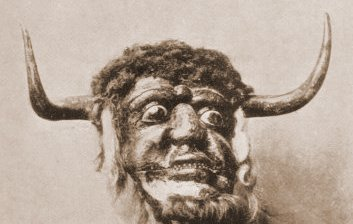

  
[Intangible Textual Heritage](../../index)  [Neopaganism](../index.md) 

------------------------------------------------------------------------

[Buy this Book at
Amazon.com](https://www.amazon.com/exec/obidos/ASIN/B0027ISAIM/internetsacredte.md)

------------------------------------------------------------------------

<table width="75%">
<colgroup>
<col style="width: 50%" />
<col style="width: 50%" />
</colgroup>
<tbody>
<tr class="odd">
<td width="50%" data-valign="TOP"></td>
<td width="50%" data-valign="CENTER"><h1 id="the-witch-cult-in-western-europe" data-align="CENTER">The Witch-Cult in Western Europe</h1>
<h2 id="by-margaret-alice-murray" data-align="CENTER">by Margaret Alice Murray</h2>
<h4 id="section" data-align="CENTER">[1921]</h4></td>
</tr>
</tbody>
</table>

------------------------------------------------------------------------

[Contents](#contents)    [Start Reading](wcwe00.md)    [Text
\[Zipped\]](wcwe.txt.gz.md)

------------------------------------------------------------------------

|                                                                                                                           |
|---------------------------------------------------------------------------------------------------------------------------|
|  |

The Witch-Cult in Western Europe was the first book in which Margaret
Murray developed her controversial literal interpretation of the Witch
trial evidence. This work is of importance because it is a source-book
of the Witch trials, with extensive quotes from the original documents,
presented in the original Elizabethan English, French and German. The
names of hundreds of accused witches are given in an appendix, a somber
roll call of the 'burning times.' The main body of this work aims to
show that the consistent narrative of the cult is evidence of a
wide-spread, underground pagan religion existing in Europe up through
the Renaissance. Murray, as if not having stirred things up enough, adds
appendices with her controversial take on the Fairies, Joan of Arc and
Gilles de Rais, as well as one truly dangerous recipe. This book is one
of those crucial works which every scholar of Neopaganism must come to
terms with, one way or another.--J.B. Hare, April
2009.

PRODUCTION NOTES: This was one of the first texts I
scanned for the site back in 2000, and I remastered the HTML in 2009.
Footnotes are interspersed with the text in brackets. This was the
first-ever posting of this book on the Internet.

------------------------------------------------------------------------

 [Title Page, Preface, Contents,
Introduction](wcwe00.md)  
[Chapter I. Continuity of the Religion](wcwe01.md)  
[Chapter II. The God](wcwe02.md)  
[Chapter III. Admission Ceremonies](wcwe03.md)  
[Chapter IV. The Assemblies](wcwe04.md)  
[Chapter V. The Rites](wcwe05.md)  
[Chapter VI. The Rites (continued)](wcwe06.md)  
[Chapter VII. The Organization](wcwe07.md)  
[Chapter VIII. Familiars and Transformations](wcwe08.md)  
[Appendix I. Fairies and Witches](wcweapp1.md)  
[Appendix II. Trial of Silvain Nevillon and Gentien le
Clerc](wcweapp2.md)  
[Appendix III. Names of Witches in Covens](wcweapp3.md)  
[Appendix IV. Joan of Arc and Gilles de Rais](wcweapp4.md)  
[Appendix V. Flying Ointments](wcweapp5.md)  
[Bibliography](wcwebib.md)  
[Addendum](wcweadd.md)  
