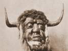

  
[Intangible Textual Heritage](../../index)  [Neopaganism](../index.md) 
[Index](index)  [Previous](wcweapp5)  [Next](wcweadd.md) 

------------------------------------------------------------------------

[Buy this Book at
Amazon.com](https://www.amazon.com/exec/obidos/ASIN/B0027ISAIM/internetsacredte.md)

------------------------------------------------------------------------

  
*The Witch-Cult in Western Europe*, by Margaret Alice Murray, \[1921\],
at Intangible Textual Heritage

------------------------------------------------------------------------

# BIBLIOGRAPHY

*Abbotsford Club Miscellany*, vol. i. Edinburgh, 1837.  
Ady, Thomas. *A Candle in the Dark*. London, 1656.  
*Alse Gooderige, The most Wonderfull and true Storie of*. London,
1597.  
Arnot, Hugo, *Criminal Trials*. Edinburgh, 1785  
Baines, Edward. *History of the County Palatine and Duchy of Lancaster*.
London, 1836.  
Bannatyne Club. *Memoirs of Sir James Melville*. Edinburgh, 1827.  
--- *Historie and Life of King James the Sext*. Edinburgh, 1825.  
--- *Diary of John Nicoll*. Edinburgh, 1836.  
--- *Spottiswode's History of the Church of Scotland*. Edinburgh,
1847-50.  
Baxter, Richard. *Certainty of Worlds of Spirits*. London, 1691.  
Beaumont, John. *Historical Treatise of Spirits*. London, 1705.  
Bede, Venerable. *Ecclesiastical History* (ed. Giles). London, 1843  
Bernard, Richard. *Guide to Grand-Jury men*. London, 1627.  
*Berwickshire Naturalists' Club*, vol. xi. Alnwick, 1887.  
Black, G. F. *Scottish Antiquary*, vol. ix. Edinburgh, 1895.  
*Blackwood's Edinburgh Magazine*, vol. i. Edinburgh, 1817.  
Bodin, Jean. *De la Démonomanie des Sorciers*. Rouen, 1604.  
--- *Le Fléau des Demons et Sorciers*. Nyort, 1616.  
Boguet, Henri. *Discours des Sorciers*. Lyons, 1608.  
Bourignon, Antoinette. *La Parole de Dieu*. Amsterdam, 1683.  
--- *La vie exterieur*. Amsterdam, 1683.  
Bounon, Jacques. *Chroniques de la Lorraine*. Nancy, 1838  
Bovett, Richard. *Pandaemonium*. London, 1684.  
Bower, Edmund. *Dr. Lamb revived*. London, 1653.  
Bromhall, Thomas. *Treatise of Spectres.* London, 1658.  
Burns Begg. *Proceedings of the Society of Antiquaries of Scotland*. New
Series, vol. x. Edinburgh.  
Burr, George Lincoln. *Narratives of the Witchcraft Cases*. New York,
1914  
Burton, John Hill. *Criminal Trials*. London, 1852.  
--- *History of Scotland*. Edinburgh, 1873.  
Calef, Robert. *More Wonders of the Invisible World*. Salem, 1861.  
Calendar of State Papers. Domestic, 1584. London, 1865.  
Cambrensis, Giraldus. *Itinerary* (Bohn's edition). London, 1847.  
Camden Society. *Lady Alice Kyteler*. London, 1843.  
Campbell, John Gregorson. *Superstitions of the Highlands*. Glasgow,
1902.  
Cannaert, J. B. *Olim procès des Sorcières en Belique*. Gand, 1847.  
Chambers, Robert. *Domestic Annals of Scotland*. Edinburgh, 1861.  
Chartier, Jean. *Chronique de Charles VII* (ed. Vallet de Viriville).
Paris, 1858.  
Chetham Society. *Moore Rental*. Manchester, 1847.  
--- *Potts, Discoverie of Witchcraft*. Manchester, 1858.  
*Chronicon de Lanercost* (ed. Stevenson). Maitland Club. Glasgow, 1839  
*Collection of rare and curious Tracts relating to Witchcraft*. London,
1838  
Cooper, Thomas. *Mystery of Witchcraft*. London, 1617.  
--- Pleasant Treatise of Witches. London, 1673.  
Cotta, John. *Infallible, trite and assured Witch*. London, 1625.  
--- *Trial of Witchcraft*. London, 1616.  
County Folklore, iii. *Orkney*. London, 1901.  
Cunningham, Allan. *Traditional Tales of the English and Scottish
Peasantry*. London, 1874.  
Dalyell, John Grahame. *Darker Superstitions of Scotland*. Edinburgh,
1834  
Danaeus, Lambert. *Dialogue of Witches*. \[London?\] 1575.  
Davenport, John. *Witches of Huntingdon*. London, 1646.  
Davies, J. Ceredig. *Welsh Folklore*. Aberystwith, 1911.  
De la Martiniére. Voyage des Pais Settentrionaux. Paris, 1682.  
De Lancre, Pierre. *L'Incredulité et Mescreance du Sortilege*. Paris,
1622.  
--- *Tableau de l'Inconstance des mauvais Anges*. Paris, 1613.  
*Denham Tracts*. London, 1895.  
*Detection of damnable Drifts*. 1579.  
Erah, J. Onurb. *Key to Witchcrafte & Demonolatrie for Guidance of ye
Slayers*. The Watchers' Society, Cambridge, 1751.  
Elven, Henry van. *La Tradition*, vol. v. Paris, 1891.  
*Examination of certain Witches at Chelmsford*. Philobiblon Society,
viii. London, 1863-4.  
*Examination of A. Baker, Joane Willimot, and Ellen Greene*. London,
1619.  
*Examination of Joane Williford, Joan Cariden, and Jone Holl*. (See
*Collection of rare and curious Tracts*.) London, 1645.  
*Examination of John Walsh*. London, 1566.  
Fairfax, Edward. *Demonologia* (ed. W. Grainge). Harrogate, 1882.  
*Flower, The Wonderful Discoverie of the Witchcrafts of Margaret and
Phillip*. London, 1619.  
Forbes, William. *Institutes of the Law of Scotland*. Edinburgh,
1722-30  
*Foster, Tryall of Ann*. Northampton, 1881.  
Fountainhall, Lord., *Decisions*. Edinburgh, 1759.  
Fournier, Alban. *Épidémie de Sorcellerie en Lorraine*. Nancy, 1891.  
*French Intelligencer*, No. 21. Thomason Tracts. London, 1652.  
*Full Tryals of A Notorious Witches at Worcester*. London, n. d.  
Gaule, John. *Select Cases of Conscience*. London, 1646.  
Gerish, William Blyth. *Relation of Mary Hall of Gadsden*. 1912.  
--- *The Divel's Delusions*. Bishops Stortford, 1914.  
--- *The Severall Practices of Johane Harrison*. 1909.  
Gibbons, A. *Ely Episcopal Records*. Lincoln, 1891.  
Giffard, George. *Discourse of the subtill Practises of Devilles.*
London, 1587.  
--- *Dialogue Concerning Witches*. Percy Society, VIII. London, 1843.  
Gilbert, William. *Witchcraft in Essex*. London, 1909.  
Giraldus Cambrensis. Itinerary (Bohu's edition). London, 1847.  
Glanvil, Joseph. *Sadducismus Triumphatus*. London, 1681.  
Goldsmid, E. *Confessions of Witches under Torture*. Edinburgh, 1886.  
Goodcole, Henry. *Wonderfull Discoverie of Elizabeth Sawyer*. London,
1621.  
Gooderige, *The Most wonderfull and true storie, of a certaine Witch
named Alse*. London, 1597.  
Green, Samuel Abbott. *Groton in the Witchcraft Times*. Cambridge,
Mass., 1883.  
Hale, John. *A modest Enquiry* (ed. Burr). New York, 1914.  
Hale, Sir Matthew. *Collection of Modern Relations*. London, 1693.  
Harou, Alfred. *La Tradition*, vol. vi. Paris, 1892.  
Hector, William. *Judicial Records of Renfrewshire*. Paisley, 1876.  
Hibbert, Samuel. *Description of the Shetland Isles*. Edinburgh, 1822.  
Highland Papers, vol. iii. *Witchcraft in Bute*. Edinburgh, 1920.  
Holinshed, Raphael. *Chronicles*. London, 1587.  
Hopkins, Matthew. *The Discovery of Witches*. London, 1647.  
Horneck, Anthony. Appendix to Glanvil's *Sadducismus Triumphatus*.
London, 1681.  
Howell, Thomas Bayly. *State Trials*. London, 1816.  
Humborg, Ludwig. *Die Hexenprozesse in der Stadt Münster*. \[Münster?\]
1882.  
Hunt, William. *History of the English Church*. London, 1901.  
Hutchinson, Bishop Francis. *Historical Essay*. London, 1718.  
Hutchinson, John. *History of the Province of Massachuset's Bay*.
1828.  
*Inch, Trial of Isobel*. Ardrossan (1855).  
James I. *Demonologie*. Edinburgh, 1597.  
*James the Sext, Historie and Life of*. Bannatyne Club. Edinburgh,
1825.  
*Journal of Anatomy*, vols. xiii and xxv. London, 1879, 1891.  
*Journal d'un bourgeois de Paris*. Panthéon Littéraire. Paris, 1838.  
*Justiciary Court, Edinburgh, Records of the Proceedings of*. Edinburgh,
1905.  
Kinloch, George Ritchie. *Reliquiae Antiquae Scoticae*. Edinburgh,
1848.  
Lamont, John. *Diary*. Maitland Club. Edinburgh, 1830.  
Law, Robert. *Memorialls* (ed. Sharpe). Edinburgh, 1818.  
*Lawes against Witches and Conivration*. Published by Authority. London,
1645.  
Lea, Henry Charles. *History of the Inquisition*. London, 1888.  
Lemoine, Jules. *La Tradition*, vol. vi. Paris, 1892.  
Mackenzie, Sir George. *Laws and Customs of Scotland*. Edinburgh.
1699.  
Maitland Club. *Chronicon de Lanercost*. Glasgow, 1839.  
--- *Lamont's Diary*. Glasgow, 1830  
*Maitland Club Miscellany*, vol. ii. Glasgow, 1840.  
*Manchester Oriental Society's Journal*. Manchester, 1916-17.  
Mather, Cotton. *Wonders of the Invisible World*. London, 1862.  
--- Increase. *Remarkable Providences*. London, 1890.  
Melville, Sir James. *Memoirs*. Bannatyne Club. Edinburgh.  
Michaelis, Sebastian. *Admirable Historie of the Possession and
Conversion of a Penitent Woman*. London, 1613  
--- A Discourse of Spirits. London, 1613  
Monoyer, Jules. *La Sorcellerie en Hainault*. Essais d'histoire et
d'archéologie. Mons, 1886.  
Monseur, Eugène. Le Folklore Wallon. Bruxelles (1592).  
Moore Rental. Chetham Society, vol. xii. Manchester, 1847.  
More, Henry. *Antidote against Atheism*. London, 1655.  
Moret, A. *Mystères Ègyptiens*. Paris, 1913.  
Murray, T. Douglas. *Jeanne d'Arc*. London, 1902.  
*Narrative of the Sufferings of a young, Girle*. Edinburgh, 1698.  
Nicoll, John. *Diary*. Bannatyne Club. Edinburgh, 1836.  
Notestein, Wallace. *History of Witchcraft in England*. Washington,
1911.  
Pearson, Karl. *Chances of Death*. London, 1897.  
Percy Society. *Giffard's Dialogue of Witches*. London, 1843.  
Perkins, William. *Discourse of the damned Art of Witchcraft*.
Cambridge, 1608.  
*Peterson. Tryall of Mrs. Joan*. Thomason Tracts. London, 1652.  
Petto, Samuel. *A faithful Narrative*. London, 1693.  
Philobiblon Society. Examination of certain Witches. London, 1863-4.  
Pinkerton, John. *Voyages*. London, 1808-14  
Pitcairn, Robert. *Criminal Trials*. Edinburgh, 1833.  
Pittenweem, *A true and full Relation of the Witches of Edinburgh*,
1704.  
*Pleasant Treatise of Witches*. London, 1673.  
Potts, Thomas. *Discoverie of Witches*. Chetham Society. Manchester,
1845  
*Prodigious and Tragicall History*. See Collection of rare and curious
Tracts. London, 1652.  
Quibell, James Edward. *Hierakonpolis*, ii. London, 1902.  
Quicherat, Jules Éttienne Joseph. *Procès de condemnation et de
réhabililation de Jeanne d'Arc*. Paris, 1841.  
Ravaisson, François. *Archives de la Bastille*. Paris, 1873.  
*Records of the Justiciary Court of Edinburgh*. Edinburgh, 1905  
*Registrum Magni Sigilli Regum Scotorum*. Edinburgh, 1886.  
*Rehearsall both straung and true*. London, 1579.  
Remigius, Nicholas. *Daemonolatria*. Hamburg, 1693  
Roberts, Alexander. *Treatise of Witchcraft*. London, 1616.  
Ross, William. *Aberdour and Inchcolme*. Edinburgh, 1885.  
Rymer, Thomas. *Foedera*. London, 1704.  
*Sadducismus Debellatus*. London, 1698.  
*St. Osees, A true and iust Recorde of all the Witches taken at*.
London, 1582.  
Sandys, George. *Relation of a Journey*. London, 1632.  
*Sawyer, Wonderfull Discouerie of Elizabeth*. 1621.  
Scot, Reginald. *Discoverie of Witchcraft*. London, 1584.  
*Scots Magazine*. Edinburgh, 1772 and 1814.  
Scott, Sir Walter. *Demonology and Witchcraft*. Morley's Universal
Library. London, 1883  
*Scottish Antiquary*, vol. ix. Edinburgh, 1891.  
*Scottish History Society*, vol. xxv. Edinburgh, 1896.  
Sharpe, Charles Kirkpatrick. *Historical Account of Witchcraft in
Scotland*. London, 1884.  
*Shaw, Elinor, and Mary Phillips*. Northampton, 1866.  
Sinclair, George. *The Hydrostaticks*. Edinburgh, 1672.  
--- *Satan's Invisible World Discovered*. Edinburgh, 1871.  
Sinclair, John. *Statistical Account of Scotland*, vol. xviii.
Edinburgh, 1796.  
Sinistrari de Ameno, Ludovico Maria. *Demoniality*. Paris, 1879.  
*Society of Antiquaries of Scotland*. New Series, x. Edinburgh.  
*Spalding Club Miscellany*. Aberdeen, 1841.  
Spottiswode, John. History of the Church of Scotland. Edinburgh,
1847-50.  
*Spottiswoode Miscellany*. Edinburgh, 1844-5.  
Stearne, John. *Confirmation and Discovery of Witchcraft*. London,
1648.  
Stevenson, J. *Chronicon de Lanercost*. Maitland Club. Glasgow, 1839.  
'Stewart, William Grant. *Popular Superstitions of the Highlanders*.
Edinburgh, 1823.  
*Surtees Society*, vol. xl. Durham, 1861.  
Taylor, John. *Tracts relating to Northamptonshire*. Northampton,
1866.  
Taylor, John. *The Witchcraft Delusion in Colonial Connecticut*. New
York, n. d.  
Thomson, H. A., and Miles, *A. Manual of Surgery*. Oxford, 1913.  
Thorpe, Benjamin. *Monumenta Ecclesiastica*. \[London\] 1840.  
*Tradition, La*, Vol. v. van Elven's *Les Procès de Sorcellerie au Moyen
Age*. Paris, 1891.  
--- vol. vi. Harou's *Sorciers et Sorcières*. Paris, 1892.  
--- vol. vi. Lemoine's *Sorcellerie contemporaine*. Paris, 1892.  
*True and exact Relation of the severall Informations, Examinations and
Confessions of the late Witches executed in the County of Essex*.
London, 1645.  
*True and iust Recorde of all the Witches taken at St. Oses*. By W. W.
London, 1582.  
*Tryalls of Four Notorious Witches at Worcester*. London, n. d.  
Wagstaffe, John. *Question of Witchcraft*. London, 1671.  
*Walsh, Examination of John*. London, 1566.  
Webster, John. *Displaying of Supposed Witchcraft*. London, 1677.  
Wellhausen, Julius. *Reste arabischen Heidenthums*. Berlin, 1897.  
Whitaker, T. D. *History of Whalley*. London, 1818.  
Wilson, Daniel. *Memorials of Edinburgh in the Olden Time*. Edinburgh,
1891.  
*Witch of Wapping, The*. Thomason Tracts. London, 1652.  
*Witchcraft, Collection of rare and curious tracts on*. Edinburgh,
1820.  
*Witches of Northamptonshire*. London, 1621.  
*Wonderfull Discouerie of Elizabeth Sawyer*. London, 1621.  
*Wonderful Discoverie of Margaret and Philip Flower*. London, 1619.

------------------------------------------------------------------------

[Next: Addendum](wcweadd.md)
