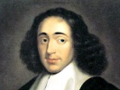

  
[Intangible Textual Heritage](../../../index.md) 
[Philosophy](../../index)  [Spinoza](../index)  [Index](index.md) 
[Previous](corr04)  [Next](corr06.md) 

------------------------------------------------------------------------

[Buy this Book at
Amazon.com](https://www.amazon.com/exec/obidos/ASIN/048620250X/internetsacredte.md)

------------------------------------------------------------------------

  
*Correspondence*, by Benedict de Spinoza, \[1883\], at Intangible
Textual Heritage

------------------------------------------------------------------------

### LETTER V. (V.)

#### OLDENBURG TO SPINOZA.

\[*Oldenburg sends Boyle's book, and laments that Spinoza has not been
able to answer all his doubts*.\]

Most respected Friend, Please accept
herewith the book I promised you, and write me in answer your opinion on
it, especially on the remarks about nitre, and about fluidity, and
solidity. I owe you the warmest thanks for your learned second letter,
which I received to-day, but I greatly grieve that your journey to
Amsterdam prevented you from answering all my doubts. I beg you will
supply the omission, as soon as you have leisure. You have much
enlightened me in your last letter, but have not yet dispelled all my
darkness; this result will, I believe, be happily accomplished, when you
send me clear and distinct information concerning the first origin of
things. Hitherto I have been somewhat in doubt as to the cause from
which, and the manner in which things took their origin; also, as to
what is the nature of their connection with the first cause, if such
there be. All that I hear or read on the subject seems inconclusive. Do
you then, my very learned master, act, as it were, as my torch-bearer in
the matter. You will have no reason to doubt my confidence and
gratitude. Such is the earnest petition of

Yours most faithfully,  
HENRY OLDENBURG.

------------------------------------------------------------------------

[Next: Letter VI. (omitted)](corr06.md)
