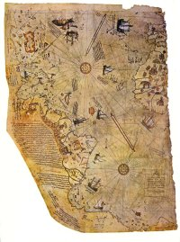

---
title: "The Piri Re'is Map"

<table width="100">
<colgroup>
<col style="width: 50%" />
<col style="width: 50%" />
</colgroup>
<tbody>
<tr class="odd">
<td data-valign="center" width="50%"> 
 Click to View full sized map</td>
<td data-valign="center" width="50%">The Piri Reis Map</td>
</tr>
</tbody>
</table>

------------------------------------------------------------------------

The image of the Piri Rei's map was scanned from the frontpiece of a
first edition of Hapgood's Maps of the Ancient Sea Kings. It is included
here for non-profit archival and research purposes only.

[Translation of the map text](pirikey.md)

------------------------------------------------------------------------

### Recommended books:

Maps of the Ancient Sea Kings, by Charles Hapgood.  
The Path of the Pole, by Charles Hapgood  
When the Sky Fell: In Search of Atlantis, by Rand and Rose Flem-Ath.  
Hamlet's Mill, by by Giorgio De Santillana and Hertha Von Dechend.  

------------------------------------------------------------------------

Most theories about ancient unknown civilizations are based on
absolutely no physical evidence, usually just hearsay and speculation.
What really would shake the basis of our knowledge of history would be
an actual artifact. This probably wouldn't be something spectacular like
finding a sunken city in the Atlantic, or armor-piercing bullets
embedded in a dinosaur skeleton. *It would probably be something that
only an expert in the field would recognize as anomalous.*

More likely, this artifact would be a document or tradition from the
past which reveals a deep understanding of some scientific fact recently
discovered. This could be a description of the structure and function of
DNA, knowledge of astronomy or physics which is only known to modern
science . . . or accurate maps of the earth drawn long before the "Age
of Exploration". The Piri Re'is map appears to be just that artifact.

The Piri Re'is Map is only one of several anomalous maps drawn in the
15th Century and earlier which appear to represent better information
about the shape of the continents than should have been known at the
time. Furthermore, this information appears to have been obtained at
some distant time in the past.

Piri Re'is, Ptolomy (2nd Century A.D.), as well as Mercator and Oronteus
Finaeus, well-known 15th Century map-makers, included the traditional
southern continent in their world maps, as did others. Antarctica was
not discovered until the 19th Century, and it was largely unexplored
until the middle of the 20th. This is just the start. Anomalous maps
also show the Behring Strait as linking Asia and America, river deltas
which appear much shorter than they do today, islands in the Aegean
which haven't been above water since the sea-level rise at the end of
the ice-age and huge glaciers covering Britian and Scandinavia. Long
dismissed as attempts by cartographers to fill in empty spaces, some of
the details of the old maps look very startling when correlated with
modern (very mainstream) knowledge of the changes in the Earths'
geography in the geologic past, particularly during the Ice Ages.

The Piri Re'is map is most interesting because of the attribution of the
source of its information, and the extraordinary detail of the coastal
outlines.

The Piri Re'is map was found in 1929 in the Imperial Palace in
Constantinople. It is painted on parchment and dated 919 A.H. (in the
Islamic calendar), which corresponds to 1513 AD. It is signed by an
admiral of the Turkish Navy named Piri Ibn Haji Memmed, also known as
Piri Re'is. According to Piri Re'is, the map had been assembled from a
set of 20 maps drawn in the time of Alexander the Great.

This map and others were analyzed by Charles H. Hapgood and his graduate
stutents. Hapgood was a historian and geographer at the University of
New Hampshire, in his book [Maps of the Ancient Sea
Kings](https://www.amazon.com/exec/obidos/ASIN/0932813429/internetsacredte.md)
(1966). Only the conclusions of this book are sensational; for the most
part it is a technical monograph on the history and geography of the
anomalous maps, employing spherical trigonometry to associate map
features with actual geographic locations. This book has recently been
republished, and we highly recommend it.

The conclusion that Hapgood reached was that a civilization with high
seafaring and mapping skills surveyed the entire earth in the ancient
past. They left maps which have been copied by hand through many
generations. The Piri Re'is map is a patchwork which has gaps (most
notably the Drake Passage between South America and Antarctica) which
can be explained as non-overlapping areas between the source maps. Maps
of the Ancient Sea Kings and Hapgood's other book The Earth's Shifting
Crust, in which he advanced a theory of polar shifts, are controversial,
and earned him the scorn of offical academia.

More evidence has appeared in recent years. Hapgood may yet be
vindicated (at least his guess as to the signficance of the anomalous
maps). The Piri Re'is map is one of the cornerstones of the growing body
of evidence for an unknown Ice Age civilization. Along with this we can
include the book [Hamlet's
Mill](https://www.amazon.com/exec/obidos/ASIN/0879232153/internetsacredte.md),
by De Santillana and von Dechend (1969), and the works of [Graham
Hancock](https://www.amazon.com/exec/obidos/external-search?tag=internetsacredte&keyword=Graham%20Hancock.md).

One striking thing about this map is the level of detail of the coasts
and interiors in South America. Although the scale is somewhat off, a
long, high mountain range is shown as the source of the rivers flowing
to the coast of South America.

However, the best-known feature in the Piri Re'is map (and other
pre-modern maps) is the Antarctic coastline. In Hapgood and others'
opinions, this represents the outline of the coast of Antarctica
*without glaciers*.

Our modern knowledge of the coastline under the ice was obtained using
seismic sounding data from Antarctic expeditions in the 1940s and 50s.
Sonar is one way to map the coast under the Antarctic glaciers. The
other way would be to have surveyed them when they were ice-free.
According to Hapgood, who based the claim on 1949 core samples from the
Ross Sea, the last time the particular area shown in the Piri Re'is map
was free of ice was more than 6000 years ago. More recent studies show
that this may be off by a couple of orders of magnitude. In any case,
this geography *should* have been unknown to the ancients. If this is
correct, there are some big mysteries to explain.

A number of writers have rushed in and attempted to do just this. One
school of thought about the Piri Re'is map is the 'Atlantis in
Antarctica' thesis. The chief proponents of this are Rand and Rose
Flem-Ath in their book [When the Sky
Fell](https://www.amazon.com/exec/obidos/ASIN/0312964013/internetsacredte.md),
though there are others. The Flem-Aths buy into both Hapgoods' Sea Kings
and Polar shift thesis. In the latter, Hapgood claimed that the
inclination of the Earth's axis of rotation shifted suddenly in the year
9,500 B.C. causing Antarctica to move hundreds of miles to the south.
This transformed its climate from semi-temperate to freezing. In
contrast to the *Sea Kings* hypothesis, there is no evidence that a
rapid polar shift actually occured at this time and much negative
evidence that it didn't.

There is no scientific explanation for a mechanism which could cause
such a global transformation in a matter of hours without completely
destroying the crust of the planet. A planetary collision would be
required, of the sort that has not occurred since the early period of
planetary formation. If such a collision occured in 9,500 B.C., it is
fairly certain that all life on Earth would have been wiped out, which
is obviously not the case. While it is not impossible that some
instability in the planet could cause the Earth's axis to change its
inclination, this would not occur overnight. Additionally, a polar shift
would probably leave an obvious mark in the geomagnetic strata found in
sea floor cores, which is not the case.

Much has been made of Einstein's endorsement of Hapgood's polar shift
theory. This proves nothing, since Einstein was not a geologist.
Furthermore, although Einstein's theories have stood up to rigorous
experimental and observational evidence, it's important to note that he
was a human being and wasn't *always* right. Part of Einstein's
greatness was his ability to admit his errors.

In any case, the Flem-Aths propose that this shift destroyed a
hypothetical Antarctic civilization, located somewhere in the
present-day Ross penninsula. They attempt (with mixed success) to relate
this to [Plato's Atlantis](../atl/index.md). Unfortunately, proving this
would involve doing archaeology under an ice sheet thousands of meters
thick. This is an excellent example of 'extraordinary claims require
extraordinary proof'.

One subconscious influence on this may be fantasy writer [H.P.
Lovecraft's Cthulhu mythos](../nec/index.md), which places the abode of the
Ancient Gods, R'lyeh, in Antarctica. Lovecraft's mythos is completly
fictional, even if it has resemblances to actual mythologies.

While features suggestive of advanced geographical knowledge are shown
in the map itself, the [annotations](pirikey.md) and illustrations paint a
different picture. Skeptics will note that the Piri Re'is map of the
Antarctic coast, of which so much has been made, is notated as follows:

> *This country is a waste. Everything is in ruin and it is said that
> large snakes are found here. For this reason the Portuguese infidels
> did not land on these shores and these are also said to be very hot.*

There are also pictures of some mythical animals in the same vicinity,
of which the text reads:

> *And in this country it seems that there are white-haired monsters in
> this shape, and also six-horned oxen. The Portuguese infidels have
> written it in their maps. . . .*

This doesn't invalidate the startling landforms, but does indicate that
whoever wrote these notes (presumably Piri Re'is) never actually visited
Antarctica. Non-skeptics might argue that when the source map was
surveyed there could have been 1) large snakes, 2) unknown varieties of
land mammals, as well as a 3) "very hot" climate in Antarctica, but
there is no physical evidence that this has *ever* been the case. This
also does not explain the other fanciful illustrations and notations on
the map, including a sketch of a red-haired headless man (with his face
on his chest) in the Andes area. This takes us out of the realm of the
possible into the fantastic, a line which Hapgood was careful not to
cross, at least in Maps of the Ancient Sea Kings.

-- J.B. Hare

Text on this page is © Copyright 2001, J.B. Hare.
