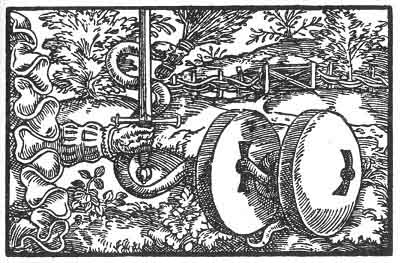

[Intangible Textual Heritage](../../index)  [Prophecy](../index) 
[Index](index)  [Previous](pop05)  [Next](pop07) 

------------------------------------------------------------------------

p. 61

 

### The First Figure

'What a thing is internally is shown by its outward sign. As Nature
signs her own so doth *Magic*. Thou has been signed as a devourer of all
who have to do with thee. Blessed is he that is unsoiled of thee for
thou leavest none in peace. *Magic* hath considered thee well and given
thee thy due, but as thy beauty is only beheld and not the signs,
therefore thou devourest all that touch thee. For beauty and not
goodness is sought of thee.'

------------------------------------------------------------------------

[Next: The Second Figure](pop07)
