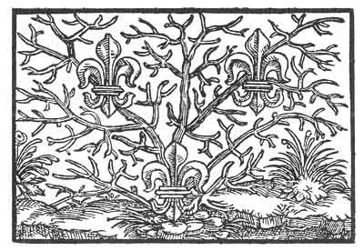

[Intangible Textual Heritage](../../index)  [Prophecy](../index.md) 
[Index](index)  [Previous](pop06)  [Next](pop08.md) 

------------------------------------------------------------------------

p. 62

 

### The Second Figure

'A flower groweth to the destined height. He that causeth her to grow
also causeth her to fade. This happens to thee, for *Magic* hath
therewith adorned thee, that thy coming up should be known, and also how
thou has come to nought. For before thou wast, *Magic* hath known thee
and therefore compared thee to a flower, that to-day is in bloom and
to-morrow is withered. Wisdom and Fear of God would have preserved thee,
but thou has overlooked it, thine own wisdom hath seduced thee.'

------------------------------------------------------------------------

[Next: The Third Figure](pop08.md)
