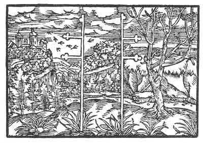

[Intangible Textual Heritage](../../index)  [Prophecy](../index.md) 
[Index](index)  [Previous](pop08)  [Next](pop10.md) 

------------------------------------------------------------------------

p. 64

 

### The Fourth Figure

'Thou hast divided duty into left and right, as if it were oppressing
thee. Both sides will cause thee anxiety and hatred shall altogether
overcome thee. For a harlot divideth her wantonness and for a while she
hath her way, but woe to her when her deceit is discovered. Then cometh
true the saying, "no love without pain." Although thou didst mightily
rejoice that thou art without a head, a head shall be placed upon thee
and thou shall become a limb, though thou art not accustomed to it. But
against thy will shalt thou swallow and eat what is not thy natural
food.'

------------------------------------------------------------------------

[Next: The Fifth Figure](pop10.md)
