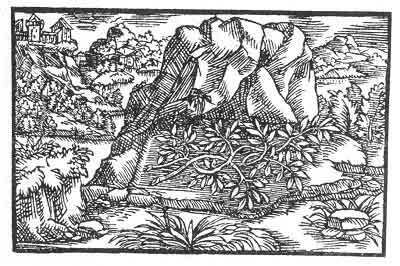

[Intangible Textual Heritage](../../index)  [Prophecy](../index) 
[Index](index)  [Previous](pop10)  [Next](pop12) 

------------------------------------------------------------------------

p. 66

 

### The Sixth Figure

'Thy flavour is strong, not wholesome and pleasant to everyone.
Therefore, will thine enemies, to whom thou art not wholesome, cast a
shadow and dry thee up, that thou mayest become temperate, and that thy
fruit may not grow from thee as thou now vainly imaginest. For thou wilt
have to give way to one whom thou knowest not. At the beginning thou
wast very bold, and as a hero hast thou uplifted thyself. But thy
undertaking hath divided thy comrades and what is divided hath no
permanence. Still thou shalt retain a praise and a victory, for thou has
known thyself.'

------------------------------------------------------------------------

[Next: The Seventh Figure](pop12)
