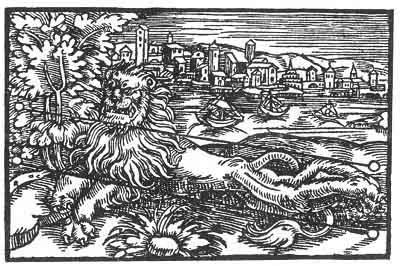

[Intangible Textual Heritage](../../index)  [Prophecy](../index.md) 
[Index](index)  [Previous](pop13)  [Next](pop15.md) 

------------------------------------------------------------------------

p. 69

 

### The Ninth Figure

'Although God hath ordained that people should fear and be in terror of
thee, yet there is a rod awaiting thee, that at the time shall smite thy
back in such a wise as thou wilt not be able to endure, and they will
say with amazement: Who would have thought that he would thus be brought
to silence? It would have well become thee to observe moderation, and
not as is now made manifest, to appear to be what thou art not, but to
consider the end. This will make thee lame and crooked, that thou and
thy followers shall with pain lament to each other.'

------------------------------------------------------------------------

[Next: The Tenth Figure](pop15.md)
