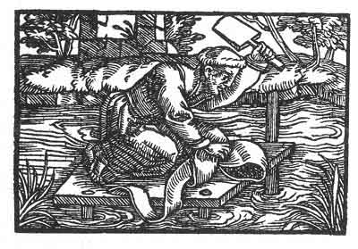

[Intangible Textual Heritage](../../index)  [Prophecy](../index) 
[Index](index)  [Previous](pop14)  [Next](pop16) 

------------------------------------------------------------------------

p. 70

 

### The Tenth Figure

'Thine is not a wedding garment, *Magic* has opened thy heart, and had
made thee known. Therefore even as gold and silver must be refined from
blemish, and tested, even seven times more severely than gold and silver
is cleansed of its dross by fire, must thou be tried. It were well for
thee to consider in thyself what was thy beginning, when thy neighbours
brought thee up, and showed more kindness unto thee than was thy due,
whereon thou hast presumed. This is demanded of thee. Thy transient
wealth belongeth to another.'

------------------------------------------------------------------------

[Next: The Eleventh Figure](pop16)
