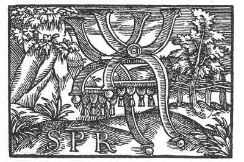

[Intangible Textual Heritage](../../index)  [Prophecy](../index.md) 
[Index](index)  [Previous](pop16)  [Next](pop18.md) 

------------------------------------------------------------------------

p. 72

 

### The Twelfth Figure

'Although one may seat himself securely, yet there is no chair that may
not fall, and also he that sitteth thereon. And thou seatest thyself
upon this chair but thou shouldst not be thereon. Thou shouldst be below
and not above. For thou art a burthen and an unbearable yoke, therefore
falls *S. P*. Thou hast seated thyself thereon and he hath paid thee and
given thee the reward thou was seeking: Temporal honour and praise: and
these thou hast gathered all together in thyself and swallowed them up.
Therefore as a temporal thing thou must also pass away.'

------------------------------------------------------------------------

[Next: The Thirteenth Figure](pop18.md)
