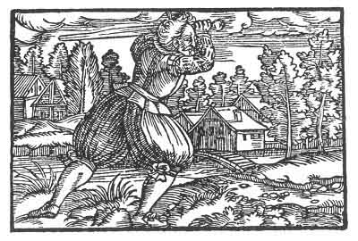

[Intangible Textual Heritage](../../index)  [Prophecy](../index) 
[Index](index)  [Previous](pop17)  [Next](pop19) 

------------------------------------------------------------------------

p. 73

 

### The Thirteenth Figure

'Too much kindness giveth too much evil, when the evil despiseth the
kindness and the folly thereof allows it to advance in its undertaking.
But it advanceth the wrong way, and it shall happen as to grass that is
fully grown, it is mowed off and taken to where it should be. But if
thou hadst been provident, and considered the end, thou wouldst see thy
misery and know thyself. Nay, then, as thou willest it, shall it take
its reward and its end, as thou hast been seeking it, and thy wisdom
shall come to thee as a mockery.'

------------------------------------------------------------------------

[Next: The Fourteenth Figure](pop19)
