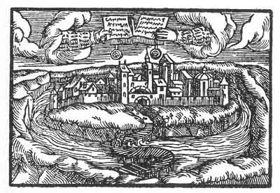

[Intangible Textual Heritage](../../index)  [Prophecy](../index.md) 
[Index](index)  [Previous](pop18)  [Next](pop20.md) 

------------------------------------------------------------------------

p. 74

 

### The Fourteenth Figure

'Giving too much out of hand bringeth sorrow and want to the giver; for
if it fail he shall be beaten with his own weapons. Therefore as such
overmuch giving away hath made thee proud, thy pride shall have a time
and term where it goeth thus far and no farther; then shall all be torn
up, and thou must, have nothing more. But if thou hadst considered that
no one should set himself against the poor, and hadst also recognised
thy liberty to be against thy neighbour, thou wouldst have abstained
therefrom. But thy own heart hath seduced thee and thy wisdom hath been
reckoned openly as a folly.'

------------------------------------------------------------------------

[Next: The Fifteenth Figure](pop20.md)
