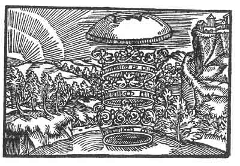

[Intangible Textual Heritage](../../index)  [Prophecy](../index) 
[Index](index)  [Previous](pop19)  [Next](pop21) 

------------------------------------------------------------------------

p. 75

 

### The Fifteenth Figure

'Nothing is so good that it may not also become evil if it ever is
without a head. To be without a head giveth pride and that bringeth
forth no good. Therefore shall a head be placed upon thee that thou
shalt become a limb, and it will press heavy upon thee, that thou shalt
have to carry the head with the other limbs. It is high enough but it
would be higher, didst thou but understand it. Thou shalt encounter
those whom thou hast not expected, and thy great Council will cause
confusion. But when thou sleepest will union take place.'

------------------------------------------------------------------------

[Next: The Sixteenth Figure](pop21)
