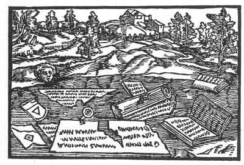

[Intangible Textual Heritage](../../index)  [Prophecy](../index) 
[Index](index)  [Previous](pop20)  [Next](pop22) 

------------------------------------------------------------------------

p. 76

 

### The Sixteenth Figure

'A child that goes to school and learns, when it arrives at years of
discretion is ashamed of its childish work and destroys it. Thus shall
it also happen to thee. As thou writest in such a manner thine own work
shall be nought. For which reason there will be much labour for nought
and in vain. For the time teacheth and giveth knowledge that not every
pearl is a true pearl that is alleged so to be. Therefore a hand shall
fall upon thee that will tear thee to shreds.'

------------------------------------------------------------------------

[Next: The Seventeenth Figure](pop22)
