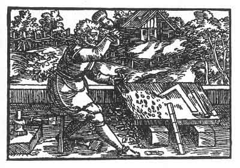

[Intangible Textual Heritage](../../index)  [Prophecy](../index.md) 
[Index](index)  [Previous](pop21)  [Next](pop23.md) 

------------------------------------------------------------------------

p. 77

 

### The Seventeenth Figure

'He who buildeth a house should guard it, that when the enemy cometh it
may not be destroyed. Its destruction should also be guarded that it may
not be rebuilt, and that the folly of both may not be laughed at. Thus
what hath been broken up is again rebuilt. Such things are done by
children of men who do not consider the end. They erect, ornament and
decorate, forgetting that their work is subject to destruction and again
to restoration. At present all is still fragile, moreover they do not
build on a rock but upon the sand.'

------------------------------------------------------------------------

[Next: The Eighteenth Figure](pop23.md)
