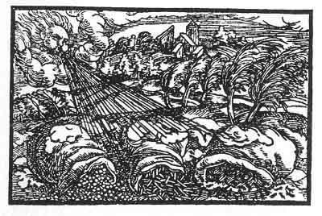

[Intangible Textual Heritage](../../index)  [Prophecy](../index.md) 
[Index](index)  [Previous](pop22)  [Next](pop24.md) 

------------------------------------------------------------------------

p. 78

 

### The Eighteenth Figure

'The eagle doth not grow out of thee, therefore shall He send a wind
unto thee that will repress thee and thy young. Although it may go well
with thee and thou sayest to thyself: My soul, thou hast all thou
desirest and wishest for, what is there that may not be thine? Thou art
sitting in Paradise. While thou art thinking it thus with thee, and
there is nothing contrary, in thy greatest councils and rejoicings, the
Deluge shall burst in upon thee, and the rough South Wind shall blow
thee away as dust off the earth. For not in pleasure and wealth are we
created but in the vale of tears. This thou hast forgotten.'

------------------------------------------------------------------------

[Next: The Nineteenth Figure](pop24.md)
