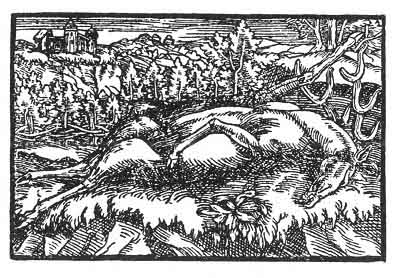

[Intangible Textual Heritage](../../index)  [Prophecy](../index.md) 
[Index](index)  [Previous](pop23)  [Next](pop25.md) 

------------------------------------------------------------------------

p. 79

 

### The Nineteenth Figure

'Thou art leaping about in thy garden and art well pleased with thyself;
but giving up thy wisdom and following thy pleasure thou makest bad use
of thy leapings. Therefore shall it happen to thee even as thou art
lying there, and those that should be thy peace will hunt thee and force
thee to leap high. But take thought with thyself and consider that human
things are vain. Then wouldst thou become altogether changed and
wouldest be safe from the misfortune into which thou doest daily walk.
Bethink thyself that pride and ill-manners never ended well.

------------------------------------------------------------------------

[Next: The Twentieth Figure](pop25.md)
