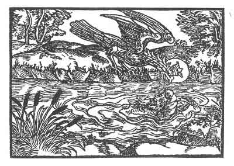

[Intangible Textual Heritage](../../index)  [Prophecy](../index.md) 
[Index](index)  [Previous](pop25)  [Next](pop27.md) 

------------------------------------------------------------------------

p. 81

 

### The Twenty-First Figure

'When rest shall come to him, and thy watchers shall be dispersed, and
thy limehound shall be wearied and succumb, then shalt thou be afflicted
in thine own nest, with thy young, and shalt be forced to give way to
him of whom thou hadst supposed that he would give way to thee, and thou
shalt have to leave thy eggs and nest. Thus shall happen to thee, that
thou and thine shall be ensnared together in the meshes thou has laid
for others, and never again shalt thou be what thou wast formerly. And
the children that were thine shall no more be thine. Thy robe shall
clothe thine enemy, who will despise thee.'

------------------------------------------------------------------------

[Next: The Twenty-Second Figure](pop27.md)
