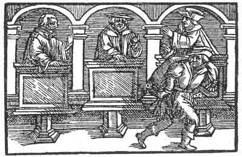

[Intangible Textual Heritage](../../index)  [Prophecy](../index.md) 
[Index](index)  [Previous](pop27)  [Next](pop29.md) 

------------------------------------------------------------------------

p. 83

 

### The Twenty-Third Figure

'As there are three persons in the Godhead, comprising but one number,
thus should also men become united only in one number. But, where this
does not come to pass then is fulfilled the saying: every empire that is
divided in itself must pass away. Thus no empire passeth away unless it
be divided against itself. The wisest construction of a house and
confederation of an empire is, when they conduct themselves as one and
act accordingly, so that the number may never be divided. For what can
be divided is unstable and vain, and one disputes with another. But
rejoice, for thou shalt become one.'

------------------------------------------------------------------------

[Next: The Twenty-Fourth Figure](pop29.md)
