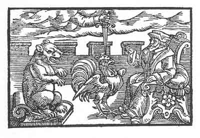

[Intangible Textual Heritage](../../index)  [Prophecy](../index.md) 
[Index](index)  [Previous](pop28)  [Next](pop30.md) 

------------------------------------------------------------------------

p. 84

 

### The Twenty-Fourth Figure

'What is it, or what does it help you that ye combine together and do
not consider that ye are contrary in soul and heart? Behold only how ye
are externally marked by your garments, even so are ye also internally.
Ye should not be as beasts but as men, but as ye are not so, he will
rule you that is above you, of whom stands written: give unto him what
to him belongs. For no bestial reason is permanent, only that reason
remaineth which is destined and ordained by God. This falleth in due
time, thus is your council destroyed.'

------------------------------------------------------------------------

[Next: The Twenty-Fifth Figure](pop30.md)
