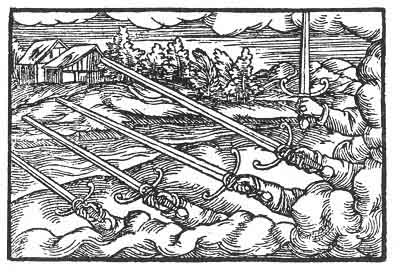

[Intangible Textual Heritage](../../index)  [Prophecy](../index.md) 
[Index](index)  [Previous](pop31)  [Next](pop33.md) 

------------------------------------------------------------------------

p. 87

 

### The Twenty-Seventh Figure

'It hath been forgotten that many heads rule badly, and that also only
one should rule and not more. This is the cause that they have split up
and parted, each one seeking his own opportunity. But as it is not right
to seek one's own opportunity, but that each should serve the other, and
seek to be useful to the other, and leave his own, as doth indeed but
seldom happen, for this reason they will be put down; and to whom it is
destined to be united, he shall be foremost, and under him shall rejoice
those who have been long afflicted and distressed.'

------------------------------------------------------------------------

[Next: The Twenty-Eighth Figure](pop33.md)
