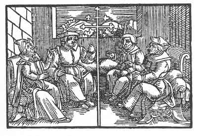

[Intangible Textual Heritage](../../index)  [Prophecy](../index.md) 
[Index](index)  [Previous](pop32)  [Next](pop34.md) 

------------------------------------------------------------------------

p. 88

 

### The Twenty-Eighth Figure

'There will be no common voice, therefore it will be in vain that the
five consult together. Have care of the future-forty-two and a little
before and after will he come and do as he pleaseth, and bend you like a
branch, and gird you in a wise such as will not please you. For thy
council is not of him who is sought nor of whom thou deemest it to be.
If ye would consider that there is no wisdom at all in man when he
throweth off the yoke, he would himself be opposed to it and would not
throw off the yoke, but would think of the heavy reckoning in the day of
wrath.'

------------------------------------------------------------------------

[Next: The Twenty-Ninth Figure](pop34.md)
