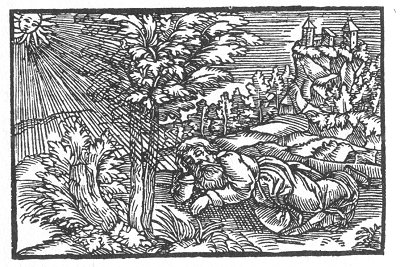

[Intangible Textual Heritage](../../index)  [Prophecy](../index.md) 
[Index](index)  [Previous](pop36)  [Next](pop38.md) 

------------------------------------------------------------------------

p. 92

 

### The Thirty-Second Figure

'Thou hast taken great trouble, therefore it is but just that after thy
day's work thou shouldst have rest and repose. Blessed is he that is
born during sleep; he shall know no evil. For thou hast purified with
great care, and hast endured much in thy days, Thee no one hath
overcome, and no one shall there be that will again awaken thee, even as
long as there is counted as much as thine enemies have counted from
their eyrie.'

------------------------------------------------------------------------

[Next: Elucidations of the Prognostications and Conclusion of Doctor
Paracelsus](pop38.md)
