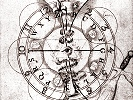

  
[Intangible Textual Heritage](../../index)  [Parapsychology](../index) 
[Theosophy](../../the/index)  [Index](index)  [Previous](clrv05) 
[Next](clrv07) 

------------------------------------------------------------------------

[Buy this Book at
Amazon.com](https://www.amazon.com/exec/obidos/ASIN/0835670953/internetsacredte)

------------------------------------------------------------------------

  
*Clairvoyance*, by C.W. Leadbeater, \[1899\], at Intangible Textual
Heritage

------------------------------------------------------------------------

p. 99

### CHAPTER V

#### CLAIRVOYANCE IN SPACE: SEMI-INTENTIONAL

Under this rather curious title I am grouping together the cases of all
those people who definitely set themselves to see something, but have no
idea what the something will be, and no control over the sight after the
visions have begun—psychic Micawbers, who put themselves into a
receptive condition, and then simply wait for something to turn up. Many
trance-mediums would come under this heading; they either in some way
hypnotize themselves or are hypnotized by some "spirit-guide", and then
they describe the scenes or persons that happen to float before their
vision. Sometimes however, when in this condition they see what is
taking place at a distance, and so they come to have a place among our
"clairvoyants in space."

p. 100

But the largest and most widely-spread band of these semi-intentional
clairvoyants are the various kinds of crystal-gazers—those who, as Mr.
Andrew Lang puts it, "stare into a crystal ball, a cup, a mirror, a bob
of ink (Egypt and India), a drop of blood (among that Maories of New
Zealand), a bowl of water (Red Indian), a pond (Roman and African),
water in a glass bowl (in Fez), or almost any polished surface."
(*Dreams and Ghosts*, page 57)

Two pages later Mr. Lang gives us a very good example of the kind of
vision most frequently seen in this way. "I had given a glass ball," he
says, "to a young lady, Miss Baillie, who had scarcely any success with
it. She lent it to Miss Leslie, who saw a large square, old-fashioned
red sofa covered with muslin, which she found in the next country-house
she visited. Miss Baillie's brother, a young athlete, laughed at these
experiments, took the ball into the study, and came back looking 'gey
gash'. He admitted that he had seen a vision—somebody he knew under a
lamp. He would discover during the week whether he saw right or not.
This was at 5.30 on a Sunday afternoon.

p. 101

"On Tuesday, Mr. Baillie was at a dance in a town some forty miles from
his home, and met a Miss Preston. 'On Sunday,' he said, 'about half-past
five you were sitting under a standard lamp in a dress I never saw you
wear, a blue blouse with lace over the shoulders, pouring out tea for a
man in blue serge, whose back was towards me, so that I only saw the tip
of his moustache.'

"'Why, the blinds must have been up,' said Miss Preston.

"'I was at Dulby,' said Mr. Baillie, and he undeniably was."

This is quite a typical case of crystal-gazing—the picture correct in
every detail, you see, and yet absolutely unimportant and bearing no
apparent signification of any sort to either party, except that it
served to prove to Mr. Baillie that there was something in
crystal-gazing. Perhaps more frequently the visions tend to be of a
romantic character—men in foreign dress, or beautiful though generally
unknown landscapes.

Now what is the rationale of this kind of clairvoyance? As I have
indicated above, it

p. 102

belongs usually to the "astral current" type, and the crystal or other
object simply acts as a focus for the willpower of the seer, and a
convenient starting-point for his astral tube. There are some who can
influence what they will see by their will, that is to say they have the
power of pointing their telescope as they wish; but the great majority
just form a fortuitous tube and see whatever happens to present itself
at the end of it.

Sometimes it may be scene comparatively near at hand, as in the case
just quoted; at other times it will be a far-away Oriental landscape; at
others yet it may be a reflection of some fragment of an ākāshic record,
and then the picture will contain figures in some antique dress, and the
phenomenon belongs to our third large division of "clairvoyance in
time." It is said that visions of the future are sometimes seen in
crystals also—a further development to which we must refer later.

I have seen a clairvoyant use instead of the ordinary shining surface a
deal black one, produced by a handful of powdered charcoal in a saucer.
Indeed it does not seem to matter

p. 103

much what is used as a focus, except that pure crystal has an undoubted
advantage over other substances in that its peculiar arrangement of
elemental essence renders it specially stimulating to the psychic
faculties.

It seems probable, however, that in cases where a tiny brilliant object
is employed—such as a point of light, or the drop of blood used by the
Maories—the instance is in reality merely one of self-hypnotization.
Among non-European nations the experiment is very frequently preceded or
accompanied by magical ceremonies and invocations so that it is quite
likely that such sight as is gained may sometimes be really that of some
foreign entity, and so the phenomenon may in fact be merely a case of
temporary possession, and not of clairvoyance at all.

------------------------------------------------------------------------

[Next: Chapter VI. Clairvoyance in Space: Unintentional](clrv07)
