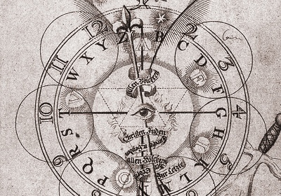

  
[Intangible Textual Heritage](../../index)  [Parapsychology](../index) 
[Theosophy](../../the/index) 

------------------------------------------------------------------------

[Buy this Book at
Amazon.com](https://www.amazon.com/exec/obidos/ASIN/0835670953/internetsacredte)

------------------------------------------------------------------------

<table width="75%">
<colgroup>
<col style="width: 50%" />
<col style="width: 50%" />
</colgroup>
<tbody>
<tr class="odd">
<td width="50%" data-valign="TOP"> 
J. Böhme, Theosophische Wercke, Amsterdam [1682] (Public Domain Image)</td>
<td width="50%" data-valign="CENTER"><h1 id="clairvoyance" data-align="CENTER">Clairvoyance</h1>
<h2 id="by-c.-w.-leadbeater" data-align="CENTER">by C. W. Leadbeater</h2>
<h4 id="section" data-align="CENTER">[1899]</h4></td>
</tr>
</tbody>
</table>

------------------------------------------------------------------------

[Contents](#contents)    [Start Reading](clrv00)    [Page
Index](pageidx)    [Text \[Zipped\]](clrvtxt.zip)

------------------------------------------------------------------------

|                                                                                                                           |
|---------------------------------------------------------------------------------------------------------------------------|
|  |

This is a Theosophical manual of the phenomena of Clairvoyance, the
mental viewing of things far removed in space and/or time. Leadbeater
appeals to the fourth dimension, the Akashic record, and the assistance
of unseen spirits, as explanations of the phenomena. Students of the
occult will find this a satisfying review, but more rationalist minded
investigators will find this more of a *counter-example* of how to
research psi.

------------------------------------------------------------------------

 [Title Page](clrv00)  
[Contents](clrv01)  
[Chapter I. What Clairvoyance Is](clrv02)  
[Chapter II. Simple Clairvoyance: Full](clrv03)  
[Chapter III. Simple Clairvoyance: Partial](clrv04)  
[Chapter IV. Clairvoyance in Space: Intentional](clrv05)  
[Chapter V. Clairvoyance in Space: Semi-Intentional](clrv06)  
[Chapter VI. Clairvoyance in Space: Unintentional](clrv07)  
[Chapter VII. Clairvoyance in Time: The Past](clrv08)  
[Chapter VIII. Clairvoyance in Time: The Future](clrv09)  
[Chapter IX. Methods of Development](clrv10)  
[Index](clrv11)  
