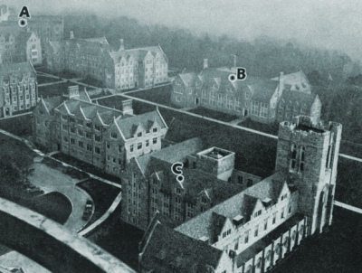

  
[Intangible Textual Heritage](../../index)  [Parapsychology](../index.md) 

------------------------------------------------------------------------

[Buy this Book at
Amazon.com](https://www.amazon.com/exec/obidos/ASIN/076613962X/internetsacredte.md)

------------------------------------------------------------------------

<table width="75%">
<colgroup>
<col style="width: 50%" />
<col style="width: 50%" />
</colgroup>
<tbody>
<tr class="odd">
<td width="50%" data-valign="TOP"></td>
<td width="50%" data-valign="CENTER"><h1 id="extra-sensory-perception" data-align="CENTER">Extra-Sensory Perception</h1>
<h2 id="by-j.b.-rhine" data-align="CENTER">by J.B. Rhine</h2>
<h4 id="section" data-align="CENTER">[1934]</h4></td>
</tr>
</tbody>
</table>

------------------------------------------------------------------------

[Contents](#contents)    [Start Reading](esp00.md)    [Page
Index](pageidx)    [Text \[Zipped\]](esptxt.zip.md)

------------------------------------------------------------------------

|                                                                                                                           |
|---------------------------------------------------------------------------------------------------------------------------|
|  |

Although this was not the first appearance of the term 'Extrasensory
Perception' in print, this book was the first one which brought *ESP* to
the foreground. Even in [Mental Radio](../mrad/index.md), which preceded
this study (in 1930), there was no general agreement as to what to call
the phenomena.

J. B. Rhine, the author of this study, and the organizer of the famous
Duke ESP laboratory, attempted to create standardized terminology and
methodologies (such as the Zener card deck) for studying these mental
abilities. Rhine empiricized the study of ESP; instead of making wild
speculations about ghosts, angels, spirits, or the *akashic* plane, he
started from the point of view of a scientist. Rhine asked questions
such as: How do we measure this in a controlled experiment? Can we
reproduce the results? What parameters of the experiment can we alter,
and what effects of this can we measure?

Rhine found that some individuals could reliably demonstrate telepathy
and clairvoyance in laboratory settings. The subjects did better when
alert, and therefore, not surprisingly, caffeine seemed to improve ESP.
Accuracy did not seem to drop off at distance (even hundreds of miles),
which probably means that it is not some kind of inverse-square-law
radiation. Alas, 'Mental Radio!' *Mental Internet* is probably closer to
reality...

ESP is very puzzling, and more common that might be expected. Decades
later, we are still waiting for some kind of explanation of this from
conventional science.

------------------------------------------------------------------------

 [Title Page](esp00.md)  
[Contents](esp01.md)  
[List of Illustrations](esp02.md)  
[Foreword](esp03.md)  
[Introduction by Dr. Walter Franklin Prince](esp04.md)  
[List of Abbreviations](esp05.md)  
[Preface](esp06.md)  

### Part I. General Introduction

[Chapter 1. Clarification of the Problem](esp07.md)  
[Chapter 2. Historical Background](esp08.md)  
[Appendix to Chapter 2. Mathematics of Probability Used in
Evaluation](esp09.md)  

### Part II. The Experimental Results

[Chapter 3. A General Survey](esp10.md)  
[Chapter IV. Earlier and Minor Experiments](esp11.md)  
[Chapter 5. A. J. Linzmayer](esp12.md)  
[Chapter 6. Charles E. Stuart](esp13.md)  
[Chapter 7. Hubert E. Pearce, Jr.](esp14.md)  
[Chapter 8. Five Other Major Subjects](esp15.md)  

### Part III. Explanation and Discussion

[Chapter 9. Elimination of Negative Hypotheses](esp16.md)  
[Chapter 10. Physical Conditions in the Functioning of E.S.P.](esp17.md)  
[Chapter 11. Some Physiological Conditions Affecting E.S.P.](esp18.md)  
[Chapter 12. The Psychological Conditions and Bearings of the
Results](esp19.md)  
[Chapter 13. E.S.P. From the Viewpoint of General
Parapsychology](esp20.md)  
[Chapter 14. Some General Biological Considerations](esp21.md)  
[Chapter 15. Summary and Concluding Remarks](esp22.md)  
[Appendix to Chapter 15. Suggestions to Those Who May Care to Repeat
These Experiments](esp23.md)  
[Second Appendix to Chapter 15.](esp24.md)  
