  
[Intangible Textual Heritage](../../index)  [Parapsychology](../index) 
[Index](index)  [Previous](mrad02)  [Next](mrad04) 

------------------------------------------------------------------------

[Buy this Book at
Amazon.com](https://www.amazon.com/exec/obidos/ASIN/B002FGTN5A/internetsacredte)

------------------------------------------------------------------------

  
*Mental Radio*, by Upton Sinclair, \[1930\], at Intangible Textual
Heritage

------------------------------------------------------------------------

p. 4

### II

Telepathy, or mind-reading: that is to
say, can one human mind communicate with another human mind, except by
the sense channels ordinarily known and used—seeing, hearing, feeling,
tasting and touching? Can a thought or image in one mind be sent
directly to another mind and there reproduced and recognized? If this
can be done, how is it done? Is it some kind of vibration, going out
from the brain, like radio broadcasting? Or is it some contact with a
deeper level of mind, as bubbles on a stream have contact with the water
of the stream? And if this power exists, can it be developed and used?
Is it something that manifests itself now and then, like a lightning
flash, over which we have no control? Or can we make the energy and
store it, and use it regularly, as we have learned to do with the
lightning which Franklin brought from the clouds?

These are the questions; and the answers, as well as I can summarize
them, are as follows: Telepathy is real; it does happen. Whatever

p. 5

may be the nature of the force, it has nothing to do with distance, for
it works exactly as well over forty miles as over thirty feet. And while
it may be spontaneous and may depend upon a special endowment, it can be
cultivated and used deliberately, as any other object of study, in
physics and chemistry. The essential in this training is an art of
mental concentration and autosuggestion, which can be learned. I am
going to tell you not merely what you can do, but how you can do it, so
that if you have patience and real interest, you can make your own
contribution to knowledge.

Starting the subject, I am like the wandering book-agent or peddler who
taps on your door and gets you to open it, and has to speak quickly and
persuasively, putting his best goods foremost. Your prejudice is against
this idea; and if you are one of my old-time readers, you are a little
shocked to find me taking up a new and unexpected line of activity. You
have come, after thirty years, to the position where you allow me to be
one kind of "crank," but you won't stand for two kinds. So let me come
straight to the point—open up my pack, pull out my choicest wares, and
catch your attention with them if I can.

p. 6

Here is a drawing of a table-fork. It was done with a lead-pencil on a
sheet of ruled paper, which has been photographed, and then reproduced
in the ordinary way. You note that it bears a signature and a date
([fig. 1](#img_fig001)):

 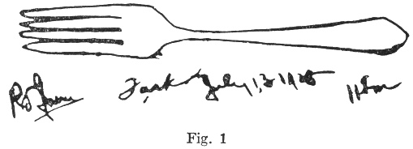

This drawing was produced by my brother-in-law, Robert L. Irwin, a young
business man, and no kind of "crank," under the following circumstances.
He was sitting in a room in his home in Pasadena at a specified hour,
eleven-thirty in the morning of July 13, 1928, having agreed to make a
drawing of any object he might select, at random, and then to sit gazing
at it, concentrating his entire attention upon it for a period of from
fifteen to twenty minutes.

At the same agreed hour, eleven-thirty in the morning of July 13, 1928,
my wife was lying on the couch in her study, in our home in Long Beach,
forty miles away by the road. She was in semi-darkness, with her eyes
closed; employing a system of mental concentration which she has

p. 7

been practicing off and on for several years, and mentally suggesting to
her subconscious mind to bring her whatever was in the mind of her
brother-in-law. Having become satisfied that the image which came to her
mind was the correct one—because it persisted, and came back again and
again—she sat up and took pencil and paper and wrote the date, and six
words, as follows ([fig. 1a](#img_fig001a)):

 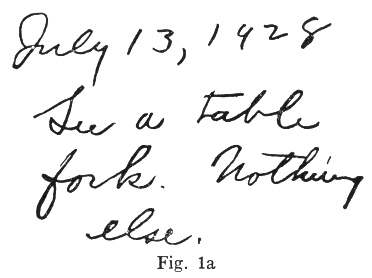

A day or two later we drove to Pasadena, and then in the presence of Bob
and his wife, the drawing and writing were produced and compared. I have
in my possession affidavits from Bob, his wife, and my wife, to the
effect that the drawing and writing were produced in this way. Later in
this book I shall present four other pairs of drawings, made in the same
way, three of them equally successful.

p. 8

Second case. Here is a drawing ([fig. 2](#img_fig002)), and below it a
set of five drawings ([fig. 2a](#img_fig002)):

 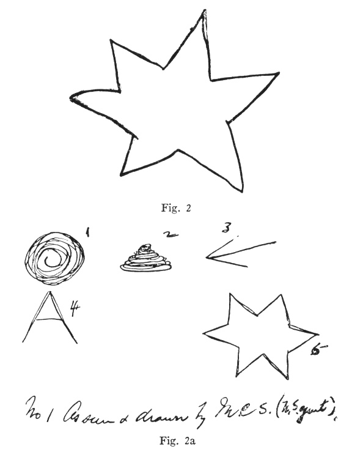

The above drawings were produced under the following circumstances. The
single drawing ([fig. 2](#img_fig002)) was made by me in my study at my

p. 9

home. I was alone, and the door was closed before the drawing was made,
and was not opened until the test was concluded. Having made the
drawing, I held it before me and concentrated upon it for a period of
five or ten minutes.

The five drawings ([fig. 2a](#img_fig002)) were produced by my wife, who
was lying on the couch in her study, some thirty feet away from me, with
the door closed between us. The only words spoken were as follows: when
I was ready to make my drawing, I called, "All right," and when she had
completed her drawings, she called, "All right" —whereupon I opened the
door and took my drawing to her and we compared them. I found that in
addition to the five little pictures, she had written some explanation
of how she came to draw them. This I shall quote and discuss later on. I
shall also tell about six other pairs of drawings, produced in this same
way.

Third case: another drawing ([fig. 3a](#img_fig003)), produced under the
following circumstances. My wife went upstairs, and shut the door which
is at the top of the stairway. I went on tip-toe to a cupboard in a
downstairs room and took from a shelf a red electric-light bulb—it
having been agreed that I should select any small article, of which
there were certainly many hundreds in our

p. 10

home. I wrapped this bulb in several thicknesses of newspaper, and put
it, so wrapped, in a shoe-box, and wrapped the shoe-box in a whole
newspaper, and tied it tightly with a string. I then called my wife and
she came downstairs, and lay on her couch and put the box on her body,
over the solar plexus. I sat watching, and never took my eyes from her,
nor did I speak a word during the test. Finally she sat up, and made her
drawing, with the written comment, and handed it to me. Every word of
the comment, as well as the drawing, was produced before I said a word,
and the drawing and writing as here reproduced have not been touched or
altered in any way ([fig. 3a](#img_fig003)):

 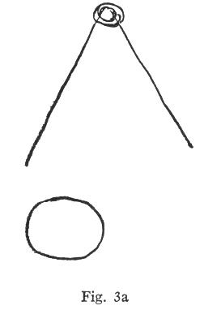

p. 11

The text of my wife's written comment is as follows:

"First see round glass. Guess nose glasses? No. Then comes V shape again
with a 'button' in top. Button stands out from object. This round top is
of different color from lower part. It is light color, the other part is
dark."

To avoid any possible misunderstanding, perhaps I should state that the
question and answer in the above were my wife's description of her own
mental process, and do not represent a question asked of me. She did not
"guess" aloud, nor did either of us speak a single word during this
test, except the single word, "Ready," to call my wife downstairs.

The next drawings were produced in the following manner. The one at the
top ([fig. 4](#img_fig004)) was drawn by me alone in my study, and was
one of nine, all made at the same time, and with no restriction upon
what I should draw—anything that came into my head. Having made the nine
drawings, I wrapped each one in a separate sheet of green paper, to make
it absolutely invisible, and put each one in a plain envelope and sealed
it, and then took the nine sealed envelopes and laid them on the table
by my wife's couch. My wife then took one of them and placed it

p. 12

 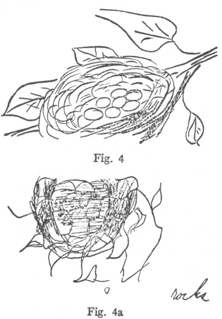

over her solar plexus, and lay in her state of concentration, while I
sat watching her, at her insistence, in order to make the evidence more
convincing. Having received what she considered a convincing telepathic
"message," or image of the contents of the envelope, she sat up and made
her sketch ([fig. 4a](#img_fig004)) on a pad of paper.

The essence of our procedure is this: that never did she see my drawing
until hers was completed and her descriptive words written; that I spoke
no word and made no comment until

p. 13

after this was done; and that the drawings presented here are in every
case exactly what I drew, and the corresponding drawing is exactly what
my wife drew, with no change or addition whatsoever. In the case of this
particular pair, my wife wrote: "Inside of rock well with vines climbing
on outside." Such was her guess as to the drawing, which I had meant for
a bird's nest surrounded by leaves; but you see that the two drawings
are for practical purposes identical.

Many tests have been made, by each of the different methods above
outlined, and the results will be given and explained in these pages.
The method of attempting to reproduce little drawings was used more than
any other, simply because it proved the most convenient; it could be
done at a moment's notice, and so fitted into our busy lives. The
procedure was varied in a few details to save time and trouble, as I
shall later explain, but the essential feature remains unchanged: I make
a set of drawings, and my wife takes them one by one and attempts to
reproduce them without having seen them. Here are a few samples, chosen
at random because of their picturesque character. If my wife wrote
anything on the drawing, I add it as "comment"; and you are to
understand here, and for the rest

p. 14

of this book, that "comment" means the exact words which she wrote
*before* she saw my drawing. Often there will be parts of this "comment"
visible in the photograph. I give it all in print. Note that drawings 1,
2, 3, etc., are mine, while la, 2a, 3a, etc., are my wife's.

In the case of my drawing numbered five, my wife's comment was:
"Knight's helmet."

 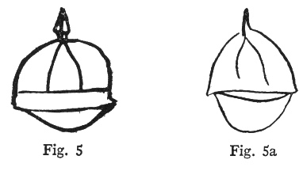

 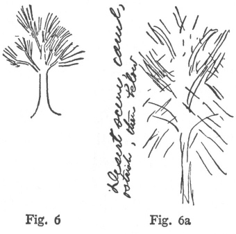

p. 15

On [figure 6](#img_fig006), the comment was: "Desert scene, camel,
ostrich, then below"—and the drawing in figure [6a](#img_fig006). On the
reverse side of the page is further comment: "This came in fragments, as
if I saw it being drawn by invisible pencil."

And here is a pair with no comment, and none needed ([fig. 7,
7a](#img_fig007)):

 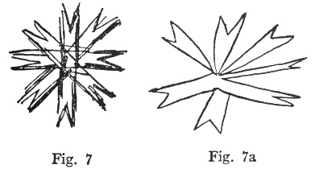

On the following, also, no comment was written ([fig. 8,
8a](#img_fig008)):

 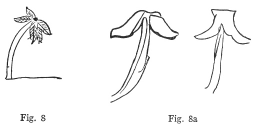

p. 16

 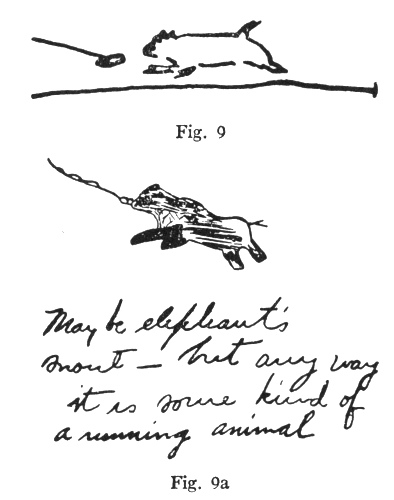

I drew figure [9](#img_fig009), and my wife drew [9a](#img_fig009), a
striking success, and wrote the comment: "May be elephant's snout—but
anyway it is some kind of a running animal. Long thing like rope flung
out in front of him."

Next, a series of three pairs, which, as it happened, were done one
after the other, numbers three, four and five in the twenty-third series
of my drawings. They are selected in part because they are amusing.
First, I tried to draw a bat, from vague memories of boyhood days when
they used to fly into the ball-rooms at Virginia

p. 17

springs hotels, and have to be massacred with brooms, because it was
believed that they sought to tangle themselves in the hair of the ladies
([fig. 10, 10a](#img_fig010)):

 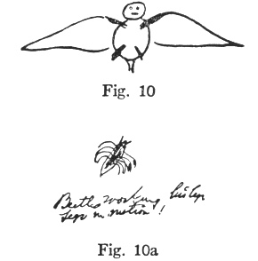

My wife's comment on the above reads: "Big insect. I know this is right
because it moves his legs as if flying. Beetle working its legs. Legs in
motion!"

And next, my effort at a Chinese mandarin ([fig. 11, 11a](#img_fig011)):

 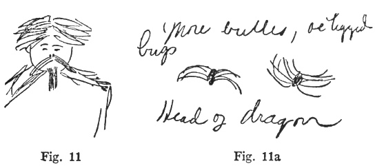

p. 18

The comment reads: "More beetles, or legged bugs"—and she draws the
mustaches of the mandarin and his hair. "Head of dragon with big mouth.
See also a part of his body—in front, or shoulders." The association of
mandarins with dragons is obvious.

And finally, my effort at a boy's foot and roller-skate, which undergoes
a strange telepathic transformation. I have put it upside down for
easier comparison ([fig. 12, 12a](#img_fig012)):

 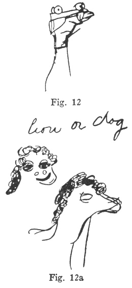

p. 19

The comment, complete, reads: "Profile of head and neck of animal—lion
or dog—a muzzle. Maybe pig snout."

The above are samples of our successes. Altogether, of such drawings, 38
were prepared by my secretary, while I made 252, a total of 290. I have
classified the drawings to the best of my ability into three groups:
successes, partial successes, and failures. The partial successes are
those drawings which contain some easily recognized element of the
original drawing: such as, for example, the last one above. The profile
of a pig's head is not a roller skate, but when you compare the
drawings, you see that in my wife's first sketch the eyes resemble the
wheels of the roller-skates, and in her second sketch the snout
resembles my shoe-tip; also there is a general similarity of outline,
which is what she most commonly gets.

In the 290 drawings, the total of successes is 65, which is roughly 23
per cent. The total of partial successes is 155, which is 53 per cent.
The total of failures is 70, which is 24 per cent. I asked some
mathematician friends to work out the probabilities on the above
results, but I found that the problem was too complicated. Who could
estimate how many possible objects

p. 20

there were, which might come into my head to be drawn? Any time the
supply ran short, I would pick up a magazine, and in the advertising
pages find a score of new drawings to imitate. Again, very few of the
drawings were simple. We began with such things as a circle, a square, a
cross, a number or a letter; but soon we were doing Chinese mandarins
with long mustaches, and puppies chasing a string. Each of these
drawings has many different features; and what mathematician could count
the number of these features, and the chances of reproducing them?

It is a matter to be judged by common sense. It seems to me any one must
agree that the chances of the twelve drawings so far shown having been
reproduced by accident is too great to be worth considering. A million
years would not be enough for such a set of coincidences.

------------------------------------------------------------------------

[Next: Chapter III](mrad04)
