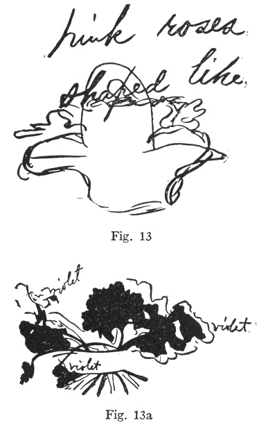

  
[Intangible Textual Heritage](../../index)  [Parapsychology](../index) 
[Index](index)  [Previous](mrad05)  [Next](mrad07) 

------------------------------------------------------------------------

[Buy this Book at
Amazon.com](https://www.amazon.com/exec/obidos/ASIN/B002FGTN5A/internetsacredte)

------------------------------------------------------------------------

  
*Mental Radio*, by Upton Sinclair, \[1930\], at Intangible Textual
Heritage

------------------------------------------------------------------------

p. 35

### V

Please let me repeat, I am not telling
here a set of fairy tales and fantasies; I am presenting a record of
experiments, conducted in strict scientific fashion. All the results
were set down day by day in writing. For an hour or two every day for
the past three years my wife has been scribbling notes of her
experiments, and there are eight boxes full in her study, enough to fill
a big trunk. No statement in all the following rests upon our memories;
everything is taken from memoranda now in my hands. Admitting that new
facts can be learned about the mind, I do not see how any one can use
more careful methods than we have done.

My wife "saw" Jan carrying a bouquet of flowers, wrapped in white paper,
on the street, and she wrote this down. She later ascertained that at
this hour Jan had carried flowers to a friend in a hospital in Los
Angeles, and she telephoned this friend and verified the facts. On
another occasion when Jan was in Santa Barbara, a hundred miles from our
home, she "saw" him escorting a blonde girl in a blue dress from

p. 36

an auto to a hotel over a rainy pavement; she wrote this down, and later
ascertained that it had actually been happening. The details were
verified, not merely by Jan, but by another member of the party. I ought
to add that in no case did my wife tell the other persons what she had
"seen" until after these persons had told her what had happened. No
chance was taken of their making up events to conform to her records.
Always Craig kept her cold-blooded determination to know what was *real*
in this field where so much is invented and imagined.

Again, she "saw" Jan preparing to commit suicide, dressed in a pair of
yellow silk pajamas; then she "saw" him lying dead on the floor. She was
much disturbed—until Jan reminded her that he had been seven times
publicly "buried" in Southern California before she met him. Several
weeks later she learned that in one of these "burials" he had worn
yellow silk pajamas. Jan had forgotten this, but Dr. Frank Sweet, of
Long Beach, who had overseen the procedure, remembered the pajamas, and
how they had been ruined by mud.

Craig saw a vision of a bride, at a time when Jan, in his room in a far
part of the city, was awakening from sleep with a dream about a friend's
wedding. On two occasions, while "concentrating,"

p. 37

she got the impression that Jan and a friend of his had returned
unexpectedly from Santa Barbara to Hollywood. In both cases she made
careful record, and it turned out to be correct; I have a written
statement of the two young men, confirming the second instance, and
saying that it could not have been normally known to my wife.

I have also a detailed record—some twenty pages long—of a "clairvoyant"
vision of Jan's movements about the city of Long Beach, including his
parking of a car, carrying something over his arm, visiting a
barber-shop and a flower-shop, and stopping and hesitating and then
going on. The record includes a detailed description of the streets and
their lay-out, a one-story white building, etc. Jan had been doing all
this at approximately the time specified. He had carried his trousers to
a tailor-shop, with a barber-shop directly opposite; he had stopped in
front of a flower-shop and debated whether to buy some flowers; he had
taken a letter to be copied by a typist, and had stopped on the street,
hesitating as to whether to wait for this copying to be done. All these
details he narrated to my wife *before* he knew what was in her written
record.

Another curious experience: I took Jan to the

p. 38

home of Dr. John R. Haynes of Los Angeles, to give a demonstration of
his mind-reading. Jan said he felt ill, and would not be successful.
Only one or two of the tests succeeded. But meanwhile my wife was at
home, concentrating, and ordering her subconscious mind to show her what
Jan and I were doing. When I returned I found that she had written a
detailed description of Dr. Haynes' home, including a correct ground
plan of the entrance hall, stairs and drawing-room, and a description of
the color and style of decorations, furniture, lamps, vases, etc., in
good part correct. Craig has never been in this house.

Jan goes into one of his deep states—a cataleptic trance, he calls it—in
which his body is rigid and cold. He has the power to fix in advance the
time when he will come out of the trance, and his subconscious mind
apparently possesses the power to keep track of time—days, hours,
minutes, even seconds. I have seen him amaze a group of scientists by
coming out on the second, while they held stop-watches on him.

But now my wife thinks she will vary this procedure. Jan goes into the
trance in our home and Craig sits and silently wills, "Your right leg
will come out; you will lift it; you will put it down again. You will
sit erect"—and so on.

p. 39

\[paragraph continues\] Without speaking a
word, she can make him do whatever she pleases.

Another incident, quite a long one. I ask you to have patience with the
details, promising that in the end you will see what it is all about. I
am in the next room, and I hear Jan and my wife having one of their
regular evening arguments, because he will not tell her how he does this
or that; at one moment he insists that he has told her—and the next
moment he insists that he does not know. My wife finally asks him to
concentrate upon an object in the room, and she will see if she can
"get" it. He selects the gas stove, in which a fire is burning; and
Craig says, "I see a lot of little flames." Jan insists that is "no
good," she didn't get the stove; which annoys her very much—she thinks
he does not want to allow any success to a woman. He is a "continental
male," something she makes fierce feminist war upon.

Craig is suffering from neuralgia in neck and shoulder, and Jan offers
to treat her. He will use what he calls "magnetism"; he believes there
is an emanation from his finger-tips, and so, with his two forefingers
he lightly traces the course of the nerves of her neck and shoulder and
arm. For ten or fifteen minutes his two fingers are tracing patterns in
front of her.

p. 40

Then it is time for him to go home, and he is unhappy, and she succeeds
in drawing the explanation from him—he has to walk, and his shoes are
tight and hurt him. He has to have them stretched, he tells her. She
offers him a pair of my big tennis shoes to wear home, and then she
scolds him because he has the fashionable notion that white canvas
tennis shoes are not proper footwear for eleven o'clock in the evening.
Finally he puts them on and departs; and my wife lies down and makes her
mind a blank, and orders it to tell her what Jan is doing.

She has a pencil and paper, and presently she is writing words. They are
foreign words, and she thinks they must be in Jan's native language;
they come drifting through her mind for several minutes. Next day comes
Jan for the daily lesson, and she shows him this record. He tells her
that the words are not in his language, but German—which he knows, but
never uses. My wife knows no German; except possibly sauerkraut and
kindergarten. But here she has written a string of German and
near-German words. I have the original sheet before me, and I give it as
well as I can make out the scrawl: "ei einfinen ein-fe-en swenfenz
fingen sweizzen czie ofen weizen ofen fingen sweinfen swei fingern efein

p. 41

boden fienzen meifen bogen feingen Bladen Meichen frefen eifein."

Some of this is nonsense; but there are a few German words in it, and
others which are guesses at German words, such as might be made by a
person hearing a strange language, and trying to set down what he hears.
Part of the effort seems to be concentrated on getting one expression,
"zwei Fingern"—two fingers! You remember the two fingers moving up and
down over Craig's neck and shoulder! And "Ofen"—the argument about the
stove! And "bladen"—to stretch shoes over a block of wood. Where these
ideas came from seems plain enough. But where did the German come
from—unless from the subconscious mind of Jan?

A further detail, especially curious. Jan gave my wife the meaning for
the word "bladen": "to stretch shoes over a block of wood"; I have the
memo which he wrote at the time. But looking up the word in the
dictionaries, I do not find it, nor can I find any German who knows it.
Apparently there is no such word; and this would clearly seem to
indicate that my wife got her German from Jan. If so, it was by
telepathy, for he spoke no word of it that evening.

It is the fashion among young ladies of the South to tease the men; and
Craig found in this

p. 42

episode a basis for tormenting her psychic instructor. He had assured
his patient that during the treatment he was sending her "curative
thoughts." But what kind of telepathic healer was it who sent gas-stoves
and shoe-blocks into a neuralgic shoulder? Jan, missing the humor, and
trying to save his reputation, declared that he hated the German
language so greatly, he did not even allow himself to think in it!
Germany was associated in his mind with the most painful memories, and
all that previous day he had been fighting depression caused by these
memories. You see, in this blundering defense, a significant bit of
evidence. Jan had really had the German language in his thoughts at the
time Craig got them!

I have before me a letter from Jan to my wife, postmarked Santa Barbara,
October 19, 1927. He says: "May these lovely Cosmos bring you such peace
and contentment as they have brought me." He has cut a double slit in
the paper, and inserted cosmos blossoms and violets. Prior to the
receipt of this letter, my wife was making the record of a dream, and
here is what she wrote down: "I dreamed Jan had a little basket of
flowers, pink roses and violets, shaped like this." (A drawing.) "He
lifted them up and said they were for me, but a girl near

p. 43

him took them and said, 'But I want them.'" When Jan came to see us
again, my wife asked about the circumstance, and learned the following:
a woman friend, who had given Jan the

 

flowers, had accused him of meaning to send them to a girl; but he had
answered that they were for "a middle-aged and distinguished lady."

I present here the basket of "pink roses and

p. 44

violets" which my wife drew, and then the spray of pink double cosmos
and violets which met her eyes when she opened the young "psychic's"
letter a day or two later. I explain that my wife's drawing ([fig.
13](#img_fig013)) is partly written over by the words of her notes;
while in Jan's letter the violets had to be at once traced in pencil, as
they would not last. My wife drew pencil marks around them and wrote the
word "violet" in three places, to indicate what the marks meant. The
cosmos flowers, pressed and dried, are still exactly as Jan stuck them
into position and as they remained until I took them to be photographed
([fig. 13](#img_fig013)).

------------------------------------------------------------------------

[Next: Chapter VI](mrad07)
