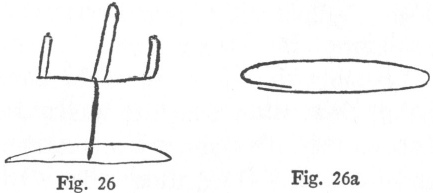
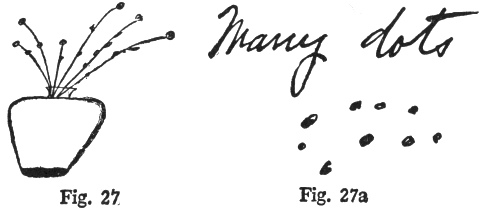
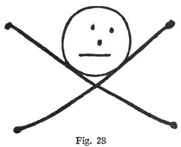
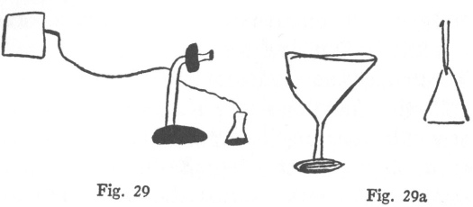
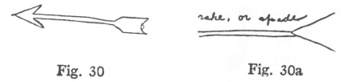
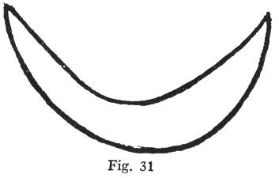
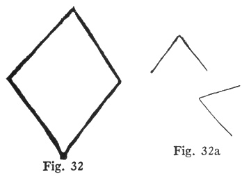
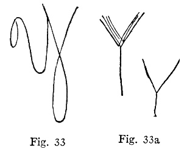
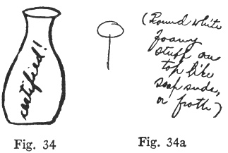
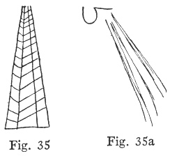

  
[Intangible Textual Heritage](../../index)  [Parapsychology](../index) 
[Index](index)  [Previous](mrad11)  [Next](mrad13) 

------------------------------------------------------------------------

[Buy this Book at
Amazon.com](https://www.amazon.com/exec/obidos/ASIN/B002FGTN5A/internetsacredte)

------------------------------------------------------------------------

  
*Mental Radio*, by Upton Sinclair, \[1930\], at Intangible Textual
Heritage

------------------------------------------------------------------------

p. 87

### XI

I shall give a number of the successful
drawings, and some of the partial successes, but none of the failures,
for these obviously are merely waste. When I draw a cow, and my wife
draws a star or a fish or a horseshoe, all you want is the word
"Failure," and then you want to know the percentage of failures, so that
you can figure the probabilities. Failures prove nothing that you do not
already believe; if your ideas are to be changed, it is successes that
will change them.

I begin with series three, because of the interesting circumstances
under which it was made. Late in the afternoon I phoned my secretary to
make a dozen drawings; and then, after dark, Craig and I decided to
drive to Pasadena, and on the way I stopped at the office and got the
twelve sealed envelopes which had been laid on my desk. I picked them up
in a hurry and slipped them into a pocket, and a minute or two later I
put them on the seat beside me in the car.

After we had started, I said, "Why don't you try some of the drawings on
the way?" We were passing through the Signal Hill oil-field, amid

p. 88

thunder of machinery and hiss of steam and flashing of headlights of
cars and trucks. "It will be interesting to see if I can concentrate in
such circumstances," said Craig, and took one envelope and held it
against her body in the darkness, while I went on with my job of
driving. After a few minutes Craig said, "I see something long and
oblong, like a stand." She got a pad and pencil from a pocket of the
car, and switched on the ceiling light, and made a drawing, and then
opened the envelope. Here are the pictures; I call it a partial success
([fig. 26, 26a](#img_fig026)):

 

Here is the next pair, done on the same drive to Pasadena ([figs. 27,
27a](#img_fig027)):

 

p. 89

Then came a drawing of an automobile. Considering the attendant
circumstances, it was surely not surprising that Craig should report it
as "a big light in the end of a tube or horn." There were many such
lights in her eyes.

Then a fourth envelope: she said, "I see a little animal or bug with
legs, and the legs sticking out in bug effect." When she looked into the
envelope, she was so excited that she tried to get me to look—at forty
miles an hour on a highway at night! Here is the drawing, meant to be a
skull and cross-bones, but so done that a "bug with legs" is really a
fair description of it ([fig. 28](#img_fig028)):

 

After we arrived at our destination, my wife did some more of the
drawings, and got partial successes. On this telephone the comment was:

p. 90

\[paragraph continues\] "Goblet with
another one floating near or above it inverted" ([figs. 29,
29a](#img_fig029)):

 

And then this arrow ([figs. 30, 30a](#img_fig030)):

 

Concerning the above my wife wrote: "See something that suggests a
garden tool—a lawn rake, or spade." And for the next one ([fig.
31](#img_fig031)) she wrote: "A pully-bone"—which is Mississippi "darky"
talk for a wish-bone of a chicken. I don't know whether it means a bone
that you pull, or whether it is Creole for "poulet." Here is what my
secretary had drawn ([fig. 31](#img_fig031)):

 

p. 91

I had asked my secretary at the outset to make simple geometrical
designs, letters and figures, thinking that these would be easier to
recognize and reproduce. But they brought only partial successes; Craig
would get elements of the drawing, but would not know how to put them
together. There were seven in the first series, and there is some
element right in every one. An oblong was drawn exactly, and then two
fragments of oblongs added to it. A capital M in script had the first
stroke done exactly, with the curl. A capital E in script was done with
the curls left out.

And the same with the second series. Here is a square—but you see that
the two halves of it are wandering about ([fig. 32, 32a](#img_fig032)):

 

p. 92

And here is a letter Y, but by telepathy it has been turned from script
into print ([fig. 33, 33a](#img_fig033)):

 

A quite different story began when my secretary allowed his imagination
a little play. He knows that my wife lives in part on milk, and he knows
that she is particular about the quality, because he has to handle the
bills. So he has a little fun with her, and you see that immediately she
gets, not the form, but the color and feeling of it ([figs. 34,
34a](#img_fig034)):

 

The comment reads: "Round white foamy stuff on top like soap suds or
froth." As she

p. 93

drinks her milk sour and whipped, you see that its foaminess is a
prominent feature.

Then comes an oil derrick. We live in the midst of these unsightly
objects, and are liable to be turned out of house and home by drilling
nearby; moreover, I have written a book called "Oil! " and the
exclamation mark at the end has been justified by the effect of it on
our lives. My wife made a figure five with long lines going out, and
wrote: "I don't know why the five should have such a thing as an
appendage, but the appendage was most vivid, so there it is" ([figs. 35,
35a](#img_fig035)):

 

After she had opened the envelope and seen the original drawing, the
problem became, not why a figure five should have an appendage, but why
an oil derrick should have a figure five. Craig puzzled over this, and
then lay down and told her subconscious mind to bring her the

p. 94

answer. What came was this: the German version of my book, called
"Petroleum," has three oil derricks on the front, and a huge dollar sign
on the back of the cover, and this was what Craig had really "seen." She
had looked at this book when it arrived, a year or more back, and it had
been filed away in her memory. Of course this may not be the correct
explanation, but it is the one which her mind brought to her.

------------------------------------------------------------------------

[Next: Chapter XII](mrad13)
